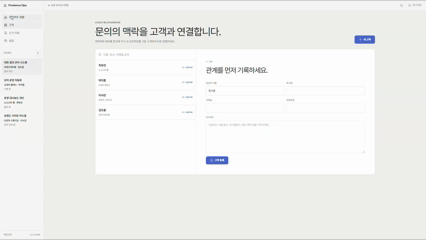
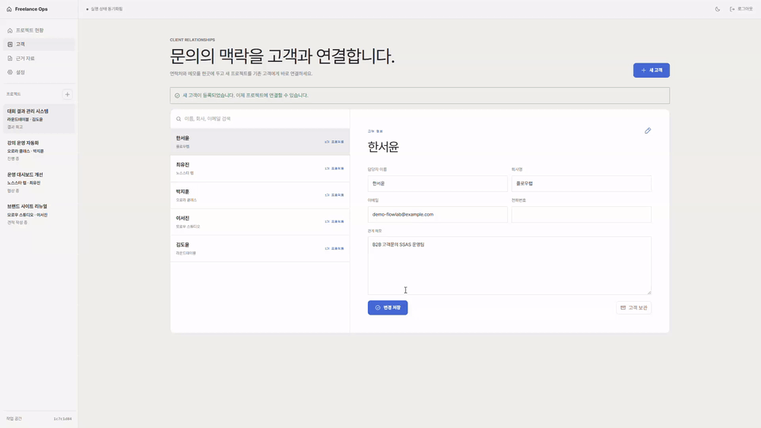
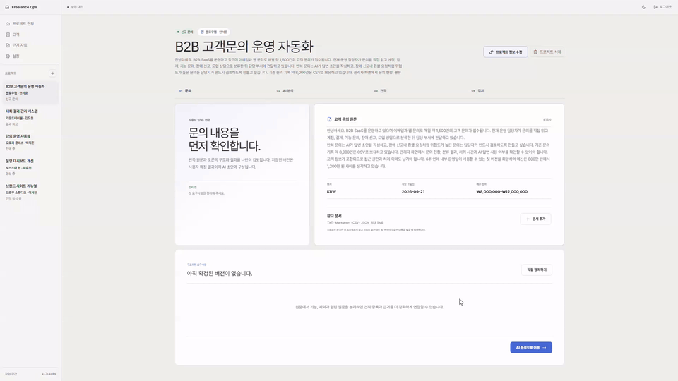
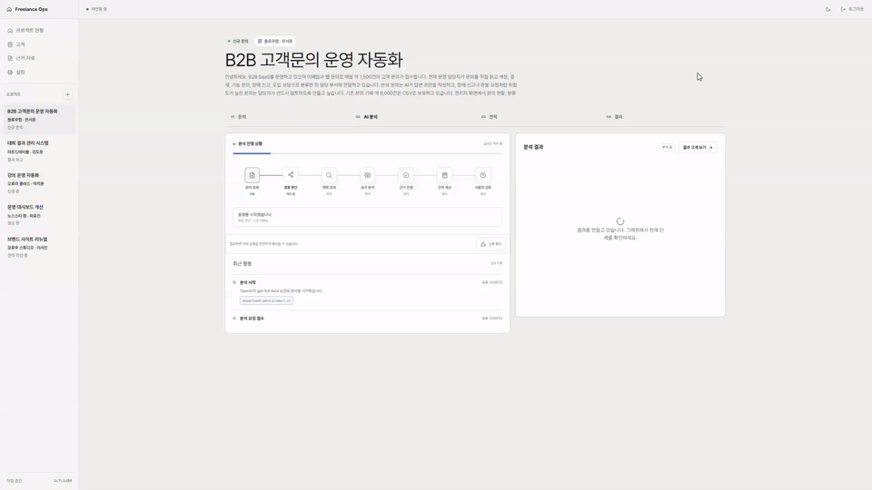
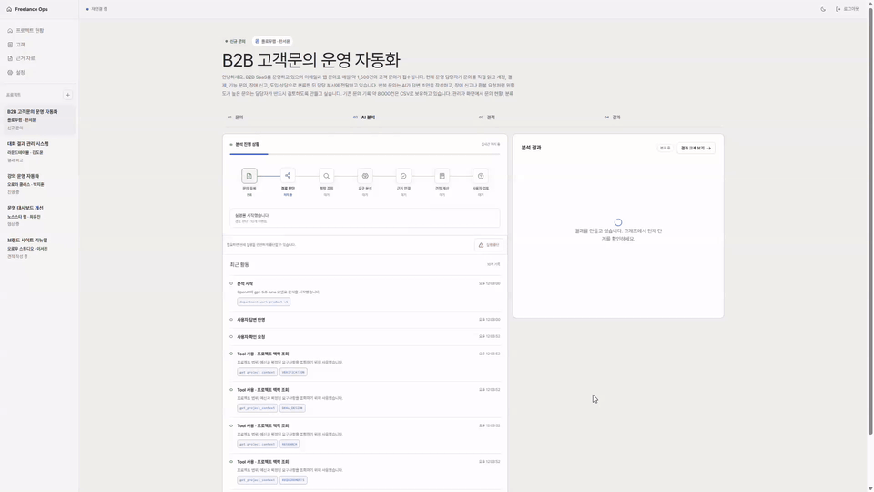
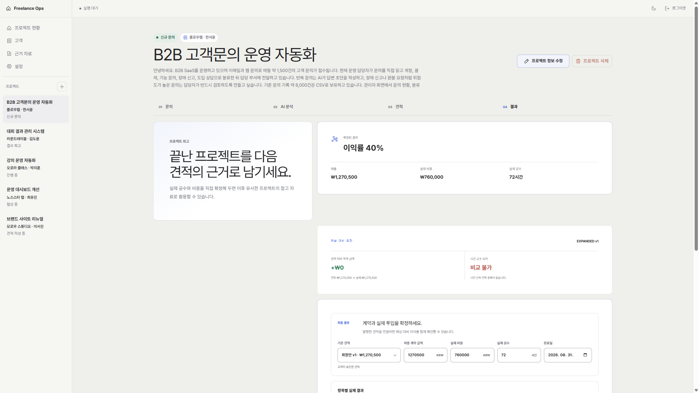
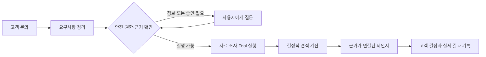

<div align="center">

# Freelance Ops Agent

### 작은 AI 동료와 함께, 고객 문의를 근거 있는 견적으로.

문의 내용을 다시 정리하고, 빠진 내용을 물어보고, 관련 자료를 찾고, 금액을 계산하는 일.<br/>
Freelance Ops Agent는 고객 관리부터 AI 분석, 견적 검토·발행, 실제 결과 기록까지 이어지는 프리랜서 업무 도구입니다.

[서비스 소개](https://www.freelance-ops.site) · [업무 공간 시작](https://www.freelance-ops.site/workspace) · [기술 포트폴리오](docs/portfolio/README.md)<br/>
[Architecture](docs/V2_SPECIFICATION.md) · [Evaluation & Operations](docs/portfolio/README.md)


<br/>


<br/>


</div>

> **현재 공개 버전: V2 운영 파일럿 · 2026-09-12 기준**
> AI 펫 개인화·외형/성향 생성, 개인 API 키 연결(BYOK), 요약 중심 견적·결과 화면을 제공합니다. 실제 모델의 결과 품질과 고객 업무 적합성은 사용자 검토가 필요합니다.

## 현재 제공하는 기능

| 기능 | 할 수 있는 일 |
| --- | --- |
| 고객·프로젝트 관리 | 고객 맥락과 문의를 연결하고 프로젝트의 진행 단계를 관리 |
| AI 분석과 사용자 확인 | 요구사항·자료·근거를 정리하고 추가 확인이 필요하면 질문 후 재개 |
| 세 관점의 AI 동료 | 핵심·권장·확장 견적의 제안과 트레이드오프를 비교 |
| 나만의 동료 | 이름·동물·색·장식·말투·판단 성향을 꾸미고 자연어로 설정 생성 |
| 견적 검토·공유 | 항목·근거를 편집하고 초안 저장, 발행, 고객용 링크 공유 |
| 개인 AI 연결 | OpenAI/Gemini API 키를 연결해 허용 모델로 실행 |
| 결과 기록 | 실제 매출·비용·공수를 확정하고 견적과 차이를 기록 |

## 왜 만들었나요?

고객이 “이런 서비스가 필요해요”라고 문의를 보내도<br/>
곧바로 견적을 쓰기는 어렵습니다.

몇 줄 안 되는 메시지 안에도 다시 확인할 내용이 꽤 많습니다.

- 어디까지 해달라는 것인지
- 일정과 예산은 정해졌는지
- 비슷한 작업을 예전에 얼마에 했는지
- 지금 세운 가정이 맞는지

이걸 매번 문서와 메신저를 오가며 정리하는 대신,<br/>
문의를 받은 순간부터 결과를 기록할 때까지 한곳에서 이어지게 만들었습니다.

AI가 먼저 정리하고 찾아보되,<br/>
모르는 내용까지 그럴듯하게 채우지는 않도록 했습니다.

## 문의부터 결과까지

### 1. 고객과 문의를 등록합니다

고객 관리에서 담당자와 회사, 관계 맥락을 기록하고 프로젝트에 고객 문의·희망 일정·예산을 연결합니다. 프로젝트는 **문의 → AI 분석 → 견적 → 결과** 순서로 검토합니다.

### 2. AI 연결과 동료를 준비합니다

설정의 **AI 연결**에서 개인 API 키를 등록하거나, 분석 시작 전에 **기본 제공 AI**를 선택합니다. 제공사와 모델은 실행마다 명시하며 개인 연결 실패 시 기본 제공 모델로 자동 전환하지 않습니다.

프로젝트의 **새 분석 준비 → 나만의 작은 동료 만들기**에서 세 동료의 이름·외형·성향을 설정합니다. 자연어로 생성한 설정은 미리보기 후 **이 동료 저장**으로 확정하고 다음 분석부터 사용합니다.

- 외형 생성은 거북이·부엉이·고양이와 지원 색상·장식의 SVG 조합입니다. 자유 형태 이미지 생성은 아닙니다.
- 성향은 범위·납품 단계·조건의 우선순위에 반영되며 금액 계산과 권한 규칙은 유지됩니다.
- 기본 동료의 표정·동작은 실제 대기·진행·사용자 확인 상태에 연결됩니다. 캐릭터별로 별도 분석 세 번을 실행하는 구조는 아닙니다.

[동료 꾸미기 안내](docs/frontend/PET_CUSTOMIZATION.md) · [BYOK 사용·운영 안내](docs/frontend/BYOK_CONNECTIONS.md)

### 3. 분석하고, 필요한 질문에 답합니다

AI가 요구사항을 정리하고 관련 자료와 근거를 연결합니다. 사용자 확인이 필요하면 질문을 남기고 멈추며, 답변 후 저장된 지점에서 이어갑니다. 일부 단계만 완료된 경우에는 부분 결과와 누락 안내를 표시합니다.

### 4. 견적의 범위와 근거를 검토합니다

핵심·권장·확장 견적을 비교하고 각 동료의 제안·판단 이유·트레이드오프를 확인합니다. 여러 제안에서 작업을 골라 조합할 수 있으며, **변경 미리보기 → 확인한 작업으로 편집 초안 변경 → 검토용 초안 저장**을 거칩니다. 조합은 현재 편집 항목 전체를 교체하므로 적용 전 확인이 필요합니다.

견적은 항목명·예상 금액·합계부터 보여줍니다. 상세 편집, 근거·가정, 비교, 계산 조건과 이력은 기본으로 접혀 있어 필요할 때 펼칩니다. 초안 저장 후 검토한 견적을 발행하고 고객용 링크로 공유합니다.

금액·세금·할인·위험 대비 금액은 Spring의 결정적 계산 규칙으로 처리합니다. 화면의 예상 합계와 저장·서버 미리보기의 최종 계산은 구분하며, 발행된 견적 변경은 새 revision으로 관리합니다.

### 5. 실제 결과를 다음 견적의 참고 자료로 남깁니다

계약 금액과 실제 비용·공수를 확정하고 예상과 달라진 이유를 기록합니다. 확정된 지표를 먼저 보여주고 상세 기록과 수정은 펼쳐서 확인합니다. 결과는 이후 유사 프로젝트의 근거로 참고할 수 있으며 모델을 자동 재학습한다는 뜻은 아닙니다.

<details>
<summary>이전 버전의 업무 흐름 녹화 보기</summary>

아래 자료는 2026-08-17에 정리한 이전 UI의 기록입니다. 현재 로그인·펫·설정·견적 화면과 다르며 최신 모습은 [운영 서비스](https://www.freelance-ops.site)에서 확인할 수 있습니다.

| 흐름 | 이전 녹화 |
| --- | --- |
| 고객 맥락 등록 |  |
| 문의 등록 |  |
| AI 분석 |  |
| 사용자 확인 |  |
| 견적 검토 |  |
| 결과 기록 |  |

</details>

## 시스템 구성

Frontend는 Vercel에서 제공하고, Spring Boot와 Python Agent runtime은 Vultr의 Docker 환경에서 운영합니다. 외부 요청은 Cloudflare와 Caddy를 거쳐 처리하며 PostgreSQL과 pgvector를 업무 데이터와 검색 근거의 저장소로 사용합니다.


## 업무 데이터와 AI 실행의 경계



- 사용자가 볼 수 없는 자료는 AI도 볼 수 없습니다.
- 금액, 세금, 할인과 합계는 정해진 서버 로직으로 계산합니다.
- 관련 있어 보이는 문서를 찾는 데서 끝내지 않고, 그 안에 실제 답이 있는지도 다시 확인합니다.
- 정보가 모호하거나 위험한 요청은 자동으로 진행하지 않고 사람의 확인을 기다립니다.
- 중간에 서버가 재시작되어도 진행 중이던 작업을 이어갈 수 있습니다.

- 브라우저는 Spring 공개 API만 호출하고, Agent Tool은 위임된 권한으로 Spring 내부 API를 사용합니다.
- 개인 API 키는 검증 후 암호화 저장하며 원문을 다시 표시하지 않습니다. DB 복원에는 동일한 암호화 키가 필요합니다.
- BYOK의 모델 호출은 제공사 계정에 청구됩니다. 화면의 예상 AI 비용은 실제 제공사 청구액과 구분합니다.

더 자세한 설계는 [V2 제품·기술 명세](docs/V2_SPECIFICATION.md)와<br/>
[ADR](docs/adr/README.md)에 정리했습니다.

## 평가와 검증 기록

아래 수치는 과거 고정 평가 데이터에서 얻은 실험 결과이며, 현재 모든 고객 문의의 품질이나 운영 SLA를 의미하지 않습니다.

처음에는 빠르고 저렴한 로컬 모델을 앞단에 두려고 했습니다.

하지만 같은 평가 데이터로 비교해 보니<br/>
사람이 확인해야 할 요청을 제대로 구분하지 못했습니다.

속도가 빨라도 실제 업무를 맡기기에는 위험하다고 판단해<br/>
운영 경로에서는 뺐습니다.

- 검색 방식은 고정 평가에서 상위 5개 안에 필요한 문서를 찾는 비율 `0.87`을 기록했습니다.
- 로컬 검증기는 한 건에 약 `11.9ms`로 빨랐지만, 허용 판단의 정밀도가 `0.75`라 최종 결정을 맡기지 않았습니다.
- 로컬 분류 모델은 LLM보다 약 94배 빨랐지만 안전 관련 성능이 기준에 못 미쳐 비교용으로만 남겼습니다.

가장 큰 수확은 좋은 숫자 하나가 아니라,<br/>
**아무리 빠르고 저렴해도 기준을 통과하지 못하면 실제 작업에는 쓰지 않는다**는 원칙을 세운 것입니다.

실험 과정과 전체 지표, 실패한 가설과 그래프는<br/>
[RAG Answerability와 Agent Routing 신뢰성 개선](docs/portfolio/ai-routing-and-rag-reliability-case-study.md)에 따로 정리했습니다.

## 기술 구성

| 영역 | 사용 기술 |
|---|---|
| Web | Next.js 16, React 19, TypeScript |
| Business API | Java 21, Spring Boot 4, Spring Security, JPA |
| AI Runtime | Python 3.12, FastAPI, LangGraph, Pydantic |
| Data | PostgreSQL 17, pgvector, Full-text Search |
| Models | OpenAI Responses API, Gemini API |
| Delivery | GitHub Actions, Docker Compose, GHCR, Caddy, Vultr, Vercel |

## 로컬에서 확인하기

Docker Compose와 Node.js 22가 필요합니다. 서비스별 소스 검증에는 Java 21, Python 3.12와 uv도 사용합니다.

1. 루트의 [.env.example](.env.example)을 복사해 로컬 `.env`를 만들고 DB·모델·위임 토큰 등 필요한 환경 변수를 설정합니다. 개인 API 키 저장을 사용하려면 BYOK 암호화 키와 제공사별 허용 모델 설정도 필요합니다. 자세한 기준은 [Backend](backend/README.md), [Agent](agent/README.md), [BYOK](docs/frontend/BYOK_CONNECTIONS.md) 문서를 따릅니다.
2. 저장소 루트에서 DB와 서버를 실행합니다. 이 Compose 구성에는 프론트엔드가 포함되지 않습니다.

```bash
docker compose -f docker-compose-infra.yaml up -d --wait
docker compose -f docker-compose.yaml up --build -d --wait
```

3. 별도 터미널에서 프론트엔드를 실행합니다. [frontend/.env.example](frontend/.env.example)을 `frontend/.env.local`로 복사하고 `NEXT_PUBLIC_API_BASE_URL`을 Spring 주소(기본 `http://localhost:8080`)로 설정합니다.

```bash
cd frontend
npm ci
npm run dev
```

`http://localhost:3000`에서 회원가입 후 업무 공간을 시작합니다. 서비스별 검증 명령은 다음과 같습니다.

```text
Agent      cd agent && uv run --locked pytest
Backend    cd backend && ./gradlew test --no-daemon
Frontend   cd frontend && npm run preview:check
```

Windows에서는 Backend 검증에 `backend\gradlew.bat`을 사용합니다. DB 통합 검사는 실행 가능한 Docker/PostgreSQL 환경이 필요하며, 생략된 검사는 성공한 검사와 구분합니다.

최근 프론트 변경은 테스트 55개·타입 검사·린트·운영 빌드를 통과했습니다. [최종 UI 수정 PR #42](https://github.com/jomkeu3369/Freelance-Ops-Agent/pull/42)에 검증과 배포 기록이 있습니다. 실제 제공사 생성 품질·과금·고객 업무 E2E·실기기 사용성은 별도 검수 대상입니다.

## 더 자세히 보고 싶다면

1. [동료 개인화](docs/frontend/PET_CUSTOMIZATION.md) · [개인 AI 연결](docs/frontend/BYOK_CONNECTIONS.md)
2. [AI 신뢰성 사례 연구](docs/portfolio/ai-routing-and-rag-reliability-case-study.md)
3. [운영 라우팅 결정](docs/adr/0015-llm-first-operational-routing.md)
4. [Retrieval Answerability 평가](docs/testing/retrieval-answerability-pipeline.md)
5. [Async Runtime 최종 감사](docs/reviews/2026-09-01-async-runtime-final-audit.md)
6. [V2 제품·기술 명세](docs/V2_SPECIFICATION.md)

---

<div align="center">

**AI가 모든 것을 결정하게 만드는 대신,<br/>
AI가 어디까지 결정해도 되는지 검증하는 제품을 만들고 있습니다.**

</div>
