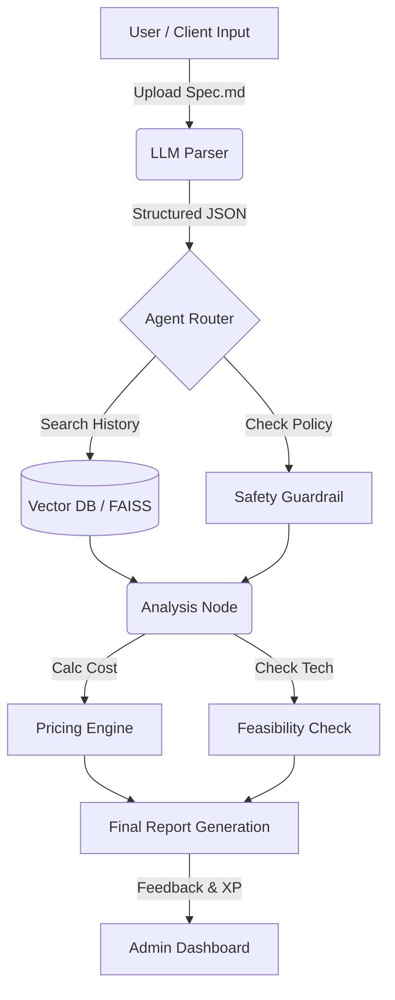

# Freelance-Ops-Agent


> **"더 이상 감으로 견적 내지 마세요."**
>
> **Freelance-Ops-Agent**는 내 프리랜서 개발 경험을 데이터화하고, 새로운 의뢰가 들어왔을 때 **구현 가능성과 적정 견적**을 분석해주는 AI 에이전트입니다.

---

## 📖 Introduction

프리랜서 개발자로 일하면서 가장 골치 아픈 순간은 코딩할 때가 아니었습니다.
바로 **"이거 얼마에 해주실 수 있나요?"** 라는 질문을 받았을 때입니다.

*"너무 비싸게 부르면 도망갈 것 같고, 싸게 부르면 내 손해인데..."*

이 고민을 끝내기 위해 **Freelance-Ops-Agent**를 만들었습니다. 이 프로젝트는 제가 지난 수백 건의 프로젝트를 진행하며 쌓은 데이터를 RAG(검색 증강 생성)로 학습시켰습니다. 클라이언트가 던져준 모호한 요구사항 텍스트를 넣으면, AI가 **"과거엔 이 정도 난이도를 얼마에 했는지"** 찾아내고, 기술적 제약 사항을 검토해 줍니다.

단순한 유틸리티를 넘어, 프로젝트를 완수할 때마다 **XP(경험치)**를 쌓는 게임 요소를 넣어 개발자로서의 성장을 기록할 수 있게 설계했습니다.

## ✨ Key Features

### 1. 📄 Smart Spec Analysis (명세서 자동 분석)
- 클라이언트가 준 정리되지 않은 파일(`md`, `txt`)을 던져주면, LLM이 핵심 기능만 뽑아내 **깔끔한 기술 명세(JSON)**로 바꿔줍니다.
- 요구사항이 너무 모호하면, 역으로 클라이언트에게 물어봐야 할 질문 리스트를 뽑아줍니다.

### 2. 💰 Data-Driven Pricing (데이터 기반 견적)
- **RAG Engine:** "이 기능, 예전에 해봤나?" 제 과거 프로젝트 DB(100+건)를 뒤져서 가장 비슷한 사례를 찾아냅니다.
- **Dual Pricing:** 현재 시장 평균 단가와 실제 작업 난이도를 고려한 '권장 견적'을 동시에 제안합니다.
  - *Output 예시: "시장가는 50만원 선이지만, DB 이중화 작업이 포함되어 있어 80만원이 적정합니다."*

### 3. 🛡️ Technical Feasibility Check (기술 검토)
- `LangGraph` 에이전트가 `discord.py`, `playwright` 등 주요 라이브러리 문서를 참조해 기술적 제약을 체크합니다.
- 디스코드 정책 위반이나 기술적으로 불가능한 요구사항(예: 어뷰징 봇)이 있다면 사전에 경고합니다.

### 4. 🎮 Gamified Growth System (성장 시스템)
- 프로젝트가 끝나면 AI가 회고(Retrospective)를 진행합니다.
- 수익과 난이도에 따라 **XP**와 **스탯**이 오르는 RPG 맛을 더했습니다.
  - *Effect: `Python Lv.3 -> Lv.4`, `Negotiation +5`*

---

## 🏗️ System Architecture

사용자가 명세서를 업로드하면 **Router**가 의도를 파악하고, **Pricing Engine**(견적 산출)과 **Feasibility Agent**(기술 검토)가 병렬로 돌아가는 구조입니다.



## 🛠️ Tech Stack

| Category | Technology |
|----------|------------|
| **Language** | Python 3.12 |
| **Backend** | FastAPI, Pydantic V2 |
| **AI / LLM** | LangChain, LangGraph, OpenAI (GPT-5-mini) |
| **Vector DB** | FAISS (Local), ChromaDB |
| **Deployment** | AWS EC2, Docker Compose |
| **Tools** | Git, Poetry |

---

## 🚀 Getting Started

로컬 환경이나 Docker를 통해 바로 실행해 볼 수 있습니다.

### Prerequisites
- Python 3.12+
- Docker & Docker Compose
- OpenAI API Key

### Installation

1. **Repository Clone**
   ```bash
   git clone [https://github.com/your-username/Freelance-Ops-Agent.git](https://github.com/your-username/Freelance-Ops-Agent.git)
   cd Freelance-Ops-Agent
   ```

2. Environment Setup .env 파일을 생성하고 API Key를 입력하세요.
  ```bash
  OPENAI_API_KEY=sk-proj-...
  TAVILY_API_KEY=tvly-...
  ```

3. Run with Docker (Recommended)
   ```bash
   docker-compose up --build
   ```

4. Run Locally
   ```bash
   poetry install
   poetry run uvicorn src.backend.main:app --reload
   ```

# 📂 Project Structure
  ```bash
  Freelance-Ops-Agent/
  ├── data/
  │   ├── raw_specs/       # 요구사항 명세서 원본 (.md)
  │   └── vector_store/    # FAISS Vector Index
  ├── src/
  │   ├── agent/           # LangGraph Nodes & Edges
  │   ├── backend/         # FastAPI Server
  │   ├── core/            # RAG & LLM Logic
  │   └── utils/           # Parsers & Helpers
  ├── tests/               # Unit Tests
  ├── docker-compose.yml
  └── README.md
  ```

## 📜 License

This project is licensed under the [MIT License](LICENSE).

