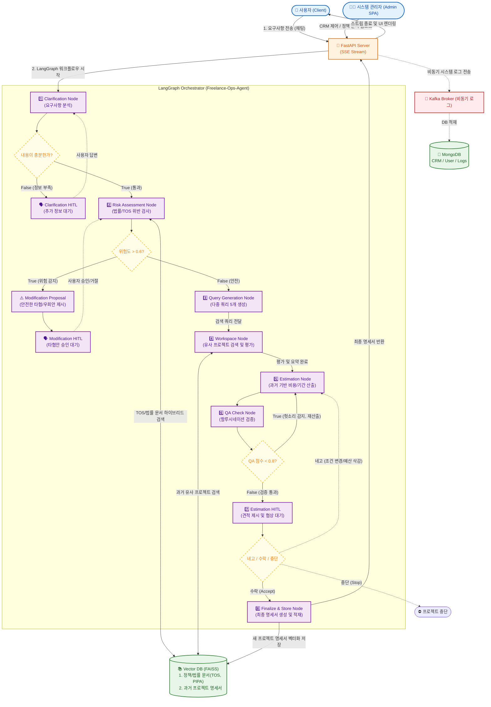

# Freelance-Ops-Agent


> **"더 이상 감으로 견적 내지 마세요."**
>
> **Freelance-Ops-Agent**는 과거 프리랜서 경험과 Human-in-the-loop 피드백을 바탕으로 **구현 가능성, 적정 견적, 제작 기간, 법률 리스크**를 종합적으로 판단해 주는 개인화된 AI 의사결정 파트너입니다.

---

## 📖 Introduction & Background

프리랜서 개발자로 일하면서 가장 골치 아픈 순간은 코딩할 때가 아니었습니다.
바로 **"이거 얼마에, 며칠 안에 가능하세요?"** 라는 질문을 받았을 때입니다. 

*"너무 비싸게 부르면 도망갈 것 같고, 싸게 부르면 내 손해인데..."*

이 고민을 끝내기 위해 **Freelance-Ops-Agent**를 만들었습니다. 클라이언트가 던져준 모호한 요구사항 텍스트를 넣으면, AI가 과거 프로젝트 데이터를 RAG로 검색하고, LangGraph 기반 상태 머신(State Machine)을 이용해 **가격·기간·리스크·질문사항**을 동시에 검토해 줍니다. 단순한 자동화 챗봇이 아닌, 파편화된 요구사항 속에서 객관적 근거를 찾아주는 저만의 **AI 기반 의사결정 보조 시스템**입니다.

이 에이전트는 오래 사용할수록 **본인의 견적 스타일을 학습**합니다.  
새로운 견적을 작성할 때마다 Vector DB에 견적서가 쌓여 사용할수록 **내 감각에 맞는 개인화된 견적 에이전트**로 진화합니다.

### ⚡ Before & After Example

| | Input (Raw Requirement) | Output (Agent Report) |
|---|---|---|
| **상황** | "메이플 쌀먹 봇, 3일 안에, 예산 5만원." | **[분석 리포트]** |
| **결과** | **거절/재협상 필요** <br> (정보 부족, 터무니없는 가격) |  **최종 제안: 150,000원** <br> • **기간:** 5일 (Testing 포함) <br> • **리스크:** 24h 서버 비용 별도 <br> • **난이도:** High (DB, 호스팅) |

## ✨ Key Features


### 1. ⚖️ Risk Detection (법률 및 정책 리스크 탐지)

- 대한민국 개인정보보호법(PIPA) 전문 및 Discord 이용 약관(TOS)을 Vector DB에 임베딩.
- 클라이언트의 요구사항을 분석하여 법적 위반 소지가 있는지 Risk Score를 정량화하고, 우회하거나 보완할 수 있는 대안 아키텍처를 선제적으로 제안합니다.
> ※ 본 시스템은 법적 판단을 대체하지 않으며, 개발자의 의사결정을 보조하기 위한 참고 도구입니다.

### 2. 💰 Map-Reduce 기반 다중 쿼리 검색 (Agentic RAG)

- 고객의 단일 요구사항을 5개의 독립적인 도메인 쿼리로 분해하고, 각 쿼리에 대해 병렬로 워크스페이스를 생성하여 FAISS DB를 하이브리드 검색합니다.
- 단순 텍스트 생성을 넘어, 기능별 **Story Point(복잡도)** 를 계산하고 RAG로 추출한 과거 유사 프로젝트의 실제 소요 기간을 혼합하여 가장 현실적인 견적과 일정을 산출합니다.

### 3. ⏸️ Human-in-the-loop (HITL) 피드백 루프

- LangGraph의 Interrupt 기능을 활용하여, 에이전트가 최종 명세서를 DB에 적재하기 전 관리자의 승인(수락/수정/거절)을 대기합니다.
- 관리자의 피드백은 즉시 다음 노드로 전달되어 협상 로직을 실시간으로 재구성합니다.


## 🧠 AI Core Logic: RAG 기반의 지속적 학습 (Continual Learning)

복잡하고 무거운 파라미터 Fine-Tuning 대신, 프리랜서의 실무 환경에 맞춘 **'메모리 기반의 암묵적 피드백 루프(Implicit Feedback Loop)'** 를 구현했습니다.

### 1. 상황 인식 및 즉각적 반영:
에이전트가 제시한 초안 견적에 대해 사용자가 금액이나 조건을 수정하면, LangGraph의 상태(State)에 해당 피드백이 즉시 반영되어 컨텍스트 기반으로 새로운 견적을 재산출합니다.

### 2. Vector DB를 통한 영구적 지식 진화:
사용자의 피드백을 거쳐 최종적으로 승인된 견적서(정답 데이터)는 ``finalize_and_store_node``를 통해 기존 명세서와 병합되어 **FAISS Vector DB에 재적재**됩니다.

### 3. 플라이휠(Flywheel) 효과:
이후 유사한 프로젝트 의뢰가 들어올 경우, 에이전트는 RAG를 통해 **'과거에 사용자가 직접 컨펌했던 정답 단가와 일정'** 을 최우선으로 검색하여 참고합니다. 시스템을 사용할수록 FAISS 내의 고품질 레퍼런스가 누적되어, 점진적으로 '나의 견적 감각'에 완벽히 동기화된 에이전트로 진화합니다.


## 🏗️ System Architecture

요청은 **FastAPI** 기반의 Server-Sent Events(SSE) 스트리밍을 통해 비동기로 처리되며, **LangGraph** 오케스트레이터를 거쳐 상태 머신 흐름을 제어합니다.



***
## 🔧 Troubleshooting & Lessons Learned

단순한 프롬프트 엔지니어링을 넘어, 실제 프로덕션 수준의 Agentic 시스템을 구축하며 겪은 아키텍처 및 상태 관리(State Management) 이슈들을 다음과 같이 해결했습니다.

### 1. 상태 스키마(State Schema) 누락으로 인한 Vector DB 대규모 유실 방어
* **Issue:** 사용자의 피드백을 처리하는 과정에서, LangGraph의 ``MainState`` 스키마에 ``project_id`` 필드가 명시되지 않아 다음 노드로 넘어갈 때 데이터가 메모리에서 휘발되는 현상 발생. 이로 인해 FAISS DB의 삭제 쿼리가 ``{"project_id": None}``으로 실행되어 256개의 시스템 기반 지식(법률, 약관) 청크가 통째로 삭제되는 크리티컬 버그 발생.
* **Solution:** Pydantic 스키마에 식별자 필드를 엄격하게 정의하고, 노드 진입부(``finalize_and_store_node``)에 ``project_id``가 없을 경우 DB 접근을 원천 차단하는 안전장치를 구축하여 데이터 무결성을 확보했습니다.

### 2. HITL (Human-in-the-Loop) 피드백 덮어쓰기 충돌 해결
* **Issue:** 에이전트가 견적 단계에서 멈춰 사용자 피드백을 기다릴 때, 대화를 재개(``/resume``)하면 에이전트가 피드백을 무시하고 이전 견적을 무한 반복하는 루프에 빠짐. 프론트엔드에서 불필요하게 ``project_id``를 다시 전송하여 LangGraph가 새로운 분기를 생성했기 때문.
* **Solution:** 라우터 레이어에서 상태 업데이트(``graph.update_state``) 시, 노드가 어떤 키를 참조하더라도 일관성을 유지하도록 ``human_feedback``과 ``input_message`` 두 채널 모두에 값을 주입하여 상태 충돌을 완벽히 제어했습니다.

### 3. 이벤트 루프 블로킹 및 비동기 스트리밍(SSE) 지연 최적화
* **Issue:** LangGraph의 **astream**과 파일 로깅, DB I/O가 단일 이벤트 루프 내에서 충돌하며, 에이전트의 추론 시간이 길어질 경우 FastAPI의 SSE 스트리밍이 끊기거나 지연되는 현상이 발생했습니다.
* **Solution:** I/O 바운드 로깅으로 인한 이벤트 루프 병목을 해결하기 위해, 실험적으로 비동기 메시지 큐 기반 구조를 도입하여 로깅 처리를 분리했습니다.
***

## 🔒 Security & Privacy Strategy

본 프로젝트는 실제 클라이언트의 민감 정보와 영업 기밀을 다루므로, **Enterprise급 보안 가이드라인**을 준수하여 설계되었습니다.

### 1. Data Isolation (데이터 격리)
- 클라이언트의 요구사항 원본 및 영업 노하우가 담긴 Vector DB(*.faiss, *.pkl)는 엄격히 .gitignore 처리되어 리포지토리에 노출되지 않습니다.

### 2. JWT Authentication & Bcrypt Hashing (세션 보안)
- 대시보드 및 에이전트 시스템에 접근하는 관리자 세션은 ``jose`` 라이브러리를 활용한 **JWT(JSON Web Token) Access/Refresh Token** 이중 구조로 보호됩니다.
- 시스템 내부의 모든 민감한 자격 증명은 ``passlib``의 **Bcrypt 단방향 해시 알고리즘**을 통해 안전하게 암호화되어 DB에 적재됩니다.

### 3. LLM Data Privacy (No-Training Policy)
- **No-Training Policy:** OpenAI API의 [Enterprise Privacy Policy](https://openai.com/enterprise-privacy)를 준수합니다. 인터페이스가 아닌 API 기반 통신을 사용하여 파이프라인에 입력된 민감한 요구사항이 LLM의 학습 데이터로 재사용되는 것을 차단했습니다.

***

## 🛠️ Tech Stack

| Category | Technology |
|----------|------------|
| **Language** | Python 3.12 |
| **Backend** | FastAPI, Pydantic V2, Uvicorn |
| **AI / Agent** | LangChain, LangGraph, OpenAI API (GPT 계열 모델) |
| **Database** | MongoDB, Beanie (ODM), FAISS (Vector DB) |
| **Message Broker** | Apache Kafka |
| **Infra & DevOps** | Docker, Docker-compose, Nginx |

***

## 🚀 Getting Started

1. **리포지토리를 복사합니다.**
```bash
git clone https://github.com/jomkeu3369/Freelance-Ops-Agent
```

2. **.env 파일을 생성하고 아래 구조에 맞게 작성합니다.**
```
version = 0.1.2

environment = development 또는 production
OPENAI_API_KEY= 

ACCESS_TOKEN_EXPIRE_MINUTES = 
REFRESH_TOKEN_EXPIRE_DAYS = 
SECRET_KEY = 
ALGORITHM = 

admin_username = 
admin_email = 
admin_password = 

LANGCHAIN_TRACING_V2=true
LANGCHAIN_ENDPOINT=https://api.smith.langchain.com
LANGCHAIN_API_KEY=
LANGCHAIN_PROJECT=

VULTR_API_KEY=
```

3. **아래 명령어를 사용하여 docker를 구동합니다.**
```bash
docker-compose -f docker-compose.infra.yaml up -d
docker-compose -f docker-compose.yaml up -d
```

***

## 📂 Project Structure

```bash
Freelance-Ops-Agent/
├── src/
│   ├── api/                    # 도메인별 API 라우터 및 CRUD (Agent, CRM, Auth 등)
│   ├── core/                   # 시스템 코어 (Kafka 설정, 보안, 세션 관리, 모니터링)
│   ├── data/                   # FAISS Vector DB 인덱스 저장소 (Git Ignored)
│   ├── logs/                   # Kafka Producer 로깅 시스템
│   ├── models/                 # LangGraph 상태 머신 (Graph, Nodes, Schema)
│   ├── main.py                 # FastAPI 애플리케이션 진입점 (Lifespan 관리)
│   └── worker.py               # Kafka Consumer 백그라운드 워커 (DB 적재)
├── docker-compose.yaml         # 백엔드 API 오케스트레이션
├── docker-compose.infra.yaml   # 인프라(Kafka, DB) 오케스트레이션
└── README.md

```

## 📜 License

This project is licensed under the [MIT License](LICENSE).