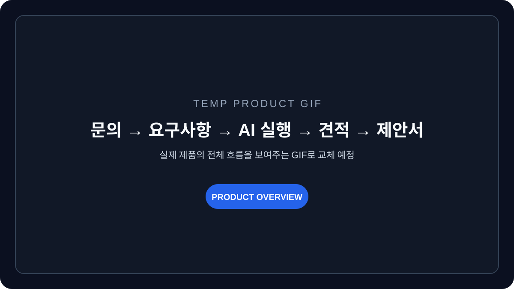
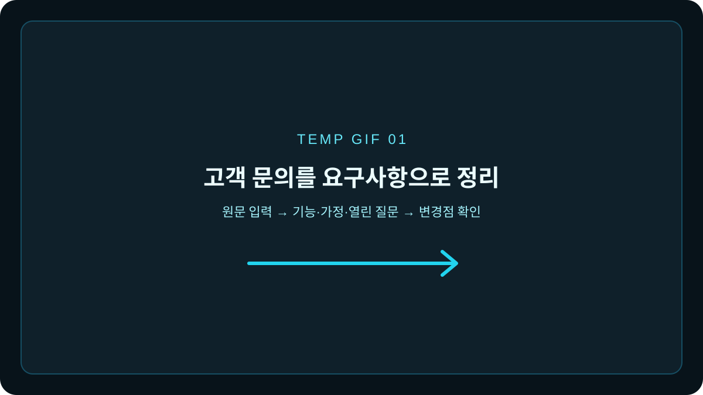
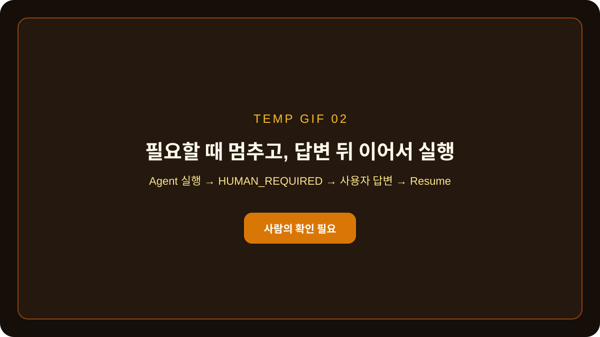
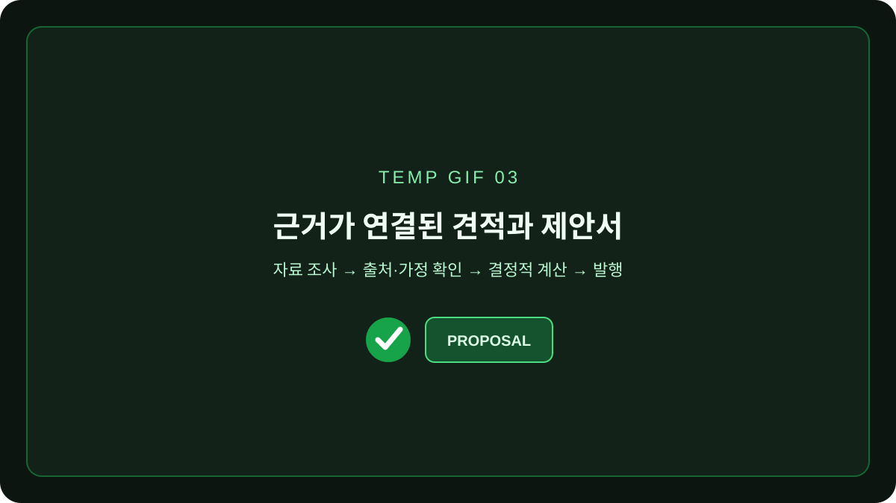
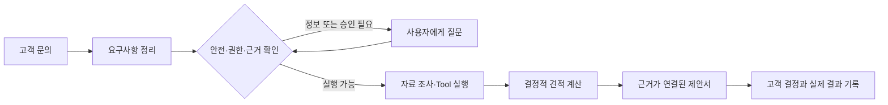

<div align="center">

# Freelance Ops Agent

### 흩어진 고객 문의를, 근거를 확인할 수 있는 견적과 제안서로 바꿉니다.

프리랜서가 고객 문의를 정리하고 자료를 찾고 견적을 계산하는 과정을<br/>
AI와 함께 진행하되, **중요한 결정은 사람이 확인하도록 설계한 업무 도구**입니다.

[Live Product](https://www.freelance-ops.site) · [기술 포트폴리오](docs/portfolio/README.md) · [Architecture](docs/V2_SPECIFICATION.md) · [Current Status](docs/STATUS.md)


</div>

<!-- TEMP: 실제 제품 전체 흐름 GIF로 교체 예정 -->


## 어떤 문제를 해결하나요?

프리랜서에게 새로운 문의가 들어오면 바로 견적을 쓰기 어렵습니다.

- 고객의 설명에서 확정된 요구사항과 아직 물어봐야 할 내용을 나눠야 합니다.
- 내부 자료와 과거 프로젝트에서 이번 제안의 근거를 찾아야 합니다.
- 작업 범위, 일정, 단가, 세금과 할인 조건을 일관되게 계산해야 합니다.
- AI가 확실하지 않은 내용을 사실처럼 채우지 않았는지 검토해야 합니다.

Freelance Ops Agent는 이 과정을 하나의 흐름으로 연결합니다. AI가 초안을 만들지만, 근거가 부족하거나 승인이 필요한 순간에는 자동으로 멈추고 사람에게 질문합니다.

## 제품은 이렇게 동작합니다

### 1. 고객 문의를 실행 가능한 요구사항으로 정리합니다

고객의 원문을 입력하면 기능, 제약조건, 일정, 예산, 가정과 열린 질문으로 구조화합니다. 원문과 정리된 내용의 차이를 함께 보여주기 때문에 AI가 무엇을 추가하거나 해석했는지 확인할 수 있습니다.

<!-- TEMP: 고객 문의 입력 → 요구사항 구조화 화면 GIF로 교체 예정 -->


### 2. 확실하지 않은 판단은 사람에게 돌려줍니다

정보가 부족하거나 민감한 작업, 승인 또는 비가역 작업이 포함되면 Agent는 실행을 강행하지 않습니다. 필요한 질문을 남기고 멈춘 뒤, 사용자가 답하면 같은 작업을 이어서 진행합니다.

<!-- TEMP: Agent 실행 → HITL 질문 → 답변 후 재개 GIF로 교체 예정 -->


### 3. 근거와 계산식이 연결된 견적을 만듭니다

내부 문서와 조사 결과를 바탕으로 여러 범위의 작업안을 만들고, 금액은 AI가 임의로 계산하지 않고 Backend의 결정적인 계산 로직으로 산출합니다. 각 견적 항목에는 출처 또는 명시적인 가정이 남습니다.

<!-- TEMP: 근거 확인 → 견적 계산 → 제안서 발행 GIF로 교체 예정 -->


## 단순한 AI 채팅과 무엇이 다른가요?

이 프로젝트의 중심은 답변을 길게 생성하는 것이 아니라, AI가 실제 업무의 경계를 지키며 일하게 만드는 것입니다.

| 일반적인 AI 채팅 | Freelance Ops Agent |
|---|---|
| 대화가 끝나면 결과가 흩어짐 | 문의, 요구사항, 견적과 고객 결정을 하나의 프로젝트로 연결 |
| 모델이 계산과 판단을 함께 수행 | 금액 계산과 권한 검사는 결정적인 Backend 로직이 담당 |
| 불확실해도 답변을 생성하기 쉬움 | 근거 부족·승인 필요·실행 실패 시 사람에게 질문하고 중단 |
| 검색 결과의 출처가 결과와 분리됨 | 각 제안 항목에 evidence 또는 assumption을 연결 |
| 재시작하면 실행 문맥을 잃기 쉬움 | checkpoint와 event를 저장해 중단된 실행을 이어서 처리 |

## AI가 일하는 방식



- 브라우저는 인증과 권한을 담당하는 Spring API만 호출합니다.
- Agent는 실행 사용자의 권한을 넘는 Tool을 사용할 수 없습니다.
- 금액, 세금, 할인과 합계는 Java Tool에서 계산합니다.
- 검색된 문서에 실제 답이 있는지 별도로 검증합니다.
- 모호하거나 위험한 요청은 `HUMAN_REQUIRED`로 중단합니다.

더 자세한 서비스 경계와 설계 결정은 [V2 제품·기술 명세](docs/V2_SPECIFICATION.md)와 [ADR](docs/adr/README.md)에서 확인할 수 있습니다.

## 검증하면서 만든 제품입니다

빠른 로컬 모델을 사용한다는 이유만으로 운영에 넣지 않았습니다. 같은 frozen dataset에서 후보를 비교하고, 잘못 자동화하면 안 되는 요청을 충분히 구분하지 못한 모델은 실제 실행 경로에서 제외했습니다.

- Hybrid retrieval은 frozen test에서 `Recall@5 0.87`을 기록했습니다.
- 로컬 verifier는 약 `11.9ms/query`였지만 허용 precision이 `0.75`여서 최종 판단을 맡기지 않았습니다.
- 로컬 route 모델은 LLM보다 약 94배 빨랐지만 안전 route 성능이 기준에 미달해 shadow 평가로만 남겼습니다.

수치 자체보다 중요한 결과는 **빠르거나 저렴해도 안전 기준을 통과하지 못하면 운영에 사용하지 않는 승격 기준**을 만든 것입니다. 실험 과정, 전체 지표, 실패한 가설과 그래프는 [RAG Answerability와 Agent Routing 신뢰성 개선](docs/portfolio/ai-routing-and-rag-reliability-case-study.md)에 분리했습니다.

## 현재 상태

> 핵심 Agent 실행 경로 구현 완료 — 실제 사용자 E2E와 운영 평가 진행 중

현재 다음 흐름이 구현되어 있습니다.

- 고객 문의와 프로젝트 요구사항 관리
- OpenAI/Gemini 기반 route 평가와 제한된 Agent 실행
- 검색, 근거 검증, Tool 호출과 견적 계산
- PostgreSQL checkpoint, 실시간 event와 HITL 재개
- workspace 단위 인증·권한·감사·비용 기록
- 견적 revision, 발행, 공유와 고객 결정 기록
- GitHub CI를 통과한 immutable image의 자동 배포

아직 실제 업무 문서 기반의 전체 평가, 실제 사용자 실패·수정 데이터, backup restore drill은 완료되지 않았습니다. 최신 검증 결과와 blocker는 [STATUS](docs/STATUS.md)에 사실대로 기록합니다.

## 기술 구성

| 영역 | 사용 기술 |
|---|---|
| Web | Next.js 16, React 19, TypeScript |
| Business API | Java 21, Spring Boot 4, Spring Security, JPA |
| AI Runtime | Python 3.12, FastAPI, LangGraph, Pydantic |
| Data | PostgreSQL 17, pgvector, Full-text Search |
| Models | OpenAI Responses API, Gemini API |
| Delivery | GitHub Actions, Docker Compose, GHCR, Caddy, Vultr, Vercel |

## 로컬에서 확인하기

`.env.example`을 기준으로 필요한 환경 변수를 설정한 뒤 실행합니다.

```bash
docker compose -f docker-compose-infra.yaml up -d --wait
docker compose -f docker-compose.yaml up --build -d --wait
```

서비스별 검증 명령은 다음과 같습니다.

```text
Agent      cd agent && uv run --locked pytest
Backend    cd backend && ./gradlew test --no-daemon
Frontend   cd frontend && npm run preview:check
```

Windows에서는 Backend 검증에 `backend\gradlew.bat`을 사용합니다.

## 더 자세히 보고 싶다면

1. [AI 신뢰성 사례 연구](docs/portfolio/ai-routing-and-rag-reliability-case-study.md)
2. [운영 라우팅 결정](docs/adr/0015-llm-first-operational-routing.md)
3. [Retrieval Answerability 평가](docs/testing/retrieval-answerability-pipeline.md)
4. [Agent Tool Catalog](docs/agent-tools/TOOL_CATALOG.md)
5. [V2 제품·기술 명세](docs/V2_SPECIFICATION.md)

---

<div align="center">

**AI가 모든 것을 결정하게 만드는 대신,<br/>
AI가 어디까지 결정해도 되는지 검증하는 제품을 만들고 있습니다.**

</div>
