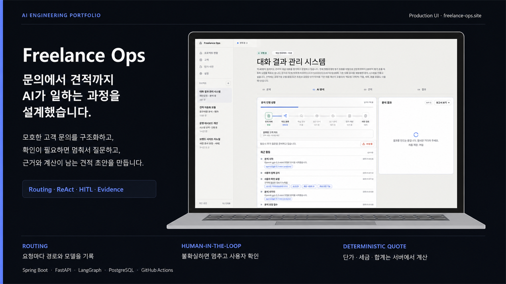
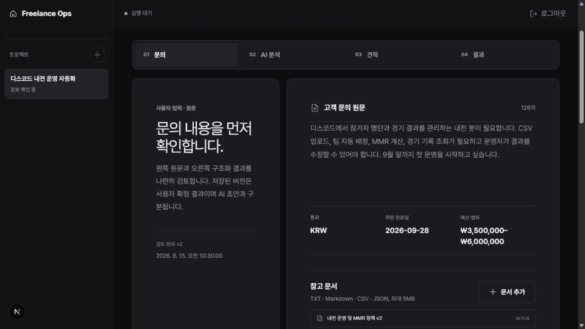
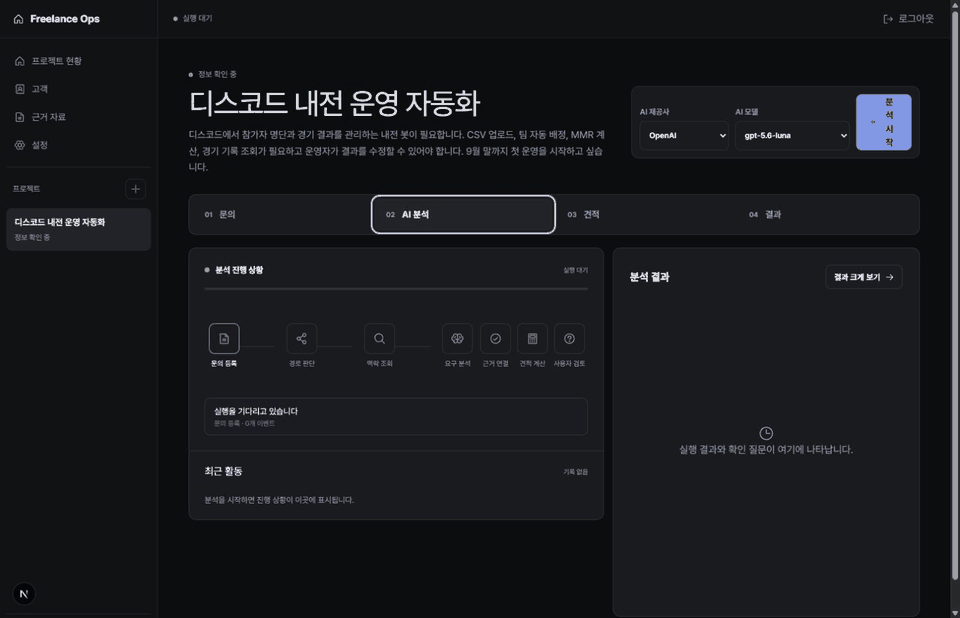
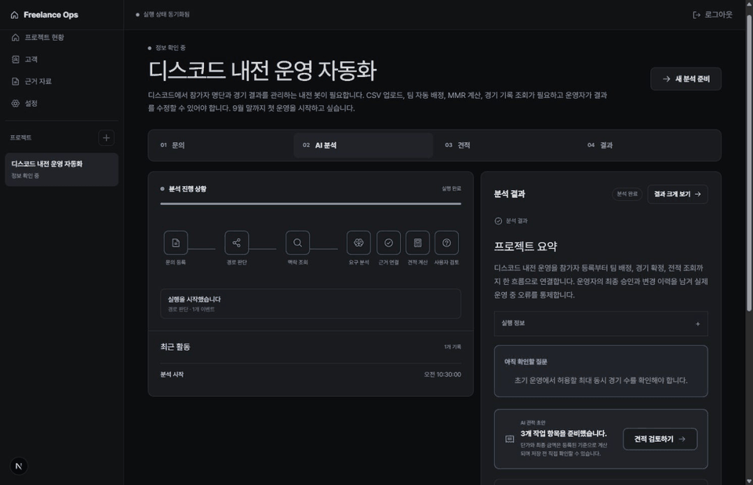
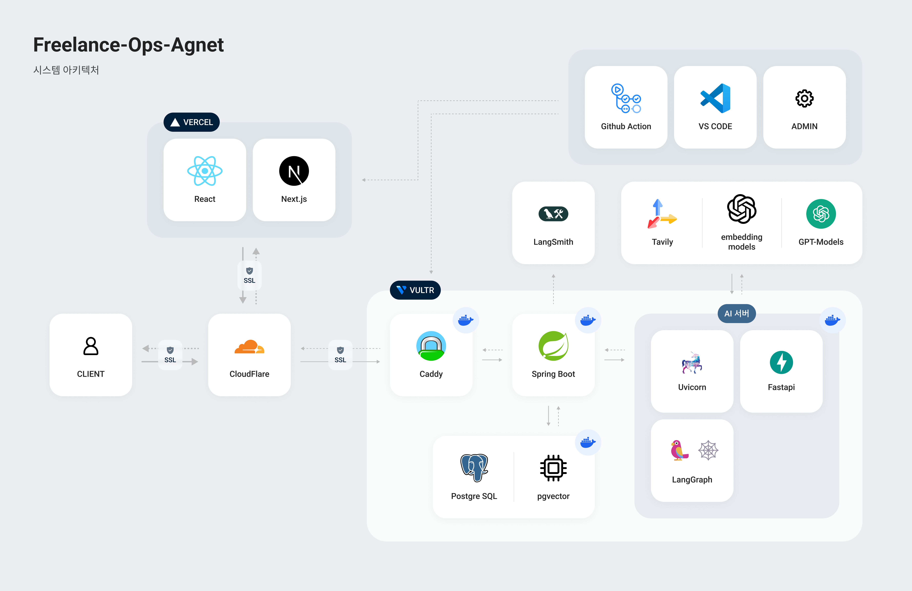
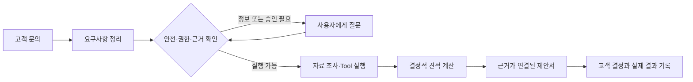

<div align="center">

# Freelance Ops Agent

### 애매하게 들어온 고객 문의를, 실제로 검토하고 보낼 수 있는 견적으로 바꿉니다.

문의 내용을 다시 정리하고, 빠진 내용을 물어보고, 관련 자료를 찾고, 금액을 계산하는 일.<br/>
Freelance Ops Agent는 이 번거로운 과정을 AI와 함께 처리하는 프리랜서 업무 도구입니다.

[Live Product](https://www.freelance-ops.site) · [기술 포트폴리오](docs/portfolio/README.md)<br/>
[Architecture](docs/V2_SPECIFICATION.md) · [Current Status](docs/STATUS.md)


<br/>


<br/>


</div>



## 왜 만들었나요?

고객이 “이런 서비스가 필요해요”라고 문의를 보내도<br/>
곧바로 견적을 쓰기는 어렵습니다.

몇 줄 안 되는 메시지 안에도 다시 확인할 내용이 꽤 많습니다.

- 어디까지 해달라는 것인지
- 일정과 예산은 정해졌는지
- 비슷한 작업을 예전에 얼마에 했는지
- 지금 세운 가정이 맞는지

이걸 매번 문서와 메신저를 오가며 정리하는 대신,<br/>
문의를 받은 순간부터 결과를 기록할 때까지 한곳에서 이어지게 만들었습니다.

AI가 먼저 정리하고 찾아보되,<br/>
모르는 내용까지 그럴듯하게 채우지는 않도록 했습니다.

## 실제로 이렇게 사용합니다

### 1. 문의 내용을 그대로 붙여 넣습니다

AI가 문의 내용을 기능, 조건, 일정, 예산, 가정과 추가 질문으로 나눠줍니다.

원문과 정리된 내용을 나란히 볼 수 있어서<br/>
AI가 어디까지 이해했고 무엇을 새로 해석했는지도 바로 확인할 수 있습니다.



### 2. 모르는 내용은 그냥 물어봅니다

정보가 부족하거나 사람의 확인이 필요한 순간에는<br/>
억지로 답을 만들지 않습니다.

필요한 질문을 남기고 잠시 멈췄다가,<br/>
사용자가 답하면 멈춘 자리에서 다시 이어갑니다.



### 3. 근거를 확인하면서 견적을 완성합니다

내부 자료와 조사 결과를 바탕으로<br/>
작업 범위를 몇 가지 안으로 나눠 제안합니다.

금액은 AI에게 암산시키지 않고 정해진 계산 로직으로 처리합니다.<br/>
왜 이런 항목과 금액이 나왔는지 알 수 있도록 출처나 가정도 함께 남깁니다.



## 채팅창 하나를 더 만든 건 아닙니다

대화를 잘하는 것보다, 실제 업무를 어디까지 맡길 수 있는지가 더 중요하다고 생각했습니다.

| 일반적인 AI 채팅 | Freelance Ops Agent |
|---|---|
| 대화가 끝나면 결과가 흩어짐 | 문의부터 견적, 고객 결정까지 한 프로젝트에 이어서 기록 |
| 모델이 판단과 금액 계산을 모두 처리 | 금액과 권한처럼 틀리면 안 되는 일은 서버가 정해진 규칙대로 처리 |
| 정보가 부족해도 답을 만들어냄 | 근거가 부족하거나 확인이 필요하면 질문을 남기고 멈춤 |
| 검색한 자료와 결과가 따로 남음 | 각 제안 항목에 참고한 자료나 가정을 연결 |
| 서버가 재시작되면 진행 상황을 잃기 쉬움 | 진행 상황을 저장해 멈춘 작업을 다시 이어서 처리 |

## 시스템 구성

Frontend는 Vercel에서 제공하고, Spring Boot와 Python Agent runtime은 Vultr의 Docker 환경에서 운영합니다. 외부 요청은 Cloudflare와 Caddy를 거쳐 처리하며 PostgreSQL과 pgvector를 업무 데이터와 검색 근거의 저장소로 사용합니다.



## 안심하고 일을 맡길 수 있도록



- 사용자가 볼 수 없는 자료는 AI도 볼 수 없습니다.
- 금액, 세금, 할인과 합계는 정해진 서버 로직으로 계산합니다.
- 관련 있어 보이는 문서를 찾는 데서 끝내지 않고, 그 안에 실제 답이 있는지도 다시 확인합니다.
- 정보가 모호하거나 위험한 요청은 자동으로 진행하지 않고 사람의 확인을 기다립니다.
- 중간에 서버가 재시작되어도 진행 중이던 작업을 이어갈 수 있습니다.

더 자세한 설계는 [V2 제품·기술 명세](docs/V2_SPECIFICATION.md)와<br/>
[ADR](docs/adr/README.md)에 정리했습니다.

## 느낌이 아니라 숫자로 확인했습니다

처음에는 빠르고 저렴한 로컬 모델을 앞단에 두려고 했습니다.

하지만 같은 평가 데이터로 비교해 보니<br/>
사람이 확인해야 할 요청을 제대로 구분하지 못했습니다.

속도가 빨라도 실제 업무를 맡기기에는 위험하다고 판단해<br/>
운영 경로에서는 뺐습니다.

- 검색 방식은 고정 평가에서 상위 5개 안에 필요한 문서를 찾는 비율 `0.87`을 기록했습니다.
- 로컬 검증기는 한 건에 약 `11.9ms`로 빨랐지만, 허용 판단의 정밀도가 `0.75`라 최종 결정을 맡기지 않았습니다.
- 로컬 분류 모델은 LLM보다 약 94배 빨랐지만 안전 관련 성능이 기준에 못 미쳐 비교용으로만 남겼습니다.

가장 큰 수확은 좋은 숫자 하나가 아니라,<br/>
**아무리 빠르고 저렴해도 기준을 통과하지 못하면 실제 작업에는 쓰지 않는다**는 원칙을 세운 것입니다.

실험 과정과 전체 지표, 실패한 가설과 그래프는<br/>
[RAG Answerability와 Agent Routing 신뢰성 개선](docs/portfolio/ai-routing-and-rag-reliability-case-study.md)에 따로 정리했습니다.

## 기술 구성

| 영역 | 사용 기술 |
|---|---|
| Web | Next.js 16, React 19, TypeScript |
| Business API | Java 21, Spring Boot 4, Spring Security, JPA |
| AI Runtime | Python 3.12, FastAPI, LangGraph, Pydantic |
| Data | PostgreSQL 17, pgvector, Full-text Search |
| Models | OpenAI Responses API, Gemini API |
| Delivery | GitHub Actions, Docker Compose, GHCR, Caddy, Vultr, Vercel |

## 로컬에서 확인하기

`.env.example`을 기준으로 필요한 환경 변수를 설정한 뒤 실행합니다.

```bash
docker compose -f docker-compose-infra.yaml up -d --wait
docker compose -f docker-compose.yaml up --build -d --wait
```

서비스별 검증 명령은 다음과 같습니다.

```text
Agent      cd agent && uv run --locked pytest
Backend    cd backend && ./gradlew test --no-daemon
Frontend   cd frontend && npm run preview:check
```

Windows에서는 Backend 검증에 `backend\gradlew.bat`을 사용합니다.

## 더 자세히 보고 싶다면

1. [AI 신뢰성 사례 연구](docs/portfolio/ai-routing-and-rag-reliability-case-study.md)
2. [운영 라우팅 결정](docs/adr/0015-llm-first-operational-routing.md)
3. [Retrieval Answerability 평가](docs/testing/retrieval-answerability-pipeline.md)
4. [Agent Tool Catalog](docs/agent-tools/TOOL_CATALOG.md)
5. [V2 제품·기술 명세](docs/V2_SPECIFICATION.md)

---

<div align="center">

**AI가 모든 것을 결정하게 만드는 대신,<br/>
AI가 어디까지 결정해도 되는지 검증하는 제품을 만들고 있습니다.**

</div>
