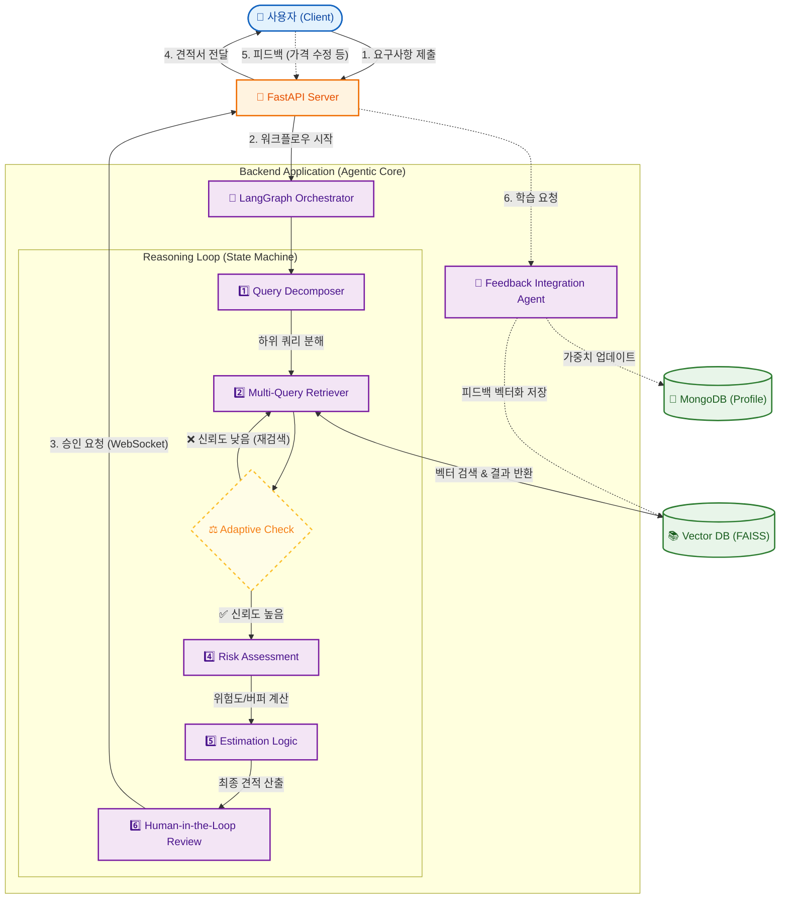

# Freelance-Ops-Agent


> **"더 이상 감으로 견적 내지 마세요."**
>
> **Freelance-Ops-Agent**는 과거 프리랜서 경험과 Human-in-the-loop 피드백을 바탕으로 **구현 가능성, 적정 견적, 제작 기간**을 함께 산출하는 개인화된 견적 파트너입니다.

---

## 📖 Introduction

프리랜서 개발자로 일하면서 가장 골치 아픈 순간은 코딩할 때가 아니었습니다.
바로 **"이거 얼마에, 며칠 안에 가능하세요?"** 라는 질문을 받았을 때입니다. 

*"너무 비싸게 부르면 도망갈 것 같고, 싸게 부르면 내 손해인데..."*

이 고민을 끝내기 위해 **Freelance-Ops-Agent**를 만들었습니다. 이 프로젝트는 클라이언트가 던져준 모호한 요구사항 텍스트를 넣으면, AI가 과거 프로젝트 데이터를 RAG로 검색하고, LangGraph 기반 워크플로우와 가중치 프로필을 이용해 **가격·기간·리스크·질문사항**을 동시에 검토해 줍니다.

이 에이전트는 사용자의 피드백으로 **본인의 견적 스타일을 학습**합니다.  
견적을 수정할 때마다 risk_buffer, hourly_rate 등의 파라미터가 자동 보정되어, 사용할수록 **내 감각에 맞는 개인화된 견적 에이전트**로 진화합니다.

### ⚡ Before & After Example

| | Input (Raw Requirement) | Output (Agent Report) |
|---|---|---|
| **상황** | "메이플 쌀먹 봇, 3일 안에, 예산 5만원." | **[분석 리포트]** |
| **결과** | **거절/재협상 필요** <br> (정보 부족, 터무니없는 가격) |  **최종 제안: 150,000원** <br> • **기간:** 5일 (Testing 포함) <br> • **리스크:** 24h 서버 비용 별도 <br> • **난이도:** High (DB, 호스팅) |

## ✨ Key Features

### 1. 📄 Smart Spec Analysis (명세서 자동 분석)

- `md`, `txt` 등 클라이언트가 준 정리되지 않은 요구사항을 LLM으로 파싱해 **기능 단위 JSON 스펙**으로 구조화합니다.
- 요구사항이 모호하면 클라이언트에게 되물어야 할 **질문 리스트**를 생성해, 사전 커뮤니케이션 비용을 줄여 줍니다.

### 2. 💰 Data-Driven Pricing (데이터 기반 견적)

- **RAG Engine**: "이 기능, 예전에 해봤나?" 제 과거 프로젝트 DB(100+건)를 뒤져서 가장 비슷한 사례를 찾아냅니다.
- **Dual Pricing**: 현재 시장 평균 단가와 실제 작업 난이도를 고려한 '권장 견적'을 동시에 제안합니다.
- **Output 예시**: "시장가는 50만원 선이지만, DB 이중화 작업이 포함되어 있어 80만원이 적정합니다."

### 3. ⏱️ Duration Estimation (제작 기간 산출)

- 각 기능에 대해 **complexity_points(Story Point)** 를 계산하고, 이를 기반으로 한 **LLM 추론 기간**을 산출합니다.
- 동시에 RAG로 과거 유사 프로젝트들의 **실제 소요 기간 평균**을 가져와, 두 값을 가중 평균하여 최종 기간을 계산합니다.

| 요소 | 설명 |
|------|------|
| LLM 추론 기간 | 스펙 난이도 기반 이론상 작업 일수 추정 |
| RAG 기간 | 유사 프로젝트들의 실제 평균 기간 |
| 최종 기간 | 두 값을 비율로 혼합한 하이브리드 기간 추정 |

## 🧠 RLHF-Lite Personalization

### 4. 🎛️ User Preference Profile (가중치 프로필)

- 에이전트는 `user_profile.json`에 저장된 **선호 가중치**를 참조해 견적을 냅니다.  
- 예시 필드:  
  - `market_price_weight`: 시장가 반영 비율  
  - `my_history_weight`: 내 과거 데이터(내 스타일) 비중  
  - `risk_buffer`: 리스크 여유분(기본 청구 배수)  
  - `hourly_rate`: 기준 시급  

이 구조는 전통적인 RLHF처럼 거대한 파이프라인을 돌리지 않고, **프롬프트/파라미터 레벨의 Preference Tuning**으로 빠르게 정렬하는 실용적인 방식입니다.

### 5. 🔁 Human-in-the-loop Feedback Loop

- LangGraph의 **interrupt / Human-in-the-loop 패턴**을 이용해, 견적 결과를 사용자에게 먼저 보여주고 **수정·승인·거절**을 받습니다.
- 사용자가 “이건 최소 1.4배는 더 받아야 한다”처럼 수정하면, 에이전트는 `risk_buffer`·`hourly_rate` 등을 조금씩 조정해 다음 견적에 반영합니다.
- 최종 확정된 견적서는 다시 Vector DB에 저장되어, 이후 RAG 검색 시 **정답 데이터** 로 활용됩니다.

#### 🧮 How Weights Update (Logic)
사용자가 AI의 견적(50만원)을 거절하고 `70만원`으로 수정하면, 에이전트는 다음과 같이 오차(Gap)를 역전파하여 프로필을 업데이트합니다.

$$NewWeight = OldWeight \times (1 + \alpha \times \frac{ActualPrice - AIPrice}{AIPrice})$$

```python
def update_profile(ai_price: int, user_price: int, profile: dict):
    gap_ratio = (user_price - ai_price) / ai_price  # e.g., +0.4 (40% Gap)
    learning_rate = 0.1
    
    profile['risk_buffer'] *= (1 + gap_ratio * learning_rate)
    return profile
```

***
## 🏗️ System Architecture

사용자의 요청은 **FastAPI**를 통해 **LangGraph Orchestrator**로 전달되며, 아래의 상태 머신(State Machine)을 따라 처리됩니다.



***
## 🔧 Troubleshooting & Lessons Learned

**1. RAG의 할루시네이션 문제**
* **Issue:** 과거 데이터가 부족할 때, 에이전트가 터무니없이 낮은 가격을 부르는 현상 발생.
* **Solution:** 유사도(Similarity Score)가 0.7 미만인 경우 RAG 결과를 버리고, 시장가(Market Price) 가중치를 100%로 강제 조정하는 **Fallback Logic**을 추가하여 방어했습니다.

**2. 모호한 난이도의 정량화**
* **Issue:** "어렵다"는 기준이 주관적임.
* **Solution:** 기능 명세(Spec) 단계에서 `Story Point(1~5)`를 산출하도록 프롬프트를 조정하고, `(Total Points / Daily Velocity)` 공식을 도입해 제작 기간을 객관화했습니다.

***

## 🔒 Security & Privacy Strategy

본 프로젝트는 실제 클라이언트의 민감 정보와 영업 기밀을 다루므로, **Enterprise급 보안 가이드라인**을 준수하여 설계되었습니다.

### 1. Data Isolation (데이터 격리)
- **Zero-Trust Repository:** 클라이언트의 요구사항 원본(`raw_specs`)과 영업 노하우가 담긴 Vector DB(`vector_store`)는 `.gitignore`를 통해 엄격히 관리되며, 리포지토리에는 포함되지 않습니다.
- **Environment Management:** API Key 등 모든 자격 증명(Credential)은 `.env` 파일로 분리하여 관리하며, 컨테이너 실행 시 환경 변수로 주입됩니다.

### 2. PII (Personally Identifiable Information) Masking
- RAG 파이프라인 투입 전, `SpecParser` 단계에서 클라이언트의 **실명, 전화번호, 이메일** 등 개인식별정보를 자동으로 탐지하여 마스킹(`***`) 처리합니다.
- 이를 통해 Vector DB 내에 민감 정보가 영구 저장되는 것을 원천 차단했습니다.

### 3. LLM Data Privacy
- **No-Training Policy:** OpenAI API의 [Enterprise Privacy Policy](https://openai.com/enterprise-privacy)를 준수합니다. API를 통해 전송된 데이터는 모델 학습에 사용되지 않음을 확인하고 적용했습니다.

***

## 🛠️ Tech Stack

| Category | Technology |
|----------|------------|
| **Language** | Python 3.12 |
| **Frontend** | HTML5, Tailwind CSS, jQuery |
| **Backend** | FastAPI, Pydantic V2, Uvicorn |
| **AI / Agent** | LangChain, LangGraph |
| **Database** | MongoDB, Beanie (ODM) |
| **Vector DB** | FAISS |
| **Infra & CI/CD** | Docker, GitHub Actions, Nginx, Cloudflare |

***

## 🚀 Getting Started

설치·실행 방법은 기존 README 구조를 유지하면서, 아래와 같이 보완하면 됩니다.

1. **Clone Repository**
2. **환경 변수 설정**: OpenAI API Key 등
3. **Docker 실행 또는 로컬 실행**
***

## 📂 Project Structure

```bash
Freelance-Ops-Agent/
├── src/
│   ├── agent/             # [Core] LangGraph 에이전트 로직
│   │   ├── graph.py       # 워크플로우 정의
│   │   ├── spec_parser.py # 요구사항 분석 노드
│   │   └── researcher.py  # 웹 검색 노드
│   ├── backend/           # FastAPI 서버 로직
│   │   ├── api/           # 엔드포인트 라우터
│   │   └── services/      # 비즈니스 서비스 계층
│   ├── core/              # 설정 및 공통 모듈
│   ├── logs/              # 구조화된 로깅 시스템
│   ├── models/            # Beanie(MongoDB) 데이터 모델
│   └── main.py            # 앱 진입점 (Lifespan & WebSocket)
├── frontend/              # 대시보드 HTML 소스
├── tests/                 # 단위 테스트 및 프로토타입
├── docker-compose.yaml    # 컨테이너 오케스트레이션
├── deploy.sh              # 무중단 배포 스크립트
└── README.md

```

## 📜 License

This project is licensed under the [MIT License](LICENSE).