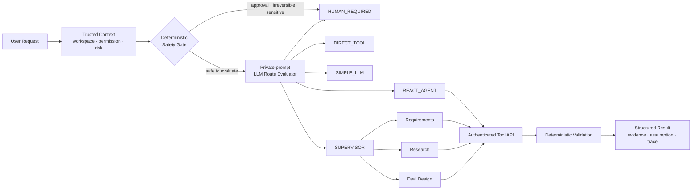
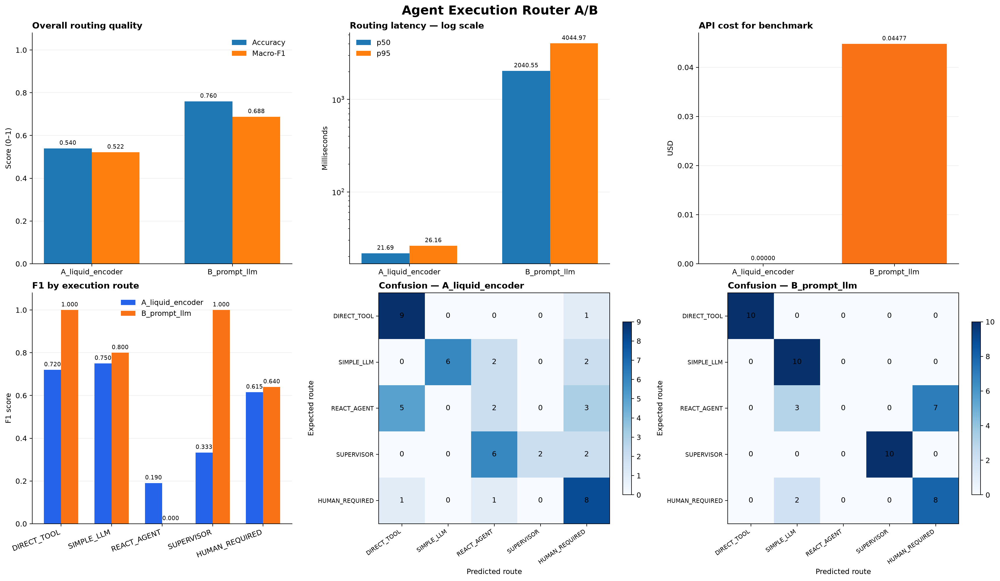
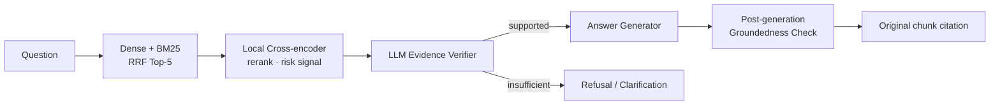
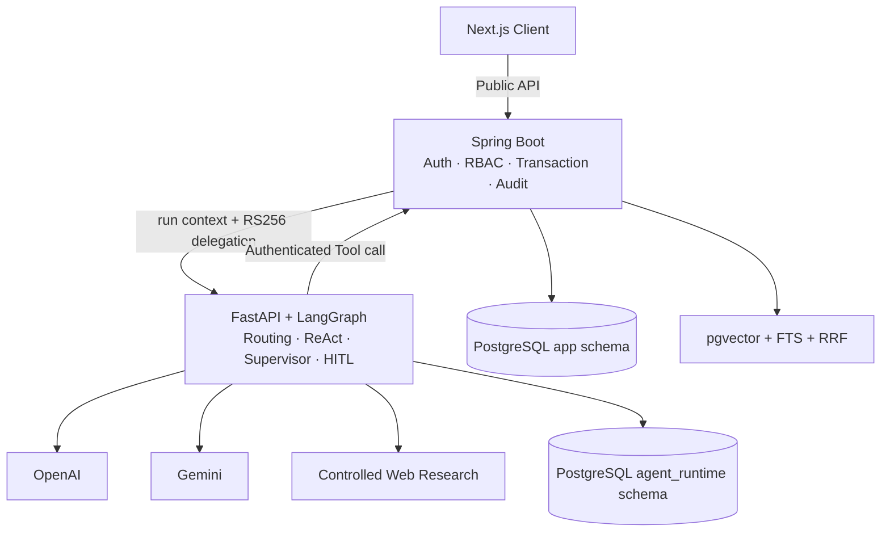

<div align="center">

# Freelance Ops Agent

### 답을 잘 만드는 AI보다, 언제 도구를 쓰고 언제 사람에게 물어야 하는지 아는 AI를 만들고 있습니다.

프리랜서의 모호한 프로젝트 문의를 실험 도메인으로 삼아<br/>
**routing · RAG · Tool use · Supervisor · HITL · evaluation**을 실제 운영 경계 안에서 검증한 AI Agent 프로젝트입니다.

[Live Product](https://www.freelance-ops.site) · [AI Architecture](docs/V2_SPECIFICATION.md) · [Experiments](experiments/routing_benchmark/RESULTS.md) · [Decision Records](docs/adr/README.md)


</div>

---

## 이 프로젝트는 무엇인가요?

Freelance Ops Agent는 **AI Agent Engineering 포트폴리오**입니다.

단순히 채팅 UI에 LLM API를 연결하는 대신, 실제 업무에서 Agent가 부딪히는 질문을 끝까지 다뤘습니다.

- 이 요청은 바로 답할 일인가, Tool을 호출할 일인가, 여러 Agent가 나눠 처리할 일인가?
- 검색 결과가 질문과 비슷하기만 한가, 실제 답을 포함하고 있는가?
- Agent가 사용자의 권한보다 더 많은 일을 하지 못하게 하려면 어디에서 막아야 하는가?
- 실행 중 사람의 판단이 필요해졌을 때 어떻게 멈추고, 서버가 재시작된 뒤에도 이어갈 것인가?
- 더 빠르고 저렴한 로컬 모델이 정말 운영에 충분한지 무엇으로 판단할 것인가?

프리랜서 견적 업무를 선택한 이유도 여기에 있습니다. 요구사항은 모호하고, 근거는 여러 문서에 흩어져 있으며, 금액 계산은 틀리면 안 되고, 마지막 결정은 사람에게 남아 있어야 합니다. **Agent의 추론·검색·도구 사용·안전 경계를 한 번에 검증하기 좋은 현실적인 문제**였습니다.

> 제품은 AI를 보여주기 위한 껍데기가 아닙니다.<br/>
> AI가 실제 데이터·권한·비용·실패를 만났을 때도 동작하는지 검증하는 환경입니다.

## Agent는 어떻게 판단하고 실행하나요?



### 다섯 개의 실행 경로

| Route | 언제 사용하는가 | 핵심 통제 |
|---|---|---|
| `DIRECT_TOOL` | 모델 추론 없이 결정적인 조회·계산이면 충분할 때 | 입력 schema와 permission 검증 |
| `SIMPLE_LLM` | Tool 없는 제한된 구조화 생성이면 충분할 때 | strict structured output |
| `REACT_AGENT` | 검색·검증·계산 Tool을 상황에 맞게 선택해야 할 때 | Tool allowlist와 반복 호출 차단 |
| `SUPERVISOR` | 요구사항·조사·견적 부문을 순서 있게 조율해야 할 때 | 최대 2단계, 고정된 전문 Agent만 허용 |
| `HUMAN_REQUIRED` | 승인·민감정보·비가역 작업 또는 불확실한 판단일 때 | fail-closed, 사용자 응답 후 resume |

Agent 실행에는 시간, model call, Tool call, 입력·출력 token, 검색 credit과 재시도 상한이 있습니다. 예산을 다 쓰면 “최선을 다해 계속”하지 않고 명시적으로 종료합니다.

## 핵심 AI 엔지니어링

### 1. Evaluation-driven Routing

처음에는 빠른 로컬 encoder와 BM25를 결합하면 대부분의 요청을 저렴하게 분류할 수 있다고 생각했습니다. 그래서 5개 route가 균형을 이루는 frozen test를 만들고 LiquidAI routing head와 prompt LLM을 같은 조건에서 비교했습니다.

| Router | Accuracy | Macro-F1 | p50 | 50건 비용 |
|---|---:|---:|---:|---:|
| Fine-tuned LiquidAI A1 | 0.540 | 0.522 | 21.7ms | $0 |
| GPT-5.6 Luna | 0.760 | 0.688 | 2,040.5ms | $0.044768 |

로컬 모델은 약 94배 빨랐지만 `REACT_AGENT` F1이 `0.190`, `HUMAN_REQUIRED` recall도 승격 기준에 미달했습니다. 평균 점수만 보면 매력적이었지만, 잘못 자동화하면 안 되는 요청에서 틀렸습니다.

결론은 로컬 모델을 억지로 운영에 넣는 것이 아니었습니다.

```text
결정적 Safety/Authority Gate
→ 통과한 모든 요청을 private-prompt LLM evaluator로 분류
→ 로컬 router는 optional shadow mode에서만 비교
→ 오류·timeout·schema 실패·abstain은 HUMAN_REQUIRED
```

<p align="center">
  
</p>

이 실험에서 중요했던 것은 “LLM이 더 좋았다”가 아니라, **속도·비용 이점이 있어도 안전 route의 recall이 부족하면 승격하지 않는 기준**을 세운 일이었습니다. 상세 데이터, confusion matrix와 비용은 [Routing Benchmark](experiments/routing_benchmark/RESULTS.md)에 남겼습니다.

### 2. Retrieval과 Answerability를 분리한 RAG

검색된 문서가 질문과 비슷하다는 것과, 그 문서 안에 답이 있다는 것은 다른 문제입니다.

초기에는 cosine similarity와 cluster 중심 거리가 answerability를 설명할 수 있다고 가정했습니다. 650건의 KLUE-MRC 파생 데이터와 문서 중복이 없는 frozen split으로 검증했지만, feature AUC가 약 `0.47~0.57`에 머물렀습니다. 이 가설은 폐기했습니다.

이후 파이프라인은 다음처럼 바뀌었습니다.



| 결과 | 수치 |
|---|---:|
| Dense Recall@3 baseline | 0.72 |
| Hybrid RRF Recall@5 | 0.87 |
| Local verifier latency | 약 11.9ms/query |
| Local accept precision | 0.75 |
| LLM fallback | 0.83 |

로컬 verifier는 검색 순위와 위험 신호에는 유용했지만, precision `0.75`로 답변 허용을 맡기기에는 부족했습니다. 그래서 현재는 LLM evidence verifier를 생략하지 않습니다. 향후 실제 업무 문서 frozen test에서 precision `0.95` 이상을 만족한 구간만 단계적으로 로컬 처리할 계획입니다.

세부 실험과 실패한 가설은 [Retrieval Answerability 평가](docs/testing/retrieval-answerability-pipeline.md)에 정리했습니다.

### 3. Bounded ReAct와 Tool Contract

ReAct loop는 모델이 자유롭게 함수를 호출하는 구조로 두지 않았습니다.

- Tool마다 JSON schema, permission, idempotency와 side-effect 등급을 정의합니다.
- 같은 인자로 같은 Tool을 반복 호출하면 loop를 중단합니다.
- Tool 이름을 hallucination하거나 allowlist 밖 Tool을 요청하면 실행하지 않습니다.
- 금액·세금·할인·합계는 LLM이 계산하지 않고 Java Tool이 결정적으로 계산합니다.
- write Tool은 실행 직전에 Spring에서 현재 권한을 다시 확인합니다.
- model, prompt, Tool schema, token, latency, 비용을 run 단위로 기록합니다.

[Tool Catalog](docs/agent-tools/TOOL_CATALOG.md)는 단순 함수 목록이 아니라 ReAct와 Supervisor 각각에 어떤 Tool을 줄 것인지, 평가 단계에서 무엇을 제외할지를 정의합니다.

### 4. Durable HITL

모호하거나 위험한 요청을 억지로 완성하지 않고 Agent graph를 interrupt합니다. 질문과 checkpoint는 PostgreSQL에 저장되며 사용자가 답하면 같은 run을 이어서 실행합니다.

- run/event와 LangGraph checkpoint를 `agent_runtime` schema에 영속화
- SSE event ID와 `Last-Event-ID`로 연결이 끊겨도 중복 없이 재구독
- 같은 idempotency key의 resume·write Tool 중복 실행 방지
- production에서 memory checkpoint 설정 시 시작 자체를 거부
- checkpoint에 delegation token, secret, 비공개 chain-of-thought 저장 금지

### 5. 제한된 Supervisor와 Deep Agents 실험

Global Orchestrator는 직접 모든 일을 처리하지 않고 Requirements, Research, Deal Design과 Verification의 책임을 나눕니다. 다만 자유로운 swarm은 허용하지 않습니다.

- 최대 계층은 `Global Orchestrator → Department Agent` 2단계
- 부서와 specialist는 코드에 사전 등록
- 부서 간 직접 호출과 재귀 위임 금지
- Supervisor는 검증된 계산과 evidence를 임의로 덮어쓸 수 없음
- general-purpose subagent와 host shell 기본 비활성화

`deepagents`는 전체 오케스트레이터가 아니라 Research 부서 내부의 planning·context offloading 후보로만 사용합니다. 현재는 spike 단계이며 단일 ReAct보다 품질·비용·p95가 좋아진다는 frozen benchmark를 통과하기 전에는 운영 executor로 승격하지 않습니다.

## AI를 실제 시스템에 연결하는 경계

AI가 핵심이지만, AI만으로는 운영 Agent를 증명할 수 없었습니다. Spring Backend는 제품의 중심이라기보다 **Agent가 넘지 말아야 할 현실의 경계**를 담당합니다.



| AI Runtime이 소유 | Spring이 소유 |
|---|---|
| prompt와 version/hash | 사용자 인증과 workspace RBAC |
| route evaluation | trusted safety context |
| LangGraph state와 HITL | CRM·프로젝트·견적 transaction |
| ReAct/Supervisor 실행 | 결정적 금액 계산 |
| OpenAI/Gemini adapter | Tool 권한 재검증과 audit |
| AI evaluation harness | Evidence Ledger와 immutable revision |

브라우저는 Python Agent를 직접 호출하지 않습니다. Python도 Spring의 업무 테이블을 직접 읽거나 수정하지 않습니다. Docker network를 인증으로 간주하지 않고, run과 audience가 고정된 짧은 수명의 RS256 delegation token을 사용합니다.

## 평가를 기능처럼 관리합니다

이 저장소에서 실험 notebook과 운영 테스트는 분리되어 있습니다.

- route별 group-aware/frozen split과 confusion matrix
- accuracy·macro-F1뿐 아니라 `HUMAN_REQUIRED` recall과 false automation 추적
- retrieval Recall@K, MRR, FAR, FRR, local coverage와 LLM fallback 측정
- 3-model Judge panel을 보조 지표로 사용하되 gold label을 대체하지 않음
- model·dataset·prompt·schema version과 실제 token·비용 기록
- V2 평가 리포터에 19개 품질·안전·비용·latency 지표와 Wilson 95% 구간 구현
- 측정하지 않은 지표는 `0`이나 성공으로 채우지 않고 `null`로 기록

Judge에게도 정답을 맡기지 않습니다. LLM Judge는 사람이 정의한 label과 deterministic metric을 보완하는 신호로만 사용합니다.

## AI가 만드는 실제 사용자 흐름

```text
고객 문의·문서
→ 기능·가정·열린 질문 구조화
→ 필요하면 HITL
→ 내부 문서·과거 outcome·웹 근거 조사
→ Lean / Recommended / Expanded WBS 초안
→ Java Tool의 결정적 견적 계산
→ evidence 또는 assumption이 연결된 제안서
→ 고객 승인·수정 요청
→ 실제 공수·매출·비용을 다음 retrieval 근거로 축적
```

이 흐름을 위해 Next.js UI, Spring API, PostgreSQL과 배포 인프라까지 구현했지만 중심 질문은 계속 같습니다. **Agent의 결과가 실제 업무에서 검증 가능하고, 중단 가능하고, 다시 실행 가능하며, 권한을 넘지 않는가?**

## 현재 상태

> **Production pilot — AI runtime 구현 약 90%, 실제 운영 평가 진행 중**

2026-08-14 기준으로 다음 경로가 구현되어 있습니다.

- OpenAI/Gemini provider별 strict structured output과 bounded retry
- private-prompt LLM router와 deterministic safety gate
- `DIRECT_TOOL`, `SIMPLE_LLM`, `REACT_AGENT`, `SUPERVISOR`, `HUMAN_REQUIRED` executor
- PostgreSQL run store, LangGraph checkpoint, SSE와 HITL resume
- audience-bound delegation token을 사용하는 Spring Tool round trip
- pgvector·full-text·RRF retrieval과 evidence provenance
- Tool/model/token/search quota와 Spring-owned cost ledger
- GitHub CI 통과 후 Agent·Backend immutable SHA image 자동 배포
- Vultr runtime과 공개 HTTPS readiness 검증

아직 완료라고 부르지 않는 항목도 분명합니다.

- 실제 OpenAI/Gemini credential을 사용한 전체 사용자 E2E 증거
- 실제 업무 문서로 만든 domain frozen set과 19개 지표 첫 전체 실행
- Research Deep Agent와 단일 ReAct의 동일 dataset 품질·비용 비교
- RAPTOR immutable snapshot publish와 collapsed-tree retrieval
- backup restore drill과 실제 사용자 10~20건의 실패·수정 데이터

최신 검증과 blocker는 [STATUS](docs/STATUS.md), 코드 구현 감사 결과는 [V2 완성도 감사](docs/reviews/2026-08-14-frontend-excluded-completion-audit.md)에서 확인할 수 있습니다.

## 기술 스택

| 영역 | 기술 |
|---|---|
| Agent | Python 3.12, FastAPI, LangGraph, Deep Agents, Pydantic |
| Models | OpenAI Responses API, Gemini API, explicit provider/model per run |
| Retrieval | OpenAI Embedding, pgvector, PostgreSQL FTS, BM25/RRF, RAPTOR core |
| Evaluation | pytest, frozen JSONL dataset, Pandas, Matplotlib, LLM Judge panel |
| Tool Backend | Java 21, Spring Boot 4, Spring Security, JPA, OpenAPI 3.1 |
| Runtime Data | PostgreSQL 17, separate `app` / `agent_runtime` schema, Flyway |
| Interface | Next.js 16, React 19, TypeScript, SSE |
| Delivery | GitHub Actions, GHCR, Docker Compose, Caddy, Vultr, Vercel |

## 로컬 검증

```text
Agent      cd agent && uv run --locked pytest
                    && uv run --locked ruff check src tests
                    && uv run --locked mypy --strict src

Backend    cd backend && ./gradlew test --no-daemon
Frontend   cd frontend && npm run preview:check
Contracts  OpenAPI validator + Docker Compose config
```

전체 로컬 환경은 `.env.example`을 기준으로 secret을 채운 뒤 실행합니다.

```bash
docker compose -f docker-compose-infra.yaml up -d --wait
docker compose -f docker-compose.yaml up --build -d --wait
```

Windows에서는 Backend 검증에 `backend\gradlew.bat`을 사용합니다. Agent는 로컬에서 memory store를 사용할 수 있지만 Compose와 production에서는 PostgreSQL store/checkpoint를 강제합니다.

## 저장소에서 먼저 볼 곳

```text
agent/src/                 운영 Agent runtime과 graph
agent/tests/               Agent contract·security·HITL·evaluation test
experiments/               routing·retrieval 가설과 benchmark artifact
contracts/openapi/         Agent ↔ Spring Tool contract
backend/                   권한·업무 transaction·결정적 Tool
docs/adr/                  채택·기각·대체된 AI 아키텍처 결정
docs/testing/              frozen evaluation과 승격 기준
frontend/                  Agent 상태·HITL·근거를 보여주는 제품 UI
infra/                     운영 배포·rollback·backup 경계
legacy/v1/                 V2와 비교하기 위해 보존한 초기 구현
```

### 추천 읽기 순서

1. [운영 라우팅 결정](docs/adr/0015-llm-first-operational-routing.md)
2. [Routing A/B 결과](experiments/routing_benchmark/RESULTS.md)
3. [Retrieval Answerability 평가](docs/testing/retrieval-answerability-pipeline.md)
4. [Deep Agents 적용 경계](docs/adr/0013-deep-agents-department-runtime.md)
5. [Agent Tool Catalog](docs/agent-tools/TOOL_CATALOG.md)
6. [V2 제품·기술 명세](docs/V2_SPECIFICATION.md)

---

<div align="center">

**이 프로젝트에서 가장 중요한 결과는 잘 나온 데모가 아니라,<br/>
성능이 부족한 모델을 운영에 넣지 않기로 결정할 수 있었던 평가 기준입니다.**

</div>
