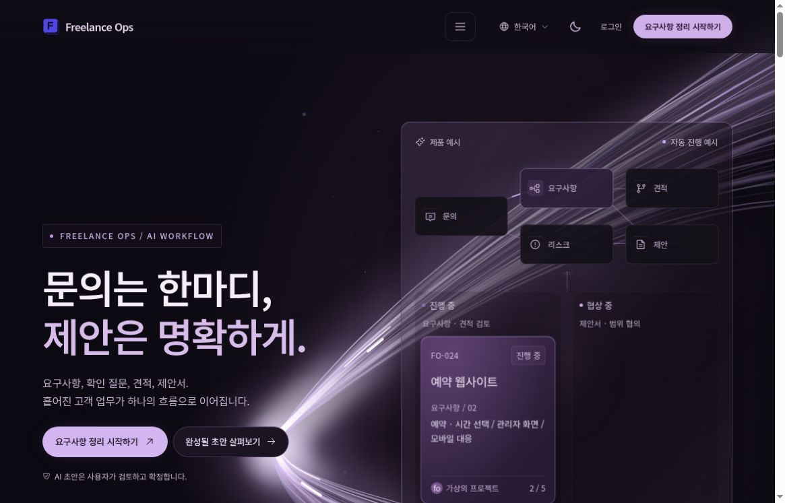
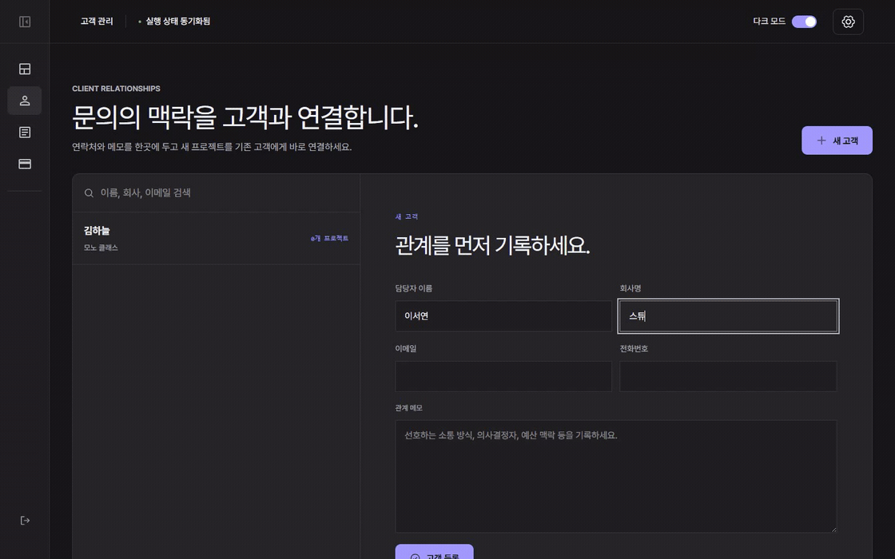
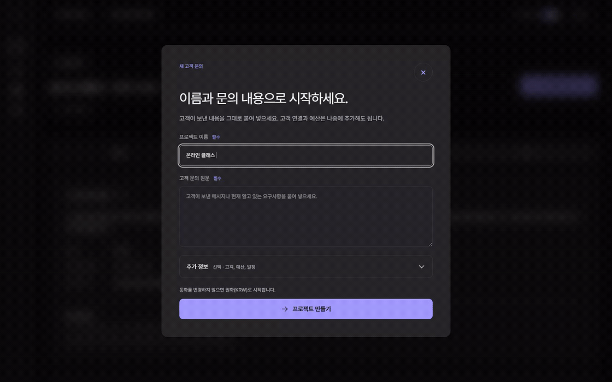
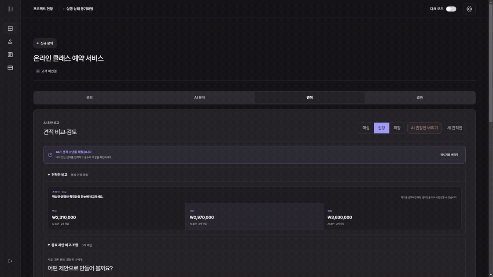
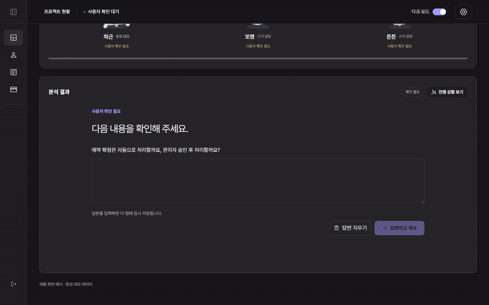
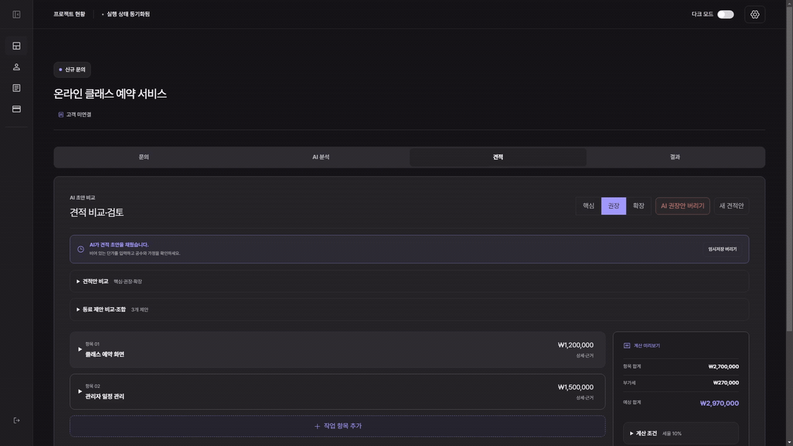
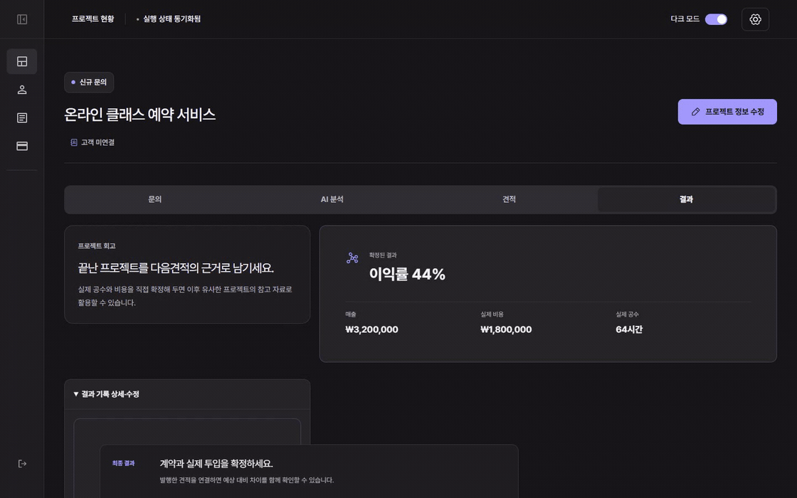

<div align="center">

# Freelance Ops Agent

### 작은 AI 동료와 함께, 고객 문의를 근거 있는 견적으로.

고객 관리부터 AI 분석, 견적 검토·발행, 실제 결과 기록까지 이어지는 프리랜서 업무 도구입니다.

[서비스 소개](https://www.freelance-ops.site) · [업무 공간 시작](https://www.freelance-ops.site/workspace) · [기술 포트폴리오](docs/portfolio/README.md)


</div>

[](https://www.freelance-ops.site)

<sub>서비스 소개 화면 · 2026-10-04</sub>

## 왜 만들었나요?

짧은 고객 문의만으로는 작업 범위나 비용을 바로 정하기 어렵습니다. 요구사항을 정리하고, 빠진 정보를 다시 묻고, 조사 자료와 단가를 연결하는 과정이 필요합니다.

이 과정에서 문의 원문과 판단 근거가 흩어지지 않도록 고객 관리·분석·견적·결과 기록을 하나의 업무 흐름으로 연결했습니다. AI는 초안을 돕고, 최종 범위와 견적 발행은 사용자가 결정합니다.

## 핵심 기능

| 기능 | 내용 |
| --- | --- |
| 고객·프로젝트 관리 | 고객 맥락과 문의, 일정·예산을 한곳에서 관리 |
| AI 분석 | 요구사항과 근거를 정리하고 필요한 질문은 사용자에게 확인 |
| 세 관점의 AI 동료 | 핵심·권장·확장 견적의 범위와 제안을 비교 |
| 동료 개인화 | 이름·외형·말투·판단 성향을 설정 |
| 견적 검토·공유 | 항목과 근거를 검토하고 견적 발행·고객용 링크 공유 |
| 개인 AI 연결 | 개인 API 키 연결(BYOK) |
| 결과 기록 | 실제 매출·비용·공수를 기록하고 견적과 비교 |

## 문의부터 결과까지

<sub>업무 화면 · 2026-09-12</sub>

### 1. 고객과 문의 등록

고객 정보와 프로젝트의 요구사항·희망 일정·예산을 연결합니다.





### 2. AI 분석과 사용자 확인

AI 동료가 요구사항과 근거를 정리합니다. 확인이 필요한 내용은 질문하고, 답변을 받은 뒤 분석을 이어갑니다.





### 3. 견적 비교·검토·발행

항목과 예상 금액부터 확인하고, 필요한 상세만 펼칩니다. 세 견적안을 비교하거나 작업을 조합한 뒤 검토한 견적을 발행합니다.




### 4. 실제 결과 기록

실제 매출·비용·공수와 예상에서 달라진 이유를 남겨 다음 견적의 참고 자료로 활용합니다.



## 데모

**[▶ 문의 등록부터 견적·결과 기록까지 영상으로 보기](https://d2ol7oe51mr4n9.cloudfront.net/user_3JEFpmzdSjsTLcCF7FlZFREgfCP/720495dd-0b55-4aa9-b73b-35eddfd54a3c.mp4)**

<sub>2026-09-12</sub>

## 작동 방식과 기술 파이프라인

1. **입력과 업무 데이터:** Next.js에서 받은 고객·문의 정보를 Spring이 인증·권한 검사 후 저장합니다.
2. **AI 분석:** FastAPI·LangGraph가 요구사항, 조사, 견적 범위와 근거를 정리합니다. 업무 데이터는 권한이 제한된 Spring 내부 API를 통해 조회합니다.
3. **사용자 확인:** 불확실한 내용은 질문으로 남기고, 답변을 받으면 저장된 실행 상태에서 분석을 이어갑니다.
4. **계산과 발행:** 금액·세금·합계는 Spring의 정해진 규칙으로 계산합니다. 사용자가 검토한 견적을 발행하고, 개정·발행 이력과 실제 결과를 기록합니다.


| 영역 | 기술 |
| --- | --- |
| Web | Next.js 16, React 19, TypeScript |
| Business API | Java 21, Spring Boot 4, Spring Security, JPA |
| AI Runtime | Python 3.12, FastAPI, LangGraph |
| Data | PostgreSQL 17, pgvector |
| Delivery | GitHub Actions, Docker Compose, GHCR, Caddy, Vultr, Vercel |

<details>
<summary>로컬에서 실행하기</summary>

Docker Compose와 Node.js 22가 필요합니다. [.env.example](.env.example)과 [frontend/.env.example](frontend/.env.example)을 각각 `.env`, `frontend/.env.local`로 복사하고 환경 변수를 설정합니다.

```bash
docker compose -f docker-compose-infra.yaml up -d --wait
docker compose -f docker-compose.yaml up --build -d --wait
```

별도 터미널에서 프론트엔드를 실행하고 `http://localhost:3000`에 접속합니다.

```bash
cd frontend
npm ci
npm run dev
```

</details>

## 문서

- [Backend 실행·검증](backend/README.md) · [Agent 실행·검증](agent/README.md)
- [동료 개인화](docs/frontend/PET_CUSTOMIZATION.md) · [개인 API 키 연결](docs/frontend/BYOK_CONNECTIONS.md)
- [V2 제품·기술 명세](docs/V2_SPECIFICATION.md) · [아키텍처 결정](docs/adr/README.md)
- [AI 신뢰성 사례 연구](docs/portfolio/ai-routing-and-rag-reliability-case-study.md) · [기술 포트폴리오](docs/portfolio/README.md)
