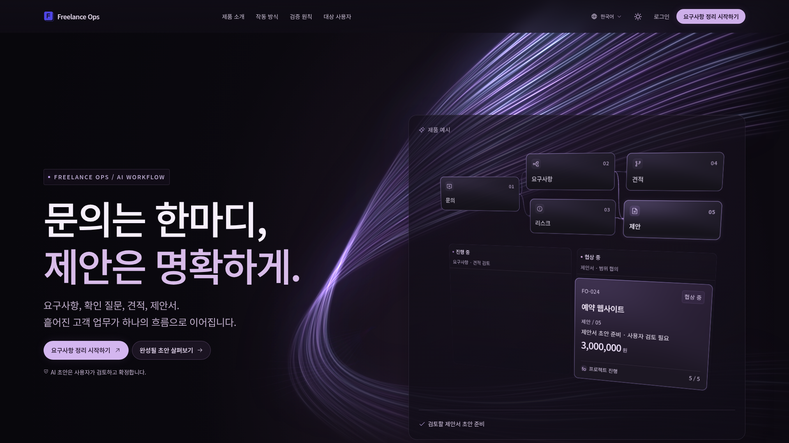
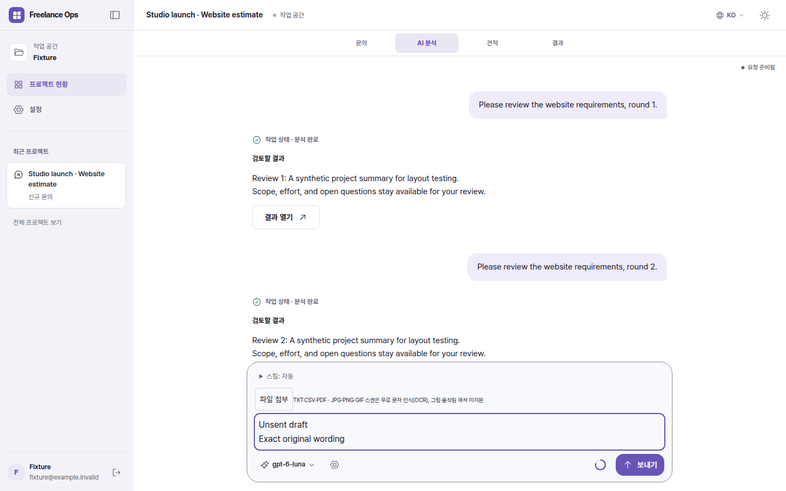
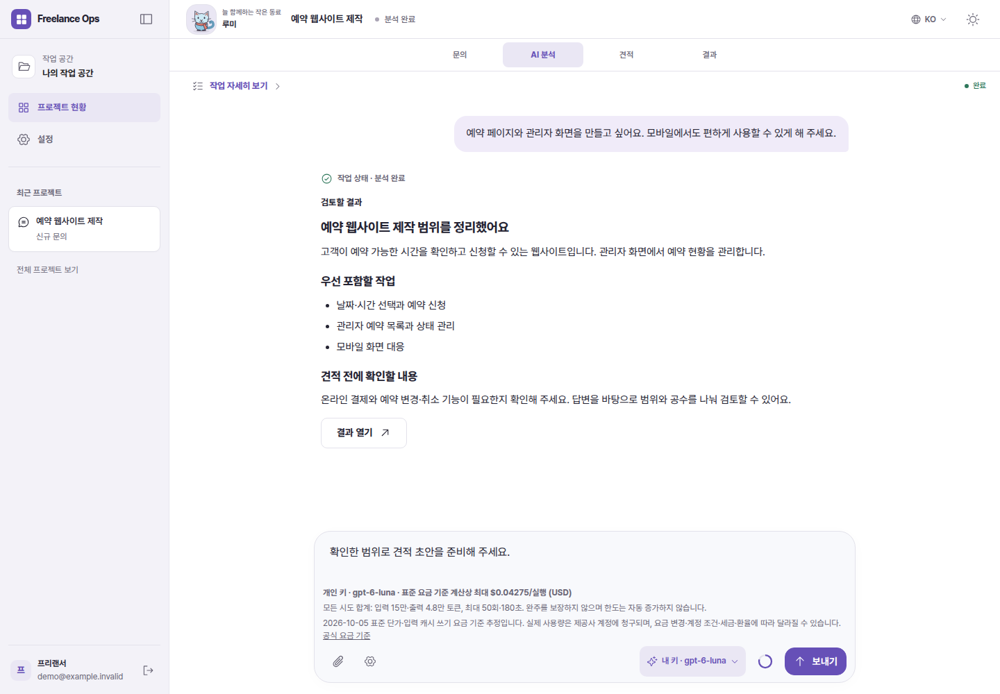
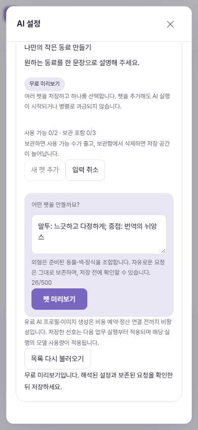
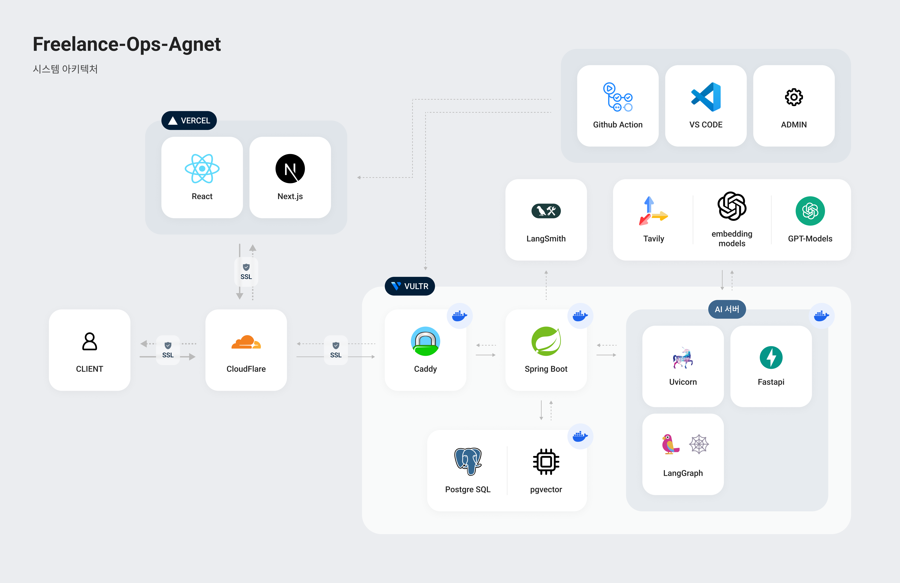

<div align="center">

# Freelance Ops Agent

### 작은 AI 동료와 함께, 고객 문의를 근거 있는 견적으로.

고객 관리부터 AI 분석, 견적 검토·발행, 실제 결과 기록까지 이어지는 프리랜서 업무 도구입니다.

[서비스 소개](https://www.freelance-ops.site) · [업무 공간 시작](https://www.freelance-ops.site/workspace) · [기술 포트폴리오](docs/portfolio/README.md)


[전체 기술 스택·선택 기능·실험 도구 보기](#전체-기술-스택)

</div>

[](https://www.freelance-ops.site)

## 왜 만들었나요?

짧은 고객 문의만으로는 작업 범위나 비용을 바로 정하기 어렵습니다. 요구사항을 정리하고, 빠진 정보를 다시 묻고, 조사 자료와 단가를 연결하는 과정이 필요합니다.

이 과정에서 문의 원문과 판단 근거가 흩어지지 않도록 고객 관리·분석·견적·결과 기록을 하나의 업무 흐름으로 연결했습니다. AI는 초안을 돕고, 최종 범위와 견적 발행은 사용자가 결정합니다.

## 핵심 기능

| 기능 | 내용 |
| --- | --- |
| 고객·프로젝트 관리 | 고객 맥락과 문의, 일정·예산을 한곳에서 관리 |
| AI 분석 | 요구사항과 근거를 정리하고 필요한 질문은 사용자에게 확인 |
| 세 관점의 AI 동료 | 핵심·권장·확장 견적의 범위와 제안을 비교 |
| 동료 개인화 | 이름·외형·말투·판단 성향을 설정 |
| 견적 검토·공유 | 항목과 근거를 검토하고 견적 발행·고객용 링크 공유 |
| 개인 AI 연결 | 개인 API 키 연결(BYOK) |
| 결과 기록 | 실제 매출·비용·공수를 기록하고 견적과 비교 |

## 문의부터 결과까지

1. **고객과 문의 등록:** 고객 정보에 요구사항·희망 일정·예산을 연결합니다.
2. **AI 분석과 사용자 확인:** 요구사항과 근거를 정리하고, 부족한 정보는 질문한 뒤 분석을 이어갑니다.
3. **견적 비교·검토·발행:** 세 견적안의 범위와 금액을 비교하고, 항목별 근거를 검토해 발행합니다.
4. **실제 결과 기록:** 실제 매출·비용·공수와 예상에서 달라진 이유를 남깁니다.

## 주요 화면

### 로그인


### 대화로 요구사항 검토

문의와 AI 분석 결과를 같은 작업 공간에서 확인합니다. 작성 중인 내용은 대화 하단에 이어집니다.



### 개인 AI 연결

실행 전에 사용할 모델과 개인 키의 예상 비용·실행 한도를 확인합니다. 실제 사용료는 연결한 제공사 계정에 청구됩니다.



### 나만의 AI 동료

원하는 말투·판단 성향을 입력하고, 무료 미리보기에서 해석된 설정을 확인합니다.



## 작동 방식과 기술 파이프라인

1. **입력과 업무 데이터:** Next.js에서 받은 고객·문의 정보를 Spring이 인증·권한 검사 후 저장합니다.
2. **AI 분석:** FastAPI·LangGraph가 요구사항, 조사, 견적 범위와 근거를 정리합니다. 업무 데이터는 권한이 제한된 Spring 내부 API를 통해 조회합니다.
3. **사용자 확인:** 불확실한 내용은 질문으로 남기고, 답변을 받으면 저장된 실행 상태에서 분석을 이어갑니다.
4. **계산과 발행:** 금액·세금·합계는 Spring의 정해진 규칙으로 계산합니다. 사용자가 검토한 견적을 발행하고, 개정·발행 이력과 실제 결과를 기록합니다.



### 전체 기술 스택

애플리케이션 코드, 의존성·잠금 파일, 데이터베이스 마이그레이션, 배포·CI 설정을 기준으로 정리했습니다. 서비스 구현, 활성화 조건이 있는 통합, 개발·실험 도구를 구분합니다.

#### 서비스 구현

| 영역 | 기술 | 사용하는 곳 |
| --- | --- | --- |
| Web 플랫폼 | **Next.js 16 · React 19 / React DOM · TypeScript 5 · JavaScript · Node.js 22** | App Router 기반 소개 페이지·업무 공간, 서버·클라이언트 렌더링 |
| 스타일·UI | **Tailwind CSS 4 · PostCSS · CSS 3D / SVG · next-themes · Phosphor Icons · Pretendard · Noto Sans KR Variable** | 반응형 화면, 다크 모드, 아이콘·한글 타이포그래피, 직접 그린 AI 동료 |
| 모션·그래픽 | **GSAP 3 · @gsap/react · ScrollTrigger · Three.js · WebGL · GLSL** | 스크롤 타임라인, 포인터 반응, 셰이더 기반 빛·입체 장면. IntersectionObserver·ResizeObserver로 가시성·레이아웃 변화 처리 |
| 대화·브라우저 API | **react-markdown · remark-gfm · Fetch / Streams API · HTML Drag and Drop** | 안전한 Markdown·GFM 표시, 스트리밍 응답, 프로젝트 보드 이동 |
| Business API | **Java 21 · Spring Boot 4 · Spring Web MVC · Jakarta Bean Validation · Jackson 3** | 고객·프로젝트·견적 API, 입력 검증, JSON 직렬화, 결정적 금액 계산 |
| 인증·보안 | **Spring Security · OAuth2 Resource Server · Nimbus JOSE/JWT · PyJWT · BCrypt · AES-256-GCM** | HS256 로그인 JWT, RS256 내부 위임 JWT, 워크스페이스 RBAC, 비밀번호 해시, SHA-256 refresh token 해시, BYOK 키 암호화, CORS·요청 제한 |
| Spring 데이터 접근 | **Spring Data JPA · Hibernate ORM / Vector · Spring JDBC / JdbcTemplate · PostgreSQL JDBC · HikariCP · Flyway** | 업무 데이터·벡터 매핑, 트랜잭션·커넥션 풀, 버전별 스키마 변경 |
| Agent API | **Python 3.12 · FastAPI · Uvicorn · Pydantic 2 · Pydantic Settings · asyncio · HTTPX** | 비동기 실행·검증·설정, Spring 내부 API와 모델 제공사 통신 |
| Agent 실행 | **LangGraph · langgraph-checkpoint-postgres · 자체 Bounded ReAct / StructuredTool** | 실행 상태 그래프, 도구 호출 한도, 사용자 확인(HITL), PostgreSQL 체크포인트·재개 |
| LLM 연결 | **OpenAI Python SDK · Responses API · JSON Schema Structured Outputs** | 구조화된 요구사항·견적 초안. 개인 키(BYOK)는 HTTPX로 예산 승인된 HTTPS 요청 실행 |
| Agent 데이터 접근 | **SQLAlchemy 2 Async ORM · Psycopg 3 · Alembic** | 실행·이벤트·작업 상태 저장과 Agent 전용 스키마 마이그레이션 |
| DB·검색 | **PostgreSQL 17 · pgvector · JSONB · Full-Text Search / tsvector · GIN · HNSW · btree_gist / GiST · RRF** | 업무·근거 저장, 키워드 검색, 코사인 벡터 검색·결과 결합, 기간 중복 제약. 현재 개인 키 실행의 근거 조회는 키워드 검색 사용 |
| 비동기 작업·이벤트 | **PostgreSQL 기반 durable outbox / inbox · Spring Scheduling · SSE** | HTTP 명령 전달, 재시도·멱등성·lease, 실행 이벤트 저장·브라우저 재연결 |
| 문서·OCR | **pypdf · Pillow · Poppler / pdftoppm · Tesseract OCR (한국어·영어)** | PDF·텍스트·CSV·이미지 읽기, 별도 프로세스에서 제한된 로컬 OCR |
| API 계약·SDK | **REST / JSON · OpenAPI 3.1 · springdoc-openapi · Swagger UI · Python SDK** | Spring–Agent 계약 검증, 개발용 API 문서, Python 표준 라이브러리 기반 클라이언트 |
| 관측 | **Spring Boot Actuator · Micrometer · SLF4J · W3C Trace Context** | 상태·준비도 점검, 호출·지연 지표, 로그와 traceparent 전파 |

#### 배포·운영

| 영역 | 기술 | 사용하는 곳 |
| --- | --- | --- |
| 빌드·패키징 | **npm / package-lock · uv / uv.lock · Gradle 9 / Kotlin DSL · Hatchling** | 프론트엔드·Agent 재현 가능한 의존성 설치, Java 빌드, Python SDK·벤치마크 패키징 |
| 컨테이너·CI/CD | **Docker · Docker Compose · Buildx / BuildKit · GitHub Actions · GHCR** | 멀티스테이지 이미지, 서비스별 테스트·이미지 발행, SHA 태그 기반 배포·롤백 |
| 서비스 호스팅 | **Vercel · Vultr · Caddy 2 · Eclipse Temurin 21 JRE · Linux · Bash / SSH / SCP** | Next.js 호스팅, VM의 Spring·Agent 실행, HTTPS·리버스 프록시, 배포 스크립트 |
| 백업·복구 도구 | **pg_dump / pg_restore · rclone / crypt · SHA-256 · OpenSSL** | DB 백업·복구 훈련, 암호화된 외부 백업 경로, 무결성 확인·배포용 키 생성. 외부 백업은 별도 설정 필요 |

#### 선택 기능·구현된 통합

| 영역 | 기술 | 현재 사용 범위 |
| --- | --- | --- |
| 계층형 RAG | **RAPTOR · NumPy · spherical K-means · OpenAI Embeddings** | 계층 요약·검색과 임베딩 어댑터 구현. 현재 예산 경계에서는 유료 RAPTOR 생성·질의 임베딩 호출 차단 |
| 웹 조사 | **Tavily · HTTPX 기반 직접 HTTP/PDF 수집** | 도메인 허용 목록·수집 한도를 둔 검색 통합. 기본 비활성화이며 현재 유료 조사 호출도 차단 |
| 로컬 라우터 | **LiquidAI LFM2.5-Encoder-350M-Prompt-Router · PyTorch · Hugging Face Transformers · Safetensors · 자체 BM25 / RRF** | local-router 추가 설치와 shadow/진단 실행용. 기본 이미지에 모델 런타임을 설치하지 않으며 shadow 기본값은 OFF |
| 추적·대시보드 | **LangSmith · Prometheus 호환 지표 · Grafana 대시보드** | 추적·지표 endpoint는 기본 OFF. 대시보드 정의 제공; Prometheus·Grafana 서버는 별도 구성 |

OpenAI 연결 구현과 유료 기능의 활성화 상태는 별개입니다. 신규 제품 실행은 OpenAI를 지원하며, 플랫폼 비용·개인 키 실행에는 각각 예산 승인과 호출 한도를 적용합니다. [개인 키 실행 경계](agent/README.md#bounded-personal-key-execution) · [관측 구성](infra/observability/README.md)

#### 테스트·품질·연구

| 영역 | 기술 | 검증·실험 대상 |
| --- | --- | --- |
| 프론트엔드 | **Node.js Test Runner · Playwright / Chromium · TypeScript tsc · ESLint 9 · typescript-eslint · React / Hooks / Next.js / JSX a11y 플러그인** | 단위·회귀·브라우저 테스트, 타입·접근성 규칙, 스크린샷 검증 |
| 백엔드 | **JUnit Jupiter · Spring Boot Test · MockMvc · Spring Security Test · Mockito · AssertJ · Hamcrest · ArchUnit · Testcontainers** | API·권한·도메인 경계, 실제 PostgreSQL/pgvector 통합 테스트 |
| Agent·계약·운영 | **pytest · pytest-asyncio · Ruff · mypy · Python unittest · openapi-spec-validator · k6** | Agent 회귀·평가 gate, 타입·린트, API 계약, 배포 순서·복구 스크립트, 부하·준비도 smoke test |
| Agent 연구·진단 | **Deep Agents · LangChain 생태계 · StateBackend · LangGraph CLI / Studio** | 제한된 파일 권한의 Research spike, Supervisor·라우팅 그래프 진단. Deep Agents는 검증용이며 제품 실행기에 연결하지 않음 |
| 분류·라우팅·검색 연구 | **Hugging Face Datasets / Hub · Transformers · PyTorch / CUDA · Safetensors · scikit-learn · OpenAI · LangSmith · NumPy · pandas · Matplotlib · python-dotenv** | DistilBERT·MiniLM·LiquidAI 비교, KLUE-MRC·KLUE RoBERTa cross-encoder·BERT QA reader, Dense + BM25 + RRF와 답변 가능성 평가 |
| 실행시간·스케줄러 연구 | **scikit-learn · XGBoost · joblib · NumPy · pandas · Matplotlib · Plotly · Streamlit** | 회귀·분류·온라인 학습, 스케줄링·재시도·공정성 시뮬레이션과 대시보드. 운영 스케줄러의 ML 적용과는 구분 |
| 문서 미디어 도구 | **FFmpeg / imageio-ffmpeg** | 제품 녹화 영상의 README용 GIF 변환 스크립트 |

<details>
<summary>의존성·과거 호환 코드의 구분과 근거 파일</summary>

- **과거 제공사:** Google GenAI SDK·Gemini 어댑터와 이력 표시 코드는 남아 있지만 신규 연결·실행은 지원 종료 상태입니다.
- **선언된 의존성:** LangChain(`langchain[all]`, `langchain-community`, `langchain-openai`)은 Deep Agents 관련 프레임워크 의존성에 포함됩니다. 애플리케이션의 ReAct·StructuredTool은 자체 구현입니다. `faiss-cpu`, `rank-bm25`, Python `pgvector` 패키지도 manifest에 남아 있으나 현재 애플리케이션의 직접 호출은 없습니다. 실제 벡터 저장·검색은 PostgreSQL 확장과 Hibernate Vector를 사용합니다.
- **이전 구성:** MongoDB·Beanie·Kafka·운영 FAISS 제거와 Redis 도입 보류는 [ADR-0003](docs/adr/0003-remove-mongodb-kafka-faiss.md), [ADR-0023](docs/adr/0023-defer-redis-until-measured-v3-need.md)에 기록했습니다.
- **구현 근거:** [프론트엔드 패키지](frontend/package.json) · [Agent 패키지](agent/pyproject.toml) · [Backend Gradle](backend/build.gradle.kts) · [검색 구현](backend/src/main/java/com/freelanceops/backend/domain/knowledge) · [첨부파일·OCR](agent/src/attachments) · [공유 API 계약](contracts) · [배포·운영](infra) · [CI/CD](.github/workflows) · [연구·벤치마크](experiments) · [Python SDK](sdk/python)

</details>

서비스를 나눈 대신 내부 인증과 API 계약을 별도로 관리합니다. 자세한 판단과 대안은 [서비스 경계](docs/adr/0001-spring-python-service-boundary.md), [저장소 선택](docs/adr/0002-postgresql-pgvector.md), [견적 계산·이력](docs/adr/0019-immutable-grounded-quotation.md)에 정리했습니다.

<details>
<summary>로컬에서 실행하기</summary>

Docker Compose와 Node.js 22가 필요합니다. [.env.example](.env.example)과 [frontend/.env.example](frontend/.env.example)을 각각 `.env`, `frontend/.env.local`로 복사하고 환경 변수를 설정합니다.

```bash
docker compose -f docker-compose-infra.yaml up -d --wait
docker compose -f docker-compose.yaml up --build -d --wait
```

별도 터미널에서 프론트엔드를 실행하고 `http://localhost:3000`에 접속합니다.

```bash
cd frontend
npm ci
npm run dev
```

</details>

## 트러블슈팅

- **로컬 API가 연결되지 않을 때:** 두 Compose 구성이 정상 실행 중인지, 프론트엔드 API 주소가 `frontend/.env.example`과 맞는지 확인합니다.
- **Swagger에서 인증 오류가 날 때:** 로그인으로 발급한 access token을 `Authorize`에 입력합니다. [인증·권한 안내](backend/README.md#user-authentication)
- **분석이 중단됐을 때:** 표시된 오류와 실행 한도를 먼저 확인합니다. 개인 키 실행의 한도는 재개해도 초기화되지 않습니다. [실행 한도 설명](agent/README.md#bounded-personal-key-execution)

## 문서

- [Backend 실행·검증](backend/README.md) · [Agent 실행·검증](agent/README.md)
- [동료 개인화](docs/frontend/PET_CUSTOMIZATION.md) · [개인 API 키 연결](docs/frontend/BYOK_CONNECTIONS.md)
- [V2 제품·기술 명세](docs/V2_SPECIFICATION.md) · [아키텍처 결정](docs/adr/README.md)
- [AI 신뢰성 사례 연구](docs/portfolio/ai-routing-and-rag-reliability-case-study.md) · [기술 포트폴리오](docs/portfolio/README.md)
