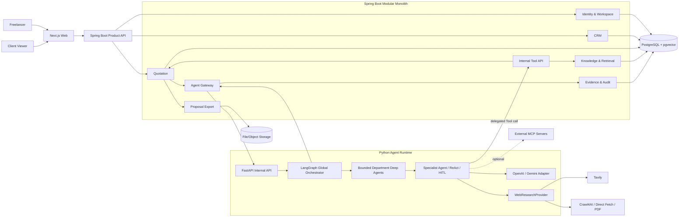
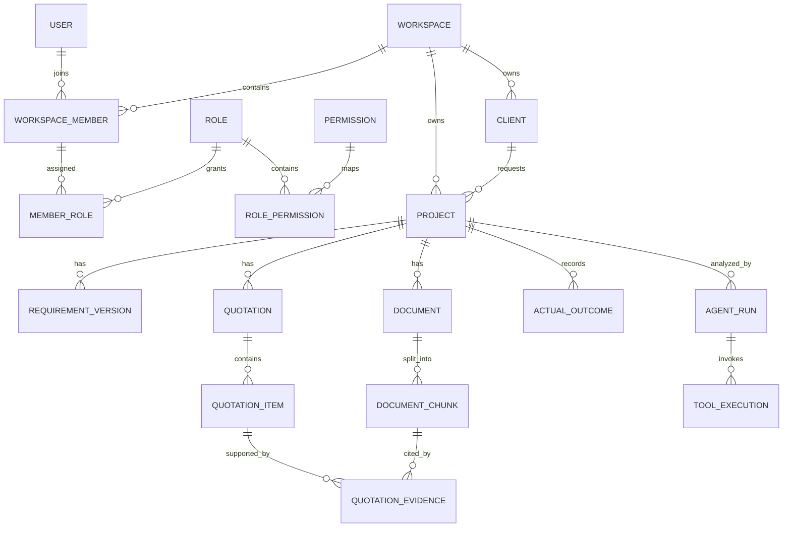
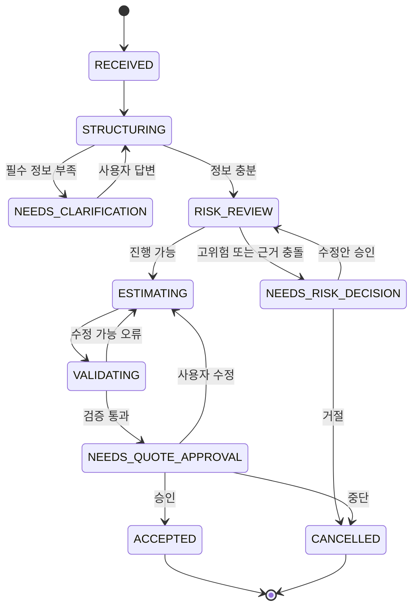
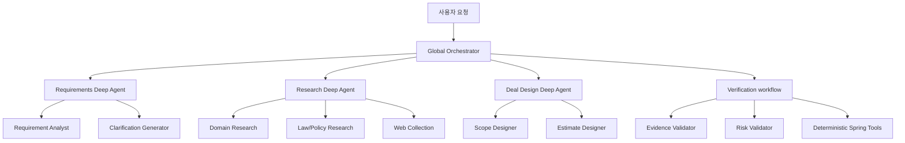

# Freelance Ops Agent V2 제품·기술 명세서

> 문서 상태: Draft v1.2
> 작성일: 2026-07-20
> 마지막 갱신: 2026-08-13
> 대상 버전: Freelance Ops Agent V2
> 구현 기준: 본 문서는 V2의 제품 범위와 아키텍처를 결정하는 기준 문서다. 구현 중 중요한 변경이 생기면 ADR(Architecture Decision Record)을 먼저 작성하고 본 문서를 갱신한다.

관련 결정 기록은 [`docs/adr/`](adr/README.md)에서 관리한다. 특히 서비스 경계는 ADR-0001, 저장소는 ADR-0002, 제거 기술은 ADR-0003, RBAC는 ADR-0004, Agent·Tool·MCP 경계는 ADR-0005, 계층형 Supervisor는 ADR-0006, 웹 자료 수집 경계는 ADR-0007, Python Agent의 project 관리는 ADR-0008, 부서 Agent의 Deep Agents runtime은 ADR-0013을 따른다.

Agent Tool의 역할, 실험 단계별 최소 Tool set과 Supervisor 배치는
[`docs/agent-tools/TOOL_CATALOG.md`](agent-tools/TOOL_CATALOG.md)를 따른다.

---

## 1. 문서 목적

V2는 V1의 기능을 단순 이식하지 않는다. V1에서 확인된 데이터 검증 부재, 근거 추적 부족, 고정형 LLM workflow, 불필요한 인프라, 단일 사용자 중심 UI를 해결하여 다음 제품으로 재구축한다.

> **모호한 프로젝트 문의를 검증 가능한 WBS·견적·제안서로 바꾸고, 실제 수행 결과를 다음 견적의 근거로 축적하는 멀티테넌트 프리랜서 운영 서비스**

V2의 우선순위는 다음 순서를 따른다.

1. 데이터 격리와 무결성
2. 견적 결과의 검증 가능성
3. 실제 프리랜서 업무 흐름의 완결성
4. 제한되고 통제 가능한 Agent 자율성
5. 운영 단순성
6. 외부 서비스 확장성

---

## 2. V1 진단 및 V2 대응

| V1 문제 | 영향 | V2 대응 |
|---|---|---|
| 평가 데이터셋과 회귀 테스트 부재 | 개선 여부를 측정할 수 없음 | 버전 관리되는 golden dataset과 자동 평가 파이프라인 구축 |
| 검색 문서가 문자열 context로만 소비됨 | 결과가 어떤 근거에서 나왔는지 추적 불가 | Evidence Ledger와 chunk 단위 citation 저장 |
| LLM이 가격과 공수를 자유 텍스트로 생성 | 계산 오류와 재현성 저하 | LLM은 기능 분해·가정 생성, Tool은 계산 담당 |
| 고정된 LangGraph node 순서 | 실제 Tool 선택 Agent가 아님 | LangGraph durable workflow 안에 제한된 ReAct Tool loop 배치 |
| `MemorySaver` 기반 상태 | 재시작·다중 인스턴스에서 상태 유실 | PostgreSQL에 Agent run 및 HITL 상태 영속화 |
| MongoDB와 FAISS 분리 | 트랜잭션·참조 무결성·권한 필터 부족 | PostgreSQL + pgvector로 통합 |
| Kafka가 로그와 로그인 이벤트에만 사용됨 | 운영 복잡도 대비 가치 부족 | Kafka 제거, 구조화 로그와 DB audit/outbox 사용 |
| FAISS 전역 index | 동시 쓰기·멀티테넌시·백업 어려움 | 운영 검색은 pgvector, FAISS는 평가 baseline으로만 유지 |
| CRM과 Agent thread에 소유권 없음 | 사용자 간 데이터 노출 위험 | 모든 도메인 데이터에 `workspace_id` 적용 |
| Workspace UI가 dummy data로 동작 | 제품 흐름 검증 불가 | 실제 API 기반 Quote Builder로 전면 재구축 |
| README의 continual learning 표현 | 실제 학습과 RAG memory를 혼동 | `Outcome-informed retrieval`로 정확히 표현 |

---

## 3. 제품 목표와 비목표

### 3.1 목표

- 여러 프리랜서가 각자의 workspace에서 데이터를 격리해 사용할 수 있다.
- 사용자가 문의 텍스트나 문서를 입력하면 기능 목록과 불확실성을 구조화한다.
- Agent는 필요한 내부 Tool을 선택하여 과거 사례, 단가, 위험 근거를 조회한다.
- 견적은 WBS 단위의 결정적 계산 결과로 생성한다.
- 모든 주요 금액·기간·위험 판단은 source 또는 assumption과 연결된다.
- 사용자는 AI 결과를 편집하고 최소안·추천안·확장안을 비교할 수 있다.
- 승인된 견적을 링크 또는 PDF 제안서로 제공할 수 있다.
- 종료된 프로젝트의 실제 공수와 금액을 기록하여 향후 검색 근거로 사용한다.
- 고정 평가셋으로 검색, grounding, 견적, 위험 탐지 품질을 반복 측정한다.
- Docker Compose만으로 로컬 전체 환경을 재현할 수 있다.
- 직군과 국가를 Agent 복제로 표현하지 않고 versioned domain/jurisdiction pack으로 확장한다.
- 단일 Agent baseline보다 효과가 검증된 영역에만 제한된 계층형 Supervisor를 적용한다.

### 3.2 비목표

V2 첫 릴리스에서는 다음을 구현하지 않는다.

- 프리랜서 마켓플레이스 및 고객 매칭
- 결제 대행과 세금계산서 발행
- 회계·노무·법률 판단의 자동 대체
- 자율적으로 계약을 체결하거나 외부 시스템을 변경하는 Agent
- 다수 Agent가 제약 없이 서로 호출하고 handoff하는 자유로운 swarm 구조
- 모델 fine-tuning
- Kafka, Kubernetes, 분산 microservice
- 실시간 공동 문서 편집
- 자체 embedding 또는 LLM 모델 서빙

### 3.3 출시 범위와 수익화 가설

장기 비전은 다양한 직군과 관할권을 포용하는 것이지만 첫 유료 검증 범위는 한국 소프트웨어 개발 프리랜서로 제한한다. 디자인·콘텐츠, 번역·컨설팅과 해외 거래는 domain/jurisdiction pack의 품질과 유료 수요를 확인하며 단계적으로 확장한다.

제품은 Agent 호출 횟수가 아니라 실제 고객에게 전달할 수 있는 산출물의 가치로 판매한다.

- 무료: 제한된 프로젝트 수의 요구사항 명확화와 기본 체크리스트
- 건별 결제 가설: 요구사항 명세서 2,900~4,900원, 견적·작업범위 4,900~9,900원, 해외 거래·근거 조사 9,900~19,900원
- Pro 구독 가설: 월 12,900~19,900원, 월간 사용량과 Deep Analysis credit이 제한된 CRM·견적·revision·PDF 기능
- Team/Agency 가설: 월 49,000~99,000원, workspace RBAC, 조직 단가표, 승인, 감사 기록과 템플릿 공유

첫 공개 릴리스에서 무제한 AI·검색·크롤링 요금제를 제공하지 않는다. 가격은 예상 API 원가가 아니라 사용자 인터뷰와 실제 유료 거래에서 검증된 지불 의사를 기준으로 결정한다. 서버 증설과 Agent 조직 확장은 최소 10~20건의 실제 유료 사용과 결과물 재사용 지표를 확인한 뒤 진행한다.

---

## 4. 핵심 사용자와 권한

### 4.1 사용자 유형

| 사용자 | 설명 | 주요 권한 |
|---|---|---|
| Workspace Member | 개인 프리랜서 또는 내부 팀원 | 부여된 RBAC role에 따라 workspace 기능 사용 |
| Client Viewer | 선택적 외부 고객 | 공유된 제안서 열람 및 승인·의견 제출 |

회원의 권한은 workspace 범위의 RBAC(Role-Based Access Control)로 결정한다. Client Viewer는 workspace 회원이 아니며, 만료 가능한 proposal share token으로 공유된 제안서에만 접근한다.

### 4.2 멀티테넌시 규칙

- 사용자 소유 데이터는 반드시 `workspace_id`를 가진다.
- API가 요청 body의 `workspace_id`만 신뢰해서는 안 된다.
- 인증된 사용자의 membership에서 접근 가능한 workspace를 계산한다.
- repository query에는 항상 `workspace_id` 조건을 포함한다.
- vector 검색에도 동일한 `workspace_id` 조건을 적용한다.
- 다른 workspace의 식별자를 전달하면 존재 여부를 노출하지 않고 `404`를 반환한다.
- 모든 cross-tenant 접근 차단은 통합 테스트로 검증한다.

### 4.3 RBAC 원칙

- role은 전역 계정이 아니라 `workspace_member`에 부여한다.
- 한 사용자는 workspace마다 서로 다른 role을 가질 수 있다.
- 한 membership에 여러 role을 부여할 수 있으며 permission은 합집합으로 계산한다.
- 모든 요청은 `인증 → workspace membership → permission → resource scope` 순서로 검사한다.
- 명시적으로 허용되지 않은 행위는 기본적으로 거부한다(deny by default).
- role 이름을 controller에 직접 비교하지 않고 permission code를 검사한다.
- workspace 격리는 RBAC보다 먼저 적용한다. 다른 workspace의 resource는 role과 관계없이 접근할 수 없다.
- 기본 role은 system role로 seed하고, custom role은 후속 릴리스에서 활성화할 수 있도록 schema를 준비한다.
- 권한 변경, role 부여·회수, 접근 거부는 audit event로 기록한다.

### 4.4 기본 role

| Role | 목적 | 핵심 권한 |
|---|---|---|
| `OWNER` | workspace 소유자 | 모든 권한, 소유권 이전, workspace 삭제, 데이터 export |
| `ADMIN` | 운영 관리자 | 멤버·설정·연동 관리, 모든 업무 데이터 관리. 소유권 이전과 workspace 삭제 제외 |
| `MANAGER` | 고객·프로젝트 책임자 | 고객·프로젝트 관리, 견적 승인·발행, 결과 입력, Agent 실행 |
| `ESTIMATOR` | 견적 작성자 | 프로젝트 열람, 요구사항·견적 작성, Agent 실행. 발행과 멤버 관리 제외 |
| `VIEWER` | 내부 열람자 | workspace 업무 데이터 읽기. 민감 설정·권한·외부 발행 제외 |

- workspace 생성자는 자동으로 `OWNER`가 된다.
- workspace에는 항상 한 명 이상의 활성 `OWNER`가 있어야 한다.
- 마지막 Owner는 탈퇴·비활성화·role 회수가 불가능하다.
- 사용자는 자신의 권한을 스스로 상승시킬 수 없다.
- `ADMIN`은 `OWNER` role을 부여하거나 회수할 수 없다.

### 4.5 Permission catalog

permission은 변경 가능한 표시 이름이 아니라 안정적인 code로 관리한다.

```text
workspace.read
workspace.update
workspace.delete
workspace.transfer_ownership
member.read
member.manage
role.read
role.manage
client.read
client.write
client.delete
project.read
project.write
project.delete
document.read
document.write
document.delete
quotation.read
quotation.write
quotation.approve
quotation.publish
agent.run
agent.respond
agent.cancel
outcome.read
outcome.write
integration.read
integration.manage
audit.read
data.export
data.delete
```

새 기능을 추가할 때 controller를 먼저 만들지 않고 필요한 permission과 기본 role matrix를 먼저 정의한다.

### 4.6 기본 권한 matrix

| Permission group | OWNER | ADMIN | MANAGER | ESTIMATOR | VIEWER |
|---|:---:|:---:|:---:|:---:|:---:|
| Workspace 읽기 | ✓ | ✓ | ✓ | ✓ | ✓ |
| Workspace 설정 수정 | ✓ | ✓ |  |  |  |
| Workspace 삭제·소유권 이전 | ✓ |  |  |  |  |
| Member·Role 관리 | ✓ | ✓* |  |  |  |
| Client·Project 읽기 | ✓ | ✓ | ✓ | ✓ | ✓ |
| Client·Project 쓰기 | ✓ | ✓ | ✓ | ✓ |  |
| Document 관리 | ✓ | ✓ | ✓ | ✓ | 읽기 |
| 견적 작성 | ✓ | ✓ | ✓ | ✓ |  |
| 견적 승인·발행 | ✓ | ✓ | ✓ |  |  |
| Agent 실행·응답 | ✓ | ✓ | ✓ | ✓ |  |
| Outcome 입력 | ✓ | ✓ | ✓ |  |  |
| Integration 관리 | ✓ | ✓ |  |  |  |
| Audit 열람·Data export | ✓ | ✓ |  |  |  |

`* ADMIN`은 OWNER role과 소유권을 변경할 수 없다. 초기 릴리스는 workspace 범위 RBAC로 시작하고, 실제 요구가 확인되면 project assignment 기반 resource scope를 별도 ADR로 추가한다. RBAC를 가장해 미검증된 복잡한 ABAC를 선제 도입하지 않는다.

### 4.7 권한 평가 흐름

```text
AuthenticatedPrincipal
→ WorkspaceMembership 확인
→ MemberRole 조회
→ RolePermission 합산
→ 요청 permission 보유 여부
→ resource.workspace_id 일치 여부
→ 추가 resource rule 확인
→ 허용 또는 거부 + audit
```

Spring Security의 method security와 중앙 `WorkspaceAuthorizationService`를 사용한다. `@PreAuthorize`는 web 진입점의 빠른 차단에 사용하고, 실제 transaction을 수행하는 application service에서도 권한과 resource scope를 재검증한다.

---

## 5. V2 기술 결정

### 5.1 런타임 구성

| 영역 | 선택 | 이유 |
|---|---|---|
| Product Backend | Java 21+, Spring Boot | 기업형 도메인 모델, 보안, RBAC, 트랜잭션, Tool 구현 |
| AI Runtime | Python 3.12+, uv, FastAPI, LangGraph | 독립적인 Agent dependency 관리, Agent graph, ReAct, HITL checkpoint, AI 평가 |
| Model Provider | OpenAI API, Gemini API | run별 provider/model을 고정하고 동일 평가셋으로 비교 |
| Internal Contract | REST/OpenAPI 우선, MCP 후속 | 초기 복잡도를 제한하고 Tool 경계를 명시적으로 versioning |
| Frontend | React/Next.js + TypeScript | 제품형 UI와 타입 안전한 API 연동 |
| Primary DB | PostgreSQL | 관계형 데이터, 트랜잭션, 상태, 감사 기록 통합 |
| Vector Search | pgvector | 비즈니스 데이터와 embedding을 동일 DB에서 관리 |
| Web Research | Provider interface + Tavily + Crawl4AI | 탐색과 통제된 수집을 분리하고 provider 종속 방지 |
| Migration | Flyway | 재현 가능한 schema 변경 |
| File Storage | 개발: Docker volume, 운영: S3-compatible storage | 원본 문서를 DB와 분리 |
| Observability | Micrometer + OpenTelemetry-compatible tracing | API·LLM·Tool 실행 추적 |
| Test | JUnit 5, Testcontainers, pytest | business와 Agent runtime을 각각 검증 |
| Backend Packaging | Gradle Kotlin DSL | 명시적인 Java 의존성과 build 관리 |
| Agent Packaging | uv + `pyproject.toml` + `uv.lock` | V1 Poetry 환경과 분리된 재현 가능한 Python dependency 관리 |
| Local Infra | Docker Compose | 한 명의 개발자도 재현 가능한 환경 |

구현 시점의 안정 버전을 build 파일과 Docker image tag에 고정한다. `latest` tag를 사용하지 않는다.

### 5.2 제거 대상

- MongoDB 및 Beanie
- 운영 경로의 FAISS
- Kafka, Kafka worker, Kafka logging handler
- jQuery·정적 HTML 기반 기존 frontend
- 프로세스 메모리 기반 Agent checkpoint
- Markdown 문자열 하나로 표현되는 견적 응답

### 5.3 제한적으로 유지할 대상

- 기존 V1은 migration과 benchmark 비교를 위해 `legacy/v1` 또는 Git tag로 보존한다.
- FAISS는 `evaluation/baselines`의 오프라인 비교 구현에서만 사용할 수 있다.
- Python은 FastAPI/LangGraph Agent runtime과 데이터셋 평가에 사용한다. Spring business domain을 Python에 중복 구현하지 않는다.

---

## 6. 상위 아키텍처



### 6.1 배포 원칙

- 첫 공개 검증의 Spring Boot, Python Agent와 PostgreSQL runtime compute는 Vultr에 배포한다. 초기에는 단일 VM Compose를 허용하되 측정된 resource 경합이나 장애 격리 필요가 생기면 Vultr 내부에서 VM을 분리한다.
- Spring 제품 backend는 modular monolith로 시작한다.
- Python Agent runtime만 생태계와 실행 수명 차이를 근거로 별도 서비스로 분리한다.
- frontend는 Spring 공개 API만 호출하고 Agent service port는 host에 공개하지 않는다.
- Spring과 Agent는 versioned internal API, delegation token, idempotency key와 trace ID를 사용한다.
- Python은 business table을 직접 읽거나 변경하지 않고 Spring Tool API를 호출한다.
- 그 외 Spring 모듈은 독립 확장·배포 필요성이 측정되기 전에는 microservice로 분리하지 않는다.
- PostgreSQL은 단일 system of record다.
- Vultr public ingress는 TLS reverse proxy와 Spring 공개 API로 제한하고 Agent와 PostgreSQL은 public port를 갖지 않는다.
- Crawl4AI는 초기에는 Agent runtime의 제한된 비동기 worker로 실행하며 독립 확장 필요성이 입증되기 전에는 별도 서비스로 분리하지 않는다.

---

## 7. Backend 모듈 구조

```text
backend/src/main/java/com/freelanceops/
├── identity/
│   ├── domain/
│   ├── application/
│   ├── infrastructure/
│   └── web/
├── workspace/
├── crm/
├── quotation/
├── knowledge/
├── agentgateway/
├── internaltool/
├── evidence/
├── proposal/
├── audit/
└── shared/
```

각 모듈은 다음 계층을 기본으로 한다.

- `domain`: entity, value object, domain rule
- `application`: use case와 transaction boundary
- `infrastructure`: JPA, pgvector, 외부 API, 파일 저장 구현
- `web`: REST controller와 request/response DTO

JPA entity를 API response로 직접 반환하지 않는다. 특히 password hash, 내부 metadata, 삭제 정보가 직렬화되지 않도록 별도 DTO를 사용한다.

Python Agent service는 다음 구조를 기본으로 한다.

```text
agent/
├── src/
│   ├── api/              # Spring 전용 internal FastAPI route
│   ├── graph/            # LangGraph 정의와 상태
│   ├── infrastructure/   # Agent runtime adapter
│   ├── retrieval/        # RAPTOR tree build와 retrieval core
│   ├── main.py           # FastAPI entrypoint
│   ├── contracts.py      # versioned request/response model
│   └── providers.py      # OpenAI/Gemini adapter boundary
├── tests/
├── pyproject.toml
└── uv.lock
```

- `agent`는 ADR-0008에 따라 독립적인 uv project로 관리한다.
- 배포 wheel을 만들지 않는 application project이며 `[tool.uv] package = false`와
  flat `src/` import root를 사용한다.
- V2 Agent dependency를 `legacy/v1`의 V1 Poetry project와 혼합하지 않는다.
- LangChain/LangGraph 내부 message나 Runnable 객체를 service contract로 노출하지 않는다.
- FastAPI request/response는 versioned Pydantic schema를 사용한다.
- Agent service는 Spring이 발급한 delegation token과 `aud=agent-service`를 검증한다.

---

## 8. 도메인 모델

### 8.1 핵심 관계



### 8.2 주요 entity

#### User / Workspace

- `user`: 계정과 인증 상태
- `workspace`: 데이터 격리의 최상위 경계
- `workspace_member`: 사용자와 workspace의 membership·상태
- `role`: workspace 범위 role. 기본 system role과 향후 custom role을 동일 구조로 표현
- `permission`: 변경되지 않는 행위 code catalog
- `member_role`: membership에 하나 이상의 role을 부여하는 연결
- `role_permission`: role이 허용하는 permission 연결
- `rate_card`: 직무·업무 유형별 일 단가와 최소 금액
- `estimation_policy`: 위험 버퍼, 부가 작업, 할인, 세금 표시 규칙

#### CRM

- `client`: 고객 연락처와 메모
- `project`: 문의부터 완료까지의 lifecycle
- `project_status`: `LEAD`, `QUALIFYING`, `QUOTING`, `NEGOTIATING`, `ACCEPTED`, `IN_PROGRESS`, `COMPLETED`, `CANCELLED`
- `requirement_version`: 원문, 구조화된 기능, 가정, 질문을 버전별 저장

#### Quotation

- `quotation`: 견적의 immutable version
- `quotation_scenario`: `LEAN`, `RECOMMENDED`, `EXPANDED`
- `quotation_item`: 기능 단위 WBS와 계산 결과
- `quotation_assumption`: 견적에 사용된 가정
- `quotation_evidence`: 견적 항목과 source chunk의 연결
- `quotation_decision`: 승인, 수정, 거절, 고객 의견

발행된 quotation은 직접 수정하지 않는다. 변경 시 새 version을 만든다.

#### Knowledge

- `document`: 원본 파일과 버전 metadata
- `document_chunk`: 검색 가능한 본문, keyword field, embedding
- `knowledge_source_type`: `PAST_PROJECT`, `POLICY`, `PLATFORM_TERMS`, `USER_TEMPLATE`
- `embedding_model`: embedding model과 dimension, 생성 시점

#### Agent

- `agent_run`: workflow 상태, 입력·출력 version, model 설정, trace ID
- `tool_execution`: Tool 이름, 입력 hash, 결과 요약, latency, status
- `agent_interruption`: HITL 질문과 사용자 답변
- `agent_run_status`: 아래 9장의 상태 정의를 사용

#### Outcome

- `actual_outcome`: 실제 총액, 실제 공수, 완료일, 수익률, 변경 사유
- `actual_work_item`: WBS 항목별 실제 공수
- 실제 결과는 승인된 과거 사례 검색에서 우선순위가 높은 근거로 사용한다.

### 8.3 공통 column

사용자 소유 table에는 원칙적으로 다음 column을 포함한다.

```text
id UUID
workspace_id UUID
created_at TIMESTAMPTZ
updated_at TIMESTAMPTZ
created_by UUID
version BIGINT
```

- 동시 수정이 가능한 entity는 optimistic locking을 사용한다.
- 금액은 부동소수점이 아니라 정수 KRW 또는 `NUMERIC`을 사용한다.
- 시간은 DB에 UTC로 저장하고 UI에서 timezone을 적용한다.
- 삭제가 감사상 필요한 데이터는 soft delete를 사용하되 접근 query에서 제외한다.

---

## 9. Agentic 아키텍처

### 9.1 원칙

V2 Agent는 모든 로직을 LLM에 위임하지 않는다.

| 책임 | 담당 |
|---|---|
| 제품 상태, 권한, 견적 영속화, 승인 | Spring application code |
| Agent graph, 기능 분해, Tool 선택, interrupt | Python LangGraph |
| OpenAI/Gemini 호출과 structured output | Python model provider adapter |
| 금액, 기간, 세금, 합계 계산 | Spring의 결정적 Java Tool |
| 내부 지식 검색 | Spring의 PostgreSQL full-text + pgvector Tool |
| 외부 자료 탐색·수집 | Python WebResearchProvider와 검증된 수집 정책 |
| 상세 checkpoint와 resume | LangGraph `AsyncPostgresSaver` |
| 결과 근거 검증 | Spring validator + 제한된 LLM evaluator |
| 최종 수정·승인 | 사용자 HITL, Spring public API 경유 |

### 9.2 상태 전이



Spring은 사용자에게 공개되는 `agent_run` 상태와 승인 기록을 `app` schema에 저장한다. LangGraph는 상세 checkpoint를 `agent_runtime` schema에 저장한다. 두 상태는 동일한 `run_id`, `thread_id`, `trace_id`로 연결한다. 서버 재시작 이후 동일 run을 재개할 수 있어야 하며, 동일 command의 재전송에 안전하도록 idempotency key를 사용한다.

### 9.3 ReAct Tool loop

- Python LangGraph와 OpenAI/Gemini의 tool calling을 사용한다.
- Agent에 노출되는 Tool 수를 작게 유지한다.
- 최대 turn, 최대 Tool 호출 수, 최대 실행 시간을 설정한다.
- read Tool과 write Tool을 구분한다.
- 외부 변경 Tool은 기본 비활성화하고 별도 사용자 승인을 요구한다.
- Spring은 Agent run을 시작한 사용자(`initiated_by`), workspace와 effective permission을 포함한 짧은 수명의 delegation token을 발급한다.
- Agent가 호출하는 Spring Tool API는 delegation token을 전달하며 Agent 자체가 권한을 확대할 수 없다.
- 장시간 run에서는 write Tool 실행 직전에 현재 membership과 permission을 다시 확인한다. 실행 중 권한이 회수되면 안전하게 중단한다.
- 동일 Tool의 무의미한 반복 호출을 감지해 중단한다.
- Tool 오류는 구조화된 오류로 Agent에 반환한다.
- 모델의 비공개 chain-of-thought를 저장하거나 사용자에게 노출하지 않는다.

### 9.4 내부 Tool 목록

| Tool | 입력 | 출력 | 필요 permission / 성격 |
|---|---|---|---|
| `search_past_projects` | query, filters | rank와 source가 포함된 사례 | `project.read`, `document.read` |
| `search_risk_evidence` | requirement, source type | 정책·약관 chunk | `document.read` |
| `get_rate_card` | work type | 단가와 적용 규칙 | `workspace.read` |
| `get_estimation_policy` | 없음 | buffer·최소금액 정책 | `workspace.read` |
| `calculate_effort` | work items, complexity | 항목별 공수 범위 | deterministic |
| `calculate_quote` | items, rate card, policy | 합계와 계산 breakdown | deterministic |
| `validate_quote` | quotation draft | 오류·누락·경고 | `quotation.read`, deterministic |
| `check_availability` | 기간, 사용자 일정 | 가능한 일정 범위 | `integration.read`, optional |
| `create_quote_draft` | validated result | draft ID | `quotation.write`, workflow-controlled |

표의 Tool은 Python 내부에서 Spring internal REST API를 호출하는 wrapper다. Spring은 token의 workspace를 사용하므로 Agent가 임의의 `workspace_id`를 Tool 인자로 선택하게 하지 않는다. `calculate_quote` 결과를 LLM이 임의로 덮어쓸 수 없으며, 변경하려면 입력 work item 또는 policy를 수정해 Tool을 다시 호출한다.

Agent 구조 비교 단계에서는 같은 계약의 Python in-memory/fixture Tool을 사용할
수 있다. 이는 prototype adapter이며 운영 업무 규칙의 소유권을 Python으로
이전하는 결정이 아니다. 목적별 Tool 분리와 전문 Agent별 상세 allowlist는
[`Agent Tool Catalog`](agent-tools/TOOL_CATALOG.md)를 따른다.

### 9.5 MCP 범위

초기 Spring-Agent 통신은 내부 REST/OpenAPI로 구현한다. 권한과 Tool schema가 안정된 뒤 Spring Tool API를 MCP server로 확장하여 Python LangGraph의 MCP client가 사용할 수 있다. 다음 외부 연동에도 MCP를 선택적으로 사용한다.

- Google Drive 요구사항 문서 읽기
- Calendar 가용 일정 확인
- Notion 프로젝트 정보 읽기
- 외부 CRM·회계 서비스 연결
- 향후 외부 AI host에 quotation 기능 제공

MCP Tool은 최소 권한 scope, workspace별 credential, 사용자 승인, audit log를 적용한다. MCP 연결 설정은 `integration.manage`, 읽기 실행은 `integration.read`를 요구한다. MCP server의 OAuth scope와 애플리케이션 RBAC를 혼동하지 않고 둘 다 통과해야 호출한다. MCP 장애가 핵심 견적 flow를 중단시키지 않도록 first release의 필수 조건으로 두지 않는다.

### 9.6 제한된 계층형 Supervisor

목표 조직은 실제 기업의 책임 분리를 참고하되 LLM이 자유롭게 조직을 만들거나 위임하지 못하게 제한한다.



- 최대 계층은 `Global Orchestrator → Department Supervisor → Specialist/Tool`의 2단계다.
- Global Orchestrator는 요청 등급 분류, 부문 선택, 결과 조정과 HITL 진입만 담당한다. 검증된 법률 근거와 Java Tool 계산 결과를 재작성하지 않는다.
- 부문 Supervisor는 자기 부문에 허용된 최소 Tool만 사용하며 다른 부문을 직접 호출하지 않는다.
- 단순 요청은 조직 전체를 실행하지 않고 `DIRECT_TOOL`, `SINGLE_AGENT`, `DEPARTMENT`, `MULTI_DEPARTMENT`, `HUMAN_REQUIRED` 중 하나로 routing한다.
- 직군·국가마다 새 Agent를 만들지 않는다. 공통 Specialist가 versioned domain pack과 jurisdiction pack을 선택해 사용한다.
- 병렬 실행은 입력 요구사항이 확정되고 서로 독립적인 조사에만 허용한다.
- 사용자 대화의 단계 전환은 상태에 의해 허용된 제한적 handoff만 사용한다.
- Agent가 동적으로 새로운 Agent를 생성하거나 허용되지 않은 부문으로 handoff할 수 없다.
- 각 부문은 versioned structured result를 반환하며 `findings`, `risks`, `sources`, `assumptions`, `unresolved_questions`, `validation_status`를 포함한다.
- Requirements, Research와 Deal Design 부문의 내부 실행 하네스는 `deepagents`를 사용한다. 기본 범용 subagent와 host shell은 비활성화하고, 사전 등록한 specialist·Tool allowlist·skill·run 전용 가상 파일공간만 허용한다.
- Verification은 Deep Agent가 아니라 별도 LangGraph workflow와 결정적 Spring Tool로 유지하여 생성 부문과 승인 부문을 분리한다.

첫 구현은 단일 Orchestrator와 Specialist Tool 호출로 시작한다. 평가에서 품질 이득이 확인된 부문만 Deep Agent로 승격하며 조사 부문을 첫 후보로 한다. 세부 runtime·보안·승격 기준은 [ADR-0013](adr/0013-deep-agents-department-runtime.md)과 [목표 구조](architecture/deep-agents-target-architecture.md)를 따른다.

### 9.7 Agent 공통 상태와 실행 제한

Supervisor와 Specialist는 자유로운 대화 전문 대신 공통 상태의 필요한 field만 읽고 쓴다.

```text
run_id, workspace_id, initiated_by, delegated_permissions
objective, request_tier, industry, jurisdiction
requirements, assumptions, evidence, risks
department_results, validation_results, pending_questions
quote_draft, approval_required, status
```

모든 부문 실행은 담당 node, 입력 schema version, model/provider, prompt version, Tool 요약, source, token, 비용, latency, retry와 결과 상태를 기록한다. 비공개 chain-of-thought는 기록하지 않는다.

run에는 다음 hard limit를 적용한다.

```text
max_hierarchy_depth
max_model_calls
max_tool_calls
max_search_credits
max_input_tokens
max_output_tokens
max_execution_seconds
max_retries
max_handoffs
```

예상 비용이나 권한이 한도를 초과하면 자동으로 우회하지 않고 실행 전 사용자 승인 또는 안전한 중단 상태로 전환한다.

### 9.8 앞단 운영 routing gateway

Spring이 제공한 인증된 실행 문맥에 결정적 Safety/Authority Gate를 먼저 적용한다. 승인 필요,
비가역 작업, 민감정보 외부 전송 또는 필요한 권한이 검증되지 않은 요청은 LLM에 맡기지 않고
`HUMAN_REQUIRED`로 종료한다. Gate를 통과한 모든 요청은 private-prompt LLM evaluator가 strict
structured output으로 분류한다. evaluator 실패·abstain·prompt manipulation 탐지는 모두
`HUMAN_REQUIRED`로 fail-closed한다.

BM25·encoder·RRF는 운영 route를 결정하지 않는다. 선택적으로 shadow mode에서만 결과를 기록하며
LLM evaluator 입력에도 포함하지 않는다. 브라우저가 보낸 safety flag는 신뢰하지 않고 Spring이
workspace 권한과 resource 상태를 검증해 내부 Agent 요청에 제공한다. write Tool은 실행 직전에
Spring에서 현재 권한을 다시 검증한다.

local-first hybrid cascade를 대체한 근거와 향후 승격 조건은
[ADR-0015](adr/0015-llm-first-operational-routing.md)를 따른다.

---

## 10. Retrieval 및 근거 설계

### 10.1 ingest pipeline

```text
원본 업로드
→ MIME·크기·악성 파일 검사
→ 텍스트 추출
→ 정규화 및 PII 정책 적용
→ 의미 단위 chunk
→ content hash 생성
→ embedding 생성
→ document/document_chunk 저장
→ 검색 품질 smoke test
```

- 같은 `content_hash + embedding_model` 조합은 재embedding하지 않는다.
- embedding model 변경 시 기존 row를 덮어쓰지 않고 version을 구분한다.
- 정책·약관 문서는 문서명, 발행자, 버전, 시행일, source URI를 필수로 저장한다.
- 삭제 요청 시 원본, chunk, embedding, 파생 quotation reference 정책을 일관되게 처리한다.

### 10.2 검색

검색은 다음 신호를 조합한다.

1. PostgreSQL full-text keyword rank
2. pgvector semantic rank
3. workspace, document type, project status, category filter
4. 실제 완료 결과 보유 여부
5. recency 또는 source authority

초기에는 두 검색 결과를 application service에서 RRF로 결합한다. 가중치는 추측으로 고정하지 않고 evaluation dataset 결과로 결정한다.

데이터가 작은 초기에는 exact vector search를 사용한다. benchmark가 필요성을 입증할 때만 HNSW를 추가한다.

### 10.3 Evidence Ledger

모든 quotation item은 다음 중 하나 이상을 가져야 한다.

- 과거 프로젝트 source
- 사용자 rate card
- 명시적인 estimation policy
- 사용자 제공 사실
- 표시된 assumption

Evidence 항목은 다음 정보를 저장한다.

```text
evidence_type
source_document_id
source_chunk_id
source_version
excerpt
retrieval_score
contribution_summary
created_by_run_id
```

사용자 화면에는 비공개 추론 대신 다음을 표시한다.

- 어떤 source를 사용했는가
- 어떤 수치가 반영됐는가
- 어떤 계산식이 적용됐는가
- 확인되지 않은 assumption은 무엇인가
- 신뢰 범위가 넓어진 이유는 무엇인가

### 10.4 웹 자료 탐색·수집

Agent node는 Tavily나 Crawl4AI SDK를 직접 contract로 노출하지 않고 다음 provider-neutral capability를 사용한다.

```text
WebResearchProvider
├─ search(query, filters)
├─ map(domain, constraints)
├─ fetch(url)
├─ crawl(seed_url, policy)
└─ extract(document, schema)
```

기본 routing 정책은 다음과 같다.

| 상황 | 기본 route |
|---|---|
| 새로운 출처와 최신 정보 탐색 | Tavily Search |
| 공식 사이트 URL 구조 파악 | Tavily Map |
| 알려진 정적 URL 조회 | Direct HTTP 또는 Tavily Extract |
| 허용된 사이트의 다중 페이지 수집 | Tavily Crawl 또는 Crawl4AI benchmark winner |
| JavaScript 동적 페이지·구조화 추출 | Crawl4AI |
| 법령·가이드 PDF | 전용 PDF extractor |

수집 pipeline은 다음과 같다.

```text
source registry
→ discovery
→ allowlist·robots·이용약관·rate limit 확인
→ fetch/crawl
→ 악성 지시·PII·content type 검사
→ normalize/extract
→ deduplicate/content hash
→ raw snapshot과 metadata version 저장
→ 품질 검증
→ chunk/embed
→ publish
```

법률·정책 자료에는 최소한 다음 metadata를 저장한다.

```text
source_url, source_title, publisher, jurisdiction
industry, document_type, authority_level
published_at, effective_from, effective_until, retrieved_at
content_hash, raw_snapshot_id, parser_version
```

- 사용자의 언어나 위치만으로 관할권을 추정하지 않는다. 불명확하면 먼저 확인한다.
- 공식기관과 원문 source를 우선하고, 모델의 일반 지식을 법률 근거로 사용하지 않는다.
- 외부 문서 content는 untrusted input이며 내부 prompt나 Tool 실행 지시로 취급하지 않는다.
- 동일 source는 사용자 요청마다 재수집하지 않고 snapshot을 재사용하며 freshness policy에 따라 갱신한다.
- 인용은 가능한 한 변경 가능한 live page뿐 아니라 수집 시점의 불변 snapshot과 연결한다.
- 법률 판단을 자동 확정하지 않고 거래 위험 정보와 검토 자료를 제공한다. 고위험 결과는 사람의 검토로 보낸다.

### 10.5 Domain 및 Jurisdiction Pack

지원 범위는 Agent 수가 아니라 versioned pack으로 확장한다.

- domain pack: 업종별 요구사항 schema, 질문, WBS template, 산정 규칙과 거래 관행
- jurisdiction pack: 국가·관할권별 공식 source registry, 용어, 기준일, 검증 규칙과 고위험 조건
- transaction pack: 국내·해외, B2B·B2C, 고정가·시간제, 유지보수 등 거래 유형별 조건

각 pack은 version, 적용 범위, source 목록, 검수자, 유효기간과 evaluation case를 가져야 한다. V2 초기 pack은 한국 소프트웨어 개발 프리랜서로 제한하고 평가 없이 “모든 직군·국가 지원”을 표시하지 않는다.

---

## 11. 견적 산정 모델

### 11.1 구조화 출력

Agent의 견적 초안은 Markdown이 아니라 schema 검증 가능한 구조로 생성한다.

```json
{
  "projectSummary": "string",
  "workItems": [
    {
      "name": "OAuth 로그인",
      "description": "string",
      "role": "BACKEND",
      "complexity": "MEDIUM",
      "estimatedDaysMin": 2.0,
      "estimatedDaysExpected": 2.5,
      "estimatedDaysMax": 3.5,
      "dependencies": [],
      "assumptionIds": [],
      "evidenceIds": []
    }
  ],
  "openQuestions": [],
  "riskFlags": []
}
```

금액은 위 구조의 단위·`rateCardHint`와 Workspace의 활성 rate card를 통화·단위·이름 유사도 순으로 결정적으로 연결한 뒤 `calculate_quote`에 전달하여 계산한다. 이름이 일치하지 않아도 같은 통화·단위의 활성 rate card가 있으면 안정적인 서버 정렬 순서의 첫 항목을 검토용 기본값으로 적용한다. LLM은 단가·세금·합계를 생성하지 않으며 사용자는 저장 전에 연결된 rate card를 변경할 수 있다.

### 11.2 시나리오

- `LEAN`: 필수 기능과 최소 범위
- `RECOMMENDED`: 품질·운영을 포함한 권장 범위
- `EXPANDED`: 자동화·분석·추가 통합을 포함한 확장 범위

Agent는 하나의 구조화된 분석 결과 안에서 세 시나리오의 작업 항목과 공수를 각각 생성한다. `LEAN`의 항목을 이름만 바꾸어 복제하지 않고, 범위와 투입량이 실제로 달라야 한다. Frontend는 세 초안을 바로 비교하고 선택할 수 있으며 저장된 견적 revision이 있으면 해당 시나리오의 AI 초안보다 우선해 보여준다.

각 시나리오는 포함·제외 기능, 공수 범위, 가격, 가정, 위험을 독립적으로 보여준다. 단, LLM은 작업 범위·공수·가정만 제안하고 단가·세금·할인·합계는 생성하지 않는다. 금액은 Workspace rate card와 Java 계산 Tool을 통해 시나리오별로 결정적으로 산출한다.

### 11.3 confidence

단일 임의 점수 대신 다음 신호로 confidence를 구성한다.

- 필수 요구사항 completeness
- 유사 완료 프로젝트 수
- 검색 근거 간 편차
- 사용자가 확인하지 않은 assumption 수
- 외부 의존성 수
- estimator의 과거 calibration

confidence는 `HIGH/MEDIUM/LOW`와 공수 범위로 표시한다. 법률 위험 점수와 견적 confidence를 혼용하지 않는다.

---

## 12. API 명세 개요

API prefix는 `/api/v2`를 사용한다. 오류 응답은 RFC 9457 Problem Details 형식을 따른다.

### 12.1 Identity / Workspace

```text
POST   /auth/register
POST   /auth/login
POST   /auth/refresh
POST   /auth/logout
GET    /me

GET    /workspaces
POST   /workspaces
GET    /workspaces/{workspaceId}
PATCH  /workspaces/{workspaceId}
GET    /workspaces/{workspaceId}/members
POST   /workspaces/{workspaceId}/members/invitations
PATCH  /workspaces/{workspaceId}/members/{memberId}
DELETE /workspaces/{workspaceId}/members/{memberId}
GET    /workspaces/{workspaceId}/roles
POST   /workspaces/{workspaceId}/roles
PATCH  /workspaces/{workspaceId}/roles/{roleId}
PUT    /workspaces/{workspaceId}/members/{memberId}/roles
GET    /workspaces/{workspaceId}/permissions
GET    /workspaces/{workspaceId}/rate-cards
PUT    /workspaces/{workspaceId}/rate-cards/{rateCardId}
```

- role·member 변경 API는 현재 사용자의 permission뿐 아니라 대상 role의 등급 제한을 검사한다.
- 마지막 Owner 제거, 자기 권한 상승, ADMIN의 OWNER 부여는 domain rule에서 차단한다.
- 로그인 응답 또는 `/me`는 현재 선택된 workspace의 effective permission code를 제공할 수 있지만, frontend의 숨김 처리는 보안 경계가 아니다.
- permission이 없어도 resource 존재 여부가 노출되지 않도록 workspace 밖 resource는 `404`, 같은 workspace의 권한 부족은 `403`으로 응답한다.

### 12.2 CRM / Project

```text
GET    /workspaces/{workspaceId}/clients
POST   /workspaces/{workspaceId}/clients
GET    /workspaces/{workspaceId}/clients/{clientId}
PATCH  /workspaces/{workspaceId}/clients/{clientId}

GET    /workspaces/{workspaceId}/projects
POST   /workspaces/{workspaceId}/projects
GET    /workspaces/{workspaceId}/projects/{projectId}
PATCH  /workspaces/{workspaceId}/projects/{projectId}
POST   /workspaces/{workspaceId}/projects/{projectId}/documents
```

### 12.3 Agent Run / HITL

```text
POST   /workspaces/{workspaceId}/projects/{projectId}/agent-runs
GET    /workspaces/{workspaceId}/projects/{projectId}/agent-runs/latest
POST   /workspaces/{workspaceId}/projects/{projectId}/agent-runs/cancel-active
GET    /workspaces/{workspaceId}/agent-runs/{runId}
GET    /workspaces/{workspaceId}/agent-runs/{runId}/events
POST   /workspaces/{workspaceId}/agent-runs/{runId}/responses
POST   /workspaces/{workspaceId}/agent-runs/{runId}/cancel
```

- event stream은 SSE를 사용한다.
- 재연결 시 `Last-Event-ID` 이후 이벤트를 전달할 수 있어야 한다.
- frontend가 node 이름에 의존하지 않고 공개된 event type만 사용한다.
- 공개 `분석 시작`은 단순 질의가 아니라 `PROJECT_ANALYSIS` workflow다. Safety Gate가 사람 검토를 요구하지 않는 한 Requirements·Research·Deal Design·Verification을 포함하는 `SUPERVISOR` 경로보다 낮게 실행하지 않는다.
- route evaluator가 더 작은 경로를 제안하면 후보는 감사 정보로 남기되 `PROJECT_ANALYSIS_FULL_WORKFLOW` 정책으로 상향한다. 네 부서를 실행할 수 없는 budget은 부분 실행하지 않고 거부한다.

공개 event 예시:

```text
run.started
route.selected
requirement.updated
clarification.requested
tool.started
tool.completed
evidence.added
quotation.draft.created
approval.requested
run.completed
run.failed
```

Spring은 frontend SSE를 소유하고 Agent service의 내부 event를 검증·정제해 relay한다. 브라우저가 Python service에 직접 연결하지 않는다.
Frontend 진행 그래프는 최종 경로의 실제 실행 대상만 완료로 표시하고, 경로상 실행하지 않는 단계는 `해당 없음`으로 구분한다.

### 12.4 Agent Internal API

다음 endpoint는 Docker 내부에서 Spring만 호출한다. 외부 host port에 publish하지 않는다.

```text
POST   /internal/v1/runs
GET    /internal/v1/runs/{runId}
GET    /internal/v1/runs/{runId}/events
POST   /internal/v1/runs/{runId}/resume
POST   /internal/v1/runs/{runId}/cancel
GET    /internal/health
```

- Spring이 생성한 `run_id`와 idempotency key를 사용한다.
- delegation token은 `sub`, `workspace_id`, `run_id`, permission, audience와 짧은 만료 시간을 포함한다.
- Agent response에는 provider, model, prompt version, tool schema version과 trace ID를 포함한다.
- 내부 오류를 그대로 frontend에 노출하지 않고 Spring의 공개 Problem Details로 변환한다.
- OpenAPI contract와 consumer/provider contract test를 CI에서 검증한다.

### 12.5 Quotation / Outcome

```text
GET    /workspaces/{workspaceId}/projects/{projectId}/quotations
GET    /workspaces/{workspaceId}/quotations/{quotationId}
POST   /workspaces/{workspaceId}/quotations/{quotationId}/revisions
POST   /workspaces/{workspaceId}/quotations/{quotationId}/publish
POST   /public/proposals/{shareToken}/decisions
GET    /public/proposals/{shareToken}

POST   /workspaces/{workspaceId}/projects/{projectId}/outcomes
PUT    /workspaces/{workspaceId}/projects/{projectId}/outcomes/{outcomeId}
```

공개 share token은 원문 ID를 노출하지 않고, 만료·회수·조회 audit를 지원한다.

---

## 13. Frontend 제품 명세

### 13.1 디자인 원칙

- 최종 visual design은 현업 웹디자이너가 제작한 1920×1080 결과물을 기준으로 한다.
- 구현 담당자는 제품 문서와 레퍼런스를 디자이너용 자료로 정리하고, 승인된 HTML·CSS·JavaScript handoff를 React로 변환한다.
- 현재 repository의 frontend prototype은 기술 검증 자료이며 최종 visual source of truth가 아니다.
- “AI 관리자 콘솔”이 아니라 프리랜서가 매일 사용하는 업무 도구처럼 보여야 한다.
- 과도한 dark neon, terminal 문구, AI gradient를 기본 visual identity로 사용하지 않는다.
- dense dashboard보다 한 작업을 끝내는 guided workflow를 우선한다.
- AI 생성 결과와 사용자 확정 결과를 시각적으로 구분한다.
- 금액과 공수는 키보드로 빠르게 편집할 수 있어야 한다.
- 접근성, 모바일 열람, 명확한 loading/error/empty state를 포함한다.

### 13.2 주요 화면

#### Onboarding

- 직무와 제공 서비스
- 일·시간 단가
- 최소 계약 금액
- 기본 buffer와 세금 표시
- 주당 가용 시간
- 기본 국가·관할권, 통화와 거래 유형
- 기존 프로젝트 import

#### Home / Pipeline

- 신규 문의
- 정보 확인 중
- 견적 작성 중
- 협상 중
- 진행 중
- 결과 회고 필요

#### Project Intake

- 문의 원문 입력 또는 문서 업로드
- AI가 추출한 기능·제약·일정·예산 확인
- 누락 질문에 응답
- 원문과 구조화 결과 diff 확인

#### Quote Builder

- 좌측: 기능/WBS 편집
- 중앙: 공수·단가·금액 spreadsheet
- 우측: Evidence Drawer와 assumptions
- 상단: Lean/Recommended/Expanded 전환
- 하단: 제외 범위, 일정, 지급 조건

#### Proposal Preview

- 고객에게 보이는 최종 화면
- 브랜드, 범위, 금액, 일정, 가정, 제외 사항
- 승인·수정 요청·거절
- PDF export

#### Outcome Review

- 실제 항목별 공수
- 최종 계약 금액
- scope change
- 예상 대비 오차
- 다음 견적에 사용할 수 있는 사례 승인

#### Settings / Data Controls

- workspace profile
- 멤버 초대, 기본 role 부여, effective permission 확인
- role·permission 관리(초기에는 기본 role 읽기, custom role 기능 활성화 후 편집)
- rate card와 estimation policy
- 문서 및 연결 서비스
- 데이터 export와 삭제
- LLM 전송 및 trace privacy 설정
- 요금제, 남은 Agent·검색 credit와 사용 내역

### 13.3 상태 관리

- server state는 query cache 계층으로 관리한다.
- 견적 편집에는 optimistic update와 명확한 conflict 처리를 사용한다.
- SSE는 Agent 진행 상태에만 사용하고 일반 CRUD를 SSE로 만들지 않는다.
- 입력 문자열을 raw HTML로 삽입하지 않는다.
- Markdown은 sanitize 후 rendering한다.

### 13.4 디자인 handoff와 구현

- 사용자가 참고할 실제 사이트 2~3개를 선정한다.
- 구현 담당자는 V2 명세를 바탕으로 문구, page 목적, component, state, interaction과 접근성 요구사항을 웹디자이너에게 전달할 문서로 만든다.
- 웹디자이너는 1920×1080 기준 결과물과 가능한 경우 HTML·CSS·JavaScript, asset, font, license와 interaction 설명을 제공한다.
- 구현 담당자는 Next.js·React·TypeScript component로 변환하고 1440, 1024, 768과 약 390px 화면을 기준으로 반응형을 추가한다.
- 1920×1080 원본의 layout, typography, color와 spacing을 보존하며, 디자인 해석이 필요한 변경은 사용자 승인 없이 확정하지 않는다.
- 자세한 절차는 [`docs/frontend/DESIGN_IMPLEMENTATION_WORKFLOW.md`](frontend/DESIGN_IMPLEMENTATION_WORKFLOW.md)와 [ADR-0010](adr/0010-designer-first-frontend-vercel.md)을 따른다.

---

## 14. 평가 및 데이터 검증

### 14.1 데이터셋

최초 목표는 익명화된 50~100개 견적 사례다. 각 사례에 다음 label을 포함한다.

- 요구사항 충분성
- 필요한 clarification question
- 기능별 WBS
- 기능별 합리적 공수 범위
- 적절한 총 견적 범위
- 관련 과거 프로젝트
- 위험 등급과 공식 source
- 필수 assumption
- 수락·거절 또는 수정 필요 판단

실제 사례가 부족한 영역은 전문가가 만든 synthetic case로 보완하되 반드시 `synthetic=true`로 구분한다.

### 14.2 split 및 version

- train/development/test를 분리한다.
- 실제 프로젝트는 가능한 한 시간 순서 기반 split을 사용한다.
- test set은 prompt 조정 중 열람·수정하지 않는다.
- dataset, prompt, model, embedding model, retrieval 설정을 모두 versioning한다.

### 14.3 baseline

다음 구성을 단계적으로 비교한다.

1. 규칙 기반 calculator
2. 단순 LLM without RAG
3. V1 FAISS workflow
4. V2 단일 Agent + Tools + pgvector
5. V2 Global Orchestrator + 선택된 Department Supervisor
6. 제한된 state-driven handoff

Agent 실행 route 자체는 별도로 다음 구성을 비교한다.

1. deterministic policy/rule baseline
2. 프로젝트 label로 fine-tuning한 multilingual encoder
3. GPT-5.6 Terra prompt router
4. policy Gate + encoder + Terra fallback hybrid

다중 Agent 구성은 단일 Agent baseline보다 task success 또는 주요 품질 지표를 개선하면서 정해진 latency·비용 한도를 만족할 때만 기본 route로 승격한다.

### 14.4 지표

| 영역 | 지표 | 초기 목표 |
|---|---|---|
| Retrieval | Recall@5 | 0.80 이상 |
| Retrieval | MRR | baseline 대비 개선 |
| Grounding | Citation precision | 0.90 이상 |
| Grounding | 주요 주장 citation coverage | 0.95 이상 |
| 견적 | 정답 범위 포함률 | 0.75 이상 |
| 견적 | 항목 누락률 | V1 대비 30% 이상 감소 |
| 계산 | 합계·세금·할인 산술 정확도 | 100% |
| Risk | 고위험 사례 recall | 0.95 이상 |
| Agent | 정상 case completion rate | 0.90 이상 |
| Agent | department routing accuracy | baseline 측정 후 결정 |
| Routing | macro-F1·route별 recall | baseline 측정 후 threshold 결정 |
| Routing | `HUMAN_REQUIRED` 누락률 | 0% 목표 |
| Routing | abstain·Terra fallback 비율 | 품질·비용 Pareto curve로 선택 |
| Agent | loop·budget 초과율 | 0% |
| Web | source 수집 성공률·freshness | corpus별 baseline 대비 개선 |
| Cost | 성공한 산출물당 variable cost | 판매가의 20% 이하를 초기 guardrail로 사용 |
| Security | cross-tenant 차단 | 100% |

초기 목표는 dataset 품질과 baseline 결과에 따라 ADR로 조정할 수 있다. 숫자를 README에 공개할 때 dataset 규모와 confidence interval을 함께 표기한다.

### 14.5 평가 실행

- pull request: unit test, contract test, 소형 deterministic eval
- main merge: 고정 test set evaluation
- prompt/model/retrieval 변경: 전체 regression eval 필수
- 실패 case는 category별로 저장하고 수정 후 회귀 테스트에 추가
- LLM evaluator만으로 정답을 결정하지 않고 deterministic metric과 사람 평가를 병행

---

## 15. 테스트 전략

### 15.1 Backend

- Domain unit test: 금액, 상태 전이, version rule
- Repository integration test: Testcontainers PostgreSQL + pgvector
- Security test: workspace 간 접근 차단
- RBAC matrix test: 각 기본 role과 permission 조합의 허용·거부
- RBAC invariant test: 마지막 Owner 보호, 자기 권한 상승 차단, role 변경 즉시 반영
- API contract test: 요청·응답과 Problem Details
- Tool test: 입력 schema, timeout, 오류, idempotency
- Agent orchestration test: fake model과 stub Tool로 모든 분기 검증
- Agent service test: pytest로 graph 분기, interrupt/resume, provider adapter와 Tool client 검증
- Service contract test: Spring internal Tool API와 Python client schema 호환성 검증
- Delegation test: audience, 만료, workspace, permission 변조와 replay 차단
- Migration test: 빈 DB와 이전 schema 모두 Flyway 적용
- File ingest test: 허용·차단 MIME, 크기, 중복 문서

### 15.2 Frontend

- component test: Quote Builder와 Evidence Drawer
- API mocking 기반 상태 test
- end-to-end test: 가입 → 문의 → Agent → 견적 수정 → 발행 → 승인
- 접근성 test
- 사용자 입력 XSS 회귀 test

### 15.3 필수 실패 시나리오

- LLM timeout 또는 rate limit
- embedding 생성 실패
- 검색 결과 없음
- Tool이 잘못된 schema 반환
- 서버 재시작 후 HITL 재개
- 같은 응답의 중복 제출
- 이미 발행된 견적 수정
- 다른 workspace ID 접근
- VIEWER의 write API 및 Agent Tool 호출
- ESTIMATOR의 견적 발행과 role 변경 시도
- ADMIN의 OWNER role 부여·회수 시도
- 실행 중 권한이 회수된 Agent의 write Tool 재검증
- Agent service 직접 외부 접근과 잘못된 service token
- Spring 응답 timeout 이후 Agent retry와 idempotency
- Agent checkpoint는 성공했지만 Spring public 상태 갱신이 실패한 경우의 reconciliation
- 삭제된 source를 citation이 참조
- SSE 연결 중단과 재연결
- Global Orchestrator와 Department Supervisor 사이의 순환 위임
- 허용된 최대 hierarchy·handoff·model·Tool 호출 수 초과
- 무료 사용자의 token·검색 credit·크롤링 한도 초과
- 외부 웹 문서가 Tool 호출이나 내부 prompt 변경을 지시하는 prompt injection
- 관할권과 기준일이 다른 법률 source의 혼합
- Crawl4AI timeout·browser crash·사이트 구조 변경
- 수집 snapshot은 성공했지만 chunk·embedding publish가 실패한 경우의 rollback/reconciliation

---

## 16. 보안·개인정보·안전

### 16.1 인증과 세션

- Spring Security를 사용한다.
- password는 강한 adaptive hash로 저장한다.
- access token은 짧은 수명을 사용한다.
- refresh token은 rotation과 폐기를 지원한다.
- browser token을 사용할 경우 Secure, HttpOnly, SameSite cookie와 CSRF 전략을 함께 설계한다.
- API response에 password hash나 credential metadata를 포함하지 않는다.

### 16.2 권한

- workspace-scoped RBAC를 사용하며 `role → permission → membership` 관계를 DB에서 관리한다.
- controller와 application service 양쪽에서 workspace permission을 검증한다.
- role 문자열이 아니라 permission code를 검사하고 deny by default를 적용한다.
- repository query의 `workspace_id` 필터는 RBAC와 별도의 필수 방어선이다.
- role과 permission mapping은 cache할 수 있지만 변경·회수 시 즉시 무효화한다.
- service account와 background job도 암묵적 관리자 권한을 갖지 않고 명시적인 최소 permission을 사용한다.
- Agent와 Tool은 실행 사용자의 권한 범위를 상속하며, write 직전에 권한을 재검증한다.
- Spring이 발급하는 Agent delegation token은 짧은 수명, `aud=agent-service`, `run_id` binding을 사용한다.
- Python Agent의 port는 Docker 내부에만 expose하고 host에 publish하지 않는다.
- Docker network를 인증 수단으로 간주하지 않는다.
- 공개 proposal은 별도 제한된 token scope를 사용한다.
- write Tool과 MCP Tool은 사용자 승인 정책을 가진다.
- `OWNER`, `ADMIN`, `MANAGER`, `ESTIMATOR`, `VIEWER`의 기본 matrix를 자동 테스트한다.
- custom role 기능을 활성화하더라도 `workspace.transfer_ownership`, `workspace.delete`는 OWNER 전용으로 유지한다.

### 16.3 민감 데이터

- 고객 요구사항과 연락처는 민감 데이터로 분류한다.
- LLM과 trace로 전송되는 필드를 명시하고 최소화한다.
- 운영 trace에는 기본적으로 원문과 Tool 결과 전문을 저장하지 않는다.
- secret은 source code와 Docker image에 포함하지 않는다.
- log에 token, password, 고객 원문을 기록하지 않는다.
- workspace export와 삭제 기능을 제공한다.

### 16.4 위험 분석 표현

- 시스템은 법률 판단을 대신하지 않는다.
- 정책·법률 근거에는 source, version, 시행일을 표시한다.
- 검색 근거가 없으면 모델의 일반 지식을 법적 근거로 표시하지 않는다.
- 고위험·저신뢰 결과는 자동 확정하지 않고 사람 검토로 보낸다.

---

## 17. 관측성과 운영

### 17.1 trace

하나의 사용자 작업에 동일한 correlation 정보를 연결한다.

```text
request_id
workspace_id (비식별 또는 내부 ID)
project_id
agent_run_id
trace_id
model
prompt_version
tool_name
latency
token_usage
status
```

- API span 아래에 model call과 Tool call span을 둔다.
- Spring request와 Python Agent run은 동일한 W3C trace context와 `run_id`를 전달한다.
- 민감한 입력·출력 전문은 opt-in debug 환경에서만 허용한다.
- 비용, latency, 실패율을 run 단위로 집계한다.

### 17.2 로그와 audit 구분

- application log: 장애 조사용, stdout 출력
- trace: 성능과 호출 흐름
- audit event: 누가 견적·설정·권한을 변경했는지 DB에 영속 저장

로그 전달만을 위해 Kafka를 사용하지 않는다.

### 17.3 장애 처리

- 외부 LLM 호출에 timeout, 제한된 retry, circuit breaker를 적용한다.
- retry는 idempotent한 read 호출에 우선 적용한다.
- 사용자는 `실패`, `재시도 가능`, `응답 대기`를 구분해 볼 수 있어야 한다.
- Agent run 실패 시 마지막 완료 단계와 안전한 재개 방법을 저장한다.

### 17.4 비용 및 사용량 통제

비용은 API 호출 단위가 아니라 성공한 사용자 산출물 단위로 집계한다.
Supervisor의 Agent별 모델 호출, Tool, 재시도, route별 사용 횟수와 성공
산출물당 원가 계산식은
[`Supervisor 사용량 기반 비용 계산 모델`](operations/supervisor-usage-cost-model.md)을
따른다.

```text
agent_run_id
request_tier
model_input_tokens
model_output_tokens
cached_tokens
search_credits
crawled_pages
retry_count
estimated_cost
actual_cost
billable_outcome
```

- 분류·추출·요약은 평가를 통과한 저비용 모델을 기본으로 하고 복합 거래 조건과 고위험 최종 검토에만 상위 모델을 사용한다.
- 금액 계산, 권한 판단과 단순 CRUD는 LLM을 호출하지 않는다.
- 공식 법률·정책 자료는 정기 수집하고 snapshot을 재사용하여 사용자별 반복 크롤링을 방지한다.
- 무료·유료 plan마다 model call, token, search credit, deep analysis와 동시 run quota를 둔다.
- 무료 plan과 구독 plan 모두 무제한 Agent 실행을 제공하지 않는다.
- 사용자에게 실행 전 예상 credit을 표시하고 한도 초과는 명시적 승인 없이 자동 결제하거나 silent fallback하지 않는다.
- provider별 일·월 hard budget과 이상 사용량 alert를 둔다.
- 모델 가격과 환율은 코드에 고정하지 않고 versioned pricing configuration으로 관리한다.
- 수익성 판단에는 결제 수수료, 세금, storage, observability, backup과 고객지원 비용도 포함한다.

월 손익분기는 다음 식으로 관리한다.

```text
사용자당 공헌이익 = 순매출 - 사용자당 model/search/crawl/storage/결제 변동비
손익분기 유료 사용자 수 = 월 고정비 / 사용자당 공헌이익
산출물 공헌이익 = 산출물 순매출 - 해당 run들의 실제 변동비
```

초기 운영 guardrail은 성공한 산출물의 변동비를 순매출의 20% 이하로 두는 것이며, 이는 확정 수치가 아니라 유료 검증 데이터로 조정할 가설이다.

---

## 18. Docker 및 배포

### 18.1 로컬 Compose

필수 service는 다음 네 개다.

```text
frontend
backend-spring
agent-python
postgres-pgvector
```

`agent-python`은 Docker 내부 network에만 expose한다. 선택적으로 observability profile을 제공할 수 있다. Crawl4AI는 초기에는 `agent-python` 내부의 동시성 1인 비동기 worker로 시작하며 필요할 때만 `crawler-worker` profile로 분리한다. 로컬 개발 기본 경로에 Kafka, MongoDB, Qdrant, Redis를 포함하지 않는다.

### 18.2 PostgreSQL

- pgvector가 포함된 공식 image를 version pin하여 사용한다.
- named volume에 데이터를 저장한다.
- healthcheck 완료 후 Spring과 Agent service를 시작한다.
- 최초 migration에서 `CREATE EXTENSION IF NOT EXISTS vector`를 수행한다.
- 개발과 test DB를 분리한다.

### 18.3 이미지

- Spring backend와 Python Agent는 multi-stage container build를 사용한다. frontend Production build와 배포는 Vercel이 소유한다.
- Python Agent image는 `agent/pyproject.toml`과 `agent/uv.lock`을 기준으로 dependency를 재현한다.
- non-root user로 실행한다.
- health/readiness endpoint를 제공한다.
- image에 secret, `.env`, test dataset 원문을 포함하지 않는다.
- CI에서 test 통과 후에만 image를 publish한다.
- 배포는 immutable image tag를 사용하고 rollback 가능한 이전 tag를 보존한다.
- Chromium을 포함하는 crawler image는 별도 resource limit, timeout, non-root 실행과 browser sandbox 정책을 검증한다.

### 18.4 Vultr runtime 배포

- Spring Boot, Python Agent와 PostgreSQL + pgvector는 초기 Vultr VM의 Docker Compose에서 실행한다.
- host firewall은 SSH 관리 경로와 TLS reverse proxy만 허용하고 Backend를 제외한 application port를 외부에 공개하지 않는다.
- 서비스별 CPU·memory limit와 disk 사용량 경보를 설정해 Agent 부하가 Spring과 PostgreSQL을 고갈시키지 않게 한다.
- database volume snapshot만으로 backup을 대체하지 않는다. 암호화한 PostgreSQL logical backup과 원본 파일을 별도 장애 영역에 보관하고 restore를 검증한다.
- image registry, Vultr 배포 사용자, secret 주입 방식과 rollback 명령을 staging runbook에 고정한 뒤 자동 CD를 활성화한다.
- 세부 결정과 분리 기준은 [ADR-0016](adr/0016-vultr-first-runtime-deployment.md)을 따른다.

### 18.5 Frontend Vercel 배포

- frontend는 Vercel Preview에서 1920×1080 원본, responsive, theme와 상태를 검수한 뒤 Production에 배포한다.
- Preview에서 승인한 commit과 Production revision이 같아야 한다.
- Vercel 환경변수에는 공개 가능한 Spring API origin만 제공하고 secret을 client bundle에 포함하지 않는다.
- Spring의 CORS, cookie와 인증 설정은 Vercel Preview domain과 Production domain을 구분해 관리한다.
- frontend가 Python Agent service를 직접 호출하지 않는 경계는 배포 환경에서도 유지한다.

### 18.6 백업

- PostgreSQL backup과 원본 파일 backup을 함께 관리한다.
- backup 생성만이 아니라 restore drill을 자동 또는 정기적으로 수행한다.
- embedding은 재생성할 수 있지만 quotation evidence의 source 관계는 반드시 복구되어야 한다.

---

## 19. V1 → V2 마이그레이션

### 19.1 원칙

- V1 데이터를 직접 변형하지 않는다.
- export → validate → transform → import → reconcile 순서로 이동한다.
- 실제 운영 사용자가 많지 않다면 dual-write 없이 maintenance window를 사용한다.
- 모든 import row에 legacy source ID를 남긴다.

### 19.2 대상

| V1 데이터 | V2 목적지 | 처리 |
|---|---|---|
| User | `user`, `workspace`, `workspace_member`, `member_role` | 사용자별 기본 workspace 생성 후 OWNER role 부여 |
| CRM project | `client`, `project` | 중복 고객 정리 및 owner 연결 |
| FAISS project document | `document`, `document_chunk` | 원문 복원 후 재chunk·재embedding |
| 법률/TOS chunk | versioned policy document | 공식 source와 버전 검증 후 재적재 |
| 기존 Agent thread | 기본적으로 미이관 | 가치 있는 최종 견적만 import |
| system logs | 미이관 | 보존 필요 시 archive만 생성 |

### 19.3 검증

- source project 수와 import project 수 대조
- 금액 합계와 상태 분포 대조
- 각 document의 chunk 수와 hash 확인
- workspace 누락 row가 0인지 확인
- 모든 workspace에 활성 OWNER가 한 명 이상인지 확인
- 모든 membership의 role과 permission reference가 유효한지 확인
- 무작위 sample을 사람이 검토
- import 후 cross-tenant 검색 test 실행

---

## 20. 구현 단계

### Phase 0. 기준선과 안전장치

- V1 Git tag 생성
- 현재 주요 flow와 bug를 문서화
- 평가용 사례 익명화 시작
- V2 ADR 작성
- secret과 민감 데이터 점검

완료 조건:

- V1 재현 방법과 baseline 입력·출력이 보존되어 있다.
- V2의 핵심 기술 결정이 ADR로 승인되어 있다.

### Phase 1. Spring Boot 기반과 멀티테넌시

- backend skeleton
- PostgreSQL + pgvector Compose
- Flyway
- User, Workspace, Membership
- 기본 Role·Permission seed와 workspace-scoped RBAC
- Spring Security method authorization과 중앙 권한 service
- 인증·권한 matrix test
- Client, Project CRUD
- cross-tenant 통합 테스트

완료 조건:

- 두 workspace의 데이터가 모든 CRUD에서 격리된다.
- 기본 5개 role의 허용·거부 matrix가 자동 테스트로 검증된다.
- 마지막 Owner 보호와 자기 권한 상승 차단이 검증된다.
- Docker Compose로 신규 개발자가 환경을 실행할 수 있다.

### Phase 2. 견적 도메인과 실제 frontend

- rate card와 estimation policy
- requirement version
- quotation, WBS, scenario, revision
- Next.js onboarding, pipeline, Quote Builder
- 레퍼런스 2~3개 선정과 디자이너 전달자료 확정
- 1920×1080 HTML·CSS·JavaScript handoff의 React·TypeScript 변환
- 1440, 1024, 768과 mobile responsive 구현
- Vercel Preview 검수와 승인된 Production 배포
- dummy data 제거

완료 조건:

- AI 없이도 사용자가 수동 견적을 작성·수정·발행할 수 있다.

### Phase 3. Knowledge와 Evidence

- 문서 ingest
- pgvector와 full-text 검색
- hybrid rank
- Evidence Ledger
- source viewer
- retrieval evaluation
- source registry와 법률·정책 metadata
- domain/jurisdiction pack schema

완료 조건:

- 검색 결과가 workspace별로 격리된다.
- quotation item에서 source chunk까지 추적 가능하다.

### Phase 4. FastAPI/LangGraph Agent + Tool + HITL

- `agent`의 uv project, `pyproject.toml`과 `uv.lock`
- FastAPI internal API와 Pydantic/OpenAPI contract
- OpenAI/Gemini provider adapter와 run별 model 기록
- LangGraph structured output와 ReAct Tool loop
- 요청 등급 routing과 Global Orchestrator
- 부문 structured result contract와 계층·호출 budget
- Spring internal Tool API와 Python Tool client
- delegation token과 service-to-service authorization
- `AsyncPostgresSaver` 기반 persisted checkpoint
- clarification·risk·approval interrupt
- Spring SSE relay와 event resume
- timeout·retry·idempotency·호출 한도

완료 조건:

- 서버 재시작 후 중단된 HITL을 재개할 수 있다.
- 브라우저는 Python Agent service에 직접 접근할 수 없다.
- Python Agent는 Spring business table에 직접 접근할 수 없다.
- OpenAPI contract test와 delegation security test가 통과한다.
- 계산 Tool test가 100% 통과한다.
- 모든 생성 견적 항목에 evidence 또는 assumption이 존재한다.
- 단순 조회·계산이 불필요한 Supervisor를 호출하지 않는다.
- hierarchy, model·Tool·token·시간 hard limit가 자동 테스트로 검증된다.

### Phase 5. 평가와 Outcome loop

- golden dataset
- baseline 6종
- CI regression eval
- 실제 공수 회고
- calibration dashboard
- 단일 Agent, 계층형 Supervisor와 제한된 handoff 비교
- routing accuracy, loop rate, latency, token·검색 비용과 사용자 수정량 측정

완료 조건:

- 14장의 핵심 지표가 자동 보고된다.
- V1과 V2의 장단점이 정량·정성적으로 비교된다.
- 품질과 비용 개선이 입증된 부문만 Department Supervisor로 승격된다.

### Phase 6. 웹 조사와 제한된 공개 검증

- `WebResearchProvider`와 Tavily adapter
- Direct HTTP와 PDF extractor
- Crawl4AI adapter와 제한된 crawler worker
- source allowlist, snapshot, freshness와 parser version
- 한국 소프트웨어 개발 프리랜서용 첫 domain/jurisdiction pack
- plan별 quota, run별 원가 ledger와 hard budget
- 무료 요구사항 정리와 건별 유료 거래 패키지 실험

완료 조건:

- Tavily·Crawl4AI·직접 수집 route가 동일 corpus benchmark로 비교된다.
- 같은 공식 문서를 사용자마다 재수집하지 않는다.
- 모든 법률·정책 주장이 관할권, 기준일과 source snapshot을 가진다.
- 무료 사용자의 호출·검색·크롤링 비용이 hard limit 안에 있다.
- 최소 10~20건의 실제 유료 사용 또는 중단 사유가 기록된다.

### Phase 7. 제안서와 선택적 MCP

- proposal share page와 PDF
- share token 보안
- connector interface
- 우선순위가 가장 높은 MCP 연동 1개

완료 조건:

- 고객이 로그인 없이 제한된 제안서를 보고 결정을 남길 수 있다.
- MCP 연동 실패가 핵심 견적 flow를 중단시키지 않는다.

---

## 21. CI/CD 품질 게이트

pull request merge 전에 다음을 통과해야 한다.

- backend compile 및 unit test
- Agent pytest, graph regression test와 Python type/lint check
- Spring-Agent OpenAPI contract test
- Testcontainers integration test
- frontend type check, lint, test
- API contract 검증
- Flyway migration 검증
- dependency vulnerability scan
- secret scan
- deterministic evaluation subset
- Docker image build

main 배포 전에는 다음을 추가한다.

- 전체 고정 evaluation set
- smoke E2E
- database migration backup 확인
- staging health/readiness 확인

현재처럼 test 없이 main push만으로 production image를 배포하지 않는다.

---

## 22. README와 포트폴리오 산출물

V2 README는 기술 이름보다 문제, 의사결정, 검증 결과를 중심으로 작성한다.

필수 항목:

1. 실제 사용자 문제와 V2 제품 흐름
2. V1 실패와 V2 개선 이유
3. workflow와 Agent의 경계
4. Tool과 MCP를 구분한 이유
5. PostgreSQL + pgvector 선택 근거
6. Kafka와 FAISS 운영 제거 근거
7. evaluation dataset 구성
8. baseline 비교 표
9. 실패 사례와 한계
10. 멀티테넌시·보안 설계
11. 실제 화면과 E2E demo
12. 로컬 실행과 test 방법

다음 표현은 실제 증거가 없으면 사용하지 않는다.

- Enterprise-grade
- hallucination-free
- continual learning
- 완벽한 법률 검증
- production-ready

대신 측정된 수치와 알려진 한계를 함께 제시한다.

---

## 23. V2 Definition of Done

V2의 첫 공개 릴리스는 다음 조건을 모두 만족해야 한다.

- [ ] MongoDB가 운영 구성에서 제거되었다.
- [ ] Kafka와 Kafka worker가 제거되었다.
- [ ] 운영 검색에서 FAISS가 제거되었다.
- [ ] PostgreSQL + pgvector가 유일한 application database다.
- [ ] 모든 사용자 소유 데이터가 workspace로 격리된다.
- [ ] workspace-scoped RBAC와 기본 5개 role이 구현되었다.
- [ ] API, application service, Agent Tool에 permission 검사가 적용되었다.
- [ ] 마지막 Owner 보호와 권한 상승 차단 테스트가 통과한다.
- [ ] Spring Boot backend가 주요 use case를 제공한다.
- [ ] FastAPI/LangGraph Agent service가 Docker 내부 API로 배포된다.
- [ ] Agent service는 OpenAI와 Gemini provider를 run별로 선택·기록할 수 있다.
- [ ] Python Agent는 Spring business table에 직접 접근하지 않는다.
- [ ] Spring-Agent delegation token, idempotency와 contract test가 구현되었다.
- [ ] dummy가 아닌 실제 Next.js frontend가 API와 연결된다.
- [ ] AI 없이도 수동 견적 flow가 완결된다.
- [ ] Agent가 최소 5개의 구조화된 Tool을 사용할 수 있다.
- [ ] 요청 등급에 따라 Direct Tool, 단일 Agent와 부문 실행을 구분한다.
- [ ] Supervisor 계층, 호출 횟수, token, 검색 credit와 실행 시간 제한이 적용된다.
- [ ] 계층형 Supervisor는 단일 Agent baseline과 비교한 평가 결과를 가진다.
- [ ] 금액 계산은 결정적 Tool에서 수행된다.
- [ ] Agent run과 HITL이 재시작 후 복구된다.
- [ ] 모든 견적 항목에 evidence 또는 assumption이 연결된다.
- [ ] source chunk를 UI에서 확인할 수 있다.
- [ ] 웹 수집 source에 관할권, 기준일, 원문 snapshot과 parser version이 기록된다.
- [ ] Tavily, Crawl4AI, Direct HTTP/PDF가 provider-neutral contract 뒤에 격리된다.
- [ ] 외부 문서의 prompt injection과 허용되지 않은 도메인 수집을 차단하는 테스트가 통과한다.
- [ ] 발행된 견적은 version 불변성을 가진다.
- [ ] 실제 결과를 기록하고 다음 검색에 활용할 수 있다.
- [ ] golden dataset과 baseline 비교 결과가 존재한다.
- [ ] cross-tenant, XSS, token, upload 보안 테스트가 통과한다.
- [ ] Docker Compose로 전체 환경이 재현된다.
- [ ] CI 품질 게이트를 통과해야만 image가 배포된다.
- [ ] README에 측정 결과와 알려진 한계가 공개된다.
- [ ] plan별 quota와 run별 실제 원가를 조회하고 hard budget을 강제할 수 있다.

---

## 24. 핵심 결정 요약

```text
제품        개인용 AI 관리자 화면 → 멀티테넌트 견적 운영 SaaS
Backend     FastAPI 단일 backend → Spring Boot product backend
AI Runtime  backend 내 고정 node → FastAPI + LangGraph service
Frontend    jQuery/static HTML → Next.js/TypeScript
Database    MongoDB + FAISS → PostgreSQL + pgvector
Authorization 단일 관리자 가정 → workspace-scoped RBAC + permission matrix
Messaging   Kafka 제거 → structured log + audit/outbox
Agent       고정 LLM workflow → durable workflow + 제한된 계층형 Supervisor + bounded ReAct
Reasoning   자유 텍스트 설명 → Evidence Ledger + 계산식 + assumption
Learning    FAISS 누적 → versioned outcome-informed retrieval
Evaluation  notebook 실험 → golden dataset + CI regression evaluation
Web         단일 검색 호출 → Tavily·Crawl4AI·Direct/PDF provider routing + snapshot
Business    개인 프로젝트 → 무료 제한 + 건별 산출물 + quota 기반 구독 가설
MCP         기술 시연용 전면 적용 → 안정된 internal Tool·외부 connector 경계에 선택 적용
Deployment  근거 없는 infra → frontend/Spring/Agent/PostgreSQL 중심 Compose
```

V2의 성공 기준은 기술 스택의 개수가 아니다. 사용자가 만든 견적이 재현 가능하고, 근거를 확인할 수 있으며, 다른 사용자의 데이터와 격리되고, 실제 결과를 통해 품질 변화를 측정할 수 있는지가 기준이다.
