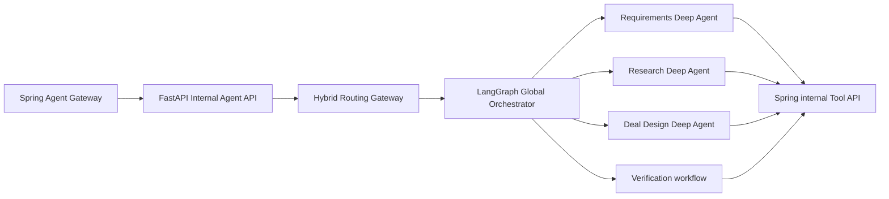

# ADR-0013: Deep Agents를 부서 Agent 실행 하네스로 채택

- 상태: Accepted
- 결정일: 2026-08-13
- 관련 결정: ADR-0001, ADR-0004, ADR-0005, ADR-0006, ADR-0012

## Context

V2는 `Global Orchestrator → Department Supervisor → Specialist/Tool`의 제한된 계층을
목표로 한다. Requirements, Research, Deal Design 부문은 장기 작업을 계획하고, 중간
산출물을 context 밖으로 내리고, 전문 subagent와 versioned skill을 조합할 실행 하네스가
필요하다. 이 기능을 부문마다 직접 구현하면 planning, context 관리, subagent 호출과
checkpoint 연동 코드가 중복된다.

LangChain의 `deepagents`는 LangGraph runtime 위에서 planning, 가상 파일시스템 기반 context
관리, subagent, skill과 long-term memory를 조합하는 독립 하네스를 제공한다. 그러나 기본
구성을 그대로 사용하면 범용 subagent와 파일 접근 범위가 V2의 고정 조직·최소 권한 원칙을
벗어날 수 있다. 또한 2026-08-13 기준 PyPI 패키지는 `0.7.5` Beta이므로 안정된 제품
contract로 간주할 수 없다.

## Decision

Deep Agents를 전체 시스템의 오케스트레이터가 아니라 **부서 Agent의 내부 실행 하네스**로
채택한다.

다음 경계를 강제한다.

- FastAPI internal API, hybrid routing gateway, Global Orchestrator와 HITL은 기존 LangGraph
  workflow가 소유한다. `create_deep_agent`가 이 경계를 대체하지 않는다.
- Requirements, Research, Deal Design만 Deep Agent 승격 후보로 둔다. 각 부문은 단일
  Agent baseline보다 품질·비용이 개선된 경우에만 승격한다.
- Verification은 별도의 LangGraph workflow와 결정적 검증 Tool로 유지한다. 산출물을 만든
  Deep Agent가 자기 결과를 최종 승인할 수 없다.
- 기본 general-purpose subagent는 비활성화한다. 사용할 specialist는 코드에 이름, 역할,
  model, Tool allowlist, skill과 output schema를 명시한다. Agent가 실행 중 새 역할이나 부서를
  만들 수 없다.
- 최대 계층은 ADR-0006의 2단계를 유지한다. subagent의 재귀 위임과 부서 간 직접 호출을
  금지하고, 부서 간 협력은 Global Orchestrator의 state transition으로만 수행한다.
- 부서별 Tool은 인증된 Spring internal REST API client를 통해 실행한다. Python은 Spring의
  business table을 직접 읽거나 변경하지 않는다. write Tool은 실행 직전에 현재 권한을 다시
  검증한다.
- runtime context에는 `run_id`, `workspace_id`, 실행 사용자와 위임 permission을 전달한다.
  delegation token과 secret은 파일, prompt, checkpoint, memory에 저장하지 않는다.
- 파일 기능은 `/run/{run_id}/`에 해당하는 논리 namespace로 제한한다. 운영 환경에서 host
  `LocalShellBackend`를 사용하지 않으며 shell 실행은 기본 비활성화한다. 필요한 경우 격리된
  sandbox와 별도 ADR·보안 검토를 먼저 거친다.
- 단기 작업 파일은 run 종료 정책에 따라 폐기하고, 영속화할 산출물은 Spring Evidence
  Ledger 또는 object storage에 명시적으로 등록한다. long-term memory는
  workspace-scoped `agent_memory`에 저장하되 승인된 사실·선호·요약만 허용하고 비공개
  chain-of-thought는 저장하지 않는다.
- custom subagent는 skill을 자동 상속한다고 가정하지 않는다. 허용 skill을 명시하고, skill,
  domain pack, jurisdiction pack, transaction pack, prompt와 schema version을 run trace에
  기록한다.
- planning/todo는 필수 기능으로 가정하지 않는다. 고정 dataset에서 성공률·비용·latency 개선이
  확인된 부문에만 활성화한다.
- provider와 model은 run마다 명시하고 기록하며 조용한 자동 fallback을 사용하지 않는다.
- 첫 spike의 `uv.lock`은 `deepagents 0.7.5`를 재현한다. pre-1.0 upgrade는 lock file diff,
  contract test, frozen evaluation과 보안 회귀 검사를 통과한 뒤 명시적으로 변경한다.

## Runtime mapping

| Deep Agents 기능 | V2 적용 |
|---|---|
| Planning | 부서 내부 작업 분해; 중앙 run budget의 하위 한도 적용 |
| Context offloading | run 전용 가상 파일공간; 원본 evidence ID와 provenance 유지 |
| Subagents | 사전 등록된 specialist만 허용; 재귀 위임 금지 |
| Skills | Git에서 versioning한 부서·domain·jurisdiction skill을 명시적으로 주입 |
| Long-term memory | workspace 격리된 승인 데이터만 저장; secret·사고 과정 제외 |
| LangGraph runtime | checkpoint, streaming, interrupt/HITL과 resume |
| Tools | delegation token을 사용하는 Spring internal REST client |

## Acceptance criteria

첫 적용 부문은 Research로 하며 다음을 모두 만족해야 한다.

1. 단일 ReAct baseline과 같은 frozen dataset에서 근거 정확성 또는 task success가 개선된다.
2. source citation 누락, cross-workspace 접근과 허용되지 않은 Tool 호출이 0건이다.
3. model·Tool·token·검색 credit·시간·재시도·subagent 호출 hard limit가 강제된다.
4. 중단 후 동일 checkpoint에서 resume되고, 같은 idempotency key의 write Tool이 중복 실행되지
   않는다.
5. 평균 비용과 p95 latency가 제품 route budget 안에 있거나, 초과 시 품질 이득과 HITL
   감소로 정당화된다.
6. default general-purpose subagent, host shell과 run namespace 밖 파일 접근이 테스트에서
   거부된다.

Requirements와 Deal Design은 Research의 운영·평가 결과를 검토한 뒤 같은 승격 절차를
따른다.

## Consequences

장점:

- planning, context offloading, subagent와 skill loading의 공통 구현을 줄일 수 있다.
- 긴 조사 작업의 context 비대화와 specialist 간 책임 혼합을 완화할 수 있다.
- LangGraph checkpoint와 HITL을 유지하면서 부서 내부 실행을 확장할 수 있다.

비용과 제약:

- pre-1.0 dependency의 API·기본 동작 변화에 대비한 lock 고정과 회귀 평가가 필요하다.
- Agent 파일시스템, memory와 subagent가 새로운 권한·정보 유출 경계를 만든다.
- 단순 작업에는 하네스의 planning과 context 관리가 비용과 latency만 늘릴 수 있다.
- 기존 Langflow prototype은 설계·prompt 검증 기준선으로 보존하되 운영 runtime 계약은
  Deep Agents 기반 Python code와 versioned schema로 다시 검증해야 한다.

## Rejected alternatives

- Deep Agents가 Global Orchestrator까지 대체: 정책 routing, HITL과 부서 간 상태 전이를
  분리하기 어려워 거부한다.
- 기본 범용 subagent와 자유로운 delegation 허용: ADR-0006의 고정 조직·비용·권한 경계를
  위반하므로 거부한다.
- 운영 host filesystem과 shell 직접 사용: 격리와 감사가 불충분하므로 거부한다.
- 모든 부서를 즉시 Deep Agent로 전환: baseline 비교 없이 복잡성과 비용을 늘리므로 거부한다.

## References

- [Deep Agents overview](https://docs.langchain.com/oss/python/deepagents/overview)
- [Deep Agents backends](https://docs.langchain.com/oss/python/deepagents/backends)
- [Deep Agents subagents](https://docs.langchain.com/oss/python/deepagents/subagents)
- [Deep Agents customization](https://docs.langchain.com/oss/python/deepagents/customization)
- [deepagents PyPI](https://pypi.org/project/deepagents/)
