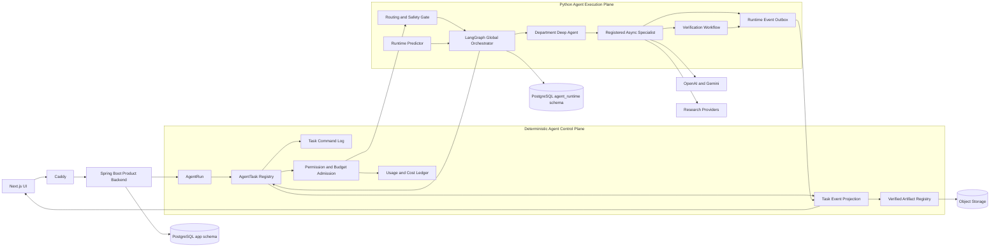

# Async Deep Agent 백엔드 목표 아키텍처

> 작성일: 2026-08-26
> 상태: Draft — 구현 승인 전
> 적용 범위: Spring Boot 백엔드, Python Agent 연동, PostgreSQL 영속화, 캐시와 Redis 도입 기준

## 1. 목적

이 문서는 `2026-08-25-deep-agent-async-runtime-handoff.md`의 비동기 Deep Agent 방향을
현재 Spring Boot 백엔드 구조에 적용하기 위한 목표 아키텍처를 정의한다.

핵심 목표는 다음과 같다.

- `AgentRun` 아래에 관찰·지시·취소 가능한 장기 실행 `AgentTask`를 둔다.
- Python 모델과 Agent는 계획과 실행을 담당하지만 권한, 예산과 실제 행동 허용 여부는
  결정적인 Harness가 통제한다.
- Spring은 사용자에게 공개되는 Task 상태, command, event, 비용과 audit의 source of truth다.
- Python은 LangGraph checkpoint와 실행 내부 상태를 소유한다.
- 서비스 장애와 재시작 후에도 Task를 재개하거나 명시적으로 실패 처리할 수 있어야 한다.
- Redis는 현재 필수 인프라에 포함하지 않고 측정된 병목이 있을 때 보조 계층으로 도입한다.

이 문서는 다음 Accepted ADR을 유지한다.

- [ADR-0013: Deep Agents 부서 Runtime](../adr/0013-deep-agents-department-runtime.md)
- [ADR-0023: Redis 도입 연기](../adr/0023-defer-redis-until-measured-v3-need.md)
- [ADR-0024: Backend-Agent 독립 전달](../adr/0024-independent-backend-agent-delivery.md)
- [ADR-0026: 정책 기반 AI Gateway](../adr/0026-policy-controlled-ai-gateway.md)

## 2. 결론 요약

현재 `agentrun` 도메인은 단일 Agent 실행의 시작, 재개, 조회와 비용 projection을 제공하지만
Async Specialist의 task, revision, attempt, dependency와 사용자 command를 표현할 수 없다.
기존 `AgentRun`을 계속 비대하게 확장하지 않고 다음 경계를 추가한다.

```text
AgentRun       상위 사용자 요청과 공개 결과
AgentTask      부서 또는 Specialist 작업의 권위 있는 Registry
TaskAttempt    특정 Task revision을 실행한 개별 시도
TaskCommand    Soft update, Hard redirect와 Cancel의 불변 사용자 명령
TaskEvent      phase, milestone, heartbeat와 결과 상태의 정렬된 이벤트
AgentLedger    중앙 budget reservation과 append-only usage/cost 원장
AgentArtifact  검증된 산출물과 exact/versioned reuse
```

## 3. 현재 구조에서 우선 수정할 결함

### 3.1 DB와 Java 상태 불일치

Java와 Agent OpenAPI는 `PARTIAL`을 사용하지만 `app.agent_run.status` 제약에는 `PARTIAL`이 없다.
부분 결과 projection이 PostgreSQL 제약 위반으로 실패할 수 있다.

### 3.2 신규 AgentRun reconciliation 시각 누락

`next_reconciliation_at`은 `NOT NULL`이지만 `AgentRunEntity` 생성자에서 초기화되지 않는다.
Hibernate가 `NULL`을 명시하는 INSERT를 생성하면 신규 실행 생성이 실패한다.

### 3.3 장기 실행과 delegation token 수명 충돌

기본 Agent 실행 상한은 180초지만 delegation token TTL은 60초다. Python은 최초 token을 Tool
호출에 계속 사용하므로 장기 실행 중 인증이 만료될 수 있다. Async Task에서는 사용자 token을
Python 실행 메모리에 장기간 전달하는 방식 자체를 제거한다.

### 3.4 실행 예약의 비영속성

Agent runtime 상태와 event는 PostgreSQL에 저장되지만 실제 실행은 FastAPI `BackgroundTasks`와
process-local `asyncio.Task`에 의존한다. 프로세스가 재시작되면 `QUEUED` 또는 `RUNNING` 상태를
다시 claim하는 recovery worker가 없다.

### 3.5 취소와 상태 조회의 동기 결합

현재 `CANCEL`은 durable command가 아니며 Spring의 상태 조회와 SSE도 Agent HTTP에 직접
의존한다. Agent 장애 중에도 사용자가 마지막 권위 있는 상태와 event를 볼 수 있도록 Spring
projection으로 전환해야 한다.

## 4. 설계 원칙

1. **Spring product state와 Python runtime state를 분리한다.**
2. **명령과 이벤트는 at-least-once 전달을 전제로 idempotent하게 처리한다.**
3. **Task revision과 Attempt를 분리해 late result를 거부한다.**
4. **모든 model, Tool과 외부 Provider 호출 전에 중앙 budget을 예약한다.**
5. **권한은 Tool 실행 시점에 현재 DB 상태로 다시 검증한다.**
6. **사용자에게 내부 chain-of-thought를 저장하거나 노출하지 않는다.**
7. **캐시는 correctness의 원본이 아니며 version과 permission 검증을 우회하지 않는다.**
8. **Redis 장애가 업무 transaction의 correctness를 깨뜨리지 않게 한다.**

## 5. 전체 목표 구조



## 6. 책임 경계

| 영역 | 권위 있는 소유자 | 책임 |
|---|---|---|
| 인증과 workspace RBAC | Spring | 사용자, membership, role, 현재 effective permission |
| AgentRun 공개 상태 | Spring | 상위 실행 상태와 사용자 결과 projection |
| Task Registry | Spring | task, dependency, revision, attempt, alias와 heartbeat |
| Task command | Spring | command idempotency, 예상 revision과 audit |
| Budget와 비용 | Spring | reservation, actual usage, pricing snapshot과 원가 |
| Tool 허용 | Spring | capability, 현재 권한, task 상태와 idempotency 검사 |
| Routing과 부서 선택 | Python | 정책 gate 이후 실행 경로와 dependency 제안 |
| Department 내부 계획 | Python | 제한된 Deep Agent planning과 specialist 실행 |
| Runtime checkpoint | Python | LangGraph node와 재개 가능한 실행 내부 상태 |
| 사용자 event와 SSE | Spring | sanitize된 durable event와 reconnect cursor |
| Runtime prediction | 독립 Python adapter | leaf attempt의 service runtime 예측 |
| Artifact 원본 | Spring metadata + Object Storage | provenance, verification과 reuse audit |

Python의 Global Orchestrator는 task와 dependency를 제안한다. Spring Harness는 권한, budget,
hierarchy, allowlist와 revision을 검사한 뒤 task를 등록하거나 거부한다.

## 7. 권장 백엔드 도메인

```text
com.freelanceops.backend.domain
├── agentrun
│   └── 상위 실행 aggregate와 기존 공개 API 호환 façade
├── agenttask
│   └── task, dependency, attempt, command, event와 lease
├── agentledger
│   └── budget, reservation, usage event, pricing과 cost projection
├── agentartifact
│   └── result artifact, verification과 exact reuse
├── internaltool
│   └── policy-controlled Action Gateway
├── knowledge
│   └── document, processing artifact, chunk와 embedding
└── workspace
    └── RBAC와 authorization revision
```

신규 도메인도 다음 공통 구조를 유지한다.

```text
client
controller
dto/request
dto/response
entity
model
repository
security
service
```

필요한 경우 `policy`, `projection`과 `scheduler`를 추가하되 도메인 간 직접 repository 접근은
금지한다.

## 8. 데이터 모델

### 8.1 `agent_task`

주요 필드:

```text
id
workspace_id
run_id
parent_task_id
department
specialist_profile
alias
objective_reference
status
revision
priority
deadline_at
current_attempt_number
last_heartbeat_at
phase
activity
created_at
updated_at
version
```

`alias`는 한 run 안에서 `Research #1`, `Risk Review #2`처럼 안정적으로 생성한다.

### 8.2 `agent_task_dependency`

```text
task_id
depends_on_task_id
dependency_type
created_at
```

자기 참조와 cycle은 service policy와 DB 검증으로 거부한다.

### 8.3 `agent_task_attempt`

```text
id
task_id
task_revision
attempt_number
status
queued_at
lease_owner
lease_until
started_at
completed_at
predicted_service_runtime_seconds
prediction_model_version
prediction_feature_snapshot
cache_outcome
failure_code
```

동일 `(task_id, task_revision, attempt_number)`는 유일해야 한다. Worker는 유효한 lease와 현재
revision을 모두 만족할 때만 결과를 기록할 수 있다.

### 8.4 `agent_task_command`

```text
id
workspace_id
run_id
task_id
expected_task_revision
command_type
idempotency_key
payload
requested_by
authorization_revision
budget_revision
requested_at
```

command row는 immutable하게 유지한다. 전달 상태, retry와 lease는 별도
`agent_task_command_delivery`에서 관리한다.

지원 command:

```text
SOFT_UPDATE
HARD_REDIRECT
CANCEL
APPROVE_BUDGET
APPROVE_PERMISSION
```

### 8.5 `agent_task_event`

```text
id
workspace_id
run_id
task_id
task_revision
attempt_id
source
source_event_id
sequence
event_type
phase
milestone
data
occurred_at
received_at
```

`(source, source_event_id)`와 `(attempt_id, sequence)`를 유일하게 만들어 재전송을 안전하게
deduplicate한다. `data`에는 chain-of-thought, secret과 delegation token을 저장하지 않는다.

Scheduler shadow replay용 TaskAttempt event는 `task-attempt-telemetry-v1`로 versioning한다. 최소 lifecycle은
`attempt.predicted → attempt.queued → attempt.started → attempt.completed|failed`이며 실패 후 retry에는
`attempt.retry_decided`를 append한다. Prediction feature snapshot은 prediction보다 늦을 수 없고 terminal
runtime은 `terminal_at - started_at`과 일치해야 한다.

Retry decision에는 classifier·bucket policy version, classification confidence, workspace/global token의
before·after와 `retry_ready_at`을 원자적으로 저장한다. Final incident label은 decision event를 수정하지
않고 `attempt.incident_finalized`로 나중에 append한다. Raw event가 source of truth이고 assembled attempt는
재생성 가능한 projection이다.

### 8.6 Budget와 사용량

```text
agent_budget_account
agent_budget_reservation
agent_usage_event
agent_run_usage_projection
```

`agent_usage_event`는 provider request 또는 Tool execution 단위의 append-only 원장이다.
현재의 run 누적 usage row는 조회 최적화 projection으로만 사용한다.

## 9. Task 상태 모델

```text
QUEUED
DISPATCHED
RUNNING
WAITING_FOR_TOOL
WAITING_FOR_USER
UPDATE_PENDING
CANCELLING
CANCELLED
COMPLETED
COMPLETED_REUSED
FAILED
TIMED_OUT
```

핵심 규칙:

- `COMPLETED`, `COMPLETED_REUSED`, `FAILED`, `TIMED_OUT`, `CANCELLED`는 terminal이다.
- Soft update는 같은 revision의 `UPDATE_PENDING`을 거쳐 안전한 checkpoint에서 반영한다.
- Hard redirect는 기존 attempt를 `CANCELLING`으로 만들고 task revision을 증가시킨다.
- 이전 revision 또는 만료된 attempt에서 도착한 결과는 저장하되 현재 결과에 병합하지 않는다.
- 취소된 Task의 child Task에도 cancel command를 생성한다.
- 퍼센트 진행률은 계산 근거가 있을 때만 사용한다. 기본 UI는 phase, milestone, activity와
  `last_heartbeat_at`을 표시한다.

## 10. Harness와 Action Gateway

모든 외부 행동은 다음 순서를 통과한다.

```text
ActionProposal
→ schema validation
→ task revision과 attempt lease 검사
→ current workspace membership 검사
→ capability와 Tool allowlist 검사
→ budget reservation
→ idempotency 검사
→ Capability Executor
→ 결과 sanitize와 audit
→ usage settlement
→ Observation
```

프롬프트의 permission, workspace ID, budget 또는 endpoint는 신뢰하지 않는다.

### 10.1 인증 변경

장기 Task가 사용자 delegation token을 보관하는 방식은 제거한다.

- Agent는 별도의 workload identity로 Spring에 인증한다.
- 호출마다 `run_id`, `task_id`, `task_revision`, `attempt_id`, `capability`와
  `idempotency_key`를 전달한다.
- Spring은 Task의 `initiated_by`와 현재 membership을 조회해 권한을 다시 계산한다.
- revoked permission, 취소된 attempt와 이전 revision의 요청은 즉시 거부한다.
- workload credential과 secret은 checkpoint, prompt, event와 artifact에 저장하지 않는다.

## 11. 명령과 이벤트 전달

### 11.1 Spring에서 Agent 방향

Spring transaction에서 업무 상태와 command를 함께 저장한다. Dispatcher는 commit 이후 command를
전달한다. Agent는 command inbox에 `(command_id, task_revision)`을 먼저 영속화한 뒤 응답한다.

### 11.2 Agent에서 Spring 방향

Agent는 runtime state 변경과 event outbox를 같은 PostgreSQL transaction으로 기록한다. Event
publisher는 Spring ingestion API로 batch 전송하고 Spring이 deduplicate한 뒤 ack한다.

Spring SSE는 Agent의 실시간 HTTP stream을 직접 proxy하지 않고 `agent_task_event`를 읽는다.
PostgreSQL `LISTEN/NOTIFY`는 새 event가 있음을 알리는 wake-up으로만 사용하며 event payload의
source of truth는 테이블이다.

## 12. Budget와 비용 원장

모든 병렬 호출은 실행 전에 원자적으로 예산을 예약한다.

```text
reserved_cost
+ actual_model_cost
+ actual_tool_cost
+ pending_parallel_reservation
<= run_cost_budget
```

필수 budget dimension:

- model calls
- Tool calls
- input, cached input과 output token
- 검색 credit와 crawl page
- 실행 시간
- retry와 handoff
- child task 수와 hierarchy depth
- 예상·실제 금액

Provider 응답이 모호하면 비용을 0으로 확정하지 않고 `RECONCILIATION_REQUIRED` usage 상태로
남긴다. Silent model fallback은 허용하지 않는다.

## 13. 캐시와 Artifact

### 13.1 문서 처리

현재 문서 hash와 chunk를 다음 artifact로 분리한다.

```text
document_reference
content_artifact
document_processing_artifact
chunk_artifact
embedding_artifact
```

권장 identity:

```text
document processing
= workspace scope 또는 public corpus namespace
+ content hash
+ parser version
+ chunking version

embedding
= chunk content hash
+ provider
+ model
+ dimension
+ normalization version
```

### 13.2 Sub-Agent 결과 재사용

동일 workspace의 정확히 같은 versioned Task만 재사용한다. 재사용 전 다음을 모두 확인한다.

- 현재 사용자의 read permission
- 완료 및 Verification 통과
- objective와 input reference version 일치
- evidence snapshot 일치
- prompt, skill, Tool schema와 output schema version 일치
- policy version과 freshness 일치
- 새로운 command 또는 revision이 없음

cache hit은 `COMPLETED_REUSED`로 기록하고 Runtime Predictor의 정상 service runtime 학습에서
제외한다.

## 14. Redis 도입 결정

### 14.1 현재 결정

Redis는 현재 목표 구조의 필수 구성요소로 도입하지 않는다.

이유:

- 현재 핵심 문제는 Task 모델과 실행 복구이며 Redis가 해결하지 않는다.
- PostgreSQL은 이미 업무 transaction과 checkpoint의 필수 인프라다.
- Redis를 추가하면 배포, backup, 장애 대응과 cache invalidation 대상이 증가한다.
- 초기 단일 Backend instance와 제한된 Worker 규모에서는 PostgreSQL Outbox, lease와
  `LISTEN/NOTIFY`로 충분하다.

### 14.2 Redis 도입 조건

다음 중 하나가 실제 지표로 확인될 때 새 ADR과 benchmark 후 도입한다.

- 다중 Backend instance에서 distributed rate limit이 필요하다.
- SSE fan-out 또는 event polling이 PostgreSQL 부하의 주요 원인이다.
- Task claim 경합으로 queue wait SLO를 초과한다.
- 짧은 TTL exact read cache가 충분한 hit ratio와 비용 절감을 보인다.
- 여러 독립 consumer group이 같은 실시간 event stream을 소비해야 한다.

### 14.3 도입 시 역할

```text
PostgreSQL source of truth
→ Transactional Outbox
→ Redis Streams
    ├── SSE fan-out
    ├── metrics consumer
    └── notification consumer

Redis
├── distributed rate limit
├── short-lived exact read cache
└── ephemeral event distribution
```

Redis에 Task 상태, command 원본, budget, 비용, RBAC, audit와 checkpoint의 유일한 원본을 두지
않는다. Redis Stream consumer는 at-least-once 재전달을 전제로 idempotent해야 한다.

## 15. API 초안

### 15.1 Public API

```text
GET  /api/v2/workspaces/{workspaceId}/agent-runs/{runId}/tasks
GET  /api/v2/workspaces/{workspaceId}/agent-tasks/{taskId}
GET  /api/v2/workspaces/{workspaceId}/agent-tasks/{taskId}/result
POST /api/v2/workspaces/{workspaceId}/agent-tasks/{taskId}/commands
GET  /api/v2/workspaces/{workspaceId}/agent-runs/{runId}/events
```

command 요청에는 `Idempotency-Key`와 `expectedTaskRevision`이 필요하다.

### 15.2 Agent service API

```text
POST /internal/v1/agent-control/tasks
POST /internal/v1/agent-control/tasks/{taskId}/attempts/{attemptId}/heartbeat
POST /internal/v1/agent-control/task-events:batch
POST /internal/v1/agent-control/budget-reservations
POST /internal/v1/agent-control/usage-events:batch
```

### 15.3 Tool API

기존 `/internal/v1` 공통 filter를 다음 두 security chain으로 분리한다.

```text
/internal/v1/agent-control/**  Agent workload identity
/internal/v1/tools/**          Task capability와 current RBAC
```

## 16. 단계별 마이그레이션

### Phase 0 — 현재 결함 보정

- `PARTIAL` DB 상태 제약 수정
- `next_reconciliation_at` 생성 초기화
- token TTL 충돌 재현 테스트
- 실제 PostgreSQL AgentRun 생성·부분 결과 projection 테스트

### Phase 1 — Contract와 Schema

- Task, Attempt, Command와 Event contract 확정
- 상태 전이표와 reason code 확정
- 신규 테이블과 repository 추가
- 기존 AgentRun API는 유지

### Phase 2 — Read-only Research vertical slice

- Research Specialist 한 종류만 등록
- FIFO task claim, lease와 heartbeat
- event ingestion과 Spring SSE
- restart recovery와 duplicate delivery 테스트

### Phase 3 — 사용자 제어

- task 목록, 상태와 결과 API
- Soft update와 Hard redirect
- durable cancel과 child 전파
- late-result rejection

### Phase 4 — Action Gateway와 Budget

- workload identity
- current RBAC와 capability 검사
- atomic budget reservation
- write Tool idempotency
- permission과 budget revision audit

### Phase 5 — Ledger와 Cache

- append-only usage event
- provider cached token telemetry
- document processing과 embedding exact reuse
- verified Sub-Agent artifact reuse

### Phase 6 — Runtime Predictor와 Scheduler

- 실제 TaskAttempt history feature snapshot
- cache hit과 cancelled attempt 제외
- Fair Predicted-SJF와 bounded aging
- prediction 장애 시 명시적 FIFO fallback

### Phase 7 — 기존 경로 제거

- Spring의 Agent GET polling 축소
- Agent SSE proxy 제거
- 동기 cancel 제거
- 구 `agent_run_command` 호환 경로 제거

각 Phase는 독립 migration, contract test, 실제 PostgreSQL concurrency test와 rollback 가능한
feature flag를 가져야 한다.

## 17. 승인 기준

### Durability

- Spring 또는 Agent 재시작 후 유효한 Attempt가 재개 또는 명시적으로 timeout 처리된다.
- command와 event 중복 전달이 상태와 side effect를 중복시키지 않는다.
- 취소와 timeout이 child Task에 전파된다.
- 이전 revision의 late result가 현재 결과에 병합되지 않는다.

### Security

- 허용되지 않은 Tool, Sub-Agent와 파일 접근이 0건이다.
- 권한 회수 후 다음 Tool 호출이 거부된다.
- prompt injection이 workspace, permission, budget 또는 capability를 변경하지 못한다.
- secret과 chain-of-thought가 event, checkpoint와 artifact에 저장되지 않는다.

### Budget와 Cost

- 병렬 호출이 중앙 예산을 초과 예약하지 않는다.
- model과 Tool 사용량이 append-only 원장으로 추적된다.
- cached token과 uncached token 비용이 구분된다.
- cache hit이 Predictor 학습 target에 포함되지 않는다.

### Cache

- cross-workspace 생성 응답 재사용이 0건이다.
- permission, content, prompt, skill, Tool schema와 policy version 변경이 cache miss를 만든다.
- 재사용 결과는 원본 artifact와 verification 상태를 표시한다.

### Operability

- phase, milestone, heartbeat, queue wait와 service runtime을 조회할 수 있다.
- queue depth, oldest age, lease expiry, retry와 dead-letter 지표가 존재한다.
- Redis 없이 기준 부하를 만족한다.
- Redis 도입은 측정된 병목과 benchmark로 정당화된다.

## 18. 구현 전 확정할 결정

다음 항목은 구현 전에 ADR 또는 contract로 확정해야 한다.

1. Agent workload identity 방식과 key rotation
2. Python scheduler 제안과 Spring admission의 정확한 API 경계
3. Task result와 artifact의 object storage 보존 기간
4. Soft update를 반영할 안전한 checkpoint 정의
5. Hard redirect 시 기존 child Task 처리 정책
6. Budget 금액 단위, 환율 snapshot과 미확정 Provider 비용 처리
7. Task Event 보존 기간과 개인정보 삭제 정책
8. Redis 도입을 재검토할 수치 기반 threshold

## 19. 비목표

- Redis를 업무 데이터 또는 checkpoint의 source of truth로 사용하지 않는다.
- Python이 Spring business table을 직접 읽거나 수정하지 않는다.
- Deep Agents가 Global Orchestrator를 대체하지 않는다.
- general-purpose subagent, 재귀 위임과 host shell을 허용하지 않는다.
- 유사도만으로 고객 생성 응답을 재사용하지 않는다.
- Runtime Predictor prototype을 즉시 운영 Scheduler에 연결하지 않는다.
