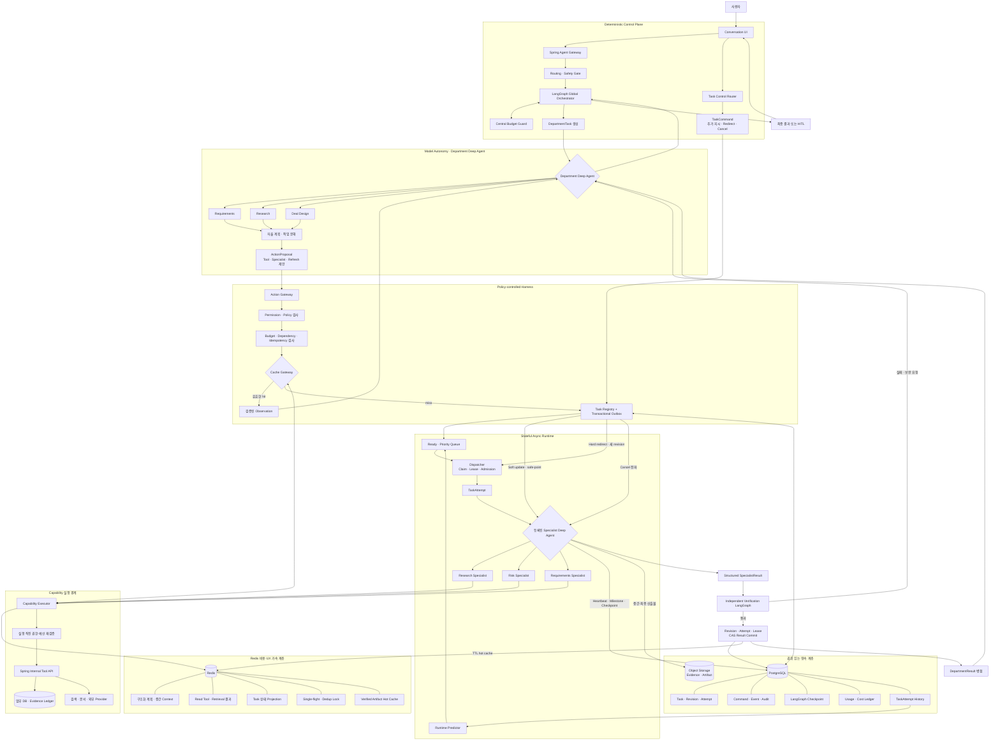

# Deep Agent 자율 실행·Redis 가속 Runtime 설계 초안

> 작성일: 2026-08-26  
> 상태: 설계 협의 중 — 구현 및 ADR 승인 전  
> 범위: Department Deep Agent, Async Specialist, Harness, Redis cache, PostgreSQL task lifecycle  
> 관련 문서: ADR-0013, ADR-0023, ADR-0026, `deep-agents-target-architecture.md`,
> `2026-08-25-deep-agent-async-runtime-handoff.md`

## 1. 목표

최종 목표는 모델의 자율적 계획과 문제 해결 능력을 유지하면서 반복 실행 비용과 사용자 대기시간을
줄이는 것이다.

```text
모델은 목표를 해석하고 계획·위임·추가 조사를 자유롭게 제안한다.
Harness는 모델의 사고가 아니라 실제 외부 행동의 허용 여부와 실행만 통제한다.
PostgreSQL은 권위 있는 상태와 감사 기록을 보존한다.
Redis는 검증된 중간 결과와 조회 결과를 TTL 기반으로 재사용하는 가속 계층이다.
```

이 설계는 모델의 비공개 chain-of-thought를 저장하거나 재생하는 것을 목표로 하지 않는다.
재사용하는 대상은 명시적으로 구조화한 계획, 가정, ActionProposal, Tool Observation, 중간 산출물과
검증 결과다.

## 2. 핵심 설계 원칙

1. **모델 자율성 보존**
   - 모델이 작업 분해, specialist 선택, Tool 사용과 refresh 필요성을 제안한다.
   - 캐시 hit은 강제 최종 답변이 아니라 provenance가 포함된 Observation으로 모델에 제공한다.
   - 모델은 불확실성이나 freshness 요구가 있으면 재조사를 요청할 수 있다.

2. **행동만 결정적으로 통제**
   - 모델이 생성한 workspace, permission, budget, token과 endpoint를 신뢰하지 않는다.
   - 모든 외부 행동은 Action Gateway에서 permission, policy, budget, dependency, idempotency를 검사한다.

3. **PostgreSQL을 source of truth로 유지**
   - Task, revision, attempt, command, event, checkpoint, audit와 비용 원장은 PostgreSQL에 저장한다.
   - Redis 장애나 eviction으로 업무 상태 또는 감사 기록이 유실되어서는 안 된다.

4. **Redis는 ephemeral acceleration layer로 제한**
   - Redis는 hot context, read 결과, task projection, single-flight와 verified artifact 가속에 사용한다.
   - TTL만으로 correctness를 판단하지 않고 permission·policy·resource version을 함께 검증한다.

5. **Deep Agents는 부서 내부 실행 엔진**
   - Global Orchestrator, 중앙 budget, HITL과 부서 간 상태 전이는 LangGraph control plane이 소유한다.
   - Deep Agents는 부서 내부 계획, context 관리와 사전 등록된 specialist 실행에 사용한다.

6. **Verification 분리**
   - 결과를 만든 Deep Agent가 자기 결과를 최종 승인하지 않는다.
   - 독립 Verification workflow가 evidence, schema, 계산, 권한과 freshness를 검증한다.

## 3. 전체 아키텍처



## 4. 책임 경계

| 구성 요소 | 소유 책임 | 소유하지 않는 책임 |
|---|---|---|
| 모델 | 목표 해석, 계획, 위임과 Tool 사용 제안, 결과 종합 | permission, 실제 budget debit, 업무 transaction |
| Global Orchestrator | 부서 선택, dependency, 중앙 budget, HITL, 결과 조정 | 부서 내부 자유로운 작업 분해 |
| Department Deep Agent | 부서 내부 계획, context 관리, specialist 선택 | 부서 간 직접 호출, 최종 승인 |
| Action Gateway | schema, permission, policy, budget, idempotency 검사 | 모델의 추론 방식 결정 |
| Task Registry | Task lifecycle의 권위 있는 상태 | 실행 우선순위 계산 |
| Scheduler·Dispatcher | admission, priority, worker claim과 lease | 업무 권한 판정 |
| Specialist Worker | 승인된 task 실행과 checkpoint | 새 권한·예산의 자의적 확장 |
| Verification | evidence, schema, 계산, freshness 검증 | 산출물 생성자의 자기 승인 |
| PostgreSQL | durable state, audit, command, checkpoint, 비용 원장 | hot cache와 짧은 TTL 조회 가속 |
| Redis | hot cache, projection, dedup, single-flight | 업무 상태와 권한의 source of truth |

## 5. Model과 Harness의 상호작용

모델은 실행 명령이 아니라 `ActionProposal`을 생성한다.

```text
Model
→ ActionProposal
→ Action Gateway validation
→ cache lookup 또는 Capability 실행
→ sanitized Observation
→ Model
```

권장 `ActionProposal`의 개념 필드는 다음과 같다.

```text
proposal_id
task_id
task_revision
action_type
capability_name 또는 specialist_profile
objective
canonical_arguments
input_reference_versions
requested_budget
freshness_requirement
reason_summary
```

`reason_summary`는 설명 가능한 짧은 근거이며 비공개 chain-of-thought가 아니다.

캐시 hit도 다음 metadata를 포함하는 Observation으로 반환한다.

```text
cache_hit
cache_namespace
created_at
fresh_until
source_versions
verification_status
producer_attempt_id
refresh_allowed
```

모델은 `refresh_allowed=true`인 Observation에 대해 새 실행을 제안할 수 있다. Harness는 중요도,
freshness와 남은 budget을 기준으로 이를 허용하거나 거부한다.

## 6. 비동기 Task 계약

### 6.1 식별자

| 식별자 | 의미 |
|---|---|
| `task_id` | 사용자에게 보이는 논리 작업의 불변 ID |
| `task_revision` | 목표 또는 산출물 contract 변경 버전 |
| `attempt_id` | 특정 revision의 실제 실행 시도 |
| `command_id` | 추가 지시, redirect, cancel의 불변 명령 ID |
| `external_thread_id` | Agent Protocol 또는 외부 runtime 내부 매핑 |
| `external_run_id` | 외부 runtime의 개별 실행 매핑 |

외부 thread/run ID는 사용자 명령과 권한 판정의 기준으로 사용하지 않는다.

### 6.2 상태와 activity 분리

Durable lifecycle 상태와 순간 실행 activity를 분리한다.

```text
TaskStatus
QUEUED
RUNNING
WAITING_FOR_USER
CANCELLING
COMPLETED
FAILED
TIMED_OUT
CANCELLED
```

```text
AttemptStatus
PENDING
CLAIMED
RUNNING
INTERRUPTING
COMPLETED
FAILED
TIMED_OUT
CANCELLED
SUPERSEDED
```

```text
Activity
CACHE_LOOKUP
DISPATCHING
PLANNING
MODEL_CALL
WAITING_FOR_TOOL
WAITING_FOR_COMMAND
VERIFYING
COMMITTING
```

캐시 재사용은 별도 terminal status를 늘리지 않고 다음과 같이 표현한다.

```text
status = COMPLETED
completion_kind = EXECUTED | REUSED
```

### 6.3 Soft update

- 기존 objective와 output contract를 변경하지 않는 추가 정보다.
- `TaskCommand` append-only log에 저장한다.
- Worker가 model 호출 전, Tool 호출 전, checkpoint 직후 등의 safe-point에서 소비한다.
- 이미 시작한 외부 side effect를 되돌리지 않는다.
- 새 permission이나 budget이 필요하면 `WAITING_FOR_USER` 또는 별도 승인 흐름으로 전환한다.

### 6.4 Hard redirect

- objective, output schema, evidence 범위 또는 주요 제약이 변경될 때 사용한다.
- `task_revision`을 증가시킨다.
- 기존 attempt를 `INTERRUPTING` 또는 `SUPERSEDED`로 전환한다.
- 새 feature snapshot과 runtime prediction으로 새 attempt를 생성한다.
- 이전 revision의 늦은 결과는 현재 task 결과로 병합하지 않는다.

### 6.5 Cancel

- 요청 수신 시 먼저 `CANCELLING`으로 전환한다.
- Dispatcher와 child runtime에 취소를 전파한다.
- 실제 종료 또는 lease 만료를 확인한 뒤 `CANCELLED`로 전환한다.
- 취소 이후 도착한 결과는 artifact로 보존할 수 있지만 현재 revision에는 병합하지 않는다.

## 7. Result commit 안전 조건

Specialist 결과는 Verification을 통과한 뒤 compare-and-swap으로 commit한다.

```text
task_id가 일치함
task_revision이 현재 revision과 일치함
attempt_id가 active attempt와 일치함
lease owner와 lease token이 일치함
attempt status가 RUNNING 또는 VERIFYING임
task가 CANCELLING 또는 CANCELLED가 아님
output schema와 verification contract를 통과함
```

조건이 하나라도 다르면 결과를 현재 task에 병합하지 않는다. 이를 통해 hard redirect, timeout,
worker 재시작과 cancel 이후의 late result를 차단한다.

## 8. Redis cache 설계

### 8.1 캐시 대상

| Cache namespace | 대상 | 기본 TTL 방향 | 비고 |
|---|---|---:|---|
| `reasoning-artifact` | 구조화 계획, 가정, 결정 요약 | 10~30분 | chain-of-thought 제외 |
| `tool-read` | deterministic read Tool 결과 | 수초~수분 | resource version 필수 |
| `retrieval` | 검색·retrieval 결과 | 5~30분 | corpus revision 필수 |
| `document` | parse, OCR, chunk 결과 | 장기 | content-addressed |
| `embedding` | 동일 chunk embedding | 장기 | model·dimension 포함 |
| `task-view` | UI 상태 projection | 1~10초 | PostgreSQL에서 재구축 가능 |
| `artifact-hot` | verified specialist artifact | 30분~수시간 | exact task identity만 허용 |
| `single-flight` | 동시 동일 실행 dedup | 실행 시간 | lock timeout·fencing 필요 |

TTL 값은 초기값이며 실제 freshness 요구, 비용과 hit ratio 측정 후 조정한다.

### 8.2 Cache identity

최소 identity는 다음 요소로 구성한다.

```text
workspace_id
cache_namespace
canonical_input_hash
effective_permission_fingerprint
policy_version
provider_and_model
prompt_version
skill_bundle_hash
tool_schema_hash
output_schema_version
resource_versions
evidence_snapshot_hash
```

delegation token, secret과 사용자 인증 credential은 cache key나 value에 저장하지 않는다.

### 8.3 TTL 외 무효화 조건

다음 변경은 TTL이 남아 있어도 cache miss 또는 stale rejection을 만든다.

```text
permission revision 변경
policy version 변경
task hard redirect
prompt·skill·Tool schema 변경
원본 document 또는 업무 resource 변경
evidence snapshot 변경
법률·가격·환율 등의 freshness deadline 초과
Verification 상태 취소 또는 실패
workspace scope 불일치
```

### 8.4 금지 대상

- 비공개 chain-of-thought와 hidden instruction
- cross-workspace 고객 생성 응답
- semantic similarity만으로 선택한 최종 응답
- permission 검사를 생략한 cache hit
- write Tool 결과의 일반 TTL 재실행 방지
- 실시간 권한, 승인, quota와 현재 task 상태의 권위 있는 값
- secret, delegation token과 내부 credential

Write Tool의 중복 방지는 Redis cache가 아니라 PostgreSQL idempotency ledger로 처리한다.

## 9. Redis 장애와 일관성 원칙

- Redis miss 또는 장애 시 PostgreSQL과 원본 Tool로 안전하게 fallback한다.
- Redis 장애가 permission이나 budget 검사를 우회하게 해서는 안 된다.
- Redis eviction은 비용과 latency만 증가시키며 correctness에는 영향을 주지 않아야 한다.
- task 상태 projection은 PostgreSQL event에서 재구축할 수 있어야 한다.
- single-flight lock에는 fencing token을 사용해 오래된 worker가 결과를 commit하지 못하게 한다.
- cache write 실패 때문에 이미 검증된 업무 결과 전체를 실패 처리하지 않는다.
- cache hit과 miss는 명시적으로 event와 telemetry에 기록한다.

## 10. 실행과 권한 위임

장시간 worker는 최초 HTTP 요청의 delegation token을 DB, checkpoint 또는 Redis에 저장하지 않는다.

권장 방식은 다음과 같다.

1. Task Registry에는 검증된 workspace, initiated user와 permission revision만 저장한다.
2. Worker가 attempt를 claim한다.
3. Tool 호출 직전에 Spring이 task/attempt identity와 현재 권한을 재검증한다.
4. Spring이 짧은 수명의 task-scoped capability를 발급하거나 요청을 직접 대행한다.
5. permission이 회수되었으면 Tool 실행 전에 task를 중단하거나 HITL로 전환한다.

이를 통해 재시작 가능한 장시간 task와 secret 비저장 원칙을 동시에 만족한다.

## 11. Deep Agents Async API 적용 원칙

`deepagents 0.7.5`의 내장 Async Sub-Agent 도구는 Agent Protocol server에 remote thread/run을 직접
생성하고 task 정보를 부모 agent state에 저장한다. 이 상태를 제품의 권위 있는 Task Registry로
사용하지 않는다.

운영에서는 다음 adapter를 둔다.

```text
Deep Agent의 specialist 제안
→ 프로젝트 Action Gateway
→ PostgreSQL task/outbox 등록
→ Scheduler와 Dispatcher
→ Agent Protocol adapter
→ external thread/run mapping 저장
```

모델에게 라이브러리의 `start_async_task`를 직접 노출하지 않고 프로젝트가 소유한
`request_specialist_task` capability를 노출한다. 외부 runtime 호출 전에 task 등록과 검증이
완료되어야 한다.

라이브러리의 update가 현재 run interrupt와 새 run 생성을 의미한다면 이를 soft update로 사용하지
않는다. 프로젝트 command adapter가 soft update와 hard redirect 의미를 보존한다.

## 12. Scheduler와의 연결 경계

Scheduler는 Task의 의미나 모델의 계획을 변경하지 않는다. 실행 가능한 `TaskAttempt` 중 다음 정보를
사용해 dispatch 순서와 admission을 결정한다.

```text
workspace_id
priority
queued_at
deadline 또는 max_wait
predicted_service_runtime_seconds
resource_class
budget reservation
dependency readiness
cache lookup outcome
```

Scheduler는 실제 runtime을 보지 못하며 prediction을 사용한다. cache hit attempt는 worker를 점유하지
않고 완료하며 정상 service runtime 학습 target에서 제외한다.

## 13. 사용자 UX

사용자는 내부 UUID 대신 workspace 내에서 안정된 alias를 사용한다.

```text
Research #1
Risk Review #2
Requirements #1
```

상태 응답에는 추측한 진행률 대신 다음을 표시한다.

```text
현재 phase/activity
완료 milestone
현재 실행 또는 대기 사유
마지막 heartbeat 시각
cache reuse 여부와 freshness
사용된 budget과 남은 budget
```

Redis `task-view`는 빠른 조회와 SSE fan-out을 돕지만, 상태 확인이 중요하거나 cache가 없으면
PostgreSQL Task Registry를 조회한다.

## 14. 관측 지표

### 비용·캐시

```text
provider_cached_input_tokens
provider_uncached_input_tokens
prompt_cache_hit_ratio
tool_cache_hit_ratio
retrieval_cache_hit_ratio
artifact_reuse_ratio
cache_lookup_seconds
cache_stale_rejection_count
cache_permission_rejection_count
single_flight_deduplicated_runs
actual_cost_per_successful_outcome
```

### Async runtime

```text
queue_wait_seconds
service_runtime_seconds
verification_seconds
task_end_to_end_seconds
lease_expiration_count
orphan_attempt_recovery_count
cancel_propagation_seconds
late_result_rejection_count
soft_update_apply_seconds
hard_redirect_count
```

### 품질·자율성

```text
task_success_rate
evidence_citation_accuracy
verification_rejection_rate
model_requested_refresh_rate
cache_refresh_approval_rate
cache_induced_quality_regression
HITL_rate
```

## 15. 테스트 전략

### P0 Contract와 state machine

- 허용·금지 상태 전이를 table-driven test로 검증한다.
- 같은 command의 idempotent 처리와 중복 event 방지를 검증한다.
- hard redirect 후 이전 attempt 결과가 commit되지 않는지 검증한다.
- cancel, timeout, completion 경합을 동시성 테스트로 검증한다.
- lease 만료 후 다른 worker가 안전하게 reclaim하는지 검증한다.

### P0 Security

- prompt injection이 permission, budget, Tool allowlist를 바꾸지 못해야 한다.
- cross-workspace cache hit과 artifact 접근이 0건이어야 한다.
- permission revision 변경 직후 이전 cache entry가 거부되어야 한다.
- general-purpose subagent, 재귀 위임과 host shell tool이 노출되지 않아야 한다.
- secret과 delegation token이 prompt, Redis, checkpoint와 event에 없어야 한다.

### P0 Cache correctness

- content, prompt, skill, Tool, policy와 permission version 변경이 miss를 만들어야 한다.
- Redis outage와 eviction에서 PostgreSQL 또는 원본 실행으로 fallback해야 한다.
- single-flight leader 실패 후 follower가 영구 대기하지 않아야 한다.
- stale result와 verification 실패 artifact가 재사용되지 않아야 한다.
- cache hit이 Runtime Predictor 학습 target에 포함되지 않아야 한다.

### P1 Deep Agent integration

- fake Agent Protocol server로 start, check, cancel과 redirect adapter를 검증한다.
- 실제 Research specialist 한 종류의 read-only end-to-end 실행을 검증한다.
- checkpoint 이후 동일 attempt resume와 Tool idempotency를 검증한다.
- frozen dataset에서 bounded ReAct baseline과 품질·비용·p95 latency를 비교한다.

### P1 UX

- alias 기반 list/status/result/update/redirect/cancel을 검증한다.
- status projection stale 시 PostgreSQL fallback을 검증한다.
- cache hit의 생성 시점, freshness와 provenance가 UI에 표시되는지 검증한다.
- 근거 없는 percentage progress를 노출하지 않는지 검증한다.

## 16. 단계적 구현 제안

### Phase 1 — Durable Task core

1. `DepartmentTask`, `TaskRevision`, `TaskAttempt`, `TaskCommand`, `TaskEvent` 계약 정의
2. PostgreSQL state transition과 compare-and-swap commit 구현
3. transactional outbox, worker claim과 lease 구현
4. fake specialist adapter로 crash, cancel과 redirect 검증

### Phase 2 — Redis acceleration

1. cache identity와 permission fingerprint 계약 정의
2. task projection과 read Tool cache 적용
3. single-flight와 fencing 적용
4. Redis outage, stale rejection과 비용 telemetry 검증

### Phase 3 — Research Deep Agent vertical slice

1. 사전 등록된 read-only Research specialist graph 구축
2. Action Gateway와 Agent Protocol adapter 연결
3. structured output, evidence와 Verification 연결
4. soft update safe-point와 hard redirect 분리 검증

### Phase 4 — Evaluation과 승격

1. 단일 bounded ReAct baseline과 frozen evaluation
2. 실제 비용, cache hit, task success와 p95 latency 측정
3. Research 승격 여부 결정
4. Requirements와 Deal Design을 같은 gate로 검토

## 17. ADR 영향

이 문서는 구현 승인을 의미하지 않는다.

- ADR-0013의 Deep Agents 부서 내부 한정 원칙과 일치한다.
- ADR-0026의 모델 제안과 Harness 실행 분리 원칙과 일치한다.
- Redis 도입은 ADR-0023의 현재 결정과 충돌한다.

Redis를 운영 dependency로 채택하려면 실제 비용·latency 목표, 장애 fallback, source-of-truth 경계와
운영 부담을 기록한 새 ADR로 ADR-0023을 명시적으로 supersede해야 한다.

## 18. 미결정 사항

1. Redis를 V2에 즉시 포함할지, Phase 1 측정 이후 활성화할지
2. Redis를 단일 runtime 내부용으로만 둘지 향후 다중 instance까지 지원할지
3. Soft update safe-point를 model call, Tool call, milestone 중 어디까지 보장할지
4. specialist를 동일 Agent Server에 둘지 별도 worker deployment로 분리할지
5. task-scoped capability 재발급을 Spring이 어떤 API와 수명으로 제공할지
6. verified artifact의 업무 유형별 freshness 기본값
7. cache refresh 요청이 중앙 budget을 사용하는 정확한 정책
8. Redis Streams/PubSub을 SSE 가속에 사용할지 PostgreSQL LISTEN/NOTIFY를 유지할지

## 19. 제안 결론

```text
모델의 계획 자유는 유지한다.
모델이 제안한 행동은 Harness가 검증한다.
PostgreSQL은 권위 있는 task와 audit 상태를 유지한다.
Redis는 안전하게 검증된 반복 결과와 UX projection을 TTL로 가속한다.
Deep Agents 내장 async state를 제품의 source of truth로 사용하지 않는다.
모든 specialist 결과는 독립 Verification과 CAS commit을 통과한다.
```
