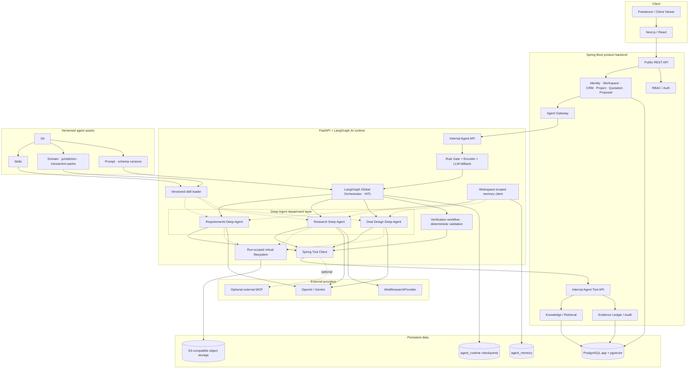

# Deep Agents 기반 V2 목표 구조

> 상태: ADR-0013 Accepted 구조 설명  
> 기준일: 2026-08-13

이 문서는 사용자 승인 다이어그램을 저장소의 V2 경계와 구현 단위로 옮긴 목표 구조다.
구현 우선순위와 강제 제약은 [ADR-0013](../adr/0013-deep-agents-department-runtime.md)을
따른다.

## 책임 경계

| 계층 | 소유 책임 |
|---|---|
| Spring Boot | 인증, workspace RBAC, 업무 transaction, 견적 계산, Evidence Ledger, audit |
| Hybrid Routing Gateway | 정책 gate 이후 실행 route 선택과 abstain/fallback |
| Global Orchestrator | 부서 선택, 상태 전이, 중앙 budget, HITL, 결과 조정 |
| Department Deep Agent | 자기 부문의 계획, context 관리, 허용 specialist·Tool 실행 |
| Verification workflow | evidence·risk·계산 결과의 독립 검증과 승인 조건 판정 |
| PostgreSQL / object storage | 업무 데이터, checkpoint, 승인 memory, 근거와 산출물 영속화 |

## 단계적 도입

1. `uv.lock`의 `deepagents 0.7.5`로 dependency spike와 최소 Research Deep Agent를 만든다.
2. general-purpose subagent·shell을 끄고 run-scoped backend와 명시적 specialist를 구성한다.
3. read-only Spring Tool client, structured output, checkpoint와 budget contract를 연결한다.
4. 단일 ReAct baseline과 frozen evaluation을 수행한다.
5. ADR-0013 acceptance criteria를 통과하면 Research를 승격한다.
6. 같은 절차로 Requirements와 Deal Design을 검토한다.

운영 FAISS, Python의 business table 직접 접근, 자유로운 swarm과 자동 model fallback은 이
구조에 포함되지 않는다.
