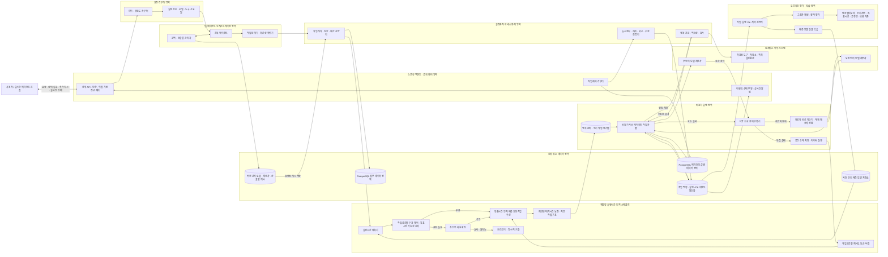

# 라우터 · 딥 에이전트 · 스케줄러 통합 목표 아키텍처

> 상태: 목표 구조 v1 확정
>
> 범위: 요청 라우팅, 딥 에이전트 작업 분해, 하네스 통제, 비동기 서브 에이전트 스케줄링,
> 사용자 실시간 제어, 장애 복구, 캐시, 실행 기록과 학습 루프

## 1. 전체 구조



## 2. 계층별 단일 책임

| 계층 | 결정하는 질문 | 결정하지 않는 것 |
|---|---|---|
| 라우터 | 어떤 업무 경로, 위험 등급, 모델·도구 프로필인가? | 실행 순서와 작업자 배정 |
| 딥 에이전트 | 목표를 어떤 작업 의존성 그래프와 서브 에이전트 역할로 분해할 것인가? | 권한 완화와 실제 외부 행동 |
| 하네스 | 제안된 작업·행동이 권한, 예산, 자료 구조와 멱등성을 만족하는가? | 의미 기반 자유 추론 |
| 스케줄러 | 작업을 수락할 수 있는가, 언제 어느 작업자에 배정할 것인가? | 모델·도구 권한의 임의 변경 |
| 작업자 | 허가된 실행 시도를 수행하고 중간 상태와 이벤트를 남기는가? | 전역 수용 정책 변경 |
| 제어 영역 | 사용자의 상태 질문과 명령을 영속 상태에 연결하는가? | 에이전트의 추측을 상태로 사용 |
| 평가 영역 | 실제 실행 기록으로 예측기와 정책을 그림자 검증하는가? | 실행 중인 모델의 즉시 실시간 재학습 |

## 3. 확정된 운영 정책

1. 기본 배치는 `목표시간 인지 예측 최단작업 우선 + 제한된 대기시간 보정 + 지연 작업 구조`다.
2. 작업공간 공정성은 항상 작동하는 공정 대기열보다 수용 단계의 유연한 할당량과 차입으로 보호한다.
3. 물리 용량 부족은 정렬로 숨기지 않고 조건부 확장, 처리 연기와 명시적 거절로 처리한다.
4. 독립 실패는 중간 상태에서 즉시 재개하고 작업공간별 재시도 토큰을 소비한다.
5. 여러 작업공간에 동시에 나타나는 제공자 장애만 회로 차단과 보조 제공자 전환 대상으로 삼는다.
6. 모델은 계획과 행동을 자유롭게 제안할 수 있지만 실제 행동은 행동 관문이 결정적으로 통제한다.
7. PostgreSQL이 작업, 명령, 이벤트, 중간 상태, 예산과 감사 기록의 단일 기준 정보원이다.
8. Redis는 초기 필수 구성요소가 아니다. 대기열 또는 실시간 이벤트 병목이 측정된 뒤 보조 계층으로만 도입한다.
9. 캐시 적중 작업은 작업자 실행시간 표본에서 제외하고, 캐시 미적중으로 실제 실행된 시도만 예측기 학습에 사용한다.
10. 학습은 실시간 가중치 변경이 아니라 검증된 일괄 재학습과 버전 관리 배포로 수행한다.

## 4. 사용자 실시간 제어

사용자의 상태 질문은 에이전트에게 새로 추론시키지 않는다. `작업 제어 라우터`가 PostgreSQL의 권위
있는 실행 시도와 이벤트 상태를 읽어 응답한다. 추가 지시는 변경 불가능한 명령으로 기록하고
개정 번호, 권한과 예산 검사를 통과한 뒤 안전한 중간 상태 경계에서 작업자가 소비한다.

```text
상태 질문: 사용자 → API → 작업 제어 라우터 → PostgreSQL → 실시간 응답
추가 지시: 사용자 → API → 명령 검증기 → 명령 발신함 → 작업자 중간 상태
실행 사건: 작업자 → 실행 시도 이벤트 발신함 → 상태 투영 → 실시간 알림
```

## 5. 캐시 경계

- 프로세스 내부 제한 캐시: 짧은 수명의 라우팅·정책 조회
- 제공자 프롬프트 캐시: 안정적인 앞부분과 버전 관리 시스템·도구 계약
- 내용 주소 기반 산출물 캐시: 문서 분석, 분할과 임베딩 결과
- 검증된 서브 에이전트 결과 캐시: 동일 작업공간, 동일 목표·근거·버전의 읽기 전용 결과
- 캐시하지 않는 값: 권한 판정, 예산 잔액, 작업 상태, 사용자 명령, 미검증 외부 행동 결과

## 6. 현재 구현과 목표 구조의 차이

현재 예측기, 스케줄러, 과부하, 재시도, 제공자 전환과 실행 기록 정책은 합성 모의실험과 그림자
계약 수준에서 검증되었다. 실행 시도 추가 전용 저장 계층은 구현 중이지만 실제 작업자 이벤트 발행기,
정식 데이터베이스 이관, 운영 로그 그림자 재현과 제한 배포 승격은 아직 남아 있다. 따라서 이 문서는 목표
아키텍처를 확정하지만 프로덕션 승격 완료를 의미하지 않는다.

## 7. 다음 구현 순서

1. 실행 시도 데이터베이스 이관, 이벤트 저장소와 작업자 이벤트 발행기 완성
2. 사용자 명령 발신함과 안전한 중간 상태 제어 연결
3. 실제 로그의 재현 정확도와 실행 기록 지연 기준 검증
4. 예측기·스케줄러 그림자 모드 운영
5. 필수 기준을 통과한 집단부터 제한적인 시험 배치
6. 측정된 병목이 있을 때만 Redis 도입 재검토
