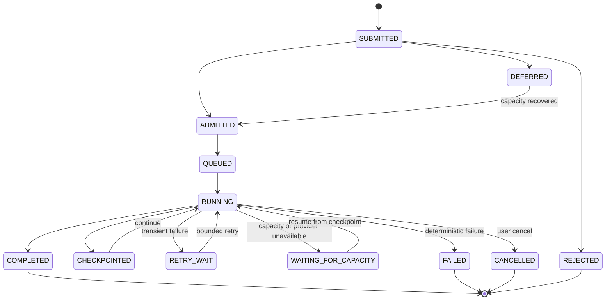

# Runtime-aware Async Sub-Agent Scheduler Architecture

> 상태: Prototype 검증 기반 목표 설계
> 기준일: 2026-08-27
> 범위: Runtime 예측, 사용자 간 공정성, SLO 기반 스케줄링, 과부하 제어, 재개와 제한적 Retry

## 1. 목적

이 문서는 Deep Agent Runtime에서 다수 사용자의 비동기 Sub-Agent Task를 안전하게 수락하고,
예상 실행시간과 우선순위에 따라 배정하며, 과부하 상태에서도 사용자 제어 요청과 이미 수락한
작업을 보호하는 목표 구조를 정의한다.

핵심 결정은 다음과 같다.

1. 스케줄링은 처리 용량을 증가시키지 않으므로 과부하는 Admission Control에서 먼저 제어한다.
2. 수락한 Task는 durable state와 checkpoint를 이용해 나중에 이어서 실행한다.
3. Retry는 과부하 해소 수단이 아니라 일시적 실행 실패의 제한적 복구 수단으로만 사용한다.
4. 사용자 간에는 공정성을 적용하고, 사용자 내부에서는 예상 실행시간을 활용한다.
5. 평균 성능보다 starvation, tail latency, 사용자 공정성과 priority SLO를 먼저 만족시킨다.
6. 사용자의 상태 질문, 추가 지시와 취소는 실행 Queue와 분리된 제어 경로로 처리한다.

## 2. 전체 아키텍처

```mermaid
flowchart LR
    subgraph USER["사용자 제어 영역"]
        U["사용자"]
        CONSOLE["실시간 Task Console"]
    end

    subgraph API["Task API 계층"]
        TASKAPI["Task API"]
        CONTROLAPI["Status · 추가 지시 · 취소 API"]
    end

    subgraph CONTROL["Supervisor 및 Harness"]
        SUPERVISOR["Supervisor Agent"]
        HARNESS["Harness Action Gateway"]
        REGISTRY["Task Registry"]
    end

    subgraph ADMISSION["과부하 제어 계층"]
        DETECTOR["Overload Detector"]
        CONTROLLER["Admission Controller"]
        DECISION{"Admission 결정"}
        REJECT["Reject 또는 품질 축소"]
    end

    subgraph PREDICTION["Runtime Prediction 계층"]
        FEATURE["사전 실행 Feature 추출"]
        PREDICTOR["Runtime Predictor"]
        MODEL["XGBoost Model"]
        MARGIN["Prediction Safety Margin"]
    end

    subgraph QUEUE["Durable Queue 계층"]
        READY["Ready Queue"]
        DEFERRED["Deferred Capacity Queue"]
        RESCUE["Deadline Rescue Queue"]
        RETRY["Bounded Retry Queue"]
    end

    subgraph SCHEDULER["Scheduler 계층"]
        FAIR["Workspace Fair Queue"]
        PRIORITY["Priority Class"]
        RUNTIME["Predicted-SJF"]
        AGING["Bounded Aging"]
        DISPATCHER["Dispatcher"]
    end

    subgraph EXECUTION["비동기 실행 계층"]
        WORKERS["Worker Pool"]
        SUBAGENTS["Async Sub-Agents"]
        CHECKPOINT["Checkpoint Manager"]
        FAILCLASS["Failure Classifier"]
    end

    subgraph DATA["상태 · 학습 · 캐시"]
        TASKSTORE[("Task State Store")]
        CHECKPOINTSTORE[("Checkpoint Store")]
        HISTORY[("Execution History")]
        CACHE[("Versioned Cache")]
        MODELSTORE[("Model Artifact")]
    end

    subgraph EXTERNAL["외부 실행 대상"]
        CIRCUIT["Provider Circuit Breaker"]
        LLM["Primary LLM Provider"]
        SECONDARY["Secondary Provider"]
        TOOLS["Tools · Sandbox"]
    end

    U --> CONSOLE
    CONSOLE <--> TASKAPI
    CONSOLE <--> CONTROLAPI
    TASKAPI --> SUPERVISOR
    CONTROLAPI --> SUPERVISOR
    SUPERVISOR --> HARNESS
    HARNESS --> REGISTRY
    REGISTRY --> TASKSTORE
    HARNESS --> DETECTOR
    DETECTOR -->|"부하율 · Queue Age · Drain Time"| CONTROLLER
    CONTROLLER --> DECISION
    DECISION -->|"수락"| FEATURE
    DECISION -->|"지연 수락"| DEFERRED
    DECISION -->|"한계 초과"| REJECT
    REJECT --> SUPERVISOR
    FEATURE --> PREDICTOR
    MODELSTORE --> MODEL
    MODEL --> PREDICTOR
    PREDICTOR --> MARGIN
    MARGIN -->|"예상 실행시간"| READY
    DEFERRED -->|"용량 회복"| FEATURE
    READY --> FAIR
    FAIR --> PRIORITY
    PRIORITY --> RUNTIME
    RUNTIME --> AGING
    AGING --> DISPATCHER
    RESCUE --> DISPATCHER
    RETRY -->|"Backoff 만료"| DISPATCHER
    DISPATCHER --> WORKERS
    WORKERS --> SUBAGENTS
    SUBAGENTS --> FAILCLASS
    FAILCLASS --> CIRCUIT
    CIRCUIT --> LLM
    CIRCUIT -->|"20s failover target"| SECONDARY
    SUBAGENTS --> TOOLS
    SUBAGENTS <--> CACHE
    SUBAGENTS -->|"진행 상태"| CHECKPOINT
    CHECKPOINT --> CHECKPOINTSTORE
    CHECKPOINT --> TASKSTORE
    SUBAGENTS -->|"실제 Runtime"| HISTORY
    HISTORY -->|"Batch Retraining"| MODELSTORE
    SUBAGENTS -->|"일시적 실패만"| RETRY
    AGING -->|"최대 대기 접근"| RESCUE
    SUBAGENTS -->|"상태 · 결과"| REGISTRY
    REGISTRY --> SUPERVISOR
    SUPERVISOR --> CONTROLAPI
```



## 3. 정상 Task 처리 흐름

```text
Task 제출
  → Harness 정책 검사
  → 과부하 상태 확인
  → 사전 실행 Feature 추출
  → Runtime 예측과 안전 여유 적용
  → Durable Ready Queue 저장
  → Workspace 공정 선택
  → Priority와 예상 Runtime 기반 정렬
  → Aging 및 Deadline Rescue 적용
  → Worker 배정
  → 실행 상태와 Checkpoint 저장
  → 실제 Runtime 기록
  → Batch Retraining 데이터로 사용
```

Runtime Predictor에는 실행 전에 알 수 있는 다음 Feature만 사용한다.

```text
task_type
model
input_tokens
context_tokens
file_count
subagent_depth
```

`actual_tool_calls`, `output_tokens`, `retry_count`, `actual_runtime`과 `completed_at`은 분석용
metadata로 저장할 수 있지만 현재 Task의 예측 Feature로 사용하지 않는다.

## 4. 과부하 탐지

Queue 길이만으로는 작업량을 판단할 수 없다. Runtime Predictor의 예상 실행시간을 이용해 남은
service demand와 예상 소진시간을 계산한다.

```text
predicted_backlog_work = Σ pending_task.predicted_runtime_seconds

estimated_drain_time
= predicted_backlog_work / effective_worker_count

offered_load_ratio
= recent_predicted_incoming_work / recent_worker_capacity
```

탐지기는 다음 신호를 함께 사용한다.

- `offered_load_ratio`
- `predicted_backlog_seconds`
- `estimated_drain_time`
- `queue_growth_rate`
- `oldest_task_age`
- `p95_queue_wait`
- `worker_utilization`
- Provider의 `429`, timeout과 `5xx` 비율
- Retry 비율과 Runtime 과소예측 비율

Runtime 예측값은 완전하지 않으므로 단일 예측값보다 calibration 결과 또는 상위 분위수 기반의
safety margin을 적용한다. 과소예측이 증가하면 Admission Controller가 사용할 예상 작업량도
보수적으로 올린다.

## 5. 과부하 상태와 Admission 정책

아래 값은 초기 실험을 위한 기본 구간이며 실제 execution history로 보정해야 한다.

| 상태 | 예시 조건 | Admission 동작 |
|---|---|---|
| `NORMAL` | `ρ < 0.75` | 정상 수락 |
| `BUSY` | `0.75 ≤ ρ < 0.90` | 낮은 우선순위와 batch 유입 제한 |
| `SATURATED` | `0.90 ≤ ρ < 1.00` | 지연 승인, 캐시 우선, 품질 축소 검토 |
| `OVERLOADED` | `ρ ≥ 1.00` | 신규 batch 제한, interactive 용량 보존 |
| `EMERGENCY` | Queue 지속 증가 또는 SLO 붕괴 | Load shedding과 Provider circuit open |

상태 진동을 피하기 위해 hysteresis를 사용한다.

```text
OVERLOADED 진입: ρ ≥ 1.00 상태가 30초 이상 지속
OVERLOADED 해제: ρ < 0.80 상태가 60초 이상 지속
```

Admission 결과는 다음 네 가지 중 하나다.

| 결과 | 의미 |
|---|---|
| `ADMIT` | 정상적으로 Ready Queue에 저장 |
| `DEFER` | 수락하지만 용량 회복 전까지 실행하지 않음 |
| `DEGRADE` | 더 작은 모델, 축소된 탐색 범위 또는 캐시 결과 사용 |
| `REJECT` | 제품이 보장할 수 있는 대기 한계를 넘어 명시적으로 거절 |

## 6. Scheduler 정책

운영 후보는 다음 여섯 가지를 동일 Task stream에서 비교한다.

| 정책 | 사용자 간 공정성 | Runtime 예측 | Aging |
|---|---:|---:|---:|
| Global FIFO | 없음 | 없음 | 없음 |
| Global Predicted-SJF | 없음 | 사용 | 없음 |
| Global Predicted-SJF + Aging | 없음 | 사용 | 사용 |
| Fair FIFO | 사용 | 없음 | 없음 |
| Fair Predicted-SJF | 사용 | 사용 | 없음 |
| Fair Predicted-SJF + Aging | 사용 | 사용 | 사용 |

Oracle-SJF는 실제 Runtime을 미리 아는 이론적 비교군이며 운영 후보가 아니다.

목표 운영 구조는 다음과 같다.

```text
Workspace Fair Queue
  → Interactive 및 사용자 제어 Priority
  → Predicted-SJF
  → Bounded Aging
  → Deadline Rescue Queue
  → Worker Pool
```

Workspace 선택은 누적 virtual service를 기준으로 특정 사용자가 Worker를 독점하지 않게 한다.
Workspace 내부에서는 Priority를 반영한 예상 실행시간 점수가 낮은 Task를 먼저 선택한다. 최대
대기시간에 접근한 Task는 연속 Aging 점수에만 의존하지 않고 별도 Rescue Queue에서 일정 비율의
dispatch 기회를 보장받는다.

## 7. 정책 선택 기준

정책은 하나의 가중 점수로 선택하지 않는다. 다음 hard SLO를 모두 통과한 운영 후보만 남긴다.

```yaml
p95_wait_seconds: 120
maximum_wait_seconds: 300
minimum_workspace_fairness: 0.90
wait_over_120_seconds_rate: 0.01
priority_4_5_wait_over_60_seconds_rate: 0.01
```

모든 반복 seed에서 hard gate를 통과한 후보 중 평균 completion time이 가장 짧은 정책을 선택한다.
통과 정책이 없으면 임의의 승자를 고르지 않고 `NO_ELIGIBLE_POLICY`로 판정한다. 이 경우 Worker
증설, Admission 강화, 캐시 확대 또는 SLO 재협의를 먼저 수행한다.

2026-08-26 synthetic workload 실험 결과는 다음과 같다.

- 부하율 `ρ=0.94`: 모든 운영 정책 탈락
- 저부하 `ρ=0.60`: Global Predicted-SJF + Aging 선택
- 높은 캐시 적중률로 `ρ=0.53`: 모든 정책 통과 후 평균 completion으로 선택
- 예측 노이즈가 있는 `ρ=0.95`: 모든 정책 탈락
- 과부하 `ρ=1.99`: 모든 정책 탈락


## 8. 사용자 실시간 제어

사용자는 실행 중인 각 Sub-Agent에 대해 다음 동작을 수행할 수 있어야 한다.

- 현재 phase, 진행률, 최근 checkpoint와 예상 완료시간 조회
- 추가 지시 전달
- 아직 실행하지 않은 단계의 우선순위 또는 범위 변경
- soft cancel 또는 hard cancel 요청
- 실패 원인과 재개 가능 여부 조회

이 요청은 일반 작업 Queue에 넣지 않는다. 실행 Queue가 포화되어도 상태 조회와 취소가 처리되도록
Control API와 최소 Worker 용량을 별도로 보존한다. 추가 지시는 immutable command와 revision으로
기록하며 이미 실행된 외부 side effect를 암묵적으로 되돌리지 않는다.

## 9. Deferred와 Retry 구분

용량 부족은 실패가 아니다.

```text
용량 부족
  → WAITING_FOR_CAPACITY
  → Deferred Capacity Queue
  → 용량 회복
  → 동일 Task를 다시 dispatch
```

Retry는 다음과 같은 일시적 실패에만 허용한다.

- 네트워크 단절
- Provider `429`
- 일시적인 Provider `5xx`
- Worker process crash
- 일시적인 Sandbox unavailable

다음 실패는 Retry하지 않는다.

- 입력 validation 실패
- 권한 또는 정책 거부
- 예산 초과
- 존재하지 않는 파일
- 결정적 Tool 또는 코드 오류
- 반복되는 동일 validation failure

허용된 Retry에는 exponential backoff, random jitter, 최대 횟수, 전체 retry budget과 circuit breaker를
적용한다. Retry Task는 새 Task를 복제하지 않고 동일 `task_id`에서 새로운 `attempt_id`를 기록한다.

## 10. Checkpoint와 재개

장시간 Deep Agent 작업은 처음부터 다시 시작하지 않는다.



재개에 필요한 최소 식별자는 다음과 같다.

```text
task_id
attempt_id
revision
checkpoint_id
resume_token
completed_steps
side_effect_idempotency_keys
```

모든 외부 write는 idempotency key로 보호하고, 취소되거나 이전 revision에서 늦게 도착한 결과가
현재 Task 상태에 병합되지 않게 한다.

## 11. 캐시 전략

캐시 적중 Task는 가능하면 Worker Pool을 점유하지 않고 즉시 결과를 반환한다. 캐시 key에는
workspace, 권한, 입력 content hash, prompt, model, Tool, skill과 policy version을 포함한다.

안전한 캐시 우선순위는 다음과 같다.

1. Provider prompt prefix cache
2. 문서 parse, chunk와 embedding cache
3. 결정적 read Tool cache
4. 동일 workspace의 검증된 Sub-Agent artifact exact reuse
5. Runtime Predictor model artifact cache

권한 변경과 mutation은 관련 cache를 무효화한다. 고객 생성 결과의 cross-workspace semantic cache는
사용하지 않는다.

## 12. 관측 지표

```text
admission_state
offered_load_ratio
predicted_backlog_seconds
estimated_drain_time
queue_growth_rate
oldest_task_age
workspace_service_share
workspace_p95_wait
priority_slo_violation_rate
starvation_count
prediction_mae_seconds
prediction_underestimate_rate
retry_rate
retry_budget_remaining
checkpoint_resume_success_rate
cache_hit_ratio
worker_utilization
provider_429_rate
```

Scheduler 지표와 Runtime Predictor 지표는 model version, policy version과 workload snapshot을 함께
기록해야 재현 가능한 비교가 가능하다.

## 13. 현재 구현 범위와 한계

현재 `experiments/runtime_scheduler`에는 다음 검증 코드가 있다.

- XGBoost 기반 Runtime Predictor
- Global/Fair FIFO와 Predicted-SJF 비교
- Bounded Aging과 Oracle 비교
- 다중 seed와 부하·노이즈·캐시 stress simulation
- hard SLO 기반 정책 탈락 및 선택
- predicted backlog 기반 Accept, Defer, Priority shed와 Hybrid Admission 비교
- 동적 Worker capacity와 Reactive/Predictive autoscaling 비교
- versioned JSONL TaskAttempt contract와 strict shadow replay validator
- adversarial tenant workload와 SLO-aware priority rescue 비교
- adaptive hierarchical Admission과 causal capacity feasibility scale trigger
- Matplotlib 결과 Plot
- Streamlit 실험 대시보드

현재 구현은 event-driven synthetic simulator이며 운영 Queue, 실제 Worker Pool, durable Task Registry,
운영 Admission Controller와 Checkpoint Runtime은 구현하지 않았다. Admission은 fluid approximation
기반 simulator로만 검증했다. Fair Queue도 정식 WFQ가 아니라 누적 virtual service 기반의 간략화된
프로토타입이다. 실제 도입 전에는 실제 execution history의 시간순 replay와 shadow scheduling
검증이 필요하다.

2026-08-27 Admission 실험에서는 지속 과부하 `ρ=1.96`에서 Priority shed가 P95 299.0초,
SLO goodput 69.3%와 high-priority 수락률 100%로 가장 좋은 보호 성능을 냈다. Bounded defer는
SLO goodput을 36.0%까지 낮춰 지속 과부하의 기본 전략으로 부적절했다. 다만 어떤 정책도 목표
goodput 95%를 달성하지 못했으므로 autoscaling 또는 service demand 감소가 추가로 필요하다.

2026-08-27 Autoscaling 실험에서는 부하율 1.96에서 Worker를 6개에서 12개로 늘리는 60초 Reactive
scale이 거절 없이 P95 261.2초, SLO goodput 97.7%를 달성했다. Scale-up hard deadline은 120초이며,
그 시점까지 확장이 실패하거나 backlog가 계속 증가할 때만 Priority shed를 활성화한다. 즉시
Shed then scale은 불필요한 거절 때문에 goodput 94.4%로 hard gate에 실패했다.

Scale 실패를 포함한 후속 실험에서는 부하율 1.88과 scale 성공률 80%에서 `Scale then fallback
shed`도 goodput 92.1%에 그쳤다. Fallback은 P95를 Scale only의 343.4초에서 256.0초로 줄였지만
거절을 사용자 실패로 계산하면 capacity 부족을 대체하지 못한다. 현재 workload에서 95% goodput을
위해서는 scale 성공률 약 89% 이상이 필요하므로 운영 gate는 90%로 둔다. 실패 시 Priority shed와
함께 warm reserve, secondary provider 또는 service demand 감소 경로가 필요하다.

Scale-down은 미래 도착을 사용하지 않는 arrival debounce로 구현한다. 90% scale 성공률에서 cooldown
60초는 goodput 95.5%를 유지하면서 120초보다 worker 비용이 약 4.1% 낮았다. 따라서 초기 후보는
scale-up target 60초, hard deadline 120초, scale-down cooldown 60초다.

Retry·Checkpoint 실험에서는 부하율 0.81과 독립 attempt failure 20%에서 30초 checkpoint 후 즉시
resume이 Restart immediate 대비 SLO goodput을 94.8%에서 96.0%로 높이고 wasted useful work를
33.5% 줄였다. Backoff는 독립 실패의 latency를 악화시켰지만 60초 provider outage에서는 10초 retry
burst를 약 35% 줄였다. 따라서 실패 classifier와 provider circuit breaker가 정책을 전환해야 한다.

```text
Independent transient failure
  → checkpoint resume immediately

Correlated provider outage / 429·5xx burst
  → circuit breaker
  → Retry-After + exponential backoff + jitter

Predicted retry demand > capacity
  → priority-aware retry budget
  → explicit RETRY_BUDGET_EXHAUSTED outcome
```

현재 PostgreSQL checkpoint는 run lifecycle과 graph execution state를 보존하지만 Sub-Agent의 durable
service progress, checkpoint artifact와 side-effect idempotency boundary를 별도 TaskAttempt contract로
노출하지 않는다. 운영 구현 전 이 contract가 필요하다.

계층형 Scheduler와 retry를 결합한 후속 실험에서는 고정 retry 정책이 failure mode 양쪽을 보호하지
못했다. `Checkpoint immediate`는 독립 실패 gate 96.7%를 통과했지만 provider outage에서는 59.3%에
그쳤다. `Failure-aware checkpoint + provider failover`만 독립 실패와 outage 양쪽에서 96.7%를
기록했다. 전체 completion 99.4%, priority SLO 99.7%, worst-workspace 96.6%, 예상 비용 $0.144/run이다.

운영 후보는 독립 실패에 즉시 checkpoint resume, correlated outage에 circuit breaker·backoff·20%
global retry budget·20초 secondary provider failover를 적용한다. Priority task는 30초부터 dispatch
rescue하며 일반 data worker를 항상 비워 두지 않는다. Failover 30초, 독립 attempt failure 40%와
retry budget 5%는 각각 hard gate 붕괴 경계였다. Failure classifier와 secondary provider 품질·가격을
실제 로그로 검증하기 전까지 prototype이다.

Failure classifier 오분류와 secondary provider penalty를 결합한 실험에서는 FP 5%, FN 10%에서
completion 99.20%, quality-adjusted goodput 99.06%, worst-workspace 96.11%와 overall gate 93.5%를
기록했다. Failure-mode별 안전 경계는 FN 15% 이하와 FP 10% 이하이며, secondary provider는 primary
대비 latency 1.15배 이하와 quality failure 5% 이하가 필요했다. 예시 provider cost budget 1.20에서는
secondary 단가 약 2배까지 허용됐다.

Classifier confidence가 낮으면 무제한 failover하지 않는다. Correlated-safe circuit probe와 bounded
retry를 먼저 적용하고 multi-signal outage가 확인될 때 secondary로 전환한다. Secondary provider가
latency·quality·cost 계약을 위반하면 신규 low-priority admission을 줄이고 accepted high-priority
work를 보호한다. 실제 incident label과 token billing 없이는 운영 승격하지 않는다.

후속 multi-signal 분류 실험에서는 provider error, cross-workspace 확산, 영향 Worker 비율, provider
status와 local/tool 반증 신호를 결합한 weighted rule만 모든 temporal holdout seed의 gate를 통과했다.
Threshold 4에서 action FPR 5.6%, 10초 detection FNR 6.4%, P95 탐지 18.3초와 precision 93.7%였다.
단일 threshold는 FPR이 40.6~78.3%였고 temporal LogisticRegression은 drift 이후 FNR 46.7%로
붕괴했다.

운영에서는 첫 correlated 판정을 circuit에 latch하고 recovery probe와 hysteresis로 종료한다. 최종
incident label은 예측 시점 feature와 분리해 사후에만 확정하며, 실제 TaskAttempt shadow log로 검증하기
전까지 threshold 4는 prototype 후보이다.

Workspace retry token bucket 후속 실험에서는 global-only lifetime budget이 먼저 실패한 workspace에
예산을 선점당해 expected gate pass 43.3%에 그쳤다. `global + workspace token bucket`은 noisy attempt
failure 35%에서 submitted completion 95.6%, healthy-workspace goodput 99.9%, noisy-workspace goodput
88.7%, demand amplification 1.122와 gate pass 96.7%를 기록했다.

초기 shadow 후보는 workspace capacity 12·refill 0.10 token/s와 global capacity 16·refill 0.10
token/s다. Priority borrow는 측정 가능한 이득이 없어 기본값에서 제외한다. 여러 healthy workspace의
attempt failure가 15%에 도달하면 gate가 붕괴하므로 token을 늘리지 않고 correlated failure circuit으로
전환한다.

TaskAttempt telemetry contract 후속 실험에서는 20 seed × 60 task에 duplicate, missing prediction,
sequence gap, time regression, feature·final-label leakage, secret field, runtime·retry token mismatch와 retry
decision 누락을 주입했다. 11개 invalid 조건을 모두 100% 차단했고 clean stream과 receive reordering은
100% 수락해 runtime·prediction을 오차 0초로 재구성했다.

`received_at` 순서가 아니라 `(attempt_id, sequence)`와 `occurred_at`을 권위로 사용한다. 임시 지연 경계는
30초 초과 warning과 300초 초과 replay reject다. 실제 TaskAttempt event emitter와 DB 저장이 아직 없으므로
contract 검증일 뿐 production telemetry 검증은 아니다.

Multi-tenant adversarial 실험에서는 Global Predicted-SJF + Aging이 mean completion 48.4초와 Jain
fairness 0.931로 항상-on Fair Queue보다 좋았다. Bounded Fair 후보도 idle credit은 제한했지만
worst-workspace P95와 fairness를 개선하지 못해 operational selection에서 제외했다. Tenant isolation은
Ready Queue 순환이 아니라 Admission token, workspace concurrency와 service-share budget에서 강제한다.

SLO-aware strict priority는 priority violation을 13.2%에서 2.1%로 낮췄지만 mean completion과 fairness를
희생했다. 순간 batch의 최소 drain time이 SLO를 초과하면 정렬 정책으로 해결하지 않고 capacity
feasibility detector가 autoscale, defer 또는 reject를 선택해야 한다.

후속 adaptive hierarchical 실험에서는 `global predicted drain → workspace soft quota → priority
best-case feasibility → conditional scale → SLO-aware PSJF`를 결합했다. Scale factor 2.0과 delay
30초 후보는 noisy/sleep workload에서 scale하지 않고 elephant burst에서만 scale해, 15개 paired
run의 submitted completion, priority wait와 worst-workspace goodput을 모두 100%로 만들었다.
Accept-all 대비 평균 capacity 증가는 약 2.3%였다.

Workspace quota는 global capacity가 정상일 때 강제하지 않는다. Global predicted drain이 120초를
넘거나 priority backlog를 모든 Worker로 처리해도 60초를 넘을 때만 scale하고 quota borrowing을
허용한다. Scale 실패 확률과 billing 검증 전까지 이 정책은 prototype 후보이다.

후속 counterfactual 신뢰성 실험에서는 scale 성공률 90%, 최소 과금 600초와 scale-down cooldown
60초를 적용했다. Scale 전략은 96.7%의 expected hard-gate pass를 기록했고, 실패 시 workspace quota로
전환하는 정책이 completion 99.6%, priority SLO 99.8%, worst-workspace 97.9%, run당 $0.137과 SLO
tasks/$ 1,487.4로 gate를 통과한 후보 중 가장 효율적이었다. 합성 workload의 최소 scale 성공률 경계는
약 70%지만 운영 control-plane SLO는 90%로 유지한다.

현재 기본 흐름은 `2× scale 요청 → 30초 target → 60초 hard deadline → 실패 시 workspace quota
fallback`이다. 50% 체계적 runtime 과소예측에서도 합성 gate는 유지됐지만 실제 강건성 증거로
간주하지 않는다. 실제 TaskAttempt shadow replay와 task type별 drift calibration 전까지 prototype이다.

## 14. 구현 순서

1. `Task`, `TaskAttempt`, `TaskCommand`, `TaskEvent` 상태 계약 확정
2. durable Task Registry와 idempotent 상태 전이 구현
3. predicted backlog 기반 Overload Detector 구현
4. Admission 결과 `ADMIT`, `DEFER`, `DEGRADE`, `REJECT` 구현
5. Interactive control 전용 경로와 예약 용량 구현
6. Ready, Deferred, Rescue와 Retry Queue 분리
7. Checkpoint resume와 side-effect idempotency 구현
8. 실제 로그를 이용한 shadow scheduling과 SLO calibration
9. 검증 후에만 운영 Dispatcher에 Runtime Predictor 연결

## 15. 관련 자료

- [Deep Agents 목표 구조](deep-agents-target-architecture.md)
- [Deep Agents Department Runtime ADR](../adr/0013-deep-agents-department-runtime.md)
- [Policy-controlled AI Gateway ADR](../adr/0026-policy-controlled-ai-gateway.md)
- [Runtime Predictor Prototype](../../experiments/runtime_scheduler/README.md)
- [Overload Admission 실험](../testing/scheduler-overload-admission-experiment-2026-08-27.md)
- [Autoscaling 전략 실험](../testing/scheduler-autoscaling-experiment-2026-08-27.md)
- [Scale 실패·Fallback·비용 실험](../testing/scheduler-scaling-reliability-cost-experiment-2026-08-27.md)
- [Retry·Checkpoint Resume 실험](../testing/scheduler-retry-checkpoint-experiment-2026-08-27.md)
- [Shadow Replay 준비도 및 데이터 계약](../testing/scheduler-shadow-replay-readiness-2026-08-27.md)
- [Multi-tenant 공정성·Priority SLO 실험](../testing/scheduler-tenant-fairness-experiment-2026-08-27.md)
- [Adaptive Hierarchical Scheduler 실험](../testing/scheduler-adaptive-hierarchical-experiment-2026-08-27.md)
- [Hierarchical Scheduler 신뢰성 경계 실험](../testing/scheduler-hierarchical-reliability-experiment-2026-08-27.md)
- [Hierarchical Retry·Checkpoint·Failover 결합 실험](../testing/scheduler-hierarchical-retry-failover-experiment-2026-08-27.md)
- [Failure Classifier·Secondary Provider 운영 경계](../testing/scheduler-failure-classifier-provider-envelope-2026-08-27.md)
- [Multi-signal Failure Classifier 실험](../testing/scheduler-multi-signal-failure-classifier-experiment-2026-08-27.md)
- [Workspace Retry Token Bucket 실험](../testing/scheduler-workspace-retry-token-bucket-experiment-2026-08-27.md)
- [TaskAttempt Telemetry Shadow Contract 실험](../testing/scheduler-task-attempt-telemetry-shadow-contract-experiment-2026-08-27.md)
- [Async Runtime 최종 감사](../reviews/2026-09-01-async-runtime-final-audit.md)
