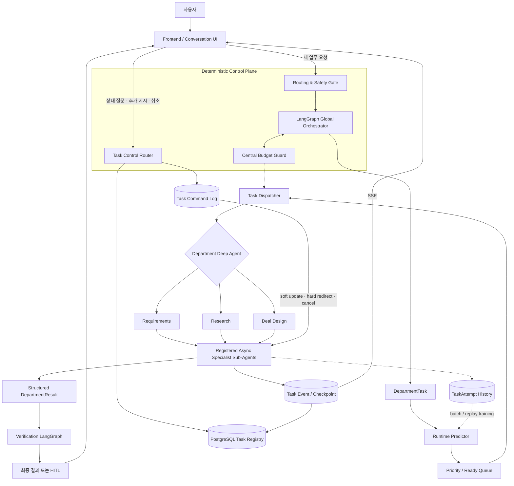

# Deep Agents 비동기 Runtime·캐싱 설계 인수인계

> 작성일: 2026-08-25  
> 상태: 설계 협의 중 — 구현 승인 전  
> 대상: 다음 Codex 작업 또는 구현 담당자  
> 기준 저장소: `Freelance-Ops-Agent`

## 1. 이 문서의 사용 방법

이 문서는 삭제된 상태 파일을 대신하여 현재 대화에서 합의된 방향, 이미 존재하는 구현,
실험 결과와 다음 의사결정 항목을 전달한다.

- 이 문서의 **확정 방향**은 후속 설계의 기본 전제로 유지한다.
- **제안 또는 미결정** 항목은 사용자의 별도 구현 지시 없이 코드로 옮기지 않는다.
- 문서와 실제 저장소가 다르면 현재 코드, Accepted ADR과 테스트를 다시 확인하고 차이를 먼저 보고한다.
- 다른 작업의 변경사항과 untracked 파일을 임의로 삭제하거나 덮어쓰지 않는다.

## 2. 목표 요약

프로젝트의 Agent runtime을 다음 원칙으로 발전시킨다.

```text
모델은 자유롭게 계획하고 행동을 제안한다.
실제 행동의 허용 여부와 실행은 결정적인 Harness가 통제한다.
```

목표 구조는 다음 조합이다.

```text
Deterministic LangGraph control plane
+ Department Deep Agents
+ queued and stateful async specialist subagents
+ policy-controlled Harness
+ safe cache hierarchy
+ independent Runtime Predictor
```

Deep Agents가 전체 시스템의 권위 있는 orchestrator가 되지 않는다. LangGraph Global
Orchestrator가 정책, 권한, 예산, 의존성, HITL과 부서 간 상태 전이를 소유한다. Deep Agents는
Requirements, Research와 Deal Design 부서 내부의 계획, context 관리와 전문 Sub-Agent 실행에
사용한다.

## 3. 현재 저장소 상태

### 3.1 이미 존재하는 주요 구조

- `agent/src/graph/supervisor.py`
  - 정적인 LangGraph 부서 순차 실행 scaffold
- `agent/src/runtime/executor.py`
  - 운영 route, budget과 부서 실행을 담당하는 현재 주 실행 경로
- `agent/src/runtime/react_loop.py`
  - provider-neutral bounded ReAct loop와 구조화된 Tool 계약
- `agent/src/infrastructure/checkpoint.py`
  - PostgreSQL 기반 LangGraph checkpoint와 durable execution wrapper
- `agent/src/departments/research_deep_agent.py`
  - run-scoped filesystem 권한과 structured output을 적용한 Research Deep Agents spike
  - 현재 general-purpose subagent와 명시적 subagent가 모두 비활성화되어 있음
- `agent/langgraph.json`
  - route, router diagnostic과 supervisor graph 등록
- `docs/adr/0013-deep-agents-department-runtime.md`
  - Deep Agents를 부서 내부 하네스로 제한하는 Accepted ADR
- `docs/architecture/deep-agents-target-architecture.md`
  - 현재 승인된 목표 구조 설명

### 3.2 의존성

`agent/pyproject.toml`에는 다음 계열이 포함되어 있다.

```text
Python 3.12
LangChain
LangGraph
Deep Agents
LangSmith
PostgreSQL checkpoint
FastAPI
```

`deepagents`는 pre-1.0 계열이므로 실제 upgrade 시 lock file diff, contract test, frozen
evaluation과 보안 회귀 검사가 필요하다. Async Sub-Agent 기능은 공식 문서상 preview이므로
프로젝트 contract가 라이브러리 세부 API에 직접 결합되지 않도록 adapter를 둔다.

### 3.3 현재 working tree 주의 사항

이 문서 작성 시점에 다음 untracked 항목이 확인됐다. 사용자 또는 다른 작업의 파일일 수 있으므로
후속 작업에서 임의 삭제하거나 수정하지 않는다.

```text
.vscode/
agent/tests/runtime_predictor_prototype/streamlit_xgb_sgd_online_demo.py
agent/tests/runtime_predictor_prototype/xgboost_runtime_test.py
model.json
model_updated.json
```

## 4. 확정된 아키텍처 방향



### 4.1 책임 경계

| 계층 | 책임 |
|---|---|
| Spring Boot | 인증, workspace RBAC, business transaction, Tool API, audit, 비용 원장 |
| Routing Gate | 정책 gate 이후 실행 route 결정과 abstain |
| Global Orchestrator | 부서 선택, dependency, 중앙 budget, HITL, 결과 조정 |
| Task Dispatcher | queue, priority, 예상 runtime, admission, 취소 전파 |
| Department Deep Agent | 부서 내부 계획, context 격리, 허용된 specialist 위임 |
| Async Specialist | 독립 thread에서 장시간 전문 작업 수행 |
| Verification | evidence, 계산, 권한과 schema를 독립 검증 |
| Runtime Predictor | 실행 전에 leaf task의 service runtime 예측 |

## 5. 모델과 Harness의 관계

시스템 프롬프트는 품질 안내 계층으로만 사용한다. 권한과 행동 통제를 시스템 프롬프트 준수에
의존하지 않는다.

```text
Model
→ 계획과 ActionProposal 생성
→ Harness가 schema, permission, budget, dependency와 idempotency 검사
→ 허용된 Capability Executor만 실행
→ Tool 결과를 sanitize하고 검증
→ 모델에 Observation으로 반환
```

### 5.1 모델이 담당하는 것

- 목표 해석
- 작업 분해와 계획
- 등록된 Tool 또는 Sub-Agent 사용 제안
- 불확실성 표현
- 결과 종합

### 5.2 Harness가 강제하는 것

- default deny
- model, Tool과 Sub-Agent allowlist
- immutable `TrustedRunContext`
- workspace와 effective permission
- model, token, Tool, 검색, 시간과 retry budget
- dependency와 최대 hierarchy
- timeout, cancel과 late-result 거부
- Tool input/output schema
- write 작업의 idempotency
- filesystem namespace와 sandbox
- output contract, provenance와 독립 Verification

모델이 생성한 `workspace_id`, permission, delegation token, budget revision 또는 내부 endpoint는
신뢰하지 않는다. 해당 값은 Harness가 검증된 context에서 주입한다.

## 6. 비동기 Sub-Agent 사용자 제어 요구사항

사용자는 실행 중인 각 비동기 Sub-Agent에 대해 다음 행동을 수행할 수 있어야 한다.

```text
list tasks
ask task status
get task result
add instruction
redirect task
cancel task
```

사용자는 UUID 대신 `Research #1`, `Risk Review #2`처럼 UI alias를 사용한다. 자연어가 여러
Task를 가리킬 때만 명확화 질문을 한다.

### 6.1 권위 있는 상태

상태 질문에 Agent가 추측으로 답하지 않는다. PostgreSQL Task Registry와 실제 event를 읽는다.

```text
QUEUED
DISPATCHED
RUNNING
WAITING_FOR_TOOL
WAITING_FOR_USER
UPDATE_PENDING
CANCELLING
CANCELLED
COMPLETED
FAILED
TIMED_OUT
```

근거 없는 퍼센트 진행률은 표시하지 않는다. `phase`, 완료된 milestone, 현재 activity와
`last_heartbeat_at`을 표시한다. 내부 chain-of-thought는 상태, event, checkpoint 또는 사용자
응답에 저장하지 않는다.

### 6.2 추가 지시

- Soft update
  - 기존 목표 안에서 범위를 추가한다.
  - 안전한 checkpoint에서 반영한다.
- Hard redirect
  - 목표 또는 산출물 contract가 변경된다.
  - 현재 attempt를 중단하고 같은 `task_id`의 새 revision과 attempt를 생성한다.
- Permission 또는 budget 확장
  - 조용히 허용하지 않는다.
  - 새로운 승인 또는 HITL이 필요하다.

## 7. 비용 절감을 위한 캐싱 확정 방향

목표는 **안전하게 검증 가능한 캐시를 최대화하는 것**이다. 모든 결과를 캐시하는 것이 아니다.

현재 Accepted ADR과의 정합성을 유지한다.

- ADR-0026에 따라 고객 데이터가 섞일 수 있는 semantic response cache는 도입하지 않는다.
- ADR-0023에 따라 V2에 Redis를 선제적으로 추가하지 않는다.
- PostgreSQL은 업무 상태, Task Registry, checkpoint와 audit의 source of truth로 유지한다.
- process-local bounded cache, provider prompt cache, content-addressed artifact와 PostgreSQL
  versioned result reuse를 우선한다.

### 7.1 캐시 계층

| 우선순위 | 계층 | 캐시 대상 | 주요 무효화 기준 |
|---:|---|---|---|
| P0 | Provider prompt cache | 공통 system prefix, Tool schema, stable skill와 domain pack | provider, model, prompt, Tool 또는 skill version 변경 |
| P0 | Document processing | parse, chunk, OCR, checksum, metadata normalization | 원본 content hash 또는 parser version 변경 |
| P0 | Embedding | 동일 chunk의 embedding | content hash, embedding model 또는 dimension 변경 |
| P0 | Official corpus | 법률·정책·공식 자료 snapshot과 crawl artifact | source revision, 기준일, jurisdiction 변경 |
| P0 | Deterministic read Tool | 변경되지 않은 versioned resource 조회 | resource version, permission revision, mutation |
| P1 | Retrieval result | 동일 workspace와 corpus revision의 exact query | corpus, permission, filter 또는 ranking version 변경 |
| P1 | Sub-Agent artifact | 동일 입력과 version contract로 완료된 read-only task 결과 | objective, evidence, model profile, prompt, skill, Tool 또는 policy 변경 |
| P1 | Prompt registry | versioned prompt pull 결과 | prompt version 변경 또는 관리자가 강제 refresh |
| P2 | Agent Server SWR | 비민감 구성과 반복 read 결과 | TTL, max age와 version event |

### 7.2 Provider prompt cache

가장 먼저 적용할 비용 절감 수단이다. 반복되는 큰 prefix가 앞에 오고 동적 데이터가 뒤에 오도록
prompt를 구성한다.

```text
1. stable department role
2. stable Tool definitions
3. versioned output schema
4. stable skill / domain / jurisdiction instructions
5. dynamic TrustedRunContext projection
6. dynamic user objective and evidence
```

OpenAI와 Gemini는 반복 prefix에 대한 provider-level prompt/context caching을 지원한다. cache
hit을 높이려면 공통 prefix를 정확히 동일하게 유지하고, prompt version과 Tool ordering을
안정화한다.

권장 cache identity:

```text
provider
model
department_profile_version
system_prompt_version
tool_schema_hash
skill_bundle_hash
output_schema_version
```

사용자 원문, secret, delegation token과 mutable permission을 cache key에 넣지 않는다. cache
key가 데이터 격리 수단이라고 가정하지 않으며 provider project와 데이터 보존 정책을 별도로
검토한다.

### 7.3 Content-addressed document와 embedding cache

동일 문서가 다시 들어오면 model 호출 전에 content hash를 계산한다.

```text
document_cache_key
= sha256(content)
+ parser_version
+ chunking_version

embedding_cache_key
= chunk_content_hash
+ embedding_provider
+ embedding_model
+ embedding_dimension
+ normalization_version
```

문서명이나 URL만으로 동일성을 판단하지 않는다. 원문이 바뀌면 새 artifact를 만든다. 공식
자료는 `source_id`, `source_revision`, `effective_date`, `jurisdiction`과 수집 시점을 함께
기록하여 사용자별 반복 검색과 크롤링을 줄인다.

### 7.4 Deterministic Tool cache

다음 조건을 모두 만족하는 read Tool만 캐시 후보가 된다.

```text
side effect가 없음
결과가 versioned resource에 의해 결정됨
권한 경계를 cache key에 포함함
mutation event로 무효화 가능함
freshness requirement가 명확함
```

권장 key 요소:

```text
workspace_id
tool_name
canonical_arguments_hash
resource_version
effective_permission_fingerprint
policy_version
```

다음 항목은 기본적으로 캐시하지 않는다.

```text
권한 승인 또는 회수 판단
write Tool 결과
현재 실행 상태
실시간 가격·환율·quota
외부 시스템의 mutable status
민감정보가 포함된 범용 응답
```

### 7.5 Sub-Agent 결과 재사용

semantic similarity로 다른 사용자 요청의 생성 응답을 재사용하지 않는다. 대신 동일 workspace
안에서 **정확히 같은 versioned task**의 완료 artifact만 재사용할 수 있다.

```text
subagent_artifact_key
= workspace_id
+ subagent_profile_version
+ canonical_objective_hash
+ input_reference_versions
+ evidence_snapshot_hash
+ provider_and_model
+ prompt_and_skill_versions
+ tool_schema_hash
+ output_schema_version
+ policy_version
```

재사용 전 다음을 모두 검사한다.

```text
현재 사용자가 artifact를 읽을 권한이 있음
artifact가 COMPLETE이고 Verification을 통과함
모든 source와 evidence version이 동일함
freshness deadline을 넘지 않음
추가 지시나 새 revision이 없음
```

cache hit이면 LLM을 호출하지 않고 Task 상태를 `COMPLETED_REUSED`로 기록하며 원본 artifact,
생성 시점과 freshness를 사용자에게 표시한다.

### 7.6 금지하는 캐싱

- workspace를 넘는 고객 생성 응답 재사용
- 유사도만으로 응답을 재사용하는 semantic response cache
- 권한 검사를 생략하는 cache hit
- stale 견적, 계약, 법률 또는 정책 결과의 무기한 재사용
- cache key에 secret이나 delegation token 저장
- write Tool과 HITL 승인 결과의 일반 TTL cache
- cache miss를 숨기거나 cache hit을 새 model 실행으로 기록

## 8. Cache invalidation 원칙

TTL만으로 correctness를 보장하지 않는다. version과 event 기반 invalidation을 우선한다.

```text
prompt changed       → prompt version 증가
Tool schema changed  → tool schema hash 변경
skill changed        → skill bundle hash 변경
document changed     → content hash 변경
permission changed   → permission revision 증가
resource mutated     → resource version 증가
policy changed       → policy version 증가
user update command  → task revision 증가
```

TTL은 외부 mutable source와 장애 복구를 위한 보조 안전장치다. cache entry에는 최소한 다음
metadata를 둔다.

```text
cache_namespace
cache_key_hash
workspace_scope
source_versions
policy_version
created_at
fresh_until
expires_at
producer
verification_status
```

## 9. Runtime Predictor와 캐시의 관계

Runtime Predictor는 leaf Sub-Agent의 실제 service runtime을 예측한다.

```text
queue_wait_seconds
= started_at - queued_at

service_runtime_seconds
= completed_at - started_at
```

cache hit 작업은 정상 worker runtime 표본과 섞지 않는다.

- `COMPLETED_REUSED`는 LLM service runtime 학습에서 제외한다.
- cache lookup latency는 별도 `cache_lookup_seconds`로 기록한다.
- cache miss 후 실행된 TaskAttempt만 service runtime target으로 사용한다.
- hard redirect는 새 revision feature snapshot으로 runtime을 다시 예측한다.
- cancelled 또는 interrupted attempt는 완전한 runtime target으로 사용하지 않는다.

Scheduler가 사용할 값은 `predicted_service_runtime_seconds`다. 부모 Department의 전체 elapsed
time은 병렬 child의 합이 아니라 dependency critical path, queue wait와 aggregation overhead를
반영해야 하므로 별도 추정 문제로 남긴다.

## 10. Runtime Predictor 실험 현황

현재 prototype은 `agent/tests/runtime_predictor_prototype/`에 있다.

구현 또는 실험된 항목:

- LinearRegression
- RandomForestRegressor
- XGBoost
- categorical OneHotEncoder pipeline
- MAE, RMSE와 R²
- synthetic execution history
- persistence
- EMA residual calibration
- drift-gated clipped EMA
- rolling median residual
- 고정 XGBoost + online residual SGD
- event-time replay를 통한 future target leakage 방지
- 결과 plot

2026-08-26 최종 prototype 검증 결과는 Runtime Predictor, Scheduler simulation, plot과
Streamlit AppTest를 포함한 pytest 37개 통과와 작업 범위 Ruff 통과다. 기존 `src` 대상 strict
mypy 결과는 이전 작업에서 통과했으며 이번 prototype 추가 파일은 `tests` 경로이므로 mypy의
현재 검사 범위에 포함되지 않는다.

대표적인 이전 실험 결과:

```text
XGBoost random split
MAE 3.80 sec
RMSE 6.82 sec
R² 0.928

30% drift
base MAE 5.34 sec
online residual SGD MAE 4.78 sec
```

별도 Streamlit 실험 보고서에서는 XGBoost가 SGD보다 좋은 결과를 보였지만 데이터 scale과 생성
조건이 달라 위 수치와 직접 비교하지 않는다. 다음 검증은 동일 stream, 동일 batch와 여러 seed를
사용해야 한다.

### 10.1 Scheduler 효용성 prototype 추가

2026-08-26에 `agent/tests/runtime_predictor_prototype/`에 실제 운영 Scheduler와 분리된
event-driven multi-workspace simulator를 추가했다.

```text
scheduler_simulation.py
test_scheduler_simulation.py
plot_scheduler_simulation.py
test_scheduler_plot.py
streamlit_scheduler_simulation.py
test_scheduler_streamlit.py
```

동일 task stream에서 FIFO, Fair FIFO, Fair Predicted-SJF, bounded Aging과 Fair Oracle-SJF를
비교한다. cache hit은 Worker를 점유하지 않고 완료되며 Oracle만 실제 runtime을 dispatch 결정에
사용한다. 실제 정책은 XGBoost prediction만 사용한다.

용량 근접 조건의 seed 5개 결과:

```text
offered load 0.94 ± 0.02
prediction MAE 5.84 ± 0.25 sec
prediction RMSE 10.86 ± 1.96 sec
prediction R² 0.845 ± 0.036

FIFO mean wait 97.22 sec
Fair Predicted-SJF mean wait 56.45 sec
Fair Oracle-SJF mean wait 54.72 sec
Fair Predicted-SJF Oracle regret 2.38%

Predicted-SJF maximum wait 1322.77 sec
Predicted-SJF + Aging maximum wait 1036.36 sec
```

Predicted-SJF는 FIFO 대비 mean wait를 약 41.9% 줄였지만 긴 task의 maximum wait가 커졌다.
bounded Aging은 mean wait를 일부 희생하면서 maximum wait를 약 21.7% 낮췄다. 저부하, 용량
근접, 과부하, prediction noise와 high cache hit 조건을 별도 stress plot으로 비교했다. offered
load가 1을 넘으면 정책만으로 queue 증가를 해결할 수 없으므로 admission 또는 Worker 확장이
필요하다.

생성 plot:

```text
scheduler_policy_comparison.png
scheduler_stress_test.png
scheduler_multidimensional_evaluation.png
scheduler_slo_stress_heatmap.png
```

Streamlit dashboard는 workload, prediction noise, cache hit, max wait와 overdue lane interval을
조절하고 여러 seed 결과와 workspace별 결과를 조회한다. P95, maximum wait, fairness, wait violation,
high-priority violation SLO도 조절하며 모든 hard gate를 반복 seed에서 통과한 정책 중 mean
completion이 가장 짧은 정책만 선택한다. 동일 parameter는 `st.cache_data`로 재사용한다. 기본
부하 0.94에서는 통과 정책이 없었고, 저부하 0.60에서는 Global Predicted-SJF + Aging이 선택됐다.
이 prototype은 Scheduler의 효용성 검증이며 운영 queue 구현은 아니다.

## 11. 비용·캐시 관측 지표

캐싱을 도입하기 전에 모든 cache 계층에 hit, miss, invalidation과 절감 비용을 기록한다.

```text
provider_cached_input_tokens
provider_uncached_input_tokens
prompt_cache_hit_ratio
document_cache_hit_ratio
embedding_cache_hit_ratio
retrieval_cache_hit_ratio
tool_cache_hit_ratio
subagent_artifact_reuse_ratio
cache_lookup_seconds
cache_stale_rejection_count
cache_permission_rejection_count
estimated_cache_savings
actual_cost_per_successful_outcome
```

비용 원장의 `cached_tokens`와 provider usage metadata를 권위 있는 값으로 사용한다. 예상 절감액과
실제 청구액은 pricing snapshot version을 사용해 구분한다.

## 12. 구현 우선순위 제안

아직 구현 승인 전이다. 사용자가 구현을 지시하면 다음 순서가 적절하다.

### P0

1. `DepartmentTask`, `TaskAttempt`, `TaskCommand`, `TaskEvent` contract 확정
2. Async Task adapter와 PostgreSQL Task Registry 구축
3. Harness Action Gateway와 중앙 permission·budget guard 연결
4. provider prompt prefix 안정화와 cached token telemetry
5. document parse, chunk와 embedding을 content hash로 재사용
6. cache hit과 worker execution을 구분하는 runtime log schema 적용

### P1

1. Research의 등록된 Async Specialist 한 종류를 read-only로 구현
2. status query, soft update, hard redirect와 cancel 구현
3. 동일 workspace의 verified Sub-Agent artifact exact reuse
4. deterministic read Tool cache와 mutation invalidation
5. cache hit ratio, 비용 절감과 stale rejection dashboard

### P2

1. Agent Server를 사용할 경우 비민감 read 결과에 SWR 검토
2. Requirements와 Deal Design을 같은 acceptance gate로 승격
3. 실제 병목이 측정된 경우에만 Redis 도입 ADR 검토
4. Runtime Predictor를 Dispatcher admission에 연결

## 13. 승인 기준

### Harness

- 허용되지 않은 Tool, Sub-Agent와 파일 접근이 0건이다.
- prompt injection이 permission, budget 또는 Tool allowlist를 바꾸지 못한다.
- 모든 write Tool이 idempotent하며 재개 후 중복 실행되지 않는다.
- 취소와 timeout이 child task에 전파되고 late result가 현재 revision에 병합되지 않는다.

### Async control

- 사용자가 실행 중 Task의 실제 phase와 milestone을 조회할 수 있다.
- 추가 지시가 immutable command와 revision으로 기록된다.
- 권한 또는 예산 확장은 명시적 승인을 요구한다.
- checkpoint 이후 resume와 cancel이 deterministic test에서 검증된다.

### Cache

- cross-workspace cache reuse가 0건이다.
- permission 변경 후 이전 cache entry가 사용되지 않는다.
- content, prompt, Tool, skill과 policy version 변경이 cache miss를 만든다.
- cache hit 작업이 Runtime Predictor 학습 target을 오염시키지 않는다.
- cache로 인한 품질 회귀 없이 성공 산출물당 실제 비용이 감소한다.

### Deep Agents 승격

- Research가 단일 bounded ReAct baseline보다 frozen evaluation에서 개선된다.
- 평균 비용과 p95 latency가 route budget 안에 있다.
- general-purpose subagent, 재귀 위임과 host shell이 비활성화된다.
- pre-1.0 dependency upgrade가 contract와 보안 회귀 검사를 통과한다.

## 14. 사용자 코드·작업 규칙

후속 구현에서 다음 사용자 규칙을 반드시 유지한다.

- Python 함수 정의와 호출 인자는 가로 형식으로 작성한다.
- 닫는 괄호 앞에 trailing comma를 찍지 않는다.
- `agent/tests/runtime_predictor_prototype/test_style.py`의 스타일 검사를 유지한다.
- 기존 사용자 변경과 untracked 파일을 임의로 수정하거나 삭제하지 않는다.
- 파일 수정에는 `apply_patch`를 사용한다.
- 작업 완료 후 생성된 `__pycache__`, `.pytest_cache`, `.ruff_cache`, `.mypy_cache`와
  `.matplotlib-cache`를 안전하게 제거하고 남은 cache directory가 없는지 확인한다.
- Scheduler 전체 구현은 사용자의 명시적 승인 전까지 시작하지 않는다.
- 프롬프트를 보안 경계로 사용하지 않고 Harness에서 권한을 강제한다.

## 15. 다음 Codex가 먼저 해야 할 일

1. 이 문서 전체를 읽는다.
2. `git status --short`로 사용자 변경을 확인한다.
3. ADR-0013, ADR-0023과 ADR-0026을 다시 읽는다.
4. 현재 `supervisor.py`, `executor.py`, `checkpoint.py`와 `research_deep_agent.py`의 실제 경계를
   비교한다.
5. 구현 지시가 없다면 코드 변경 없이 차이, 위험과 최소 구현 단위를 보고한다.
6. 구현 지시가 있으면 P0 contract부터 작은 vertical slice로 진행한다.

## 16. 참고 자료

프로젝트 문서:

- `docs/adr/0013-deep-agents-department-runtime.md`
- `docs/architecture/deep-agents-target-architecture.md`
- `docs/adr/0023-defer-redis-until-measured-v3-need.md`
- `docs/adr/0026-policy-controlled-ai-gateway.md`
- `docs/operations/supervisor-usage-cost-model.md`

공식 문서 확인일: 2026-08-25

- LangChain Deep Agents overview: <https://docs.langchain.com/oss/python/deepagents/overview>
- LangChain Deep Agents async subagents: <https://docs.langchain.com/oss/python/deepagents/async-subagents>
- LangChain model prompt caching: <https://docs.langchain.com/oss/python/langchain/models#prompt-caching>
- LangChain ChatOpenAI prompt caching: <https://docs.langchain.com/oss/python/integrations/chat/openai#prompt-caching>
- LangSmith prompt registry caching: <https://docs.langchain.com/langsmith/manage-prompts-programmatically#prompt-caching>
- LangGraph Agent Server caching: <https://docs.langchain.com/langsmith/caching>
- OpenAI prompt cache request fields: <https://platform.openai.com/docs/api-reference/responses/create>
- OpenAI data controls: <https://platform.openai.com/docs/models/default-usage-policies-by-endpoint>
- Gemini context caching: <https://ai.google.dev/gemini-api/docs/caching>

## 17. 현재 결론

이 프로젝트는 다음 방향으로 진행한다.

```text
모델의 추론 자유도는 유지한다.
모든 외부 행동은 Harness가 통제한다.
장시간 작업은 관찰·지시·취소 가능한 stateful Async Sub-Agent로 실행한다.
안전한 exact/versioned cache는 최대화한다.
고객 생성 응답의 cross-workspace semantic cache는 사용하지 않는다.
비용 절감 효과는 cached token과 성공 산출물당 실제 비용으로 검증한다.
```
