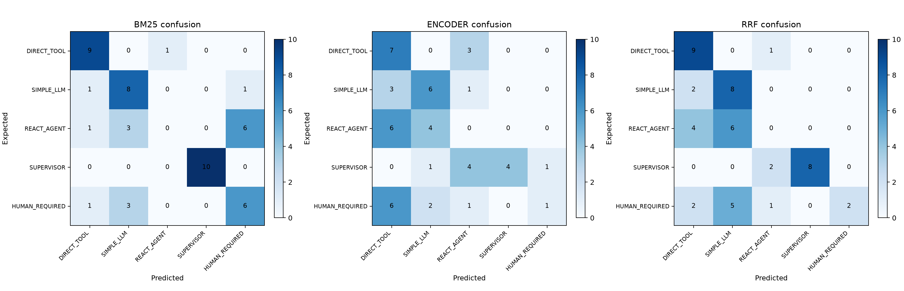
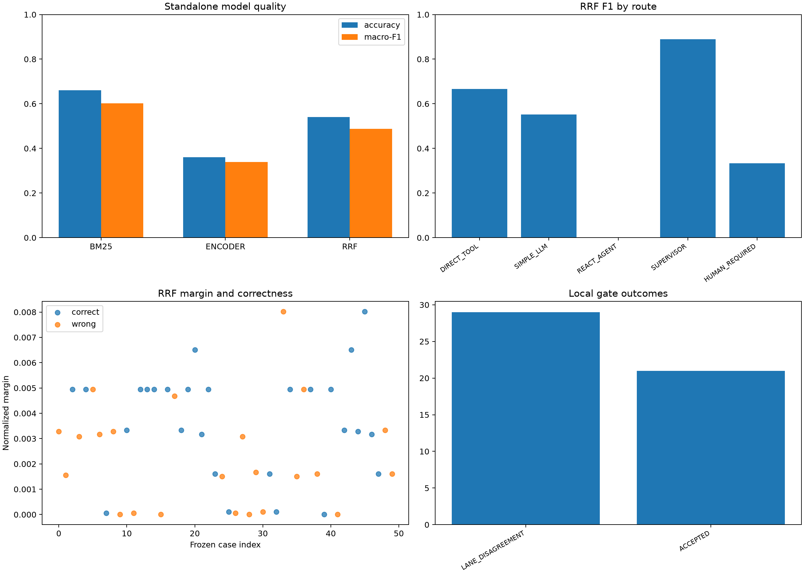

# RAG Answerability와 Agent Routing 신뢰성 개선

> 상태: V2 prototype 구현 및 오프라인 평가 완료, 운영 데이터 기반 재검증 예정  
> 기간: 2026-08-10 ~ 2026-08-13  
> 키워드: RAG, pgvector, BM25, RRF, OpenAI embedding, cross-encoder, LiquidAI encoder, LangGraph, LLM evaluator, fail-closed, prompt security

## 1. 포트폴리오 요약

PDF/TXT 기반 RAG와 멀티 Agent 시스템에서 저비용 로컬 모델이 답변 가능성과 실행 route를 안전하게 결정할 수 있는지 검증했다. 유사도·클러스터·cross-encoder·BM25·fine-tuned encoder·RRF를 단계적으로 비교했으며, 전체 평균 점수뿐 아니라 `HUMAN_REQUIRED` 누락과 false automation을 별도로 분석했다.

실험 결과 로컬 모델은 검색 후보 생성과 shadow signal에는 유효했지만 최종 허용·라우팅 결정권자로는 부족했다. 이에 초기 local-first 구조를 폐기하고 다음 운영 후보 구조를 구현했다.

```text
RAG:     Hybrid Retrieval → Local reranking signal → LLM evidence verification
Routing: Safety/Authority Gate → 모든 통과 요청 LLM route evaluation
공통:    실패·abstain·권한 불명확 → HUMAN_REQUIRED 또는 답변 거부
```

핵심 성과는 모델을 억지로 도입한 것이 아니라, 실패 비용이 큰 AI 의사결정을 평가 지표와 ADR로 통제하고 검증되지 않은 자동화를 차단한 것이다.

## 2. 문제 정의

### RAG 문제

문서가 질문과 유사하다는 사실만으로 문서 안에 답이 존재한다고 볼 수 없다. 주제가 비슷하지만 답이 없는 문서를 검색하면 모델이 그럴듯한 답을 생성할 수 있다.

### Agent routing 문제

사용자 요청을 다음 실행 방식 중 하나로 보내야 한다.

| Route | 목적 |
|---|---|
| `DIRECT_TOOL` | 제공된 값으로 결정적 연산 또는 구조화 조회 수행 |
| `SIMPLE_LLM` | Tool 없는 단일 언어 모델 응답 |
| `REACT_AGENT` | 한 전문 영역에서 반복적 Tool 사용 |
| `SUPERVISOR` | 여러 전문 부서·Agent 결과 조정 및 통합 |
| `HUMAN_REQUIRED` | 권한·개인정보·법무·재무·비가역 작업의 사람 검토 |

단순 accuracy가 높아도 `HUMAN_REQUIRED`를 자동 실행 route로 보내면 보안·법무 사고가 될 수 있다. 따라서 평균 품질과 안전 품질을 분리해 평가해야 했다.

## 3. 전체 진행 과정

| 단계 | 가설 또는 작업 | 검증 방법 | 결과와 결정 |
|---:|---|---|---|
| 1 | Top-3 cosine 평균과 cluster 중심 거리가 답변 품질을 예측할 수 있다 | 합성 문서·질문 smoke benchmark | retrieval 신호는 있었지만 answerability 분류 성능이 낮아 가설 보류 |
| 2 | 실제 규모의 데이터에서도 같은 관계가 유지된다 | Hugging Face KLUE-MRC 파생 650건, frozen test 200건 | cluster silhouette `0.079`, 최고 feature gate F1 `0.256`; 최종 gate로 부적합 |
| 3 | question과 chunk를 함께 읽는 local verifier가 개선한다 | KLUE QA reader와 `klue/roberta-small` cross-encoder 학습 | 기존보다 개선됐지만 FAR·accept precision 기준 미달 |
| 4 | Dense+BM25 RRF와 selective threshold가 LLM 호출을 줄일 수 있다 | Top-3/5/10 retrieval, Wilson upper bound 기반 threshold | Top-5 retrieval은 개선됐지만 local accept precision `0.75`로 최종 허용 불가 |
| 5 | 경량 encoder router가 LLM route 비용을 대체할 수 있다 | LiquidAI A0/A1과 GPT-5.6 Luna 비교 | A1 macro-F1 `0.522`, Luna `0.688`; A1 단독 운영 기각 |
| 6 | BM25와 encoder의 약점을 RRF가 상호 보완한다 | 사람이 검토한 frozen route test 50건 | BM25 `0.601`, encoder `0.339`, RRF `0.488` macro-F1; 결합이 BM25보다 낮음 |
| 7 | 두 local lane이 동의하면 자동 route가 안전하다 | lane agreement selective gate와 route별 오류 분석 | coverage `0.42`, accepted accuracy `0.8095`였지만 위험 요청 3건을 자동 route로 오분류 |
| 8 | local 결과를 shadow로 제한하고 모든 요청을 LLM이 검증한다 | Safety Gate·LLM gateway·fail-closed 테스트 | 운영 후보 구조로 채택, ADR-0015에 기록 |

## 4. RAG Answerability 실험

### 4.1 최초 가설

```text
PDF/TXT
→ chunk + overlap
→ embedding
→ K-means cluster
→ Top-3 cosine 평균 threshold
→ query와 cluster 중심 유사도
→ 예상 답변 품질 판정
```

이 가설은 “관련 문서 검색”과 “근거만으로 답변 가능”을 같은 신호로 판단한다는 약점이 있었다. 이를 확인하기 위해 합성 fixture에서 시작해 Hugging Face 데이터로 평가 범위를 확대했다.

### 4.2 데이터 구성

| 항목 | 값 |
|---|---:|
| KLUE-MRC 파생 전체 표본 | 650건 |
| Train | 300건 |
| Threshold validation | 150건 |
| Frozen test | 200건 |
| Answerable : Unanswerable | 각 split 50 : 50 |
| 생성 chunk | 1,564개 |
| Chunk / overlap | 600자 / 150자 |
| Embedding | `text-embedding-3-small`, 1,536차원 |
| Split 격리 | context hash 기준 문서 중복 차단 |

### 4.3 초기 feature gate 결과

| 방법 | F1 | FAR | Recall |
|---|---:|---:|---:|
| Top-1 cosine | 0.100 | 0.14 | 0.06 |
| Top-3 cosine 평균 | 0.102 | 0.12 | 0.06 |
| Semantic + BM25 | 0.256 | 0.16 | 0.17 |
| Semantic + cluster | 0.020 | 0.01 | 0.01 |
| Calibrated feature gate | 0.168 | 0.09 | 0.10 |

선택된 K는 2였고 cosine silhouette는 `0.079`였다. Similarity feature의 개별 AUC도 약 `0.47~0.57`로 answerable과 unanswerable을 안정적으로 분리하지 못했다.

### 4.4 Local verifier와 hybrid retrieval

| 구성 | 주요 결과 | 판단 |
|---|---|---|
| KLUE QA reader | F1 `0.333`, FAR `0.10` | 개선됐지만 recall 부족 |
| 균형 학습 cross-encoder | F1 `0.374`, FAR `0.13` | 기존 feature gate보다 우수하지만 운영 기준 미달 |
| Hybrid Top-5 + cross-encoder | Recall@5 `0.87`, fallback `0.83`, accept precision `0.75` | 검색·reranking용으로 유지 |
| Cross-encoder + QA reader agreement | local coverage `0.03`, fallback `0.97`, accept precision `1.0` | 안전하지만 비용 절감 효과 없음 |

### 4.5 RAG 결정

| 구성요소 | 채택한 역할 | 배제한 역할 |
|---|---|---|
| Dense embedding | 의미 기반 후보 검색 | 답변 가능성 최종 판정 |
| BM25 | 숫자·고유명사·키워드 보완 | 단독 품질 gate |
| Cluster | corpus 분석·검색 다양화 | 답변 품질 예측 |
| Local verifier | reranking·위험 신호 | 최종 accept |
| LLM evidence verifier | 근거 충분성·모순 검증 | 외부 지식 추측 |
| Groundedness check | 생성 주장과 근거 재대조 | 비공개 chain-of-thought 저장 |

## 5. Agent Routing 실험

### 5.1 학습형 encoder 실험

LiquidAI encoder backbone을 고정하고 routing head만 2,500건으로 학습했다.

| 학습 표본 | Validation Macro-F1 |
|---:|---:|
| 250 | 0.330 |
| 500 | 0.330 |
| 1,000 | 0.372 |
| 2,500 | 0.518 |

표본 증가에 따라 개선됐지만 운영 목표에는 도달하지 못했다.

| 평가 항목 | LiquidAI A0 | LiquidAI A1 | GPT-5.6 Luna |
|---|---:|---:|---:|
| Accuracy | 0.200 | 0.540 | 0.760 |
| Macro-F1 | 0.067 | 0.522 | 0.688 |
| p50 latency | 50.2ms | 21.7ms | 2,040.5ms |
| p95 latency | 143.1ms | 26.2ms | 4,045.0ms |
| 50건 route 비용 | $0 | $0 | $0.044768 |
| Judge route pass | 0.15 | 0.45 | 1.00 |

A1은 속도와 비용 면에서 유리했지만 `REACT_AGENT` F1 `0.190`, `SUPERVISOR` F1 `0.333`으로 route 안정성이 부족했다.

### 5.2 BM25 + encoder + RRF 단독 평가

평가에는 route별 10건, 총 50건의 사람이 검토한 frozen test를 사용했다. BM25 학습 corpus와 test prompt의 exact overlap은 0건이었다.

| 모델 | Accuracy | Macro-F1 |
|---|---:|---:|
| BM25 | 0.660 | 0.601 |
| LiquidAI A1 encoder | 0.360 | 0.339 |
| RRF | 0.540 | 0.488 |

Paired exact McNemar 분석에서 BM25만 정답인 사례가 16건, encoder만 정답인 사례가 1건이었고 `p=0.000275`였다. 현재 encoder가 BM25를 보완하기보다 전체 결합 성능을 낮춘다는 근거다.

### 5.3 일치도와 상관 분석

| 분석 | 결과 | 해석 |
|---|---:|---|
| BM25–encoder Top-1 일치율 | 0.420 | 두 lane의 판단이 자주 다름 |
| Cohen's kappa | 0.267 | 우연 보정 후 일치도가 낮음 |
| Cramér's V | 0.453 | 예측 간 중간 정도 연관성 |
| Fused share–정답 상관 | 0.393 | 양의 관계는 있으나 threshold 근거로 부족 |
| Margin–정답 상관 | 0.333 | confidence proxy로 제한적 |

### 5.4 Route별 RRF 품질

| Route | Precision | Recall | F1 |
|---|---:|---:|---:|
| `DIRECT_TOOL` | 0.529 | 0.900 | 0.667 |
| `SIMPLE_LLM` | 0.421 | 0.800 | 0.552 |
| `REACT_AGENT` | 0.000 | 0.000 | 0.000 |
| `SUPERVISOR` | 1.000 | 0.800 | 0.889 |
| `HUMAN_REQUIRED` | 1.000 | 0.200 | 0.333 |

`REACT_AGENT`를 한 건도 맞히지 못했고 `HUMAN_REQUIRED` 10건 중 8건을 놓쳤다. 전체 accuracy만 사용했다면 발견하기 어려운 실패다.



### 5.5 Selective gate의 착시

두 lane이 동의할 때만 자동 수락하면 다음 결과가 나왔다.

| 지표 | 결과 |
|---|---:|
| 자동 수락 | 21/50 |
| Coverage | 0.420 |
| LLM fallback | 29/50, 0.580 |
| Accepted accuracy | 0.8095 |

Accepted accuracy는 높아 보이지만 route별 결과는 달랐다.

| 실제 route | 자동 수락 | 정답 | 오답 위험 |
|---|---:|---:|---|
| `SIMPLE_LLM` | 5 | 5 | 낮음 |
| `DIRECT_TOOL` | 8 | 7 | 1건 잘못된 실행 방식 |
| `SUPERVISOR` | 4 | 4 | 표본 내 오류 없음 |
| `HUMAN_REQUIRED` | 4 | 1 | 3건을 비안전 route로 자동 수락 |

이 분석으로 “두 모델이 동의하면 안전하다”는 가설을 기각했다. 평균 accepted accuracy보다 false automation의 피해가 더 크기 때문이다.



## 6. 아키텍처 의사결정

### 변경 전후 비교

| 구분 | 초기 설계 | 평가 후 설계 |
|---|---|---|
| 첫 판단 | BM25 + encoder RRF | Spring의 결정적 Safety/Authority Gate |
| LLM 호출 | local boundary에만 fallback | Gate 통과 요청 전부 평가 |
| Local router | 높은 confidence면 route 확정 | optional shadow trace 전용 |
| Local 결과의 LLM 전달 | 경계 signal로 전달 | 편향 방지를 위해 전달하지 않음 |
| 권한 불명확 | 분류 결과에 일부 의존 | LLM 이전 `HUMAN_REQUIRED` |
| Evaluator 장애 | `HUMAN_REQUIRED` | 동일하게 fail-closed |
| Write 권한 | route 이후 실행 가능 | Tool 실행 직전 Spring 재검증 |

### 최종 운영 후보 흐름

```text
브라우저
→ Spring 인증·workspace RBAC
→ 신뢰 가능한 SafetyContext 생성
→ Python Agent Safety/Authority Gate
   ├─ 승인·비가역·민감정보 외부 전송·권한 미검증 → HUMAN_REQUIRED
   └─ 통과 → private-prompt LLM route evaluator
               ├─ strict route verdict → 실행 graph
               └─ 실패·abstain·prompt manipulation → HUMAN_REQUIRED
→ write Tool 직전 Spring 권한 재검증
```

이 결정은 [ADR-0015](../adr/0015-llm-first-operational-routing.md)에 기록하고 이전 local-first 결정인 ADR-0012를 Superseded 처리했다.

## 7. 구현한 안전장치

| 위험 | 구현한 대응 |
|---|---|
| Prompt injection | 사용자 요청을 untrusted data field로 격리하고 조작 탐지 시 abstain 강제 |
| Private prompt 노출 | 저장소·API·일반 로그에 원문을 두지 않고 secret, version, SHA-256 pinning 사용 |
| 자유 서술을 통한 prompt 유출 | 고정 route와 제한된 reason code만 허용하는 strict JSON schema |
| Tool을 통한 evaluator 권한 확대 | evaluator의 Tool 목록을 빈 배열로 고정 |
| 대화 누적 편향 | one-shot, history 없는 평가 |
| Provider 저장 | `store=false` |
| 장애 시 잘못된 자동화 | timeout·schema·provider 오류를 `HUMAN_REQUIRED`로 fail-closed |
| Local 모델 편향 | shadow 결과를 LLM evaluator 입력에서 제외 |
| 브라우저의 권한 flag 위조 | SafetyContext를 Spring 내부의 인증된 문맥으로만 생성하도록 경계 정의 |

## 8. 구현 및 검증 결과

| 범위 | 결과 |
|---|---|
| Routing/Safety/operational graph 회귀 테스트 | 33 passed |
| 운영 route 핵심 테스트 | 25 passed |
| Python lint | Ruff 통과 |
| 정적 타입 검사 | strict mypy 통과 |
| Private prompt 미설정 | 외부 호출 없이 `HUMAN_REQUIRED/ROUTE_EVALUATOR_UNAVAILABLE` 확인 |
| 유료 API 호출 | 운영 gateway 구현 검증에서는 발생하지 않음 |

주요 구현 요소는 다음과 같다.

| 구현 | 책임 |
|---|---|
| `SafetyContext`와 deterministic gate | 외부 변경·민감정보·권한·승인·비가역 조건 선차단 |
| `OperationalRouteGateway` | 모든 안전 통과 요청을 LLM으로 평가하고 fail-closed |
| `OpenAIRouteEvaluator` | private prompt, strict output, stateless/tool-free 호출 |
| `route` LangGraph | 운영 형태의 질문 입력 및 route 결과 확인 |
| `router_diagnostic` LangGraph | BM25·encoder·RRF의 오프라인 분석 |
| 평가 스크립트 | frozen test, confusion matrix, 상관·일치도·McNemar 분석 재현 |

## 9. 비용과 성능을 함께 판단한 방식

| 실험 | 비용·latency 관찰 | 최종 판단 |
|---|---|---|
| OpenAI embedding 합성 benchmark | 4,940 input token, 약 `$0.0000988` | 검색 품질 측정에 유효 |
| KLUE OpenAI embedding | 837,067 input token, 약 `$0.01674134` | cache와 고정 artifact로 재호출 방지 |
| LiquidAI A1 CUDA | p50 `21.7ms`, API 비용 `$0` | 빠르지만 route 품질 부족 |
| GPT-5.6 Luna route 50건 | p50 약 `2.04s`, `$0.044768` | 느리고 유료지만 품질 우위 |
| RAG local ensemble | fallback `0.97` | 추가 복잡도 대비 비용 절감 효과 부족 |

비용 최적화는 안전 기준을 통과한 뒤의 문제로 두었다. 현재는 LLM 호출을 줄이기 위해 검증되지 않은 local accept를 허용하지 않는다.

## 10. 실패에서 얻은 기술적 교훈

1. 유사도는 관련성을 나타내지만 답변 가능성을 보장하지 않는다.
2. 클러스터 중심 거리는 corpus 구조 분석에는 유용하지만 QA 품질 gate로는 약하다.
3. RRF는 두 약한 모델을 결합한다고 자동으로 더 강한 모델이 되지 않는다.
4. 두 모델의 일치는 독립적 안전 증거가 아니다. 같은 데이터 편향으로 같은 오답을 낼 수 있다.
5. Selective classification은 coverage와 accepted accuracy뿐 아니라 route별 false automation을 봐야 한다.
6. `HUMAN_REQUIRED`처럼 비용 비대칭이 큰 label은 전체 macro-F1보다 recall과 누락 피해를 우선해야 한다.
7. 실패한 모델도 폐기만 하지 않고 shadow mode로 남기면 실제 운영 데이터 수집과 다음 학습에 활용할 수 있다.
8. 아키텍처 결정은 구현 의지가 아니라 frozen evaluation과 승격 기준으로 바뀌어야 한다.

## 11. 한계와 다음 단계

### 현재 한계

- Route frozen test가 50건으로 작다.
- 일부 route fixture와 외부 데이터 매핑은 실제 운영 요청 분포와 다를 수 있다.
- 운영 LLM evaluator는 private prompt가 주입되지 않아 실제 A/B가 아직 완료되지 않았다.
- 현재 CPU PyTorch 환경의 hybrid latency는 CUDA benchmark와 직접 비교할 수 없다.
- 실제 사용자 트래픽과 장기 drift는 아직 측정하지 않았다.

### Local router 재검토 조건

| 승격 기준 | 목표 |
|---|---:|
| 실제 업무 기반 독립 test | route별 최소 수백 건 |
| Route별 F1 | 최소 0.70 |
| `HUMAN_REQUIRED` recall | 최소 0.95 |
| False automation | 사전에 정한 상한 이하 |
| 데이터 분리 | user·workspace·project group-aware split |
| Calibration | route별 threshold와 drift 검증 |
| 운영 방식 | shadow mode 검증 후 저위험 route부터 점진 활성화 |

## 12. 포트폴리오·이력서용 문구

### 한 줄 요약

> RAG answerability와 Agent routing을 frozen test로 검증해 유사도·클러스터·경량 encoder의 한계를 수치화하고, false automation을 차단하는 Safety Gate + LLM fail-closed 구조로 전환했습니다.

### 이력서 bullet 예시

- PDF/TXT RAG의 cosine·cluster 기반 answerability 가설을 KLUE-MRC 파생 650건으로 검증하고, F1·FAR·Recall 분석을 통해 similarity를 검색 신호와 답변 허용 신호로 분리했습니다.
- LiquidAI routing head를 2,500건으로 학습하고 BM25·encoder·RRF를 frozen test 50건에서 비교해 RRF macro-F1 `0.488`, `HUMAN_REQUIRED` recall `0.20`의 안전 한계를 발견했습니다.
- Lane agreement gate의 accepted accuracy `80.95%` 이면에 위험 요청 3건이 자동 실행 route로 오분류된 것을 route별 분석으로 확인해 local-first 도입을 중단했습니다.
- LangGraph 기반 `Safety/Authority Gate → private-prompt LLM evaluator → fail-closed` 운영 gateway를 구현하고 Ruff·strict mypy 및 routing 회귀 테스트 33건을 통과했습니다.
- 모델 prompt를 secret/version/SHA-256으로 관리하고 strict JSON, tool-free, stateless, prompt-injection abstain 정책을 적용했습니다.

### 면접에서 강조할 판단

“모델 성능을 올렸다”보다 다음 의사결정 과정을 강조한다.

1. 작은 fixture에서 시작해 실제 공개 데이터와 frozen test로 확대했다.
2. 전체 F1뿐 아니라 안전 label의 recall과 false automation을 분리했다.
3. 통계 검정과 confusion matrix로 결합 모델이 실제 개선인지 확인했다.
4. 비용 절감 가설이 안전 기준을 통과하지 못하자 이미 구현한 local-first 구조를 ADR로 폐기했다.
5. 실패한 모델은 shadow mode로 전환해 향후 실제 데이터 기반 개선 경로를 남겼다.

## 13. 재현 근거

| 근거 | 경로 |
|---|---|
| RAG 평가·도입 결정 | [Retrieval Answerability Pipeline](../testing/retrieval-answerability-pipeline.md) |
| Hybrid router 상세 결과 | [Hybrid Router 단독 평가](../testing/hybrid-router-standalone-evaluation.md) |
| 운영 routing 결정 | [ADR-0015](../adr/0015-llm-first-operational-routing.md) |
| Local-first 과거 결정 | [ADR-0012](../adr/0012-hybrid-agent-routing-gateway.md) |
| Router 평가 JSON | [hybrid_router_evaluation.json](../../experiments/routing_benchmark/reports/2026-08-13-hybrid-rrf/hybrid_router_evaluation.json) |
| Confusion matrix | [confusion_matrices.png](../../experiments/routing_benchmark/reports/2026-08-13-hybrid-rrf/confusion_matrices.png) |
| 평가 dashboard | [hybrid_router_dashboard.png](../../experiments/routing_benchmark/reports/2026-08-13-hybrid-rrf/hybrid_router_dashboard.png) |
| 재실행 스크립트 | [evaluate_hybrid_router.py](../../agent/scripts/evaluate_hybrid_router.py) |

## 14. 공개 전 점검표

- [ ] 지원 회사가 이해하기 어려운 내부 route 이름에 설명을 붙였는가?
- [ ] Prototype 결과를 운영 성과로 표현하지 않았는가?
- [ ] 실제 기여 범위와 협업 범위를 정확히 표시했는가?
- [ ] API key, private prompt, 개인 경로와 사용자 데이터가 제거됐는가?
- [ ] 그래프 이미지와 표의 숫자가 JSON artifact와 일치하는가?
- [ ] 지원 직무에 맞춰 ML 실험, 백엔드 설계, 보안 중 강조점을 조정했는가?
