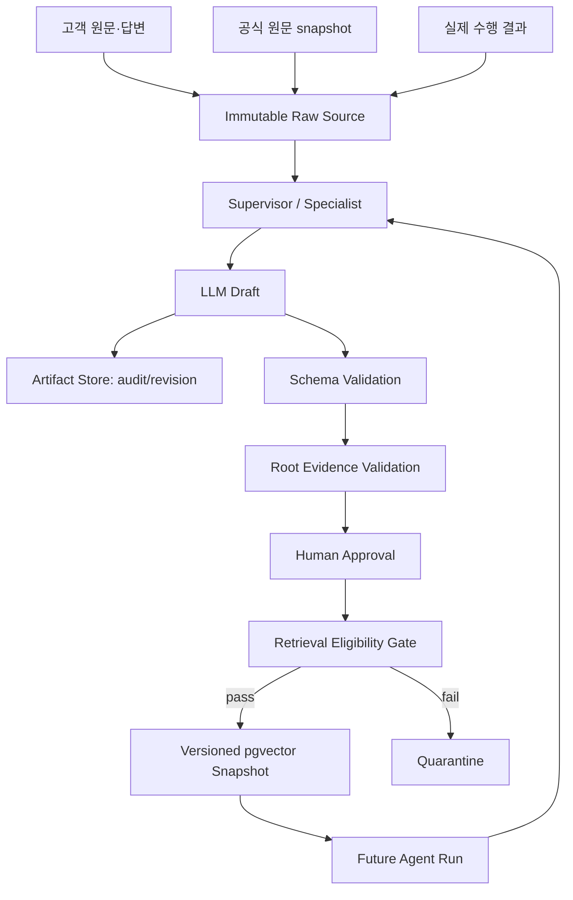

# LLM 생성 자료 재사용과 재귀 오염 위험 검토

> 검토일: 2026-07-29
> 대상: Freelance Ops Agent V2 Supervisor, PostgreSQL + pgvector, 요구사항·기술명세·견적 산출물
> 결론: 고전적 model collapse와는 다르지만 검증되지 않은 생성물을 재검색하면 corpus feedback degradation이 발생할 수 있다.

## 1. 결론

현재 V2가 OpenAI·Gemini API model을 호출하고 pgvector의 문서를 inference
context로만 사용한다면 model weight는 변경되지 않는다. 따라서 생성
데이터로 다음 세대 model을 반복 학습시키는 논문의 고전적인 model
collapse가 사용 횟수만으로 발생하지는 않는다.

그러나 다음 loop는 별도의 품질 붕괴를 만들 수 있다.

```text
LLM이 오류·편향이 포함된 문서 생성
→ 검증 없이 pgvector에 publish
→ 다음 run이 해당 문서를 근거로 검색
→ 같은 오류를 더 자연스러운 문장으로 재생성
→ 여러 유사 chunk가 같은 오류를 반복
→ 원본·희귀 사례·반대 근거가 retrieval 결과에서 밀려남
```

이 현상은 base model의 weight collapse가 아니라 다음 문제의 결합이다.

- retrieval corpus contamination
- self-reinforcing feedback
- citation laundering
- anchoring과 confirmation bias
- near-duplicate crowding
- rare case와 tail knowledge의 검색 감소

base model weight는 유지되므로 잘못된 index와 artifact를 격리하고 이전
snapshot으로 rollback하면 복구할 수 있다. 다만 원본 source와 lineage를
보존하지 않았다면 어떤 결과가 오염됐는지 판별할 수 없어 복구가 매우
어려워진다.

향후 V2가 vectorstore 자료를 자동으로 fine-tuning dataset에 포함한다면
고전적 model collapse 위험이 직접 적용된다. 자동 학습 경로는 현재
범위에서 금지해야 한다.

## 2. 논문 결과의 적용 범위

### 2.1 직접 적용되지 않는 부분

Shumailov et al.은 이전 model이 생성한 데이터로 다음 model을 반복
fine-tuning하거나 학습하는 조건에서 분포의 tail이 사라지고 오류가
누적되는 model collapse를 보였다.

V2의 일반적인 RAG 실행은 다음 점이 다르다.

```text
논문: synthetic data → model training → weight 변경
V2 RAG: retrieved document → prompt context → 일회성 inference
```

따라서 pgvector에 생성 문서가 많아져도 API model 자체가 영구적으로
학습되거나 손상되는 것은 아니다.

### 2.2 실질적으로 적용되는 부분

자기 생성 자료가 실제 인간·공식 source를 대체하고 반복될수록 품질과
다양성이 감소할 수 있다는 논문의 핵심 직관은 V2 retrieval corpus에도
적용된다.

Gerstgrasser et al.은 synthetic data가 기존 real data를 대체하는 경우와
real data를 보존하면서 누적하는 경우를 구분했다. 이 결과는 V2가 원본
고객 입력, 공식 source, 사람의 수정과 실제 outcome을 덮어쓰지 않고
계속 보존해야 한다는 근거가 된다.

ACL 2026의 Huang et al.은 LLM 생성 text가 RAG corpus를 오염시키면 retrieval
품질과 장기 안정성이 저하될 수 있음을 직접 다룬다. 반면 self-generated
document가 외부 source와 올바르게 조합될 때 RAG에 도움이 될 수 있다는
연구도 있으므로 생성 문서 전체를 폐기할 필요는 없다. 핵심은 provenance,
승인, source quota와 평가다.

관련 연구:

- [AI models collapse when trained on recursively generated data](https://www.nature.com/articles/s41586-024-07566-y)
- [Self-Consuming Generative Models Go MAD](https://arxiv.org/abs/2307.01850)
- [Is Model Collapse Inevitable? Breaking the Curse of Recursion by Accumulating Real and Synthetic Data](https://arxiv.org/abs/2404.01413)
- [LLM-Generated Text May Harm Your Retrieval!](https://aclanthology.org/2026.acl-long.1475/)
- [Evaluating Self-Generated Documents for Enhancing Retrieval-Augmented Generation](https://arxiv.org/abs/2410.13192)

## 3. Freelance Ops Agent에 발생할 수 있는 문제

### 3.1 견적 anchoring

첫 Agent가 근거 없이 OAuth 구현을 3일로 추정하고 생성 견적을 검색
가능하게 만들면 이후 Agent가 해당 값을 유사 프로젝트 사례로 반복 인용할
수 있다. 같은 내용을 paraphrase한 문서가 늘어나면 독립적인 사례가 여러
개 존재하는 것처럼 보일 수 있다.

### 3.2 source 세탁

LLM 초안 A가 출처 없는 주장을 만들고 초안 B가 A를 인용한 뒤, 최종 문서
C가 B를 인용하면 사용자는 주장의 원래 출처가 LLM 추정이라는 사실을
확인하기 어렵다.

### 3.3 희귀 요구사항 소실

검색 corpus가 전형적인 AI 작성 명세로 채워지면 접근성, 데이터 삭제,
장애 복구, 플랫폼별 정책처럼 빈도가 낮지만 중요한 요구사항이 top-k에서
밀릴 수 있다.

### 3.4 workspace 편향 증폭

특정 사용자의 견적 습관이나 잘못된 template가 승인 여부와 관계없이
누적되면 같은 workspace의 향후 결과가 한 방향으로 수렴할 수 있다.

### 3.5 stale policy 반복

과거 플랫폼 정책을 요약한 생성 문서가 원문 시행일과 freshness 없이
재사용되면 이미 변경된 정책이 최신 사실처럼 반복될 수 있다.

## 4. 필수 방어 원칙

### 4.1 저장과 검색 자격을 분리한다

감사와 revision을 위해 모든 생성물을 저장할 수 있지만, 저장됐다는 이유로
모두 embedding하거나 retrieval 후보로 publish해서는 안 된다.

```text
STORED ≠ RETRIEVAL_ELIGIBLE
```

권장 lifecycle:

```text
DRAFT
→ SCHEMA_VALIDATED
→ EVIDENCE_VALIDATED
→ HUMAN_APPROVED
→ RETRIEVAL_ELIGIBLE
→ OUTCOME_VERIFIED
```

실패 또는 미승인 artifact:

```text
QUARANTINED
REJECTED
SUPERSEDED
REVOKED
```

`DRAFT`, `QUARANTINED`, `REJECTED`, `REVOKED`는 일반 retrieval index에서
제외한다. `SUPERSEDED`는 audit에는 남기되 기본 검색에서 제외한다.

### 4.2 원본과 파생물을 다른 pool로 관리한다

| Pool | 예시 | Retrieval 용도 | Authority |
|---|---|---|---|
| Primary fact | 고객 원문, 고객 답변, Tool 계산 | 현재 프로젝트 사실 | 높음 |
| Official evidence | 법률·정책·API 원문 snapshot | 위험·기술 근거 | 높음 |
| Actual outcome | 실제 공수·금액·변경·결과 | 유사 결과·견적 calibration | 높음 |
| Human-approved artifact | 승인된 명세·견적 revision | scope·질문·template 참고 | 중간 |
| LLM draft | 미승인 요구사항·기술명세 | audit와 검토 | 검색 제외 |

승인된 AI-assisted 문서도 공식 원문이나 actual outcome과 같은 authority로
취급하지 않는다.

### 4.3 모든 artifact에 provenance와 lineage를 저장한다

최소 metadata:

```text
artifact_id
workspace_id
artifact_type
artifact_status
origin_type
retrieval_eligible

parent_artifact_ids
root_source_ids
synthetic_ancestry_depth
source_excerpt_ids

model_provider
model_name
prompt_version
schema_version
generated_at

approved_by
approved_at
outcome_verified_at
supersedes_artifact_id

content_hash
embedding_model
embedding_version
index_snapshot_id
```

권장 `origin_type`:

```text
HUMAN_INPUT
OFFICIAL_SOURCE
DETERMINISTIC_TOOL
ACTUAL_OUTCOME
LLM_DRAFT
LLM_TRANSFORM
HUMAN_APPROVED_LLM_ARTIFACT
```

사람의 승인은 retrieval 자격을 부여할 수 있지만 synthetic lineage 자체를
지우지는 않는다.

### 4.4 주장은 root source까지 역추적한다

LLM artifact A가 다른 LLM artifact B를 인용하는 것만으로 evidence를
충족했다고 판단하지 않는다.

```text
최종 주장
→ 중간 artifact
→ 원 고객 입력 / 공식 snapshot / 결정적 Tool / actual outcome
```

root source가 없는 주요 주장은 다음 중 하나로 처리한다.

- 명시적 assumption
- clarification question
- retrieval publish 거부
- human review

금액, 기간, 위험과 정책 주장은 특히 root evidence가 없으면 확정값으로
publish하지 않는다.

### 4.5 같은 run의 생성물을 다시 읽지 않는다

현재 run에서 생성한 문서는 같은 run의 retrieval index에 즉시 반영하지
않는다.

```text
run 생성
→ validation
→ 사용자 승인
→ transaction commit
→ 다음 index snapshot에 publish
```

이는 한 run 안에서 자기 출력이 검색 결과로 돌아오는 짧은 feedback loop를
차단한다.

### 4.6 중복 문서가 다수결을 만들지 못하게 한다

- exact `content_hash` deduplication
- embedding 기반 near-duplicate clustering
- 동일 lineage cluster에서는 top-k에 최대 한 chunk만 허용
- paraphrase 수를 source 수로 계산하지 않음
- 독립 source 수와 artifact 수를 별도 기록

## 5. Retrieval Gate

검색 publish 전에 결정적 gate를 통과한다.

```text
retrieval_eligible
= schema_valid
AND approved_status
AND root_source_coverage_passed
AND privacy_scan_passed
AND workspace_scope_valid
AND not_revoked
AND not_superseded
AND lineage_policy_passed
AND duplicate_policy_passed
```

권장 초기 정책:

| 정책 | 초기값 | 비고 |
|---|---:|---|
| 주요 주장 root source coverage | 100% | 근거가 없으면 assumption으로 전환 |
| 일반 주장 citation coverage | 95% 이상 | 기존 V2 grounding 목표와 정렬 |
| same-run publish | 금지 | 승인 후 다음 snapshot부터 허용 |
| 미승인 LLM draft 검색 | 0% | hard filter |
| top-k의 derived artifact 비율 | 최대 25% | 평가로 조정할 초기 guardrail |
| 동일 lineage cluster | 최대 1 chunk | paraphrase 중복 방지 |
| 직접 검색 가능한 synthetic ancestry depth | 최대 1 | 더 깊으면 root source를 직접 검색 |

25%와 depth 1은 연구가 보장한 보편값이 아니라 첫 benchmark를 위한 보수적
초기값이다. golden dataset 결과에 따라 ADR revision으로 조정한다.

## 6. Retrieval 시 방어

hard filter를 먼저 적용하고 그다음 ranking을 수행한다.

```text
workspace filter
→ artifact status·eligibility filter
→ source type quota
→ freshness·authority filter
→ dedup·lineage collapse
→ keyword/vector retrieval
→ reranking
→ evidence root resolution
```

참고용 ranking 식:

```text
final_score
= relevance_score
 × authority_weight
 × freshness_weight
 × outcome_weight
 × lineage_penalty
 × duplicate_penalty
```

soft score만으로 안전을 보장하지 않는다. 미승인·폐기·다른 workspace
artifact는 ranking 전에 hard filter로 제거한다.

요구사항 Agent에는 과거 승인 artifact의 기능을 확정 scope로 주지 않고
누락 후보와 질문 후보로만 제공한다. Estimation Agent에는
`OUTCOME_VERIFIED` 사례를 우선하고 승인 명세만 있는 사례는 낮은 가중치를
사용한다.

## 7. Supervisor 책임 분리



책임:

| 구성요소 | 책임 |
|---|---|
| Specialist Agent | 초안과 assumption 생성, source reference 전달 |
| Validation Agent | 누락·충돌·근거 coverage 보고 |
| Retrieval Gate | publish 여부를 결정적으로 판정 |
| Human | 중요한 scope·위험·견적 artifact 승인 |
| Spring | artifact 상태, revision, RBAC, audit와 publish transaction 소유 |
| Python Agent | graph, retrieval 요청, structured output과 평가 |

LLM이 자기 문서의 `retrieval_eligible=true`를 결정할 수 없다.

## 8. 평가와 운영 감시

### 8.1 clean golden set

- production vectorstore에 쓰지 않는 고정 test set 유지
- prompt와 model 변경 중 test label 열람·수정 금지
- 실제 인간 작성·검증 사례와 rare case 포함
- index snapshot마다 regression evaluation

### 8.2 필수 지표

```text
llm_generated_retrieval_share
root_source_coverage
synthetic_ancestry_depth_p95
near_duplicate_rate
independent_source_count
source_type_diversity
outcome_verified_retrieval_share
citation_precision
rare_case_recall
contradiction_rate
user_edit_distance
rejected_artifact_retrieval_count
```

특히 평균 품질만 보면 tail knowledge 손실을 늦게 발견할 수 있으므로 rare
case recall과 category별 누락률을 별도로 측정한다.

### 8.3 snapshot과 rollback

- publish batch마다 `index_snapshot_id` 생성
- embedding model과 parser version 기록
- 새 snapshot을 shadow evaluation한 뒤 활성화
- 품질 gate 실패 시 이전 snapshot으로 원자적 rollback
- 오염 artifact revoke 후 영향 받은 descendant를 lineage graph로 재검사

## 9. 향후 fine-tuning 안전장치

V2 첫 릴리스에서는 vectorstore를 fine-tuning dataset으로 자동 변환하지
않는다.

향후 fine-tuning을 도입하려면 별도 ADR과 다음 gate가 필요하다.

- 실제 인간 입력·수정·actual outcome을 보존하고 synthetic data로 대체하지 않음
- 미승인 LLM draft 제외
- root source와 label이 있는 sample만 후보 등록
- 사람이 dataset release를 승인
- synthetic ratio와 sampling weight를 명시
- 같은 project·lineage가 train과 test에 동시에 들어가지 않게 분리
- immutable clean holdout으로 세대별 품질·다양성·tail recall 평가
- 이전 model과 dataset으로 rollback 가능

## 10. 구현 우선순위

### P0

1. artifact status와 `retrieval_eligible` 분리
2. `origin_type`, root source와 parent lineage 저장
3. 미승인 draft hard filter
4. same-run index publish 금지
5. actual outcome·공식 source·승인 artifact pool 분리
6. content hash와 lineage dedup
7. versioned index snapshot과 rollback
8. clean golden evaluation

### P1

1. source type quota와 authority-aware reranking
2. near-duplicate clustering
3. lineage descendant revoke
4. rare case·synthetic share dashboard
5. random human audit

### P2

1. 생성 text detector를 보조 신호로 평가
2. retrieval corruption에 강한 aggregation benchmark
3. feedback-driven knowledge refinement 실험

생성 text detector는 오탐과 회피 가능성이 있으므로 provenance를 대신하는
보안 경계로 사용하지 않는다.

## 11. 최종 판단

Freelance Ops Agent V2는 사용 횟수가 많아진다는 이유만으로 base LLM이
붕괴해 사용할 수 없게 되는 구조는 아니다.

하지만 생성 자료를 provenance·승인·outcome 없이 전부 pgvector에 넣으면
검색 지식층이 오염되어 체감상 model collapse와 비슷한 품질 저하가 발생할
수 있다.

가장 중요한 불변조건은 다음과 같다.

```text
원본은 절대 덮어쓰지 않는다.
생성 초안은 자동으로 검색 publish하지 않는다.
주장은 root source까지 추적한다.
실제 outcome과 사람의 수정이 생성물보다 높은 authority를 가진다.
모든 index는 평가 후 활성화하고 rollback 가능해야 한다.
```
