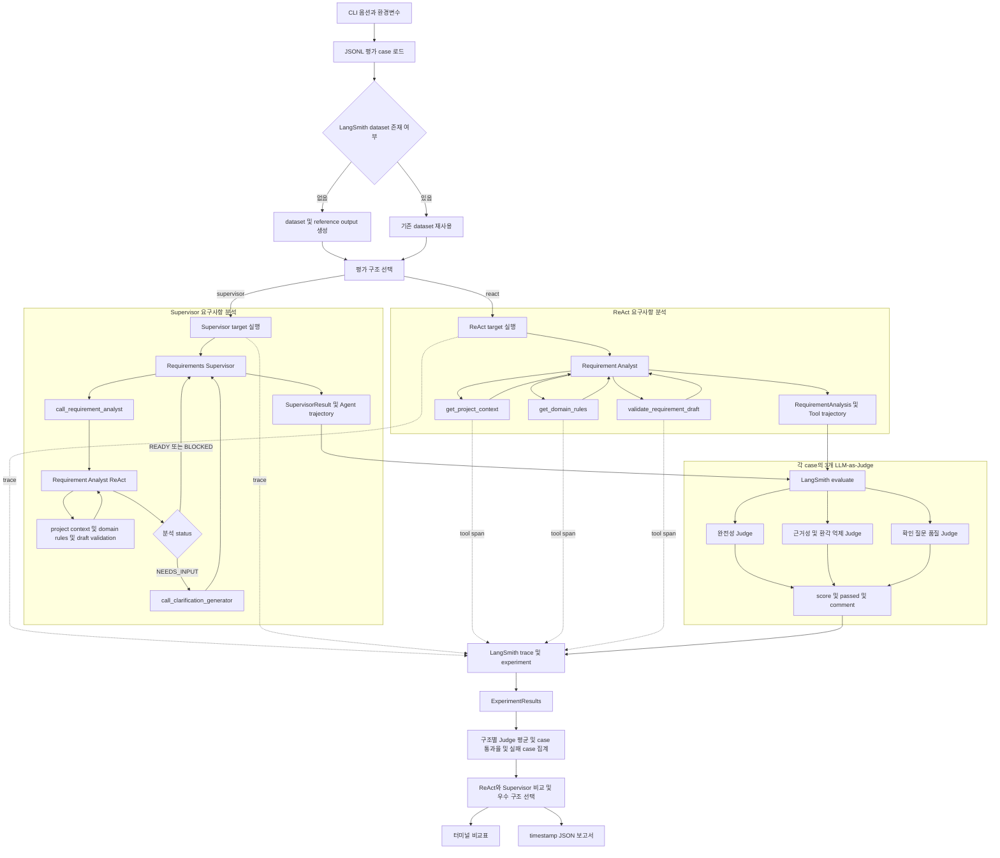

# 요구사항 분석 Prototype 평가 실행 가이드

> 작성일: 2026-07-27
> 대상: ReAct 단일 Agent와 Requirements Supervisor 구조 비교
> 현재 상태: historical evaluation design. 저장소 구조 정리 시 실행 가능한 ReAct prototype과 Supervisor prompt 초안만 보존됐으며, 아래에서 설명한 LangSmith evaluator와 fixture runner는 현재 tree에 없다.

## 1. 구현 파일

| 파일 | 역할 |
|---|---|
| `experiments/requirements/react_v1.py` | Requirement Analyst와 세 개의 원자적 Tool을 포함한 ReAct baseline |
| `experiments/requirements/supervisor_v1.py` | Requirements Supervisor system prompt 초안. 실행 graph는 아직 없음 |
| 미복구 | LangSmith dataset runner, fixture와 3개 LLM-as-Judge 평가 코드 |
| `.env.example` | 필요한 환경변수 이름과 기본 모델 설정 |

## 2. 평가 구조

```text
LangSmith Dataset
  ├─ ReAct target
  │    ├─ get_project_context
  │    ├─ get_domain_rules
  │    └─ validate_requirement_draft
  └─ Supervisor target
       ├─ call_requirement_analyst
       └─ call_clarification_generator

각 target 출력
  ├─ Judge 1: completeness
  ├─ Judge 2: groundedness
  └─ Judge 3: clarification_quality
```



세 Judge는 각각 별도의 LLM 호출이다. 기본 모델은 고빈도 평가 비용을 고려해 `gpt-5.6-luna`로 설정했으며 환경변수로 Judge마다 다른 모델을 지정할 수 있다.

## 3. 환경 설정

실제 값은 repository에 저장하지 않는다. PowerShell session에 다음 값을 설정하거나 안전한 secret manager를 사용한다.

```powershell
$env:OPENAI_API_KEY="<OpenAI API key>"
$env:LANGSMITH_API_KEY="<LangSmith API key>"
$env:LANGSMITH_TRACING="true"
$env:LANGSMITH_PROJECT="freelance-ops-requirements-eval-v1"
```

미국 외 LangSmith region을 사용하면 `LANGSMITH_ENDPOINT`도 해당 region endpoint로 설정한다.

기본 모델:

```text
PROTOTYPE_MODEL=gpt-5.6-terra
EVAL_JUDGE_MODEL=gpt-5.6-luna
PROTOTYPE_REASONING_EFFORT=low
EVAL_JUDGE_REASONING_EFFORT=low
```

Judge별 모델을 따로 지정하지 않을 때는 `JUDGE_COMPLETENESS_MODEL`, `JUDGE_GROUNDEDNESS_MODEL`, `JUDGE_CLARIFICATION_QUALITY_MODEL`을 `.env`에서 생략하거나 주석 처리한다. 빈 문자열로 남겨도 코드가 `EVAL_JUDGE_MODEL`로 fallback하지만, 설정 의도를 명확히 하기 위해 생략을 권장한다.

`ChatOpenAI`는 Responses API를 사용하도록 설정해 Tool 호출과 reasoning 설정을 함께 사용할 때 Chat Completions의 제약을 피한다.

## 4. 실행

Legacy prototype용 Poetry 환경 설치:

```powershell
poetry -C legacy/v1 install
```

ReAct 단독 확인:

```powershell
poetry -C legacy/v1 run python ../../experiments/requirements/react_v1.py
```

Supervisor graph와 전체 evaluator는 현재 tree에 없으므로 다음 항목은 재구현 후 검증해야 한다.

- 구조별 전체 평균
- case 통과율
- 완전성, 근거성, 확인 질문 품질 평균
- 실패 case 수와 실패한 Judge
- 두 구조를 함께 평가했을 때 우수 구조

결과 report는 향후 `experiments/evaluation/reports/`에 생성하고 Git에서 제외한다. 통과 기준과 LangSmith dataset 재사용 정책은 evaluator를 복구할 때 다시 확정한다.

## 5. LangSmith에서 확인할 항목

- ReAct와 Supervisor experiment의 Judge별 평균 score
- `call_requirement_analyst`와 `call_clarification_generator` 실제 호출 여부
- 불필요한 Tool 호출과 반복 호출
- 입력별 latency, token과 오류
- 동일 case의 requirement status와 질문 차이

터미널·JSON 요약은 빠른 비교를 위한 집계이며 상세 판정 근거, trace, token과 latency는 LangSmith experiment에서 확인한다.

평균 점수만으로 구조를 결정하지 않는다. 초기 3개 fixture는 실행 검증용이므로 구조 비교 결론을 내리기 전에 최소 20개 이상의 검토된 사례로 확장한다.

## 6. 보안과 평가 주의사항

- 평가 fixture에는 실제 고객 데이터, 개인정보와 secret을 넣지 않는다.
- Judge에는 비공개 chain-of-thought를 요구하지 않으며 짧은 판정 근거와 발견 사항만 저장한다.
- Agent 모델과 Judge 모델을 동일하게 사용할 경우 편향이 상관될 수 있으므로 중요한 결정 전에는 Judge model 다양화와 사람의 표본 감사를 수행한다.
- 같은 dataset, model, prompt version으로 여러 번 실행해 평균과 분산을 함께 비교한다.
- `test/.env`는 repository에 기록하거나 평가 결과에 포함하지 않는다.

## 7. 오류 해결

다음 오류는 Judge별 모델 환경변수가 빈 문자열일 때 발생한다.

```text
The requested model '' does not exist.
```

최신 코드에서는 빈 값을 `EVAL_JUDGE_MODEL`로 fallback한다. 이전 코드나 별도 script를 실행한다면 `.env`에서 빈 Judge override를 삭제하거나 주석 처리한다.

다음 오류는 `validate_requirement_draft`가 `dict[str, Any]` 하나를 입력받아 내부 object의 `properties`가 비어 있을 때 발생한다.

```text
Invalid schema for function 'validate_requirement_draft'
```

현재 Tool은 `goal`, `functional_requirements`, `non_functional_requirements`, `constraints`, `acceptance_criteria`를 모두 명시적 인자로 받아 OpenAI strict function schema를 만족한다.

## 8. 외부 데이터셋 적용 판단

### nguyenminh871/software_requirements

- 라이선스: MIT
- 언어: 영어
- 구성: `train` 단일 split, 61행, 4열
- 주요 입력 열: `Python task`, `Smart contract task`, `Java task`
- 입력 후보: 61행 × 3개 text 열 = 183개
- 전체 text는 183개 모두 고유하고 빈 값은 없지만 일부 mojibake가 존재

이 데이터셋은 개발 과제 문장 모음이며 요구사항 분석의 정답 label이 없다. 현재 평가 fixture가 요구하는 `expected_status`, `required_topics`, `expected_question_fields`, `forbidden_assumptions`을 제공하지 않으므로 그대로 사용하면 세 LLM Judge가 정확도를 평가할 reference가 없다.

권장 용도:

- 다양한 기술 도메인 입력에 대한 구조화 성공률 검사
- ReAct Tool 호출과 Supervisor 위임 경로의 안정성 검사
- 긴 입력과 짧은 입력에 대한 schema 준수 및 오류율 검사
- 사람이 사후 검토하는 탐색적 qualitative 평가

부적합한 용도:

- 요구사항 완전성 정확도의 단독 benchmark
- 확인 질문의 정답률 측정
- 환각 여부의 객관적 판정
- 실제 프리랜서 거래 요구사항의 대표 corpus

유의미한 보조 benchmark로 사용하려면 다음 전처리가 필요하다.

1. 세 text 열을 long format의 183개 case로 펼치고 `source_row_id`, `task_domain`, `request_text`를 보존한다.
2. 원본 row 단위로 train 또는 tuning set과 holdout set을 나눠 같은 주제의 Python·Java·Smart contract 변형이 서로 다른 split에 들어가지 않게 한다.
3. 최소 30~60개를 계층 표본 추출해 두 명 이상이 `expected_status`, `required_topics`, `expected_question_fields`, `forbidden_assumptions`을 작성한다.
4. annotator 불일치를 합의하고 label 근거를 기록한다.
5. 현재 3개 수작업 fixture를 대체하지 않고 `external_stress_v1` 보조 dataset으로 분리한다.
6. LLM Judge 결과 중 최소 20%를 사람이 표본 감사한다.

결론적으로 원본 상태의 정확도 benchmark 적합도는 낮다. 사람의 reference label을 추가하면 입력 다양성 및 구조 안정성을 확인하는 소규모 보조 benchmark로 사용할 수 있다.
