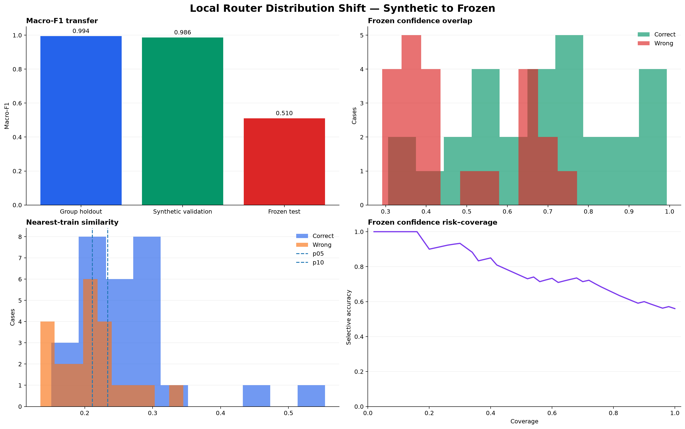
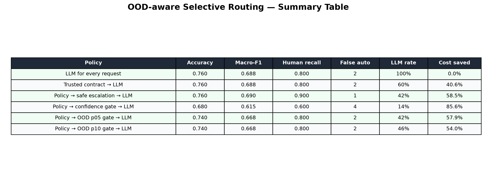

# Local Router 분포 이동·OOD 평가 — 2026-08-27

## 목적

Synthetic validation에서 높은 점수를 기록한 경량 local router가 frozen 외부 분포에서 왜
실패하는지 확인하고, confidence와 nearest-train similarity를 결합한 OOD gate가 안전한 자동
수락 범위를 만들 수 있는지 검증한다.

## 실험 설계

Test 결과를 threshold 선택에 사용하지 않도록 평가를 세 단계로 분리했다.

```text
Synthetic train batch 1–16
→ C 선택용 group holdout batch 17–20
→ 전체 synthetic train으로 재학습
→ 독립 synthetic validation으로 confidence·OOD threshold 확정
→ frozen 50건에 한 번 적용
```

- 불완전한 train batch 21은 C 선택에서 제외
- 모델: word/character TF-IDF + multinomial logistic regression
- 선택된 `C`: `2.0`
- confidence 자동 수락 최소 precision: `0.95`
- OOD floor: validation nearest-train similarity의 p05와 p10
- Frozen test는 모델, C, confidence threshold와 OOD floor 선택에 사용하지 않음
- 저장된 GPT-5.6 Luna 응답을 fallback으로 재사용해 추가 API 비용 없음

## 분포 이동 결과

| 평가 구간 | Macro-F1 |
|---|---:|
| Synthetic group holdout | 0.994 |
| Independent synthetic validation | 0.986 |
| Frozen test | 0.510 |

Synthetic validation에서 frozen test로 이동할 때 Macro-F1이 `0.476` 하락했다. 생성 batch를
분리해도 synthetic 내부 성능은 거의 완벽했으므로, 문제는 단순 batch leakage보다 synthetic와
외부 업무 요청 사이의 문체·domain·label-policy 차이에 가깝다.

Calibration error는 synthetic validation `0.136`, frozen test `0.158`이었다. ECE 차이만 보면
작아 보이지만 frozen에서는 높은 confidence 오답과 정답 구간이 겹친다. 따라서 aggregate ECE나
confidence threshold만으로 분포 밖 오답을 안정적으로 분리할 수 없다.



## Cascade 결과

| Policy | Accuracy | Macro-F1 | HUMAN recall | False automation | LLM call rate | 기록 비용 절감 |
|---|---:|---:|---:|---:|---:|---:|
| LLM for every request | 0.760 | 0.688 | 0.800 | 2 | 100% | 0.0% |
| Trusted contract → LLM | 0.760 | 0.688 | 0.800 | 2 | 60% | 40.6% |
| Policy → safe escalation → LLM | 0.760 | 0.690 | 0.900 | 1 | 42% | 58.5% |
| Policy → confidence gate → LLM | 0.680 | 0.615 | 0.600 | 4 | 14% | 85.6% |
| Policy → OOD p05 gate → LLM | 0.740 | 0.668 | 0.800 | 2 | 42% | 57.9% |
| Policy → OOD p10 gate → LLM | 0.740 | 0.668 | 0.800 | 2 | 46% | 54.0% |



## 판단

### Confidence-only 자동 수락은 기각

Synthetic validation에서 정한 confidence gate는 LLM call rate를 14%까지 낮췄지만 frozen
accuracy, Macro-F1과 HUMAN recall을 모두 악화시켰다. 높은 비용 절감률은 위험한 자동 수락을
늘린 결과이므로 운영 효율로 인정하지 않는다.

### TF-IDF similarity OOD gate도 운영 승격 실패

OOD p05/p10은 confidence-only 대비 accuracy를 `0.68 → 0.74`, Macro-F1을
`0.615 → 0.668`, HUMAN recall을 `0.60 → 0.80`으로 복구했다. 그러나 trusted contract-only
기준의 `0.760 / 0.688 / 0.800`을 넘지 못했고 false automation도 줄이지 못했다.

Nearest-train similarity 분포도 정답과 오답이 상당히 겹쳤다. TF-IDF 공간에서 가깝다는 사실은
route policy가 같다는 충분조건이 아니다. 따라서 p05와 p10 후보 모두 자동 route 결정권을
부여하지 않는다.

### Safe escalation-only는 shadow 연구를 계속한다

Local model이 `HUMAN_REQUIRED`를 제안한 경우에만 사람 검토로 상향하면 실행 권한을 확대하지
않으면서 HUMAN recall을 0.9로 개선했다. 그러나 불필요한 escalation이 1건 증가했고
HUMAN recall 0.95 gate에도 미달한다. 현재는 `SHADOW_ONLY`이며 자동 적용하지 않는다.

## 운영 결정

1차 연구에서 채택한 구조를 유지한다.

```text
Trusted Safety/Authority Gate
→ trusted direct_tool_operation
→ trusted PROJECT_ANALYSIS
→ AD_HOC LLM evaluator
→ Tool 실행 직전 permission 재검증
```

새 local classifier, confidence gate, TF-IDF OOD gate와 기존 lane agreement는 모두 운영 route를
바꿀 수 없다.

## Shadow telemetry 보강

실제 분포에서 local 후보를 검증할 수 있도록 `route.selected` event에 다음 비민감 신호를
추가했다.

```text
shadowSuggestedRoute
shadowNeedsFallback
shadowFallbackReason
shadowFusedShare
shadowMargin
shadowLaneAgreement
```

사용자 prompt, matched example 원문, credential과 개인 식별자는 기록하지 않는다. Trusted
contract fast path에서는 local model을 실행하지 않으므로 위 field는 `null`이다.

## 다음 운영 데이터 Gate

Synthetic 데이터를 추가 생성해 같은 분포 점수를 높이는 실험은 우선순위에서 내린다. 다음
승격 평가는 실제 비식별 shadow trace로 수행한다.

- workspace와 project를 묶은 group-aware split
- 최소 1,000건의 수정 완료 route 표본
- `HUMAN_REQUIRED`와 `REACT_AGENT` 각각 최소 100건
- route별 F1 최소 0.70
- HUMAN recall point estimate 최소 0.95
- HUMAN recall 95% confidence lower bound 최소 0.90
- false automation 95% confidence upper bound 최대 1%
- LLM 대비 실제 p50·p95와 성공 요청당 비용 개선
- shadow 기간에 권한 또는 workspace 격리 회귀 0건

이 조건을 만족하기 전에는 local model의 자동 실행 coverage를 확대하지 않는다.

## 산출물

- `experiments/routing_benchmark/reports/2026-08-27-distribution-shift/distribution_shift_evaluation.json`
- `experiments/routing_benchmark/reports/2026-08-27-distribution-shift/distribution_shift_summary.csv`
- `experiments/routing_benchmark/reports/2026-08-27-distribution-shift/distribution_shift_dashboard.png`
- `experiments/routing_benchmark/reports/2026-08-27-distribution-shift/distribution_shift_table.png`
- 실행 코드: `experiments/routing_benchmark/src/routing_benchmark/distribution_shift.py`
