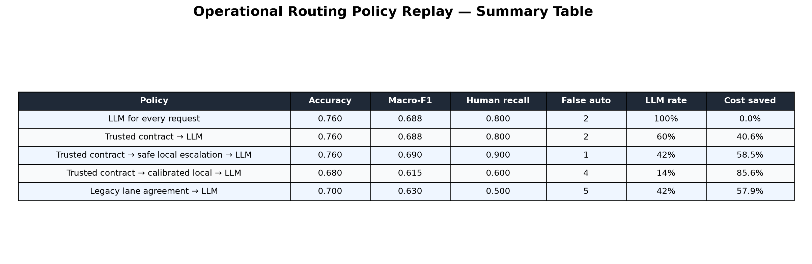
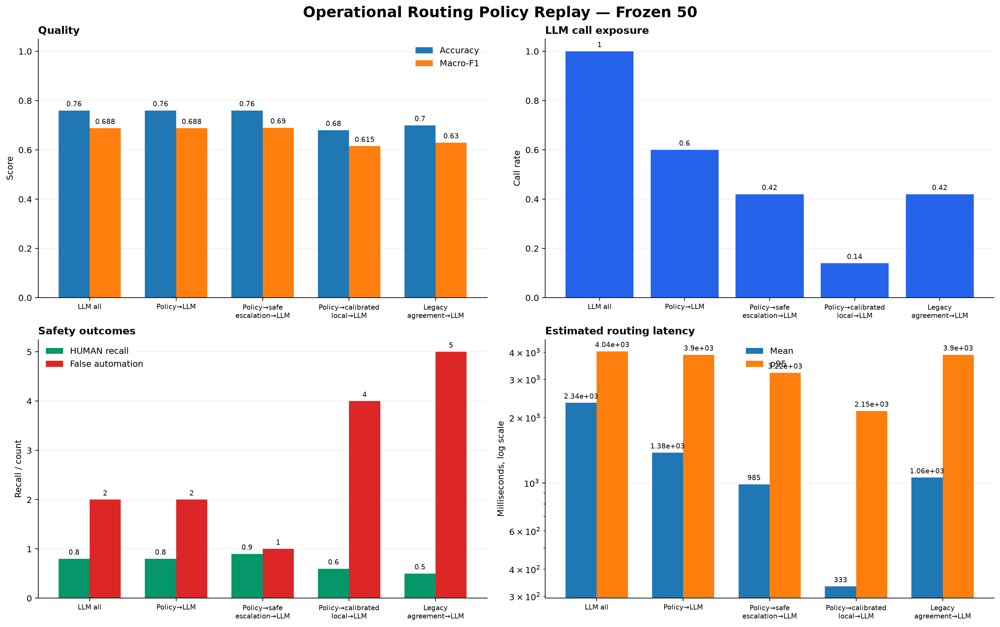

# 운영 Routing Policy Replay — 2026-08-27

## 목적

기존 전 요청 LLM routing보다 비용과 latency가 낮으면서 현재 정책·권한 경계를 유지하는 운영
구성을 찾는다. 평균 정확도만 최적화하지 않고 `HUMAN_REQUIRED` 누락과 false automation을
우선 확인한다.

## 비교 대상

| 후보 | 결정 순서 |
|---|---|
| LLM for every request | 모든 요청을 GPT-5.6 Luna evaluator로 분류 |
| Trusted contract → LLM | 신뢰된 직접 Tool·프로젝트 분석 계약을 결정적으로 처리하고 나머지만 LLM 호출 |
| Trusted contract → safe local escalation → LLM | 위 정책 후 local model이 제안한 `HUMAN_REQUIRED`만 수락 |
| Trusted contract → calibrated local → LLM | validation threshold를 통과한 local route를 수락 |
| Legacy lane agreement → LLM | BM25와 LiquidAI encoder가 동의하면 수락하고 나머지만 LLM 호출 |

운영 fast path는 사용자 자연어에서 route를 추론하지 않는다.

- `direct_tool_operation`이 인증된 내부 enum으로 전달되면 `DIRECT_TOOL`
- `workflow_mode=PROJECT_ANALYSIS`이면 `SUPERVISOR`
- Safety/Authority Gate가 중단을 요구하면 항상 `HUMAN_REQUIRED`
- 위 조건이 없는 `AD_HOC` 요청만 LLM evaluator로 전달

## 데이터와 재현 조건

- Frozen test: route별 10건, 총 50건
- LLM 결과: 2026-08-11 저장 GPT-5.6 Luna 응답 재사용
- Legacy local 결과: 2026-08-13 BM25·LiquidAI·RRF 원시 예측 재사용
- 새 local 후보 학습: synthetic train 2,500건
- C와 threshold 선택: synthetic validation 500건만 사용
- Frozen test는 C 또는 threshold 선택에 사용하지 않음
- 새 local 후보: word/character TF-IDF + multinomial logistic regression
- 실행 환경: CPU, 최종 replay 단건 평균 `2.44 ms`, p95 `4.37 ms`

Trusted contract replay는 프로젝트 fixture의 case ID를 실제 내부 요청에 존재하는 구조화된
`direct_tool_operation`과 `workflow_mode`의 대리 신호로 사용한다. 이는 텍스트 분류 성능이
아니라 제품 contract를 LLM보다 먼저 적용했을 때의 counterfactual replay다.

## 결과

| Policy | Accuracy | Macro-F1 | HUMAN recall | False automation | LLM call rate | 기록 비용 절감 |
|---|---:|---:|---:|---:|---:|---:|
| LLM for every request | 0.760 | 0.688 | 0.800 | 2 | 100% | 0.0% |
| Trusted contract → LLM | 0.760 | 0.688 | 0.800 | 2 | 60% | 40.6% |
| Trusted contract → safe local escalation → LLM | 0.760 | 0.690 | 0.900 | 1 | 42% | 58.5% |
| Trusted contract → calibrated local → LLM | 0.680 | 0.615 | 0.600 | 4 | 14% | 85.6% |
| Legacy lane agreement → LLM | 0.700 | 0.630 | 0.500 | 5 | 42% | 57.9% |





## 해석

### 1. Trusted contract fast path는 즉시 적용할 수 있다

`DIRECT_TOOL`과 `PROJECT_ANALYSIS`은 LLM 판정 후에도 정책 코드가 최종 route를 고정한다.
이 두 계약을 LLM보다 먼저 적용하면 frozen test의 최종 예측은 그대로 유지되면서 LLM 호출이
50건에서 30건으로 감소한다. 저장된 실제 token usage 기준 비용은 `$0.044768`에서
`$0.026580`으로 40.6% 감소했다.

Replay의 평균 routing latency 노출은 `2,339 ms`에서 `1,379 ms`로 약 41.1% 감소했다.
p95는 남은 LLM 호출의 tail latency 때문에 `4,045 ms`에서 `3,899 ms`로만 감소했다. 따라서
p95 개선에는 LLM evaluator 자체의 timeout, prompt 크기와 provider latency 최적화가 별도로
필요하다.

이 절감률은 route-balanced fixture에서 측정된 값이다. 실제 운영 절감률은 신뢰된 직접 Tool과
프로젝트 분석 요청의 비중에 따라 달라지므로 production telemetry로 다시 계산해야 한다.

### 2. 새 local model의 synthetic validation 점수는 실서비스 근거가 아니다

새 TF-IDF 모델은 synthetic validation에서 Macro-F1 `0.988`을 기록했다. 그러나 validation에서
precision 0.95와 human false automation 0건으로 정한 threshold를 frozen 분포에 적용하자
calibrated cascade의 accuracy는 `0.680`, Macro-F1은 `0.615`, HUMAN recall은 `0.600`으로
하락했다.

이는 단순 overfitting만으로 단정할 수 없지만 synthetic train/validation과 공개 frozen test
사이에 큰 분포·label-policy 차이가 있음을 보여준다. 높은 validation 점수만으로 local model을
운영 승격하면 안 된다.

### 3. Local escalation-only는 유망하지만 아직 운영 승격하지 않는다

Local model이 `HUMAN_REQUIRED`를 제안할 때만 fail-safe 방향으로 수락하면 LLM call rate는
42%로 낮아지고 frozen HUMAN recall은 0.8에서 0.9로 개선됐다. 다만 불필요한 사람 검토가
7건에서 8건으로 증가했고, 실제 group-aware untouched 운영 holdout과 shadow 기간이 없다.

따라서 이 후보는 다음 연구의 shadow 대상으로 유지하되 현재 운영 결정권을 주지 않는다.

### 4. 기존 lane agreement cascade는 다시 기각한다

BM25와 LiquidAI encoder가 같은 route를 선택했다는 이유만으로 자동 수락하면 HUMAN recall이
0.5로 떨어지고 false automation이 5건으로 증가했다. 비용 절감은 안전 회귀를 정당화하지
못한다.

## 운영 결정

현재 증거로 채택하는 가장 효율적인 운영 구조는 다음과 같다.

```text
Trusted Safety/Authority Gate
→ trusted direct_tool_operation이면 DIRECT_TOOL
→ trusted PROJECT_ANALYSIS이면 SUPERVISOR
→ 그 외 AD_HOC 요청은 private-prompt LLM evaluator
→ 실행 직전 Tool permission 재검증
```

Local BM25, LiquidAI, TF-IDF 후보는 운영 route를 바꾸지 않는 `SHADOW_ONLY` 또는
`SIGNAL_ONLY`로 유지한다.

## 제한사항

- Frozen test는 50건으로 작고 route-balanced이므로 실제 traffic prior를 반영하지 않는다.
- 기존 benchmark에는 실제 Spring `SafetyContext`가 포함되지 않는다. 표의 false automation은
  prompt-only replay 수치이며 전체 운영 Safety Gate의 실패율로 해석하면 안 된다.
- 저장된 LLM 응답을 재사용했으므로 새로운 provider 실행 변동성과 현재 가격을 측정하지 않았다.
- latency는 서로 다른 과거 실행과 현재 CPU 측정을 결합한 counterfactual estimate다.
- product fixture의 structured contract는 실제 운영 trace가 아니라 case provenance로 재현했다.

## 다음 연구 Gate

1. Spring이 전달한 비식별 `SafetyContext`, workflow mode와 최종 사람 수정 route를 포함한
   group-aware 운영 holdout을 구축한다.
2. 실제 traffic prior로 deterministic fast path의 LLM call reduction과 p95를 재계산한다.
3. Safe local escalation-only를 shadow로 실행해 false escalation과 사람 검토 부담을 측정한다.
4. `REACT_AGENT` label을 인증·권한 문맥과 분리해 다시 정의하고 untouched test를 만든다.
5. 모든 route F1 0.70, HUMAN recall 0.95, 사전 정의한 false automation 상한을 만족하기 전에는
   local 자동 실행 범위를 확대하지 않는다.

## 산출물

- `experiments/routing_benchmark/reports/2026-08-27-operational-replay/operational_policy_replay.json`
- `experiments/routing_benchmark/reports/2026-08-27-operational-replay/operational_policy_summary.csv`
- `experiments/routing_benchmark/reports/2026-08-27-operational-replay/operational_policy_table.png`
- `experiments/routing_benchmark/reports/2026-08-27-operational-replay/operational_policy_dashboard.png`
- 실행 코드: `experiments/routing_benchmark/src/routing_benchmark/operational_replay.py`
