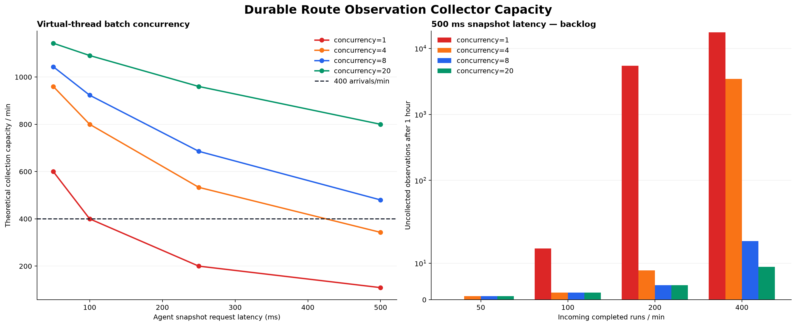
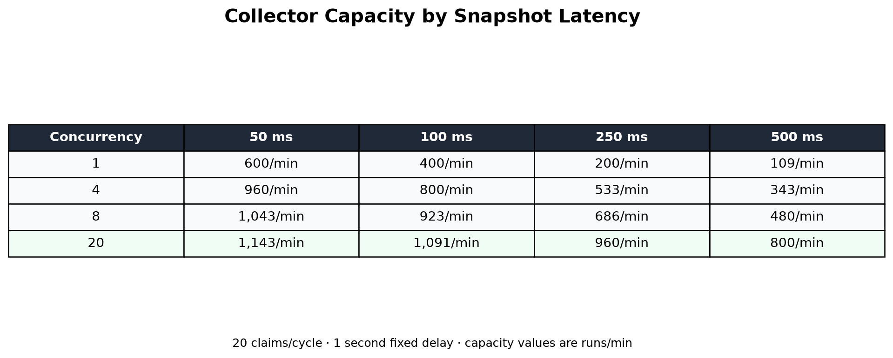

# 실서비스 Routing 관측·검토 파이프라인 — 2026-08-27

## 결론

기존 라우터를 scheduler로 대체하지 않는다. Scheduler는 실행 순서·용량·재시도를 담당하고,
router는 요청의 실행 형태를 결정한다. 이번 변경은 두 계층을 교체한 것이 아니라 운영
라우팅 결과를 안전하게 수집하고 검증하기 위한 비동기 관측 projection을 추가한 것이다.

구현된 경로는 다음과 같다.

```text
Agent routing decision
  → agent_run_event(route.selected)
  → finite run-scoped snapshot API
  → Spring durable collection queue + cursor
  → allowlisted route observation
  → workspace-scoped 50:50 natural/risk review queue
  → HMAC de-identified grouped holdout
  → shadow promotion gate
```

Agent event의 모델 식별자는 Spring allowlist와 동일한 `evaluatorModel` 계약을 사용한다. 기존
`routingModel` 이름은 수집 시 조용히 제거되므로 수정했고, 모델 ID와 입력·출력 token이 함께
projection에 남는 회귀 테스트를 추가했다. 이 정보는 export 시점의 승인된 가격 snapshot과
결합해 요청당 routing 비용을 계산하는 근거다.

평가 export는 `GET /api/v2/workspaces/{workspaceId}/route-reviews/export`를 사용한다. 첫 페이지가
반환한 `snapshotAt`과 `(nextOccurredAt, nextObservationId)`를 후속 페이지에 고정하고,
`data.export` 권한이 없는 사용자는 접근할 수 없다. 적용 가격이 없는 evaluator 호출은 비용 0으로
처리하지 않고 409를 반환한다. 전체 계약과 용량 모델은
[고정 Cohort Export 연구](routing-review-export-cohort-2026-08-27.md)에 기록했다.

현재 production routing은 ADR-0028의 `trusted contract fast path + AD_HOC LLM evaluator`다.
local router는 frozen distribution-shift 평가에서 Macro-F1 `0.510`으로 실패했으므로 계속
`SHADOW_ONLY`다.

## 구현 범위

### Agent snapshot API

`GET /internal/v1/agent-runs/{runId}/route-observations`는 `After-Event-ID` 이후의
`route.selected`만 최대 100건 반환한다. 응답은 `nextEventId`, `hasMore`, `terminal`을 포함한다.
delegation token의 run scope가 다르면 403이며, WAITING run은 terminal로 취급하지 않아 resume
이후 이벤트도 계속 수집한다.

### Spring durable projection

`V23__route_observation_review_queue.sql`은 다음을 생성한다.

- `agent_route_collection`: cursor, attempt, available time, lease, 마지막 오류
- `agent_route_observation`: workspace/project/run scope, allowlisted JSONB, optional gold review
- `agent_run` 생성 후 queue row를 만드는 trigger와 기존 run backfill
- `(agent_run_id, agent_event_id)` unique constraint

후속 migration은 운영 review workflow를 단계적으로 확장한다.

- `V24__route_review_claim_lease.sql`: reviewer claim owner와 15분 lease
- `V25__route_review_consensus.sql`: review target/vote/status, immutable vote audit,
  위험 route dual-review constraint, OWNER·ADMIN adjudication permission
- `V26__route_review_shared_error_audit.sql`: 위험 route target 3, 자연 dual 50%, 자연 senior
  audit 5%, 공통오류 방어 constraint

수집기는 한 회차에 20개 queue row를 claim하고 virtual thread로 병렬 호출한다. Agent 장애에는
1·2·4·8·16·32·60초로 제한된 exponential retry를 적용한다. WAITING 상태에서 새 route event가
없으면 60초 뒤 다시 확인하고, 일반 non-terminal batch는 5초 뒤 이어서 확인한다.

수집은 opt-in이다.

```powershell
$env:AGENT_ROUTE_OBSERVATION_COLLECTION_ENABLED = 'true'
$env:AGENT_ROUTE_OBSERVATION_COLLECTION_DELAY_MS = '1000'
```

### Human review

`GET /api/v2/workspaces/{workspaceId}/route-reviews?limit=50`은 자연 traffic과 위험 stratum을
교차해 50:50으로 제공한다. 위험 stratum은 `REACT_AGENT`, `HUMAN_REQUIRED`, shadow/actual
disagreement다. 한쪽 표본이 부족하면 다른 쪽으로 남은 quota를 채운다. GET은 UI preview이며
활성 claim이 있는 row는 제외한다.

실제 검토 시작은 `POST /api/v2/workspaces/{workspaceId}/route-reviews/claims?limit=10`을 사용한다.
15분 lease와 PostgreSQL `FOR UPDATE SKIP LOCKED`로 동시 reviewer에게 중복 배정되지 않는다.
반복 호출은 활성 claim을 먼저 반환하며 한 reviewer가 최대 100개를 초과해 선점하지 못한다.
일반 claim은 활성 `PENDING` lease만, adjudication claim은 활성 `ADJUDICATION` lease만 재사용해
두 작업 큐가 API 경계에서 섞이지 않는다.

`POST /api/v2/workspaces/{workspaceId}/route-reviews/{observationId}`는 gold route와
`HUMAN_REVIEW` 또는 `USER_EDIT` blind vote를 reviewer별 한 번만 기록한다. OWNER·ADMIN·MANAGER에만
`agent.route.review`가 부여되고 ESTIMATOR에는 부여되지 않는다. 유효한 본인 claim이 없거나
lease가 만료되면 409를 반환한다.

위험 route와 shadow disagreement는 두 blind vote가 같아도 항상 senior audit을 요구한다.
자연 표본은 stable hash로 50%를 이중검토하고, 이 중 5%는 합의 여부와 무관하게 senior가
감사한다. 두 vote가 다르거나 audit 대상으로 선택되면 `ADJUDICATION`으로 전환해 제3자 vote를
최종 gold로 확정한다. 일반 reviewer는 adjudication item을 claim할 수 없으며 OWNER·ADMIN의
`agent.route.adjudicate` 권한과 별도 adjudication claim/context API가 필요하다. 자연
이중검토율과 audit 비율은 각각 `AGENT_ROUTE_REVIEW_NATURAL_DUAL_PERCENT`,
`AGENT_ROUTE_REVIEW_NATURAL_SENIOR_AUDIT_PERCENT`로 조정한다.

OWNER·ADMIN은 고정된 `since`와 사전 등록 `checkpoint`를 사용해
`GET /api/v2/workspaces/{workspaceId}/route-reviews/canary-metrics`를 조회한다. API는 첫 N개
audit에 alpha-spending adjusted Wilson 구간을 적용한다. 두 stratum이 모두 `ACCEPT`일
때만 gold 품질 gate를 통과하며 `INCONCLUSIVE`는 승인으로 간주하지 않는다. Aggregate API에는
reviewer ID나 개별 vote를 포함하지 않는다.

## 부하 모델 결과

가정은 회차당 20건, fixed delay 1초, snapshot latency 50/100/250/500ms, 1시간 지속 유입이다.

| 동시성 | 50ms | 100ms | 250ms | 500ms |
|---:|---:|---:|---:|---:|
| 1 | 600/분 | 400/분 | 200/분 | 109/분 |
| 4 | 960/분 | 800/분 | 533/분 | 343/분 |
| 8 | 1,043/분 | 923/분 | 686/분 | 480/분 |
| 20 | 1,143/분 | 1,091/분 | 960/분 | 800/분 |

가장 보수적인 500ms와 400건/분 유입에서 동시성 1은 1시간 후 17,469건이 밀렸지만,
구현값인 동시성 20은 backlog 9건, p95 수집 지연 1.85초였다. 이는 실제 부하 측정이 아니라
현재 scheduler loop를 그대로 옮긴 결정적 모델 결과다.





## 장애 및 운영 점검

- queue `PROCESSING` lease가 2분 이상 남아 있으면 다른 worker가 가져가지 않는다.
- worker가 죽으면 lease 만료 후 같은 cursor에서 재수집한다.
- 중복 event는 unique key와 사전 존재 확인으로 건너뛴다.
- stale attempt는 cursor와 observation을 모두 기록하지 않는다.
- unknown telemetry는 버리고, allowlisted 값의 길이·route enum·reason code 개수를 검증한다.
- 수집 backlog와 oldest lag, retry attempts, review backlog를 전용 Micrometer metric으로 노출한다.
- Gauge는 기본 15초마다 갱신하며 workspace ID를 metric label로 사용하지 않는다.
- 기능 활성화 전 Spring에서 Agent 내부 URL과 delegation key가 정상인지 확인한다.
- schema migration 후 기능 flag를 켜고 1% instance에서 backlog가 안정적인지 본 뒤 전체로 확대한다.

## 승격 조건과 남은 검증

이 구현으로 production evidence를 모을 수 있게 되었지만 local router 승격은 아직 승인하지
않는다. 다음 조건이 모두 실제 human-reviewed trace에서 충족되어야 한다.

- project/workspace grouped holdout 1,000건 이상, group 50개 이상
- route별 holdout 100건 이상
- HUMAN_REQUIRED recall 0.95 이상
- false automation Wilson 95% 상한 1% 이하
- Macro-F1 0.80 이상
- 전체 observation의 natural/risk prior로 사후층화한 요청당 비용·latency 계산
- production canary와 rollback 검증
- risk/natural consensus overturn gate가 모두 `ACCEPT`

50:50 계층화 전략의 계획값은 accepted gold label 11,000건이다. 공통오류 방어 canary 정책은
gold당 평균 2.27 vote이므로 약 24,980회의 human review가 필요하다. 100 vote/일이면 약 250일,
평균 5분·동시 reviewer 4명의 infrastructure 처리량 379.8 vote/일이면 약 66 근무일이다. 실제
priors, reviewer 오류율과 업무시간이 쌓이면 allocation과 staffing을 다시 계산한다.

## 검증 기록

- Agent 본체: 189개 통과, 1개 skip 후 OpenAPI 계약 누락 1건 발견; 계약 보완 후 관련 13개 재통과
- Agent 정적 검사: Ruff 통과, mypy 57 source files 통과
- Spring: 전체 Gradle 166개와 실제 PostgreSQL에서 V23~V26 migration, 동시 claim,
  blind disagreement, RBAC adjudication과 최종 vote audit까지 통과
- Agent telemetry 관련 실행기 테스트 26개 통과, Ruff 통과, mypy 57 source files 통과
- Routing benchmark: 표본 편향 보정 및 가중 shadow 평가를 포함한 전체 40개 통과, Ruff 통과
- 생성된 dashboard와 plot table을 육안 검수

OpenAPI 누락은 새 endpoint 구현과 계약 파일이 동시에 변경되지 않은 문제였고, 최종 계약에
`RouteObservationBatch` schema와 cursor header를 추가했다.

## 재현

```powershell
uv run routing-benchmark `
  --output-dir reports/2026-08-27-route-collector-capacity `
  collector-capacity
```

산출물은 JSON, CSV, dashboard PNG, plot table PNG 네 종류다.
