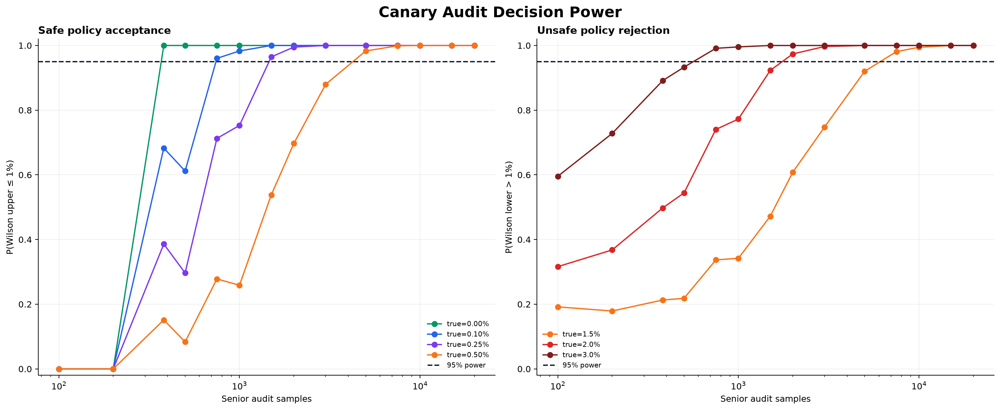
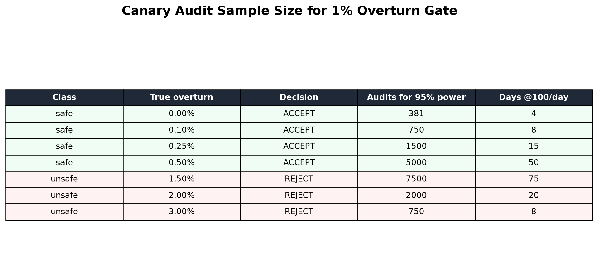

# Routing Review Canary 판정력 연구 — 2026-08-27

## 결론

공통오류 방어 audit을 운영해도 표본이 작으면 observed overturn rate만으로 안전성을 판단할 수
없다. Consensus overturn 목표를 1%로 두고 다음 양측 Wilson 95% 판정 규칙을 사용한다.

- `upper ≤ 1%`: `ACCEPT`
- `lower > 1%`: `REJECT`
- 나머지: `INCONCLUSIVE`

각 실제 overturn rate와 audit 표본 수 조합을 5,000회 Monte Carlo로 평가해 올바른 승인 또는
기각 확률이 95%에 처음 도달하는 지점을 찾았다.

| 실제 overturn | 분류 | 판정 | 95% 판정력 audit 수 | 100 audit/일 |
|---:|---|---|---:|---:|
| 0.00% | 안전 | ACCEPT | 381 | 4일 |
| 0.10% | 안전 | ACCEPT | 750 | 8일 |
| 0.25% | 안전 | ACCEPT | 1,500 | 15일 |
| 0.50% | 안전 | ACCEPT | 5,000 | 50일 |
| 1.50% | 위험 | REJECT | 7,500 | 75일 |
| 2.00% | 위험 | REJECT | 2,000 | 20일 |
| 3.00% | 위험 | REJECT | 750 | 8일 |

오류가 0건일 때의 381개 규칙은 특수한 경우다. 실제 안전 오류율이 0.5%라면 381건으로는
95% 확률의 승인을 보장하지 못하고 약 5,000건이 필요하다. 반대로 gate에 가까운 1.5% 위험
정책도 확실히 기각하려면 약 7,500건이 필요하다. 따라서 일정 기간이 지났다는 이유로
`INCONCLUSIVE`를 승인으로 해석하면 안 된다.





## 단일 checkpoint 기준

위 표본 수는 각 N에서 한 번만 판정하는 단일-look 기준이다. 여러 N에서 반복 확인할 때는
그대로 사용할 수 없다. 후속 [순차 Canary 판정 연구](routing-review-canary-sequential-2026-08-27.md)가
alpha-spending과 고정 cohort/checkpoint를 운영 기본값으로 채택했다.

## 운영 집계 API

다음 endpoint를 추가했다.

```http
GET /api/v2/workspaces/{workspaceId}/route-reviews/canary-metrics
    ?since=2026-08-27T00:00:00Z&checkpoint=1000
```

- 권한: OWNER·ADMIN의 `agent.route.adjudicate`
- cohort: 고정 `since`, observation 발생 시각 기준
- checkpoint: 사전 등록된 첫 N개 consensus audit
- scope: 요청 workspace만 집계
- 출력: completed gold, pending adjudication, senior audit, dual completion, disagreement
- 품질: risk/natural consensus audit별 overturn 수, Wilson 95% 구간, 판정
- 전체 판정: 하나라도 `REJECT`면 `REJECT`, 둘 다 `ACCEPT`일 때만 `ACCEPT`, 그 외 `INCONCLUSIVE`

API는 reviewer ID와 개별 vote를 반환하지 않는다. PostgreSQL window function으로 observation별
첫째·둘째·senior vote 순서를 계산한 뒤 aggregate count만 projection한다. 첫 두 vote가 같은
audit만 consensus overturn 분모에 포함하며, senior가 다른 route로 바꾼 건을 오류 신호로 센다.

실제 PostgreSQL Testcontainer에서 두 일반 reviewer가 같은 route에 합의하고 senior가 overturn한
경우 risk audit `1`, overturn `1`, risk `REJECT`, natural `INCONCLUSIVE`, overall `REJECT`가
반환되는 것을 RBAC와 함께 검증했다.

## 운영 해석

Canary endpoint의 `overallDecision=ACCEPT`는 gold label 생성 과정의 공통오류 gate만 통과했다는
뜻이다. Router 자체의 승격에는 별도로 다음 조건이 모두 필요하다.

- project/workspace grouped holdout
- route별 최소 100건
- HUMAN_REQUIRED recall 0.95 이상
- false automation Wilson 95% 상한 1% 이하
- Macro-F1 0.80 이상
- 자연 traffic 비용·latency gate
- production rollback 검증

`REJECT`가 나오면 router 승격을 즉시 중지하고 review guide, reviewer 분리, senior 교육자료를
점검한다. `INCONCLUSIVE`면 정책을 낮추지 않고 audit을 계속 수집한다.

## 제한

- 각 audit의 Bernoulli 결과가 독립이라는 가정이 있다.
- 동일 reviewer가 반복 참여하면 시간적·개인별 군집 효과로 유효 표본수가 줄 수 있다.
- 다중 workspace를 합쳐 계산하지 않으므로 작은 workspace는 오랫동안 inconclusive일 수 있다.
- 단일-look 표본수 결과는 순차 조회에 직접 사용할 수 없다. 실제 endpoint는 alpha-spending
  checkpoint를 강제한다.

## 재현

```powershell
uv run routing-benchmark `
  --output-dir reports/2026-08-27-review-canary-power `
  review-canary-power --trials 5000 --seed 20260827
```

결과는 JSON, CSV, dashboard PNG와 plot table PNG로 기록된다.
