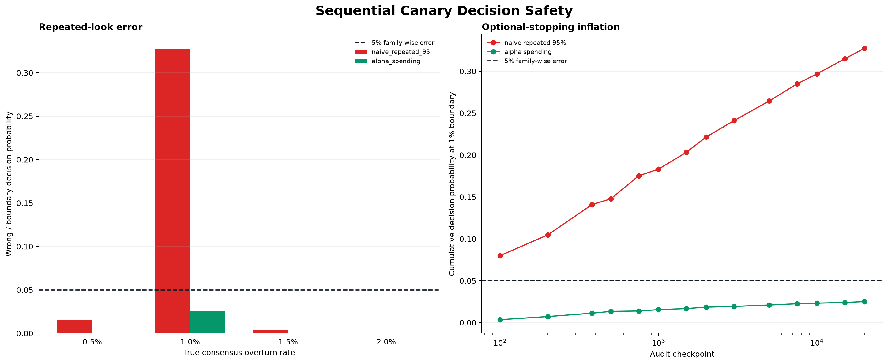
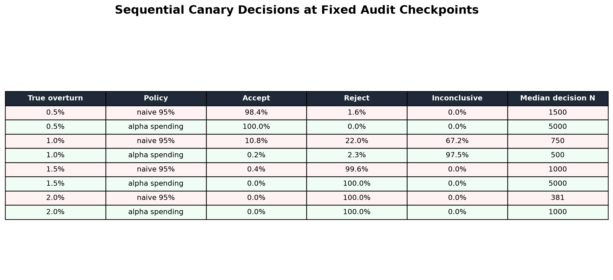

# Routing Review 순차 Canary 판정 연구 — 2026-08-27

## 결론

고정 표본용 Wilson 95% 구간을 audit이 쌓일 때마다 반복 조회하면 optional stopping으로 전체
오판 확률이 커진다. 100~20,000건의 14개 checkpoint에서 일반 Wilson 판정을 반복하는 정책과,
전체 5% 오류 예산을 `14 checkpoint × 2 stratum = 28 looks`에 Bonferroni로 나눈
alpha-spending 정책을 각각 20,000회 시뮬레이션했다.

| 실제 overturn | 정책 | ACCEPT | REJECT | INCONCLUSIVE | 중앙 판정 audit |
|---:|---|---:|---:|---:|---:|
| 0.5% | 반복 95% | 98.4% | 1.6% | 0.0% | 1,500 |
| 0.5% | alpha spending | 100.0% | 0.0% | 0.0% | 5,000 |
| 1.0% 경계 | 반복 95% | 10.8% | 22.0% | 67.2% | 750 |
| 1.0% 경계 | alpha spending | 0.2% | 2.3% | 97.5% | 500 |
| 1.5% | 반복 95% | 0.4% | 99.6% | 0.0% | 1,000 |
| 1.5% | alpha spending | 0.0% | 100.0% | 0.0% | 5,000 |
| 2.0% | 반복 95% | 0.0% | 100.0% | 0.0% | 381 |
| 2.0% | alpha spending | 0.0% | 100.0% | 0.0% | 1,000 |

실제 overturn이 정확히 1%인 경계에서 일반 95% 반복 조회는 누적 판정 확률이 `32.75%`였다.
한 stratum의 alpha-spending 판정 확률은 `2.51%`로 낮아졌고, 두 stratum을 합친 family-wise
상한을 5% 이내로 유지한다. 대가로 안전한 0.5%
정책의 중앙 판정 시점은 1,500건에서 5,000건으로 늦어진다. 운영 기본값은 빠른 판정보다
오판 통제를 우선해 alpha-spending을 사용한다.





## 사전 등록 판정 규칙

허용 checkpoint는 다음 14개로 고정한다.

```text
100, 200, 381, 500, 750, 1000, 1500, 2000, 3000,
5000, 7500, 10000, 15000, 20000
```

전체 양측 오류 예산 5%를 28번의 look에 균등 배분해 `z=3.1237346303`을 사용한다. 각
checkpoint에서 risk와 natural consensus audit의 첫 N개만 고정 표본으로 계산한다.

- adjusted Wilson upper ≤ 1%: `ACCEPT`
- adjusted Wilson lower > 1%: `REJECT`
- checkpoint 미도달 또는 구간이 1%와 겹침: `INCONCLUSIVE`

## 운영 API 강제사항

```http
GET /api/v2/workspaces/{workspaceId}/route-reviews/canary-metrics
    ?since=2026-08-27T00:00:00Z
    &checkpoint=1000
```

- `since`는 사전 등록한 canary 시작 시각이며 필수다.
- Rolling `days=30`은 cohort가 이동하므로 제거했다.
- `since`는 현재보다 미래일 수 없고 최근 365일 이내여야 한다.
- 등록되지 않은 checkpoint는 400을 반환한다.
- PostgreSQL은 senior audit 완료 시각 순서의 첫 N개 consensus audit만 계산한다.
- 현재 available audit이 N보다 작으면 interval을 보여주더라도 판정은 `INCONCLUSIVE`다.
- 동일 `since + checkpoint` 재조회는 같은 표본을 사용한다.
- 전체 응답은 family-wise simultaneous confidence 95%를 명시한다.

OWNER·ADMIN의 `agent.route.adjudicate` 권한이 필요하고 reviewer ID·개별 vote는 응답하지 않는다.
Risk 또는 natural 중 하나라도 `REJECT`면 overall `REJECT`, 두 층 모두 `ACCEPT`일 때만 overall
`ACCEPT`다.

실제 PostgreSQL Testcontainer에서 audit이 1건뿐인 cohort에 checkpoint 100을 요청했을 때,
overturn이 1건이어도 미도달 상태를 `INCONCLUSIVE`로 유지하는 것을 검증했다. 별도 service
검증에서는 도달한 checkpoint의 높은 overturn을 `REJECT`했다.

## 제한과 다음 단계

- Bonferroni 균등 배분은 단순하고 안전하지만 최적 alpha-spending보다 보수적이다.
- 두 stratum과 여러 workspace를 동시에 승격 판단하면 상위 수준의 다중검정 보정이 추가로 필요하다.
- Canary 시작 시각과 checkpoint 계획은 배포 기록에 고정해야 한다.
- 판정 후 cohort나 label 정책을 바꾸면 새 canary `since`로 다시 시작해야 한다.
- Gold 품질 `ACCEPT`는 router 성능 승격을 의미하지 않는다.

## 재현

```powershell
uv run routing-benchmark `
  --output-dir reports/2026-08-27-review-canary-sequential `
  review-canary-sequential --trials 20000 --seed 20260827
```

결과는 JSON, CSV, dashboard PNG와 plot table PNG로 기록된다.
