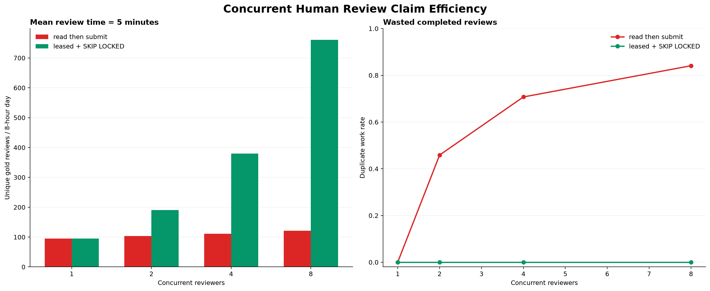
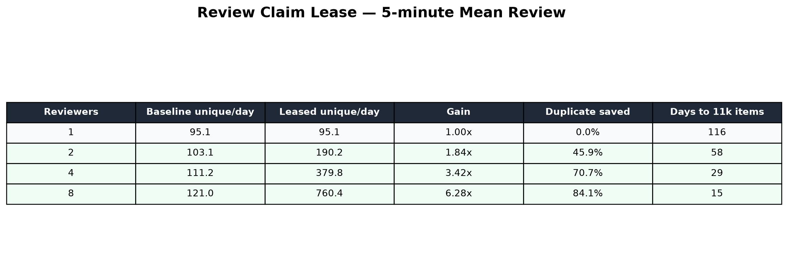

# Routing Human Review 동시성 연구 — 2026-08-27

## 결론

검토자가 pending 목록을 읽고 완료할 때까지 row를 예약하지 않는 방식은 동시 검토자를 늘려도
같은 오래된 observation을 반복 선택한다. 이를 PostgreSQL `FOR UPDATE SKIP LOCKED`와 15분
review lease로 교체했다.

평균 검토시간 5분, 8시간 근무일, lognormal 변동 `sigma=0.35`, 시나리오당 500회 Monte Carlo에서
결과는 다음과 같았다.

| 동시 검토자 | 기존 unique/일 | Lease unique/일 | 처리량 증가 | 기존 중복 작업률 | 11,000건 도달 |
|---:|---:|---:|---:|---:|---:|
| 1 | 95.1 | 95.1 | 1.00배 | 0.0% | 116일 |
| 2 | 103.1 | 190.2 | 1.84배 | 45.9% | 58일 |
| 4 | 111.2 | 379.8 | 3.42배 | 70.7% | 29일 |
| 8 | 121.0 | 760.4 | 6.28배 | 84.1% | 15일 |

Lease 전략의 중복 작업률은 모델의 모든 조건에서 0%였다. 표의 11,000건은 단일 work item
완료 기준이다. 후속 공통오류 robustness canary 정책은 gold당 2.27 vote를 요구하므로 11,000개
accepted gold에는 약 24,980 work item이 필요하다. 이 경우 4명/5분 조건은 약 66 근무일,
8명 조건은 약 33 근무일이다. Senior 권한 reviewer의 별도 처리량은 추가로 확인해야 한다.





## 구현

- Migration: `V24__route_review_claim_lease.sql`
- Claim API: `POST /api/v2/workspaces/{workspaceId}/route-reviews/claims?limit=10`
- Claim scope: 인증된 workspace와 `agent.route.review` 권한
- Lease: 15분
- Selection: natural/risk를 50:50으로 교차
- Concurrency: 두 query 모두 `FOR UPDATE SKIP LOCKED`
- Expiration: lease가 만료된 observation은 다른 reviewer가 다시 claim 가능
- Completion: 현재 reviewer가 보유한 만료 전 claim만 review 가능
- Completed review는 claim owner와 lease를 즉시 제거
- 반복 claim: 기존 활성 claim을 먼저 반환하고 reviewer당 활성 작업을 최대 100개로 제한

실제 PostgreSQL Testcontainer에서 두 transaction이 동시에 risk observation을 1개씩 claim했을 때
서로 다른 ID를 얻는 것을 검증했다. UI의 GET preview도 활성 lease row를 제외한다.

## 운영 metric

수집 기능 flag가 활성화된 환경에서 다음 Micrometer metric을 제공한다. Workspace를 label로
사용하지 않아 tenant 수에 따른 time-series cardinality 증가를 막는다.

- `freelance_ops.route.collection.backlog`
- `freelance_ops.route.collection.oldest.lag.seconds`
- `freelance_ops.route.collection.batches`
- `freelance_ops.route.collection.retries`
- `freelance_ops.route.collection.snapshot.latency`
- `freelance_ops.route.observations.captured`
- `freelance_ops.route.review.backlog`
- `freelance_ops.route.review.oldest.age.seconds`
- `freelance_ops.route.review.claims`
- `freelance_ops.route.review.votes`
- `freelance_ops.route.review.completed`

Backlog와 age gauge는 기본 15초마다 DB aggregate를 갱신한다. 운영 alert 초기값은 collection
oldest lag 120초 초과, retry rate 5분 평균 5% 초과, review oldest age가 목표 SLA를 초과할 때다.
초기값은 canary 실측 p95와 업무일정을 반영해 다시 조정한다.

## 해석 제한

- 기존 방식 결과는 모든 reviewer가 oldest-unreviewed를 선택하는 현재 FIFO 동작을 모델링한다.
- 사람 간 난이도 차이, 휴식, 항목별 route 난이도는 lognormal 시간 변동 외에는 포함하지 않았다.
- Lease 방식은 검토자가 15분 안에 제출한다고 가정하지 않는다. 15분을 넘기면 다른 reviewer가
  가져갈 수 있고 늦은 제출은 409가 된다.
- 8명/5분 조건의 760건/일은 infrastructure capacity이며, 실제 reviewer 품질과 조직 인력 비용을
  고려한 권장 인원 수가 아니다.

## 재현

```powershell
uv run routing-benchmark `
  --output-dir reports/2026-08-27-review-claim-capacity `
  review-claim-capacity --trials 500 --seed 20260827
```

결과는 JSON, CSV, dashboard PNG, plot table PNG로 기록된다.
