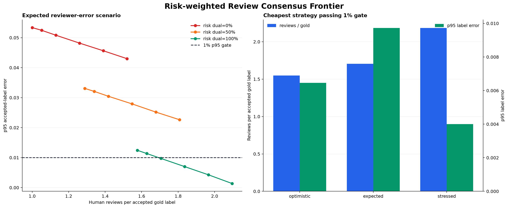
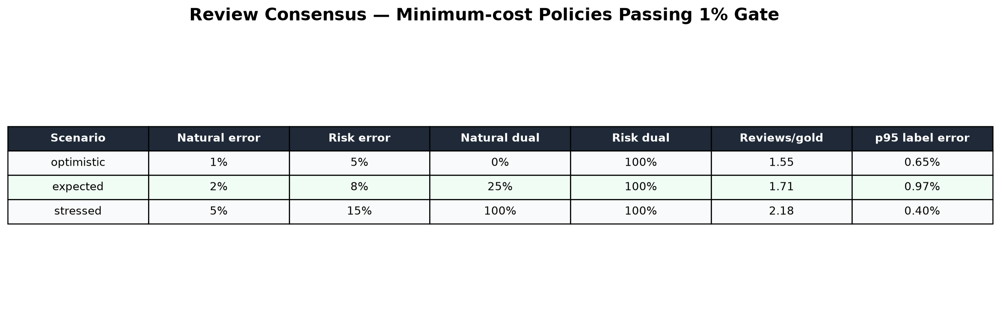

# Routing Gold Label Consensus 연구 — 2026-08-27

## 결론

한 명의 review를 바로 gold label로 확정하면 reviewer 오류가 router 평가 결과에 그대로 섞인다.
위험 route는 전수 blind dual review하고 자연 traffic은 일부만 dual review하며, 두 vote가 다를
때만 제3자가 adjudication하는 정책을 평가했다.

11,000개 label, natural/risk 50:50, 잘못된 route는 나머지 4개 route에 균등하게 분포한다고
가정하고 전략별 5,000회 Monte Carlo를 수행했다. 선택 기준은 accepted gold label 오류율의
p95가 1% 이하인 전략 중 human review 횟수가 가장 적은 것이다.

| Reviewer 오류 시나리오 | Natural 오류 | Risk 오류 | Natural dual | Risk dual | Reviews/gold | p95 label 오류 |
|---|---:|---:|---:|---:|---:|---:|
| 낙관 | 1% | 5% | 0% | 100% | 1.55 | 0.65% |
| 예상 | 2% | 8% | 25% | 100% | 1.71 | 0.97% |
| 스트레스 | 5% | 15% | 100% | 100% | 2.18 | 0.40% |

이 결과는 reviewer 오류 독립 가정의 기준선이다. 후속 [공통오류 Robustness 연구](routing-review-consensus-robustness-2026-08-27.md)에서
기존 후보 정책이 p95 `2.06%`로 실패했으므로 운영 기본값은 natural dual 50%, risk senior
audit 100%, natural consensus audit 5%로 대체했다.





## 비용 모델

단일 review item의 reviewer 오류율을 `e`라고 하면 blind dual review가 같은 잘못된 route에
합의할 확률은 잘못된 label이 4개에 균등하다는 가정에서 `e²/4`다. 두 vote가 다르면 adjudicator가
정답을 선택한다고 가정했다.

Dual-review item당 기대 review 수는 다음과 같다.

```text
2 + P(two reviewers disagree)
```

예상 시나리오에서 natural 10% dual은 평균 오류는 1% 아래였지만 표본 변동을 포함한 p95가
1.12%여서 기각했다. Natural 25%가 p95 0.97%로 처음 gate를 통과했다.

## 구현

Migration `V25__route_review_consensus.sql`은 다음 구조를 추가한다.

- observation의 `review_target`, `review_votes`, `review_status`
- reviewer별 immutable `agent_route_review_vote`
- `(observation_id, reviewer_id)` unique constraint
- 위험 route의 review target이 2 이상임을 강제하는 DB constraint
- `PENDING → ADJUDICATION → COMPLETED` 상태 제약
- OWNER/ADMIN 전용 `agent.route.adjudicate` permission

운영 처리 규칙은 다음과 같다.

1. V25 기준 `REACT_AGENT`, `HUMAN_REQUIRED`, shadow/actual disagreement는 target 2였다.
2. V25 기준 자연 표본은 UUID stable hash로 25%만 target 2였다.
3. 첫 reviewer의 vote 내용은 다음 reviewer 응답에 노출하지 않는다.
4. 동일 reviewer는 같은 observation에 두 번 vote할 수 없다.
5. 두 vote가 같으면 consensus gold를 확정한다.
6. 다르면 target 3과 `ADJUDICATION`으로 전환한다.
7. 일반 review claim에서는 adjudication item을 제외한다.
8. OWNER/ADMIN이 별도 adjudication claim을 받고 이전 두 label을 확인한다.
9. 제3자 vote를 최종 gold로 확정하고 모든 vote audit trail을 보존한다.
10. 반복 claim은 상태별 활성 lease만 반환해 일반 review와 adjudication 작업을 분리한다.

Adjudication API는 다음과 같다.

- `POST /api/v2/workspaces/{workspaceId}/route-reviews/adjudication-claims`
- `GET /api/v2/workspaces/{workspaceId}/route-reviews/{observationId}/adjudication`

실제 PostgreSQL Testcontainer와 workspace RBAC를 사용해 Manager 두 명의 blind vote, 상반된
두 vote, Admin adjudication claim/context, 최종 gold 확정, vote 3건 보존을 수직 통합 검증했다.
최신 상태 경계 변경을 포함한 전체 Spring 회귀 suite도 통과했다.

현재 production policy와 V26 변경은 후속 robustness 문서를 기준으로 한다.

## 운영 관측

기존 claim/completed metric에 `freelance_ops.route.review.votes`를 추가했다. 다음 비율을 canary
dashboard에서 계산해야 한다.

- disagreement rate: `ADJUDICATION 전환 / 두 번째 vote`
- consensus completion rate: `completed / vote`
- reviews per gold: `vote / completed`
- natural audit disagreement와 risk disagreement 분리

Reviewer 개인 ID를 metric label로 사용하지 않는다. 개별 vote는 RBAC가 적용된 DB audit trail에만
보존한다.

## 제한과 승격 조건

- Reviewer 오류 독립성과 adjudicator 정답률 100%는 낙관적 가정이다.
- 같은 교육자료나 UI에서 발생하는 상관 오류는 dual review로 제거되지 않을 수 있다.
- Canary에서 reviewer 간 Cohen/Fleiss kappa와 adjudication overturn rate를 별도로 측정해야 한다.
- Gold consensus 품질이 확인되기 전에는 router Macro-F1 차이를 production 승격 근거로 사용하지 않는다.

## 재현

```powershell
uv run routing-benchmark `
  --output-dir reports/2026-08-27-review-consensus `
  review-consensus --trials 5000 --seed 20260827
```

결과는 JSON, CSV, dashboard PNG, plot table PNG로 기록된다.
