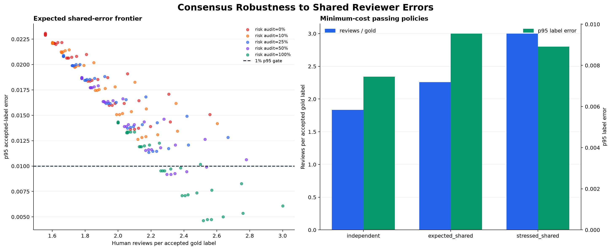
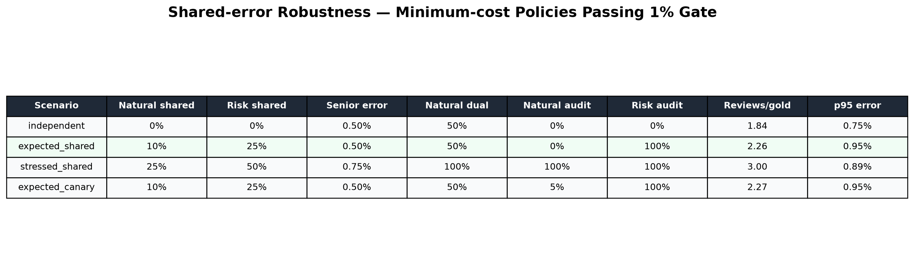

# Routing Review 공통오류 Robustness 연구 — 2026-08-27

## 결론

기존 blind dual-review 연구는 reviewer 오류가 독립적이라고 가정했다. 두 reviewer가 같은
교육자료·UI·정책 해석을 공유해 동일한 잘못된 route를 선택하면, 두 표가 일치하므로 기존
adjudication 조건이 오류를 발견하지 못한다.

11,000개 accepted gold, natural/risk 50:50, 전략별 5,000회 Monte Carlo에서 reviewer 한 명의
주변 오류율은 유지하되 그 오류의 일부가 동일 오답으로 공유되게 했다. 위험 표본은 100%
dual-review로 고정하고 natural dual 비율과 합의 후 senior audit 비율을 탐색했다.

| 시나리오 | Natural 공유오류 | Risk 공유오류 | Senior 오류 | Natural dual | Natural audit | Risk audit | Reviews/gold | p95 오류 |
|---|---:|---:|---:|---:|---:|---:|---:|---:|
| 독립 | 0% | 0% | 0.50% | 50% | 0% | 0% | 1.84 | 0.75% |
| 예상 공유 | 10% | 25% | 0.50% | 50% | 0% | 100% | 2.26 | 0.95% |
| 스트레스 공유 | 25% | 50% | 0.75% | 100% | 100% | 100% | 3.00 | 0.89% |
| 운영 canary | 10% | 25% | 0.50% | 50% | 5% | 100% | 2.27 | 0.95% |

기존 `natural dual 25% + risk dual 100% + 합의 audit 0%`는 예상 공유오류에서 p95 label
오류가 `2.06%`로 상승해 1% gate를 실패했다. 따라서 독립오류 기반의 이전 기본값은
운영 기본값으로 사용하지 않는다.

최소 통과 정책은 `natural dual 50% + risk senior audit 100%`다. 실서비스 canary는 자연
공통오류를 실제로 관측할 수 있도록 dual-reviewed natural 표본의 5%도 senior audit한다.
추가 관측 비용은 gold당 약 `0.012 review`이며 총 `2.27 reviews/gold`다.





## 오류 모델

Reviewer 주변 오류율을 `e`, 그 오류 중 동일 오답으로 공유되는 비율을 `c`로 정의한다.
확률 `e × c`에서는 두 reviewer가 같은 잘못된 route를 선택한다. 나머지 경우에는 주변
오류율이 `e`로 유지되도록 보정한 독립 오류를 발생시키며, 잘못된 label은 다른 네 route에
균등하게 분포한다고 가정한다.

Dual-review 불일치는 항상 senior가 판정한다. Audit 대상으로 선택된 합의 건도 senior가
독립적으로 최종 판정한다. Senior 오류율은 예상 시나리오 0.5%, 스트레스 시나리오 0.75%로
두었다. 이 값들은 실제 측정값이 아니라 운영 정책의 민감도 분석용 가정이다.

## 운영 구현

`V26__route_review_shared_error_audit.sql`과 review policy는 다음 기본값을 적용한다.

- `REACT_AGENT`, `HUMAN_REQUIRED`, shadow/actual disagreement: 처음부터 target 3
- 자연 traffic: stable hash로 50% target 2
- dual-reviewed natural 중 별도 stable hash 5%: target 3
- target 3은 첫 두 vote가 같아도 `ADJUDICATION`으로 전환
- OWNER·ADMIN senior가 이전 두 label을 확인하고 세 번째 최종 vote 기록

환경 설정은 다음과 같다.

```text
AGENT_ROUTE_REVIEW_NATURAL_DUAL_PERCENT=50
AGENT_ROUTE_REVIEW_NATURAL_SENIOR_AUDIT_PERCENT=5
```

V26은 기존 미완료 위험 observation도 target 3으로 올리고, 아직 vote가 없는 자연 observation의
50%를 target 2, 그중 5%를 target 3으로 backfill한다. DB constraint는 미완료 위험 route가
target 3이 아니면 거부한다.
위험 senior audit은 DB invariant이므로 애플리케이션 설정으로 낮출 수 없다. 비상 시에는
`AGENT_ROUTE_OBSERVATION_COLLECTION_ENABLED=false`로 신규 intake를 중지한다.

## 용량 영향

Canary 기본값은 11,000 accepted gold에 평균 약 24,980 vote를 요구한다. 기존 reviewer
claim 실험의 처리량을 그대로 적용하면 평균 5분 기준 4명은 약 66 근무일, 8명은 약 33
근무일이다. Senior audit은 별도 권한 인력의 병목이 될 수 있으므로 일반 reviewer 처리량만으로
운영 일정을 확정하면 안 된다.

## Canary에서 측정할 값

- risk consensus overturn: 첫 두 vote가 같았으나 senior가 변경한 비율
- risk disagreement와 senior 변경 비율
- natural 5% audit의 consensus overturn과 Wilson 95% 상한
- senior reviewer 자체의 재감사 오류율
- strata별 reviews/gold와 oldest adjudication age

공유오류율을 직접 식별하려면 합의 건 audit이 반드시 필요하다. 자연 audit에서 표본이 작거나
overturn Wilson 상한이 목표를 넘으면 audit 비율을 10%, 25%, 100% 순서로 올린다.
필요 표본 수와 `ACCEPT/REJECT/INCONCLUSIVE` 규칙은
[Canary 판정력 연구](routing-review-canary-power-2026-08-27.md)를 따른다.

## 제한과 승격 조건

- 공통오류 상태가 item 간 독립이라는 단순화가 있다.
- Senior도 동일 교육자료를 사용하면 오류가 독립적이지 않을 수 있다.
- 실제 canary overturn 데이터가 없으므로 10%/25% 공유오류는 측정값이 아니다.
- Human gold 품질을 검증하기 전 router Macro-F1 승격 판단을 하지 않는다.
- 실측 p95 label 오류의 Wilson/bootstrap 상한이 1% 이하일 때만 현재 audit 비율을 낮출 수 있다.

## 재현

```powershell
uv run routing-benchmark `
  --output-dir reports/2026-08-27-review-consensus-robustness `
  review-consensus-robustness --trials 5000 --seed 20260827
```

결과는 JSON, CSV, dashboard PNG와 plot table PNG로 기록된다.
