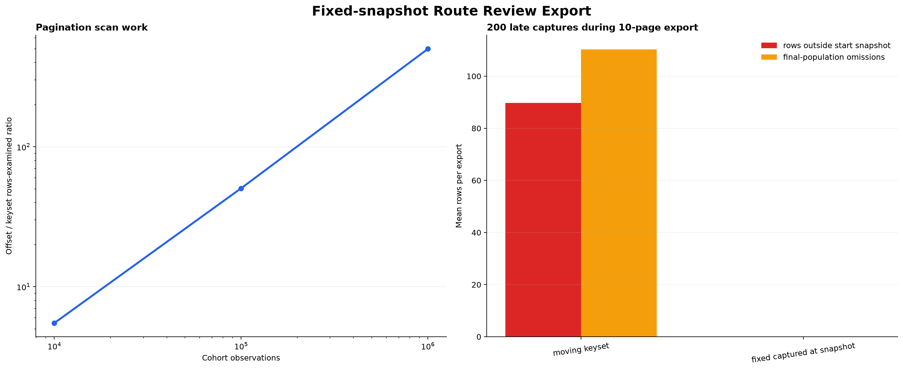
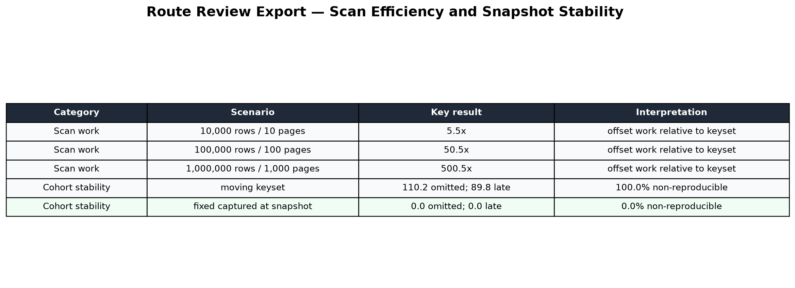

# Routing Review 고정 Cohort Export 연구 — 2026-08-27

## 결론

운영 observation과 확정 gold를 HMAC 평가기로 전달하는 재현 가능한 export 경로를 구현했다.
`since/until`만 고정하면 export 중 지연 수집된 과거 event가 페이지 앞쪽에 삽입되어 누락되므로,
첫 응답의 `snapshotAt`과 `(occurredAt, observationId)` keyset cursor를 모든 페이지에서 고정한다.

| Cohort | 페이지 | Offset / keyset scan work |
|---:|---:|---:|
| 10,000 | 10 | 5.5배 |
| 100,000 | 100 | 50.5배 |
| 1,000,000 | 1,000 | 500.5배 |

10,000건을 10페이지로 읽는 동안 occurrence 위치가 무작위인 지연 수집 200건이 들어오는 조건을
2,000회 시뮬레이션했다. Snapshot 없는 moving keyset은 시작 cohort 밖의 행을 평균 `89.8건`
포함하고, export 종료 시점 population에서는 평균 `110.2건`을 누락했다. 모든 시행의 결과가 시작
snapshot과 달랐다. `captured_at <= snapshotAt`을 고정하면 snapshot 기준 포함·누락 오류는 0건이다.





## API 계약

`data.export` 권한이 있는 OWNER·ADMIN만 호출할 수 있다.

```http
GET /api/v2/workspaces/{workspaceId}/route-reviews/export
    ?since=2026-08-01T00:00:00Z
    &until=2026-08-27T00:00:00Z
    &limit=1000
```

첫 응답은 서버가 정한 `snapshotAt`, `nextOccurredAt`, `nextObservationId`, `hasMore`를 반환한다.
두 번째 페이지부터 동일한 `since`, `until`, `snapshotAt`과 직전 두 cursor 값을 전송한다.

- Cohort window는 최대 90일이며 `since`는 최근 365일 이내다.
- `until <= snapshotAt <= 현재 시각`이어야 한다.
- `afterOccurredAt`과 `afterId`는 둘 다 있거나 둘 다 없어야 한다.
- 한 페이지는 최대 1,000 observation이다.
- occurrence는 window 안이고 capture가 snapshot 이전인 행만 포함한다.
- Gold는 `reviewedAt <= snapshotAt`에 이미 `COMPLETED`였던 경우만 같은 페이지의 reviews에 넣는다.
- Reviewer ID, 개별 blind vote, prompt, requirement 원문은 반환하지 않는다.

각 페이지를 접근 통제된 JSONL 파일의 한 줄로 기록한다. 마지막 줄은 반드시 `hasMore=false`여야
한다. 준비 도구는 cohort/snapshot 일치, terminal page, cursor와 마지막 observation 일치,
전체 keyset 정렬, 중복 run/event, orphan review를 검증한다.

```powershell
$env:ROUTING_SHADOW_HASH_KEY = '<secret manager key, 32 bytes 이상>'
$env:ROUTING_SHADOW_HASH_KEY_VERSION = 'routing-shadow-2026-v1'

uv run routing-benchmark shadow-export-prepare `
  --pages secure/route-review-export-pages.jsonl `
  --trace-output secure/shadow-traces.jsonl
```

별도 raw observation/review 중간 파일을 만들지 않고 page 응답을 메모리에서 HMAC trace로 변환한다.
입력 page 파일에는 원본 UUID가 있으므로 일반 artifact나 Git에 저장하지 않고 접근 통제 후 삭제한다.

## 가격 Snapshot

Agent와 Spring의 telemetry 이름을 다음으로 통일했다.

```text
evaluatorProvider
evaluatorModel
routingInputTokens
routingOutputTokens
```

각 observation의 `occurredAt`에 적용되던 workspace model pricing 중 가장 최근 snapshot으로 routing
비용을 계산한다. 출력에는 `routingCostUsd`, `pricingSnapshotId`, `pricingVersion`, `costCurrency`를
기록하고 HMAC manifest에는 사용한 pricing ID·version 집합을 보존한다.

- `POLICY_GATE`는 evaluator 비용 0이다.
- evaluator 호출이 없고 token도 0인 fail-closed 행은 비용 0으로 보존한다.
- evaluator identity 일부 누락, 적용 가격 없음, USD가 아닌 가격은 409로 전체 export를 중단한다.
- Token은 0 이상의 정수여야 하며 수집 allowlist에서 먼저 검증한다.
- 같은 workspace/provider/model의 가격 유효기간은 PostgreSQL exclusion constraint로 겹칠 수 없다.

누락 가격을 0으로 간주하지 않기 때문에 비용 절감률이 과대평가되지 않는다.

## 구현 검증

- Spring service/collector 단위 테스트 통과
- 실제 PostgreSQL Testcontainer에서 첫 페이지와 다음 keyset 페이지가 서로 다른 observation을 반환
- Python page 계약 및 HMAC 준비 테스트 통과
- 100만 행 offset/keyset scan work 산식 테스트 통과
- 생성된 dashboard와 plot table 육안 검수

PostgreSQL 검증은 기능 정확성 확인이며 100만 행 실제 부하 측정은 아니다. Scan work는 일반적인
offset pagination의 누적 skip 행을 계산한 분석 모델이다.

## 재현

```powershell
uv run routing-benchmark `
  --output-dir reports/2026-08-27-route-review-export-capacity `
  review-export-capacity --trials 2000 --seed 20260827
```

결과는 JSON, CSV, dashboard PNG, plot table PNG로 기록된다.

## 제한과 다음 단계

- Export page 파일 자체는 HMAC 이전 원본 UUID를 포함하므로 장기 보관 대상이 아니다.
- 실제 production 대용량 cohort에서 query latency, DB buffer hit, 응답 압축률을 측정해야 한다.
- 실제 human-reviewed trace가 승격 gate를 통과하기 전 router는 계속 `SHADOW_ONLY`다.
