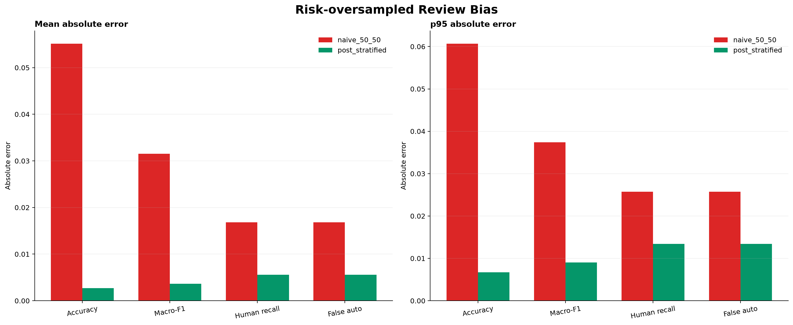
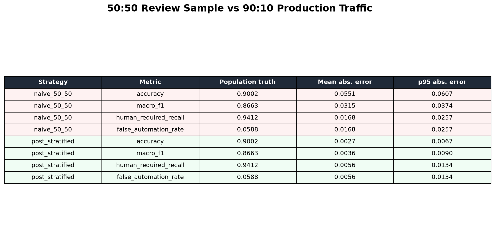

# Routing Review 표본 편향 보정 연구 — 2026-08-27

## 결론

운영 review queue의 `natural 50% + risk 50%` 배분은 희소한 위험 route의 안전성 근거를 빠르게
모으는 데 효율적이지만, review 결과를 그대로 평균하면 실제 traffic 품질을 크게 왜곡한다.
실제 traffic이 natural 90%, risk 10%인 조건에서 각 층 5,500건을 검토하는 실험을 2,000회
반복했다.

| 지표 | 실제값 | 50:50 단순 평균 MAE | 사후층화 MAE | 단순 평균 p95 오차 | 사후층화 p95 오차 |
|---|---:|---:|---:|---:|---:|
| Accuracy | 0.9002 | 0.05512 | 0.00273 | 0.06065 | 0.00673 |
| Macro-F1 | 0.8663 | 0.03152 | 0.00362 | 0.03741 | 0.00904 |
| HUMAN_REQUIRED recall | 0.9412 | 0.01684 | 0.00555 | 0.02572 | 0.01339 |
| False automation rate | 0.0588 | 0.01684 | 0.00555 | 0.02572 | 0.01339 |

사후층화는 accuracy MAE를 95.0%, Macro-F1 MAE를 88.5% 줄였다. 따라서 50:50은 **수집
allocation**일 뿐 traffic 분포가 아니다. 운영 승격 보고서의 전체 accuracy, Macro-F1, 비용,
LLM 호출률과 latency는 반드시 같은 기간의 전체 observation에서 얻은 natural/risk population
prior로 복원한다.





## 실험 설계

- seed: `20260827`
- 반복: 2,000회
- 실제 traffic prior: natural 90%, risk 10%
- review: natural 5,500건, risk 5,500건
- 비교: 50:50 단순 평균과 알려진 population prior를 사용한 post-stratification
- 지표: accuracy, Macro-F1, HUMAN_REQUIRED recall, false automation rate

이 실험의 층별 confusion probability는 시나리오 fixture이며 실제 production 성능 측정값이 아니다.
목적은 층화 oversampling이 만드는 편향의 크기와 보정기의 복원 성질을 검증하는 것이다.

## 구현된 평가 계약

`shadow-prepare`는 review된 각 trace에 다음 값을 기록한다.

- `sampling_stratum`: `natural` 또는 `risk`
- `population_stratum_probability`: 같은 export 기간 전체 observation의 층 비율
- `review_inclusion_probability`: 해당 층의 `review 수 / observation 수`
- `sample_weight`: inclusion probability의 역수

`shadow-evaluate`는 project 우선, workspace fallback의 고정 group holdout을 만든 뒤 holdout 안의
각 층을 population prior에 맞게 사후층화한다. 가중 confusion matrix로 accuracy, Macro-F1,
route별 F1을 계산하고, 비용·LLM 호출률·평균 및 p95 latency도 같은 traffic weight를 사용한다.
리포트 비용 비교값은 표본 수에 따라 달라지는 합계가 아니라 요청당 평균 비용이다.

스키마 `1.1`은 세 sampling field의 일부 누락과 inclusion probability에 맞지 않는 weight를
거부한다. 전체 observation에 존재하는 층의 review가 하나도 없으면 준비를 실패시킨다. 평가
holdout에 population prior의 층이 빠져 합이 1이 되지 않아도 결과를 만들지 않는다. 이는 결측
층을 임의로 0% 위험으로 간주하는 오류를 막는다.

## 승격 Gate 해석

- 표본 수 조건은 raw review 수가 아니라 Kish effective sample size 1,000 이상이다.
- route별 최소 100건과 false automation 0건은 안전성 확인을 위해 raw count로 유지한다.
- confidence interval은 가중 비율과 Kish effective sample size를 사용한 Wilson 근사다.
- 이 근사는 복합 층화·group correlation의 정확한 survey variance가 아니므로 최종 production
  canary의 consensus overturn 판정은 별도 alpha-spending API를 계속 사용한다.
- `USER_EDIT`나 `POLICY_REPLAY`가 섞인 결과는 승격할 수 없고 human review만 허용한다.

즉, 사후층화 scorecard는 traffic 품질·비용 비교용이고, raw 위험 사례와 순차 canary는 안전성
판정용이다. 두 근거를 하나의 평균으로 합쳐 승격하지 않는다.

## 재현

```powershell
uv run routing-benchmark `
  --output-dir reports/2026-08-27-review-sampling-bias `
  review-sampling-bias --trials 2000 --seed 20260827
```

결과는 JSON, CSV, dashboard PNG, plot table PNG로 기록된다.

## 제한과 다음 단계

- 실제 traffic prior가 시간에 따라 변하면 고정 export window별로 prior와 평가를 다시 계산해야 한다.
- review inclusion이 같은 stratum 안에서도 고객·언어·route별로 다르면 2층 보정만으로 충분하지 않다.
- 실제 production trace에서는 가중치 극단값, effective sample size, group별 잔차를 추가 감시한다.
- 현재 repository에는 human-reviewed production trace가 없으므로 local router는 계속
  `SHADOW_ONLY`다.
