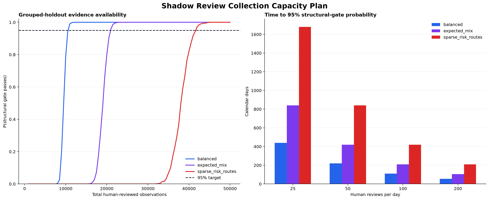
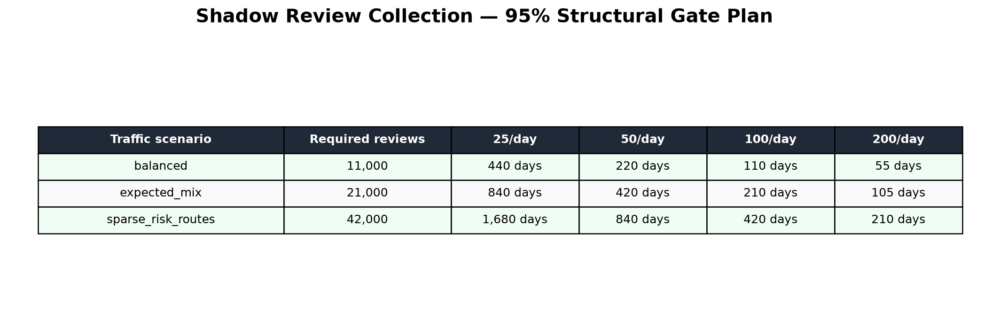
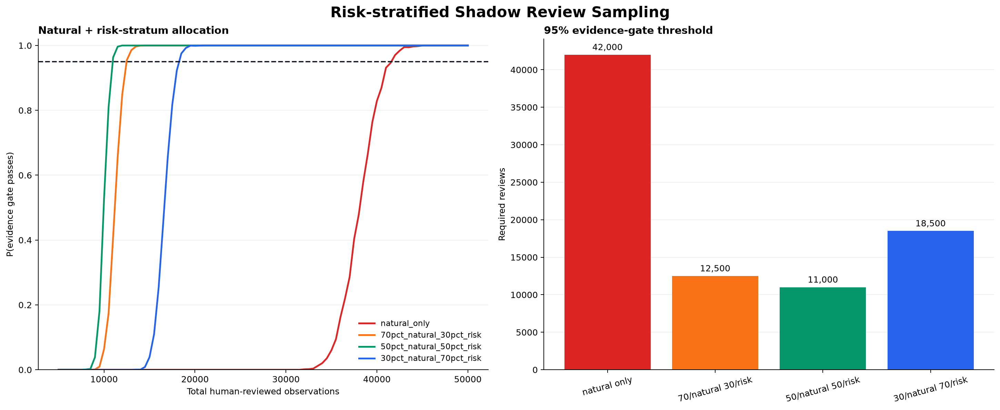
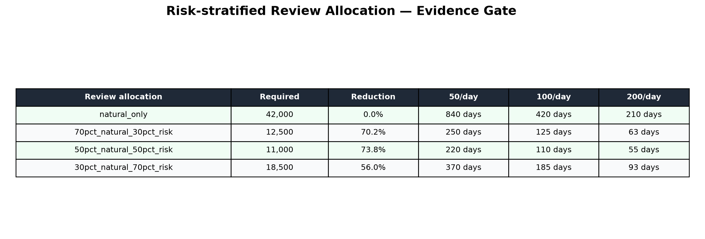

# Shadow Routing 운영 수집·검토 용량 연구 — 2026-08-27

## 결론

운영 `route.selected` event를 human-reviewed gold와 결합하는 비식별 준비 도구를 구현하고,
승격에 필요한 검토량을 Monte Carlo로 계산했다. 핵심 결과는 **1,000건을 수집하면 충분하다는
가정이 틀렸다**는 것이다.

20% project/workspace group holdout, route별 100건, false automation rate의 Wilson 95% 상한
1%를 동시에 만족할 확률이 95% 이상이 되려면 다음 전체 리뷰량이 필요하다.

| Traffic 가정 | 필요 human review | 50건/일 | 100건/일 | 200건/일 |
|---|---:|---:|---:|---:|
| route 균형 20% | 11,000 | 220일 | 110일 | 55일 |
| 예상 혼합 30/30/10/20/10% | 21,000 | 420일 | 210일 | 105일 |
| 위험 route 희소 35/35/5/20/5% | 42,000 | 840일 | 420일 | 210일 |

마지막 숫자는 측정 성능이 아니라 구조적 표본 gate를 만족할 확률이다. 시뮬레이션은 false
automation 0건을 가정했으며, 실제 Macro-F1·route별 F1·HUMAN recall gate는 별도로 통과해야 한다.





## 운영 수집 원본

현재 구현에서 Agent PostgreSQL의 `agent_runtime.agent_run_event`가 모든 `route.selected`를
구독 여부와 무관하게 저장한다. Spring SSE relay는 클라이언트가 구독했을 때만 실행되므로 연구
projection을 relay에 연결하면 selection bias가 생긴다. 검토 중 이 문제를 발견해 해당 구현은
채택하지 않았다.

운영 수집은 이후 [ADR-0029](../adr/0029-durable-route-observation-and-review.md)로 구현했다.
Agent DB를 Spring이 직접 읽지 않고 run-scoped finite snapshot API를 통해 서비스 경계를 유지한다.
Spring의 durable queue가 run별 event cursor, attempt, lease를 보존하고 allowlisted route telemetry만
workspace/project scoped projection으로 저장한다. `(agent_run_id, agent_event_id)` unique key로
at-least-once 재시도를 멱등하게 처리한다.

SSE 구독이나 UI 조회 횟수는 여전히 수집 조건으로 사용하지 않는다. 구현과 부하 결과는
[실서비스 Routing 관측·검토 파이프라인](routing-production-shadow-collector-2026-08-27.md)에
기록했다.

## Human review 입력

Reviewer는 prompt 자체가 아니라 기존 권한이 적용된 업무 화면에서 요청과 실제 실행 결과를 검토한
뒤 다음 최소 필드만 별도 JSONL로 내보낸다.

```json
{
  "run_id": "UUID",
  "event_id": 3,
  "workspace_id": "UUID",
  "gold_route": "HUMAN_REQUIRED",
  "correction_source": "HUMAN_REVIEW"
}
```

`workspace_id`는 observation과 review의 scope가 같은지 검증하기 위해 준비 단계까지만 사용하며,
최종 trace에는 남지 않는다. 같은 `(run_id, event_id)`의 중복 review와 workspace 불일치는 전체
준비 작업을 실패시킨다.

## 비식별 준비

`shadow-prepare`는 observation과 review를 join한 뒤 HMAC-SHA256으로 trace/workspace/project를
각기 다른 namespace에 hash한다. 단순 SHA-256보다 dictionary attack과 export 간 무단 연결을
줄이기 위해 32-byte 이상의 비밀 key가 필요하며 key는 CLI argument나 결과 파일에 기록하지 않는다.

```powershell
$env:ROUTING_SHADOW_HASH_KEY = '<secret manager에서 주입한 32-byte 이상 key>'
$env:ROUTING_SHADOW_HASH_KEY_VERSION = 'routing-shadow-2026-v1'

uv run routing-benchmark shadow-prepare `
  --observations secure/route-observations.jsonl `
  --reviews secure/route-reviews.jsonl `
  --trace-output secure/shadow-traces.jsonl
```

출력 manifest에는 observation/review/matched/missing/orphan 수와 결과 SHA-256을 기록한다. 최종
trace schema는 prompt, reviewer ID, run/workspace/project 원문과 알 수 없는 field를 거부한다.
같은 연구 기간에는 key version을 고정해 동일 project가 항상 같은 holdout partition에 들어가게
한다. Key 원문은 저장하지 않고 manifest에는 version label만 기록한다.

## 평가 실행

```powershell
uv run routing-benchmark `
  --output-dir reports/production-shadow-YYYY-MM-DD `
  shadow-evaluate `
  --traces secure/shadow-traces.jsonl
```

운영 trace와 review 원본은 repository에 commit하지 않는다. 비식별 결과도 workspace별 최소 표본이
너무 작으면 재식별 위험이 있으므로 접근 통제된 artifact storage에 저장하고, 공개 repository에는
aggregate plot과 gate 결과만 기록한다.

## 수집 용량 실험

시뮬레이션은 평균 group당 4개 observation, group holdout 20%, 고정 seed `20260827`, 각 점당
2,000회 시행을 사용했다. 전체 review 수를 1,000~50,000 범위에서 500 단위로 증가시켜 structural
gate 통과 확률이 처음 95%를 넘는 지점을 선택했다.

```powershell
uv run routing-benchmark `
  --output-dir reports/2026-08-27-shadow-collection-plan `
  collection-plan --trials 2000 --seed 20260827
```

희소 위험 route가 5%라면 20% holdout에 들어가는 HUMAN_REQUIRED는 전체 review의 약 1%다.
false automation 0건일 때도 Wilson 상한을 1% 이하로 낮추려면 약 381개 HUMAN_REQUIRED holdout이
필요하므로 총 review가 약 38,100건보다 커야 한다. sampling 변동까지 포함하면 이번 실험의 95%
지점은 42,000건이었다.

## 효율적인 수집 전략

모든 요청을 같은 비율로 검토하면 위험 route가 희소할 때 42,000건까지 늘어난다. 따라서 운영
review queue는 다음 두 층으로 구성한다.

1. 자연 traffic 무작위 표본: 실제 비용·latency·전체 정확도와 calibration 추정
2. 위험 route stratified oversample: HUMAN_REQUIRED, REACT_AGENT와 disagreement 경계의 안전성 추정

승격의 traffic-weighted 지표는 동일 기간 전체 observation의 natural/risk prior로 review holdout을
사후층화해야 한다. Oversample만으로 전체 accuracy나 비용 절감률을 보고하면 안 된다. 구현 및
편향 감소 결과는 [표본 편향 보정 연구](routing-review-sampling-bias-2026-08-27.md)에 기록했다.

### Sampling allocation 실험

희소 위험 route 시나리오에서 자연 표본 최소 1,000건 holdout을 별도로 유지하면서 risk stratum을
`REACT_AGENT 45%`, `HUMAN_REQUIRED 45%`, 나머지 10%로 구성했다.

| Review allocation | 필요 review | 자연 표본 대비 감소 | 100건/일 |
|---|---:|---:|---:|
| 자연 표본 100% | 42,000 | 0.0% | 420일 |
| 자연 70% + risk 30% | 12,500 | 70.2% | 125일 |
| 자연 50% + risk 50% | 11,000 | 73.8% | 110일 |
| 자연 30% + risk 70% | 18,500 | 56.0% | 185일 |

50:50 배분이 이번 조건에서 가장 효율적이었다. Risk 비중을 70%까지 늘리면 자연 traffic holdout
1,000건을 확보하는 시간이 다시 병목이 된다. 따라서 초기 운영 review queue 기본값은 자연 무작위
50%, 위험 stratum 50%로 제안한다. 실제 traffic priors가 쌓이면 이 비율을 다시 최적화한다.

이 수치는 accepted gold label 수 기준이다. 이후 [Gold Label Consensus 연구](routing-review-consensus-2026-08-27.md)에서
후속 공통오류 robustness canary 정책은 p95 1% gate와 공유오류 관측을 위해 gold당 평균
2.27 vote가 필요하다. 따라서 11,000 gold label의 인력 계획은 약 24,980 vote로 환산한다.





## 산출물

- 준비 코드: `experiments/routing_benchmark/src/routing_benchmark/shadow_collection.py`
- 용량 시뮬레이션: `experiments/routing_benchmark/src/routing_benchmark/collection_planning.py`
- review 배분 실험: `experiments/routing_benchmark/src/routing_benchmark/review_sampling.py`
- JSON/CSV/plot/표: `experiments/routing_benchmark/reports/2026-08-27-shadow-collection-plan/`
- 배분 실험 JSON/CSV/plot/표: `experiments/routing_benchmark/reports/2026-08-27-review-sampling/`
