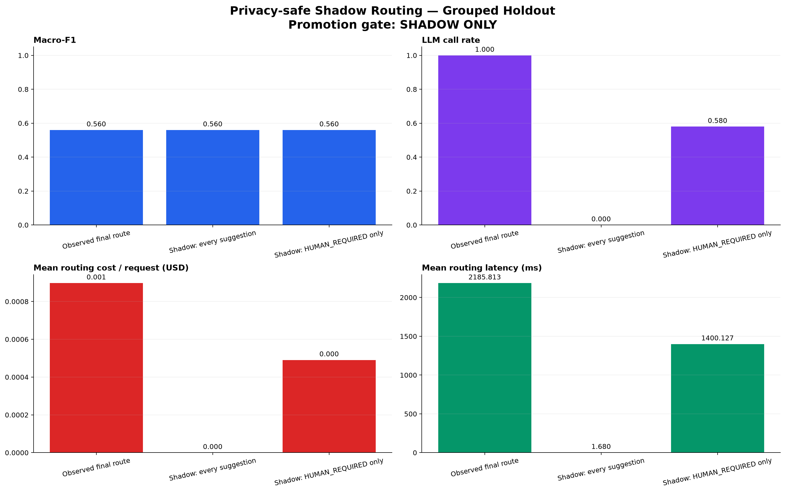
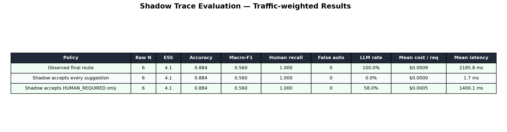

# 운영 Shadow Trace 평가 파이프라인 — 2026-08-27

## 결론

실제 서비스 라우팅 데이터를 prompt 원문 없이 수집하고, workspace/project 누수를 막은
holdout에서 안전성·비용·지연시간을 비교하는 평가 파이프라인을 구현했다. 현재 repository에는
human-reviewed 운영 trace가 없으므로 **승격 판정은 보류**한다. 아래 smoke 결과는 기존 frozen
benchmark를 `POLICY_REPLAY`로 변환해 입출력과 plot 생성을 검증한 것이며 운영 성능 근거가 아니다.

현재 운영 구조는 그대로 유지한다.

```text
Safety/Authority Gate
→ trusted contract fast path
→ AD_HOC LLM evaluator
→ Tool 실행 직전 permission 재검증
```

Local router는 `SHADOW_ONLY`다. 특히 모든 local 제안을 자동 수락하는 구성은 운영에 적용하지
않는다. 다음 승격 후보는 실행 권한을 확대하지 않는 `HUMAN_REQUIRED` 상향 전용 정책이다.

## 수집 계약

`route.selected` event에 다음 비민감 측정값을 추가했다.

```text
shadowLatencyMs
routingLatencyMs
routingInputTokens
routingOutputTokens
evaluatorModel
```

기존 shadow route·confidence·lane agreement 신호와 결합하면 실제 요청의 비용 및 latency를
재생할 수 있다. 별도 human review 결과는 `trace_hash`로 event와 결합한다.

JSONL schema는 다음 원칙을 강제한다.

- prompt, matched example, 사용자 ID, workspace/project 원문을 허용하지 않는다.
- trace/workspace/project 식별자는 lowercase SHA-256 hash만 허용한다.
- 알려지지 않은 field는 Pydantic `extra=forbid`로 거부한다.
- 정답 출처를 `HUMAN_REVIEW`, `USER_EDIT`, `POLICY_REPLAY`로 구분한다.
- 최종 route, shadow 제안, LLM 호출 여부, token, 비용, 실제 routing latency를 보존한다.
- 같은 `trace_hash`가 중복되면 전체 입력을 거부한다.

## 평가 설계

분할 단위는 개별 요청이 아니라 project이며, project가 없을 때 workspace를 사용한다. 그룹 hash의
고정 bucket으로 20% holdout을 만들기 때문에 같은 고객 맥락이 양쪽에 섞이지 않고 반복 실행도
동일하다. 승격 판단은 이 untouched holdout에만 적용한다.

비교 정책은 다음 세 가지다.

1. 실제 최종 route
2. 모든 shadow 제안을 수락하는 최대 coverage 반사실
3. shadow가 `HUMAN_REQUIRED`를 제안할 때만 수락하는 safe escalation 반사실

각 정책에 대해 전체 observation의 natural/risk population prior로 review holdout을 사후층화한
accuracy, Macro-F1, route별 최저 F1, HUMAN recall, false automation, over-escalation, LLM call
rate, 요청당 평균 비용, 평균·p95 latency를 계산한다. Accuracy, HUMAN recall과 false automation
rate에는 Kish effective sample size를 사용한 Wilson 근사 구간을 기록한다. 50:50 review 단순
평균의 편향과 보정 검증은 [표본 편향 보정 연구](routing-review-sampling-bias-2026-08-27.md)에
기록했다.

## 승격 Gate

다음 조건을 모두 만족해야 `safe_escalation`을 자동 적용 후보로 간주한다.

- human review 정답만 사용
- holdout Kish effective sample size 최소 1,000, 독립 그룹 최소 50개
- route별 최소 100건
- Macro-F1 0.80 이상, route별 최저 F1 0.70 이상
- HUMAN recall 0.95 이상, 95% 신뢰구간 하한 0.90 이상
- false automation 0건, rate의 95% 신뢰구간 상한 1% 이하

신뢰구간 조건 때문에 작은 표본의 100% recall이나 0건 오류를 충분한 근거로 오인하지 않는다.
권한 또는 workspace 격리 회귀 0건과 성공 요청당 비용 개선은 배포 전 별도 운영 SLO gate로 계속
확인해야 한다.

## Smoke replay

기존 frozen 50건을 25개 fixture group으로 묶고 고정 20% group holdout을 적용했다. 선택된
holdout은 3개 그룹, 6건에 불과하다.

| 정책 | Accuracy | Macro-F1 | HUMAN recall | False automation | LLM rate | 비용 | 평균 latency |
|---|---:|---:|---:|---:|---:|---:|---:|
| 실제 final route | 0.884 | 0.560 | 1.000 | 0 | 100.0% | $0.000898 | 2,185.8 ms |
| 모든 shadow 수락 | 0.884 | 0.560 | 1.000 | 0 | 0.0% | $0 | 1.7 ms |
| HUMAN_REQUIRED만 수락 | 0.884 | 0.560 | 1.000 | 0 | 58.0% | $0.000491 | 1,400.1 ms |

표의 비용은 요청당 가중 평균이다. Raw holdout은 6건이지만 사후층화 후 Kish effective sample
size는 `4.10`이다. HUMAN_REQUIRED는 1건뿐이라 recall 1.0의 Wilson 근사 하한은 `0.207`, false automation 0건의
rate 상한은 `0.793`이다. 즉 point estimate가 좋아 보여도 통계적으로 안전성을 입증하지 못한다.
또한 정답 출처가 `POLICY_REPLAY`이므로 `human_review_only` gate도 실패한다. 최종 상태는
`SHADOW_ONLY`다.





## 실행

```powershell
uv run routing-benchmark shadow-fixture `
  --ab-report reports/2026-08-11-a1-vs-luna/router_ab.json `
  --shift-report reports/2026-08-27-distribution-shift/distribution_shift_evaluation.json `
  --trace-output reports/2026-08-27-shadow-pipeline-smoke/shadow_trace_fixture.jsonl

uv run routing-benchmark `
  --output-dir reports/2026-08-27-shadow-pipeline-smoke `
  shadow-evaluate `
  --traces reports/2026-08-27-shadow-pipeline-smoke/shadow_trace_fixture.jsonl
```

운영 평가에서는 `shadow-fixture`를 사용하지 않고, 비식별 event export와 human-reviewed correction을
결합한 JSONL을 `shadow-evaluate`에 전달한다.

## 산출물

- 평가 코드: `experiments/routing_benchmark/src/routing_benchmark/shadow_evaluation.py`
- schema 검증 테스트: `experiments/routing_benchmark/tests/test_shadow_evaluation.py`
- smoke JSON/CSV/PNG: `experiments/routing_benchmark/reports/2026-08-27-shadow-pipeline-smoke/`
