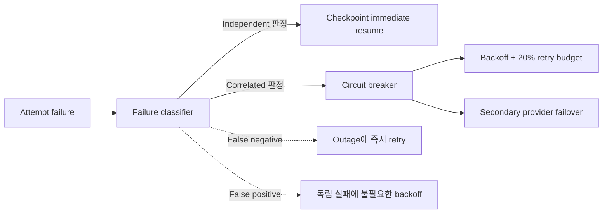

# Failure Classifier와 Secondary Provider 운영 경계 실험

> 실험일: 2026-08-27
> 상태: Counterfactual synthetic prototype result
> 대상 정책: `Failure-aware checkpoint + provider failover`
> 운영 승격: 실제 incident label, provider 품질 평가와 청구 데이터 검증 후 결정

## 1. 목적

직전 실험의 선택 정책은 독립 transient failure와 correlated provider outage를 정확히 구분하고,
secondary provider가 primary와 유사하게 동작한다고 가정했다. 이번 실험은 이 가정을 깨뜨려 다음
운영 허용 범위를 측정한다.

1. Outage를 independent로 오판하는 false negative 허용률
2. Independent failure를 outage로 오판하는 false positive 허용률
3. Secondary provider의 latency penalty
4. Secondary provider의 quality failure
5. Secondary provider의 상대 가격

## 2. Counterfactual 구조



각 workload, seed, scale 성공·실패 상태에서 정분류 정책과 오분류 정책을 모두 실행한 뒤 classifier
오류율로 결과를 혼합했다. 따라서 특정 seed가 우연히 잘못 분류되는 표본 편향 없이 기대 metric을
계산한다.

```text
Independent expected result
= (1 - FPR) × checkpoint immediate
+ FPR × checkpoint backoff budget

Provider outage expected result
= (1 - FNR) × circuit breaker + failover
+ FNR × checkpoint immediate without failover
```

## 3. 기본 가정과 결과

```yaml
classifier_false_positive_rate: 0.05
classifier_false_negative_rate: 0.10
scale_success_probability: 0.90
provider_failover_seconds: 20
secondary_latency_multiplier: 1.15
secondary_cost_multiplier: 1.25
secondary_quality_failure_rate: 0.02
```

| Metric | 결과 |
|---|---:|
| Completion SLO goodput | 99.20% |
| Quality-adjusted completion goodput | 99.06% |
| Priority SLO goodput | 99.66% |
| Worst-workspace goodput | 96.11% |
| P95 end-to-end | 155.7 sec |
| Demand amplification | 1.100× |
| Secondary provider service share | 7.35% |
| Provider cost index | 1.120× |
| Worker cost | $0.144/run |
| Overall hard-gate pass | 93.5% |
| Independent failure gate | 94.1% |
| Provider outage gate | 92.9% |

기본 오분류 가정에서도 두 failure mode가 모두 90% gate를 통과했다. Secondary provider 사용 비중은
전체 service의 7.35%였고, 1.25배 단가와 retry demand를 함께 반영한 provider cost index는 원래
primary service demand 대비 1.120배였다.

## 4. Classifier 오류 경계


### False negative

FPR을 5%로 고정했다.

| FNR | Overall gate | Provider-outage gate | Worst workspace |
|---:|---:|---:|---:|
| 0% | 95.4% | 96.7% | 96.33% |
| 5% | 94.5% | 94.8% | 96.22% |
| 10% | 93.5% | 92.9% | 96.11% |
| 15% | 92.6% | **91.1%** | 96.00% |
| 20% | 91.6% | 89.2% | 95.89% |
| 30% | 89.8% | 85.5% | 95.67% |
| 50% | 86.1% | 78.0% | 95.23% |

False negative 20%부터 provider-outage mode gate가 90% 아래로 내려간다. 운영 target은 최대 15%다.
평균 completion만 보면 차이가 작지만 failover가 필요한 특정 outage run이 무너지므로 반드시
failure-mode별 gate로 평가해야 한다.

### False positive

FNR을 10%로 고정했다.

| FPR | Overall gate | Independent-failure gate | Worst workspace |
|---:|---:|---:|---:|
| 0% | 94.8% | 96.7% | 96.35% |
| 5% | 93.5% | 94.1% | 96.11% |
| 10% | 92.2% | **91.5%** | 95.87% |
| 15% | 91.0% | 89.0% | 95.64% |
| 20% | 89.7% | 86.4% | 95.40% |
| 30% | 87.1% | 81.3% | 94.93% |
| 50% | 82.0% | 71.0% | 93.98% |

False positive는 불필요한 backoff와 global budget 소비를 만들어 독립 실패 recovery를 악화시킨다.
운영 target은 최대 10%다.

## 5. Secondary Provider 경계


### Latency multiplier

| Latency | Quality-adjusted goodput | Worst workspace | P95 | Outage gate |
|---:|---:|---:|---:|---:|
| 1.00× | 99.13% | 96.48% | 152.2 sec | 92.9% |
| 1.15× | 99.06% | 96.11% | 155.7 sec | **92.9%** |
| 1.30× | 98.92% | 95.35% | 158.7 sec | 76.7% |
| 1.50× | 98.68% | 94.33% | 163.1 sec | 71.3% |
| 2.00× | 97.90% | 92.71% | 172.6 sec | 65.9% |

평균 goodput은 1.30배에서도 높지만 일부 outage run이 gate를 실패한다. Secondary provider의 실제
latency SLO는 primary의 1.15배 이내여야 한다.

### Quality failure

Quality failure는 provider가 기술적으로 응답했지만 acceptance evaluation을 통과하지 못하는 비율이다.

| Quality failure | Quality-adjusted goodput | Outage gate |
|---:|---:|---:|
| 0% | 99.20% | 92.9% |
| 2% | 99.06% | 92.9% |
| 5% | 98.84% | **92.9%** |
| 10% | 98.48% | 87.5% |
| 20% | 97.76% | 65.9% |
| 50% | 95.58% | 47.9% |

평균 품질 metric만으로는 10% degradation도 좋아 보이지만 mode-specific gate는 이미 실패한다.
Secondary provider의 quality failure target은 최대 5%다.

### Price multiplier

| Secondary price | Provider cost index |
|---:|---:|
| 1.00× | 1.100× |
| 1.25× | 1.120× |
| 1.50× | 1.141× |
| 2.00× | 1.181× |
| 3.00× | 1.263× |

Secondary traffic이 전체 service의 일부이므로 단가 상승은 선형적으로 완화된다. 예시 provider cost
budget을 1.20으로 두면 약 2배 단가까지 허용할 수 있다. 이 budget은 synthetic runtime proxy이며
실제 도입에서는 cached tokens, input/output token 가격과 Tool 비용으로 다시 계산해야 한다.

## 6. 운영 계약

```yaml
failure_classifier:
  false_negative_rate: "<= 0.15"
  false_positive_rate: "<= 0.10"
  low_confidence_action: "correlated-safe circuit probe"

secondary_provider:
  failover_ready_seconds: "<= 20"
  latency_ratio_to_primary: "<= 1.15"
  quality_failure_rate: "<= 0.05"
  provider_cost_index: "<= 1.20 provisional"

monitoring_window:
  evaluate_by_failure_mode: true
  require_minimum_incident_count: true
  use_confidence_interval: true
```

분류 confidence가 낮을 때 즉시 모든 Task를 secondary로 보내지는 않는다. Primary circuit을 열고 작은
probe와 bounded retry budget을 사용하며, multi-signal outage가 확인되면 failover한다. Qualified
secondary provider가 운영 계약을 위반하면 failover 대신 신규 low-priority admission을 제한하고 이미
수락한 high-priority work를 보호한다.

## 7. 필요한 Telemetry

```text
failure_mode_predicted
failure_mode_confidence
failure_mode_final_label
classifier_false_positive
classifier_false_negative
provider_circuit_state
failover_requested_at
failover_ready_at
primary_provider_id
secondary_provider_id
provider_service_seconds
provider_input_tokens
provider_output_tokens
provider_cached_tokens
quality_evaluation_passed
provider_cost_actual
```

Final failure label은 장애 종료 후 incident correlation, provider status와 retry outcome을 이용해 batch로
확정한다. 이 label이 없으면 classifier SLO를 검증할 수 없다.

## 8. 한계

- Failure classifier 자체를 학습하거나 구현하지 않고 오류율을 외생 변수로 주었다.
- Quality failure는 aggregate probability이며 task type별 품질 편차를 반영하지 않았다.
- Provider cost index는 runtime proxy이고 실제 token billing이 아니다.
- Context migration, prompt cache miss와 model capability 차이를 별도 비용으로 모델링하지 않았다.
- 실제 provider incident와 TaskAttempt trace가 없는 synthetic 결과다.

## 9. 다음 연구

1. TaskAttempt·provider incident contract에 final failure label 추가
2. 규칙 기반 multi-signal classifier baseline 구현
3. Workspace별 retry token bucket과 provider별 circuit breaker
4. Context migration과 prompt cache cold-start 비용
5. 실제 shadow replay에서 FP, FN과 provider envelope 검증

## 10. 재현 명령

```powershell
cd agent
& '.venv-codex\Scripts\python.exe' -m experiments.runtime_scheduler.plot_failure_classifier_simulation
& '.venv-codex\Scripts\python.exe' -m pytest experiments/runtime_scheduler/test_failure_classifier_simulation.py experiments/runtime_scheduler/test_scheduler_plot.py experiments/runtime_scheduler/test_style.py -q
```
