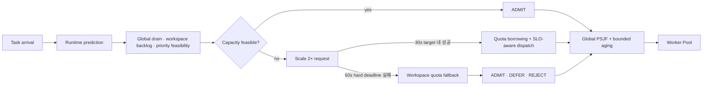
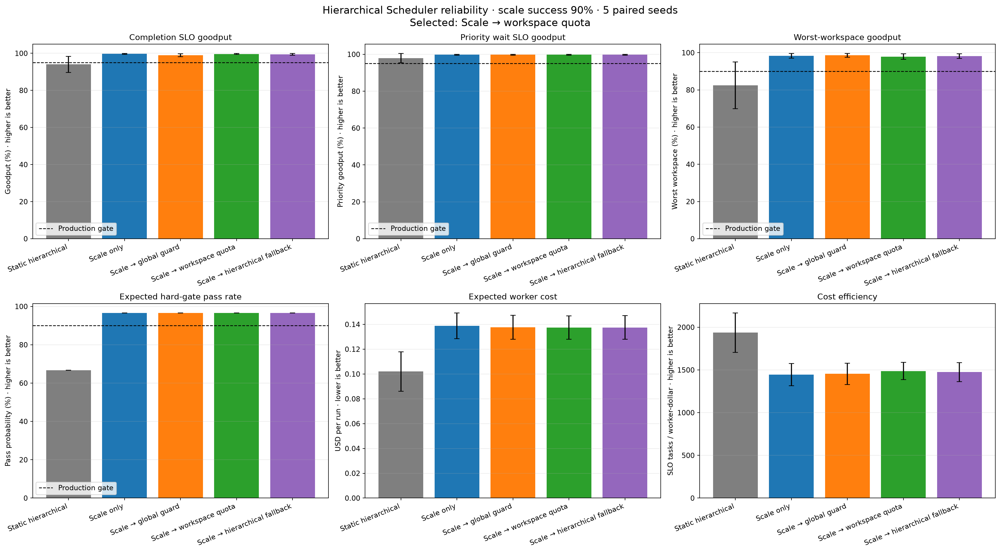
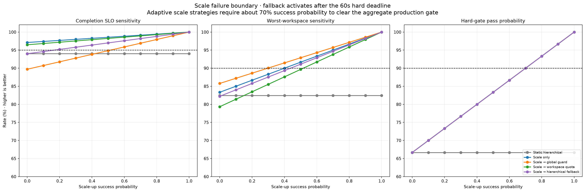
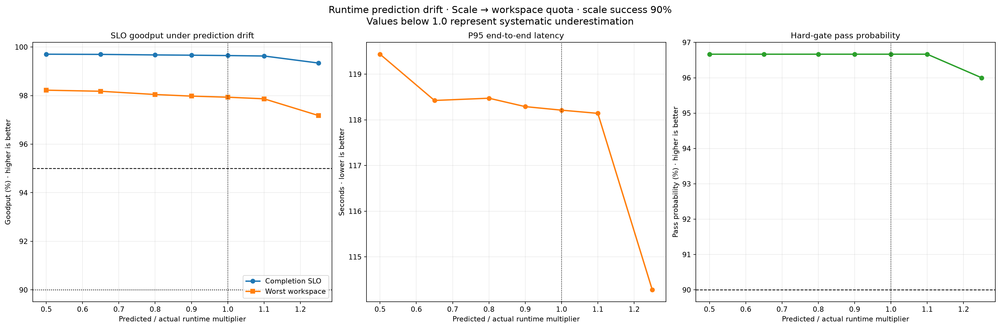

# Adaptive Hierarchical Scheduler 신뢰성 경계 실험

> 실험일: 2026-08-27
> 상태: Counterfactual synthetic prototype result
> 현재 후보: `Scale → workspace quota fallback`
> 운영 승격: 실제 TaskAttempt shadow replay와 scale control-plane SLO 검증 후 결정

## 1. 목적

이 실험은 직전 `Hierarchical + scale` 결과에서 남았던 세 가지 질문을 검증한다.

1. Scale 요청이 실패해도 정책이 안전하게 열화되는가?
2. 최소 과금과 scale-down cooldown을 포함해도 비용 대비 효용이 있는가?
3. Runtime Predictor의 체계적 오차가 admission과 SLO를 무너뜨리는가?

Scheduler는 단일 Queue 정렬기가 아니라 다음의 계층형 제어기로 정의한다.



## 2. 실험 방법

각 workload seed에 대해 scale 성공과 실패를 모두 실행한 counterfactual pair를 만든 뒤, 운영 성공률
`p`에 따라 기대값을 계산한다.

```text
expected_metric
= p × metric_when_scale_succeeds
+ (1 - p) × metric_when_scale_fails
```

이 방법은 우연히 쉬운 workload에서만 scale이 성공하는 표본 편향을 제거한다. 비교 범위는 3개
adversarial scenario와 5개 paired seed다.

```yaml
base_workers: 6
scale_factor: 2.0
scale_target_seconds: 30
scale_hard_deadline_seconds: 60
scale_success_probability: 0.90
scale_down_cooldown_seconds: 60
minimum_scale_billing_seconds: 600
worker_hour_cost_usd: 0.12
```

거절과 SLO를 넘긴 defer는 제출 Task 기준 실패로 계산한다. Hard gate는 다음 조건을 동시에 만족해야
한다.

```yaml
completion_slo_goodput: ">= 0.95"
priority_wait_slo_goodput: ">= 0.95"
worst_workspace_completion_goodput: ">= 0.90"
workspace_acceptance_fairness: ">= 0.90"
maximum_wait_seconds: "<= 300"
expected_gate_pass_probability: ">= 0.90"
```

## 3. 기본 신뢰성 결과

| Strategy | Completion | Priority | Worst workspace | Gate pass | Cost/run | SLO tasks/$ |
|---|---:|---:|---:|---:|---:|---:|
| Static hierarchical | 94.0% | 97.9% | 82.4% | 66.7% | $0.102 | 1,937.6 |
| Scale only | 99.7% | 99.8% | 98.3% | 96.7% | $0.139 | 1,444.9 |
| Scale → global guard | 99.0% | 99.8% | **98.6%** | 96.7% | $0.138 | 1,453.7 |
| Scale → workspace quota | **99.6%** | **99.8%** | 97.9% | **96.7%** | **$0.137** | **1,487.4** |
| Scale → hierarchical fallback | 99.4% | 99.8% | 98.2% | 96.7% | $0.138 | 1,474.2 |



정적 정책은 가장 싸고 단순하지만 completion과 worst-workspace gate를 통과하지 못했다. Scale을
사용하는 네 전략은 모두 기본 gate를 통과했다. 이 중 `Scale → workspace quota`가 비용과 SLO
효율에서 가장 좋으므로 현재 운영 후보로 선택한다. 단, 이 차이는 작으므로 실제 청구와 scale
telemetry에서 다시 검증해야 한다.

## 4. Scale 성공률 경계

`Scale → workspace quota`의 성공률별 기대값은 다음과 같다.

| Scale 성공률 | Completion | Priority | Worst workspace | Gate pass | Cost/run |
|---:|---:|---:|---:|---:|---:|
| 0% | 96.5% | 97.9% | 79.3% | 66.7% | $0.101 |
| 50% | 98.2% | 99.0% | 89.7% | 83.3% | $0.121 |
| 70% | 98.9% | 99.4% | 93.8% | **90.0%** | $0.129 |
| 90% | 99.6% | 99.8% | 97.9% | 96.7% | $0.137 |
| 100% | 100.0% | 100.0% | 100.0% | 100.0% | $0.141 |



합성 workload에서 hard gate를 통과하는 최소 scale 성공률은 약 70%다. 운영에서는 model risk와 실제
분포 이동을 고려해 90%를 control-plane SLO로 둔다. 최근 rolling window가 90% 미만이면 warm
reserve, secondary capacity 또는 service-demand degradation을 활성화하고 신규 batch admission을
줄여야 한다.

## 5. Runtime 예측 drift

`prediction multiplier = predicted / reference runtime`으로 두고 0.5–1.25 범위를 비교했다.

| Multiplier | Completion | Worst workspace | P95 | Gate pass |
|---:|---:|---:|---:|---:|
| 0.50 | 99.7% | 98.2% | 119.4 sec | 96.7% |
| 0.65 | 99.7% | 98.2% | 118.4 sec | 96.7% |
| 0.80 | 99.7% | 98.0% | 118.5 sec | 96.7% |
| 1.00 | 99.6% | 97.9% | 118.2 sec | 96.7% |
| 1.10 | 99.6% | 97.9% | 118.1 sec | 96.7% |
| 1.25 | 99.3% | 97.2% | 114.3 sec | 96.0% |



현재 workload에서는 50% 과소예측도 gate를 무너뜨리지 않았다. 이는 predictor가 충분히 강건하다는
운영 증거가 아니라, capacity trigger와 fallback이 이 합성 분포에서 오차를 흡수했다는 뜻이다.
오히려 25% 과대예측은 admission을 일찍 제한해 submitted goodput을 소폭 낮췄다. 실제 운영에서는
점 추정치 하나 대신 최근 underestimate quantile과 safety margin을 사용하고, drift 발생 시 margin을
확대해야 한다.

## 6. 현재 결정

```text
Normal
  → Global PSJF + bounded aging
  → workspace quota는 관측용 soft signal

Predicted drain > 120s
or priority best-case drain > 60s
  → scale 2× 요청
  → target 30s
  → hard deadline 60s

Scale success
  → quota borrowing
  → SLO-aware dispatch

Scale failure
  → workspace quota fallback
  → lower priority DEFER / REJECT
  → control-plane capacity와 accepted work 보호
```

Scale 실패를 무한 대기로 처리하거나 모든 작업을 자동 재실행하지 않는다. 용량 부족은 retryable
execution failure가 아니며 Admission 상태 전이로 처리한다. Retry는 checkpoint가 있는 transient
failure에만 별도 budget으로 허용한다.

## 7. 한계

- 실제 cloud autoscaler나 provider capacity API를 호출하지 않은 event-driven simulation이다.
- 최소 과금은 고정 600초이며 tier별·provider별 청구 규칙은 아직 없다.
- Scale-down은 arrival debounce 모델이고 실제 utilization lag와 cold pool 상태는 반영하지 않았다.
- 예측 drift는 전체 Task에 동일 multiplier를 적용했으며 task type별 selective drift는 검증하지 않았다.
- Retry demand amplification과 scale failure의 상관관계는 아직 결합하지 않았다.
- 실제 TaskAttempt telemetry가 없어 synthetic workload 결과다.

따라서 현재 결론은 “구조적 후보가 결정됐다”이지 “실서비스 성능이 입증됐다”는 의미가 아니다.

## 8. 운영 승격 조건

1. 실제 TaskAttempt log로 동일 workload를 시간순 shadow replay한다.
2. Scale request, ready, failure와 down 이벤트를 durable telemetry로 수집한다.
3. Rolling scale success가 90% 이상이고 60초 hard deadline 초과율이 1% 미만인지 확인한다.
4. 실제 청구 기준 SLO tasks per dollar가 static 대비 허용 가능한지 확인한다.
5. Predictor drift를 task type, model과 workspace별로 분리해 calibration한다.
6. 사용자 status, instruction, cancel 제어 경로가 data-plane 포화와 무관하게 동작하는지 검증한다.

## 9. 재현 명령

```powershell
cd agent
& '.venv-codex\Scripts\python.exe' -m tests.runtime_predictor_prototype.plot_hierarchical_reliability
& '.venv-codex\Scripts\python.exe' -m pytest tests/runtime_predictor_prototype/test_hierarchical_reliability_simulation.py tests/runtime_predictor_prototype/test_scheduler_plot.py tests/runtime_predictor_prototype/test_style.py -q
```
