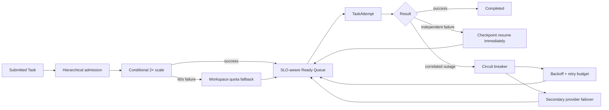
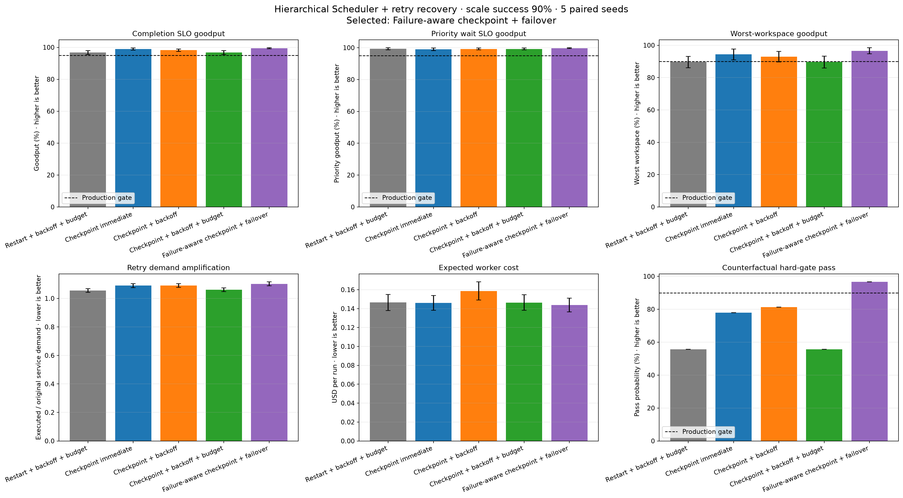
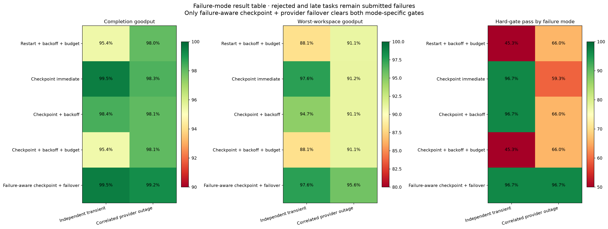
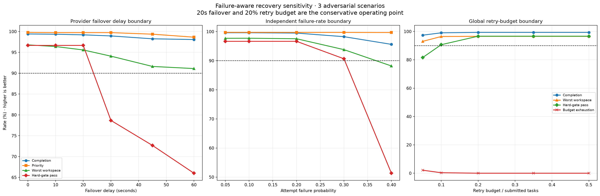

# Hierarchical Scheduler Retry·Checkpoint·Failover 결합 실험

> 실험일: 2026-08-27
> 상태: Counterfactual synthetic prototype result
> 선택 후보: `Failure-aware checkpoint + provider failover`
> 운영 승격: 실제 provider 장애와 TaskAttempt shadow replay 검증 전까지 보류

## 1. 연구 질문

이전 계층형 Scheduler는 scale 성공률, 실패 fallback, 과금과 predictor drift까지 검증했지만 실행 중
실패가 service demand를 증폭시키는 경우는 분리해서 평가했다. 이번 실험은 다음 경로를 하나의
event-driven simulator에서 결합한다.



검증 질문은 다음과 같다.

1. Scale failure와 attempt failure가 동시에 있어도 submitted SLO를 유지하는가?
2. 독립 transient failure와 correlated provider outage에 동일 retry 정책을 써도 되는가?
3. Checkpoint가 실제로 재실행 낭비와 tail latency를 줄이는가?
4. Failover deadline과 global retry budget의 운영 경계는 어디인가?

## 2. 실험 구성

### Workload

- Noisy neighbor
- Sleep/wake burst
- Elephant and mice
- 각 scenario당 paired seed 5개
- Scale 성공과 실패를 동일 workload에서 모두 실행
- Scale 성공 확률 기대값: 90%

### Failure mode

| Mode | 설정 | 의미 |
|---|---|---|
| Independent transient | attempt failure 20% | 서로 상관없는 Worker·Tool·network 실패 |
| Correlated provider outage | background failure 5% + 60초 outage | 여러 실행을 동시에 막는 provider 장애 |

### 공통 제어값

```yaml
base_workers: 6
scale_factor: 2.0
scale_target_seconds: 30
scale_hard_deadline_seconds: 60
provider_failover_seconds: 20
secondary_provider_latency_multiplier: 1.15
secondary_provider_cost_multiplier: 1.25
secondary_provider_quality_failure_rate: 0.02
checkpoint_interval_seconds: 30
checkpoint_overhead_seconds: 1
max_attempts: 4
retry_budget_ratio: 0.20
priority_rescue_seconds: 30
reserved_data_workers: 0
minimum_scale_billing_seconds: 600
```

일반 Task worker를 항상 비워 두지는 않는다. 대신 priority task가 30초 이상 대기하면 SLO-aware rescue가
다음 dispatch를 선점한다. 사용자 status·cancel을 위한 control-plane 용량은 이 data-plane worker
정책과 별도로 보존한다.

## 3. 비교 정책

| Policy | 독립 실패 | Provider outage | Retry budget | Failover |
|---|---|---|---:|---:|
| Restart + backoff + budget | restart | backoff | 사용 | 없음 |
| Checkpoint immediate | 즉시 resume | 즉시 resume | 없음 | 없음 |
| Checkpoint + backoff | backoff resume | backoff resume | 없음 | 없음 |
| Checkpoint + backoff + budget | backoff resume | backoff resume | 사용 | 없음 |
| Failure-aware checkpoint + failover | 즉시 resume | circuit breaker + backoff | outage에 사용 | 20초 |

Failure-aware 정책은 failure classifier가 mode를 구분한다. 분류가 불확실하면 짧은 sliding window의
동시 실패율, provider `429`·`5xx`, timeout과 shared dependency 상태를 이용해 correlated로
보수적으로 전환한다.

## 4. 평가 gate

거절, terminal failure와 300초를 넘긴 completion은 모두 submitted failure로 계산한다. 다음 gate를
각 failure mode에서 별도로 통과해야 한다.

```yaml
completion_slo_goodput: ">= 0.95"
priority_wait_slo_goodput: ">= 0.95"
worst_workspace_completion_goodput: ">= 0.90"
workspace_acceptance_fairness: ">= 0.90"
maximum_wait_seconds: "<= 300"
retry_budget_exhaustion_rate: "<= 0.05"
expected_hard_gate_pass_rate_per_mode: ">= 0.90"
```

Recovery duration은 별도 관측 지표로 유지하되 completion과 maximum wait에 이미 반영되므로 중복 hard
gate로 사용하지 않는다.

## 5. 전체 결과

| Policy | Completion | Priority | Worst workspace | Demand amp | Cost/run | Gate pass |
|---|---:|---:|---:|---:|---:|---:|
| Restart + backoff + budget | 96.7% | 99.3% | 89.6% | **1.055×** | $0.146 | 55.7% |
| Checkpoint immediate | 98.9% | 99.0% | 94.4% | 1.090× | $0.146 | 78.0% |
| Checkpoint + backoff | 98.2% | 99.2% | 92.9% | 1.090× | $0.159 | 81.3% |
| Checkpoint + backoff + budget | 96.7% | 99.2% | 89.6% | 1.061× | $0.146 | 55.7% |
| Failure-aware checkpoint + failover | **99.4%** | **99.7%** | **96.6%** | 1.102× | **$0.144** | **96.7%** |



Demand amplification만 최소화하면 budget 정책이 좋아 보이지만 retry를 너무 일찍 차단해 submitted
completion과 worst-workspace goodput을 낮춘다. Failure-aware 정책은 약 10.2% service demand 증가를
허용하는 대신 가장 낮은 예상 비용과 가장 높은 goodput을 동시에 기록했다.

## 6. Failure mode별 결과



| Policy | Independent gate | Provider outage gate |
|---|---:|---:|
| Restart + backoff + budget | 45.3% | 66.0% |
| Checkpoint immediate | 96.7% | 59.3% |
| Checkpoint + backoff | 96.7% | 66.0% |
| Checkpoint + backoff + budget | 45.3% | 66.0% |
| Failure-aware checkpoint + failover | **96.7%** | **96.7%** |

즉시 checkpoint resume는 독립 실패에는 가장 적절하지만 correlated outage에서는 재시도 시점을 함께
몰아 retry burst를 만든다. 반대로 backoff를 모든 실패에 적용하면 독립 실패의 recovery와 latency를
불필요하게 늘린다. 따라서 한 가지 고정 retry policy가 아니라 failure mode에 따른 분기가 필요하다.

## 7. 민감도 경계



### Provider failover deadline

| Failover | Completion | Priority | Worst workspace | Gate pass |
|---:|---:|---:|---:|---:|
| 0 sec | 99.4% | 99.8% | 96.8% | 96.7% |
| 10 sec | 99.3% | 99.7% | 96.4% | 96.7% |
| 20 sec | 99.2% | 99.7% | 95.6% | 96.7% |
| 30 sec | 98.9% | 99.7% | 94.1% | 78.7% |
| 45 sec | 98.3% | 99.4% | 91.6% | 72.7% |
| 60 sec | 98.1% | 98.6% | 91.1% | 66.0% |

Secondary provider latency 1.15배를 반영하면 20초까지 gate를 유지하지만 30초부터 paired run gate가
급격히 무너진다. 운영 target과 hard deadline은 20초다.

### Independent attempt failure

| Failure probability | Completion | Worst workspace | Demand amp | Gate pass |
|---:|---:|---:|---:|---:|
| 5% | 99.6% | 97.7% | 1.032× | 96.7% |
| 10% | 99.6% | 97.7% | 1.055× | 96.7% |
| 20% | 99.5% | 97.6% | 1.117× | 96.7% |
| 30% | 98.3% | 93.8% | 1.198× | 90.7% |
| 40% | 95.6% | 88.2% | 1.276× | 51.3% |

30%가 현재 모델의 마지막 통과 지점이고 40%에서는 worst-workspace gate가 붕괴한다. Rolling attempt
failure가 30%에 접근하면 신규 admission 축소와 dependency circuit open이 필요하다.

### Global retry budget

| Budget/tasks | Completion | Worst workspace | Exhaustion | Gate pass |
|---:|---:|---:|---:|---:|
| 5% | 97.4% | 93.0% | 2.1% | 81.7% |
| 10% | 99.1% | 96.4% | 0.3% | 90.7% |
| 20% | 99.4% | 96.6% | 0.0% | 96.7% |
| 35% | 99.4% | 96.6% | 0.0% | 96.7% |
| 50% | 99.4% | 96.6% | 0.0% | 96.7% |

20% 이상에서 추가 goodput이 없으므로 기본 budget을 35%에서 20%로 낮춘다. 이 값은 무조건적인
retry 허용량이 아니라 한 workload window에서 admission이 감당할 수 있는 retry release 상한이다.

## 8. 선택된 운영 후보

```text
Attempt failure 발생
  → Failure classifier

Independent transient
  → 30초 checkpoint에서 resume
  → 즉시 Ready Queue 복귀
  → Task당 max attempts 4

Correlated provider outage
  → Provider circuit open
  → Retry-After 또는 exponential backoff + jitter
  → Global retry budget 20%
  → 20초 안에 secondary provider failover

Priority task 30초 대기
  → 다음 dispatch에서 rescue

Scale failure 60초 확정
  → Workspace quota fallback
  → 용량 부족은 execution retry로 처리하지 않음
```

이 정책은 항상-on reserved data worker보다 효율적이었다. 다만 status·instruction·cancel API는
data-plane과 별도 control-plane에서 최소 용량을 계속 보장해야 한다.

## 9. 현재 한계

- Failure classifier가 정답 mode를 안다고 가정했다.
- Secondary provider가 호환 모델과 동일 Tool semantics를 제공한다고 가정했다.
- Provider 전환의 품질 저하, token price 차이와 warm context 재구축 비용을 포함하지 않았다.
- Outage와 scale control-plane failure 사이의 상관관계를 모델링하지 않았다.
- Retry budget은 global ratio이며 workspace별 retry storm 격리는 아직 없다.
- 실제 TaskAttempt와 provider incident log가 없는 synthetic 결과다.

## 10. 다음 연구

1. Failure classifier false-positive·false-negative matrix
2. Secondary provider의 가격·품질·context migration 비용
3. Workspace별 retry token bucket과 global budget의 계층화
4. Scale failure와 provider outage의 correlated control-plane failure
5. 실제 TaskAttempt shadow replay

## 11. 재현 명령

```powershell
cd agent
& '.venv-codex\Scripts\python.exe' -m tests.runtime_predictor_prototype.plot_hierarchical_retry_simulation
& '.venv-codex\Scripts\python.exe' -m pytest tests/runtime_predictor_prototype/test_hierarchical_retry_simulation.py tests/runtime_predictor_prototype/test_retry_checkpoint_simulation.py tests/runtime_predictor_prototype/test_scheduler_plot.py tests/runtime_predictor_prototype/test_style.py -q
```
