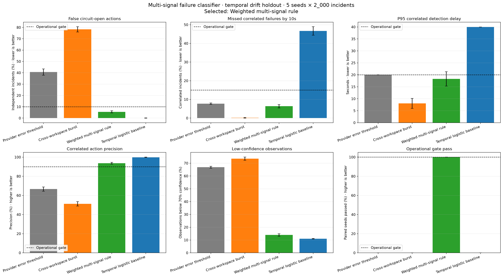
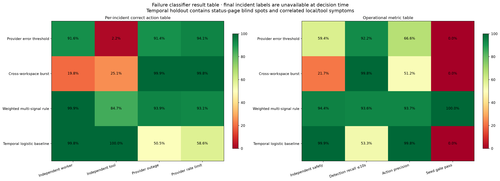
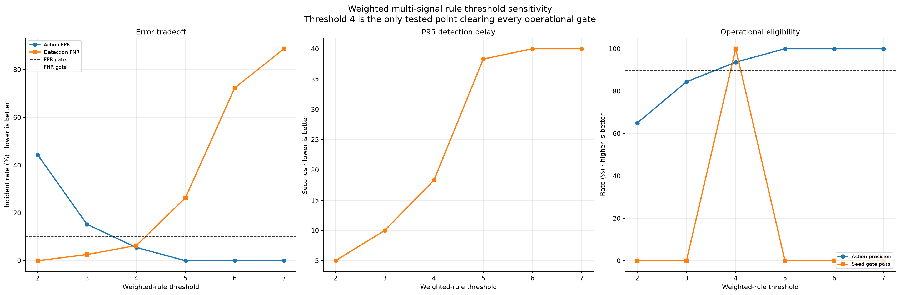

# Multi-signal Failure Classifier 실험 보고서

작성일: 2026-08-27
상태: Synthetic temporal holdout 검증 완료, production shadow 검증 전

## 1. 목적

Failure-aware Scheduler는 개별 Worker·Tool 실패와 Provider 전체에 영향을 주는 correlated failure를
구분해야 한다. 전자는 checkpoint resume이 적합하지만, 후자는 circuit breaker와 secondary provider
failover가 필요하다. 분류를 잘못하면 다음 두 문제가 발생한다.

- False positive: 국소 장애를 provider 장애로 오인해 불필요한 circuit open과 failover 비용이 발생한다.
- False negative: provider 장애를 국소 장애로 처리해 retry storm과 backlog 증폭이 발생한다.

이 실험은 실행 중 관측 가능한 여러 신호만으로 두 장애 유형을 구분할 수 있는지, 그리고 이전
Failure Classifier 실험에서 정한 `FP <= 10%`, `FN <= 15%` 운영 경계를 만족할 수 있는지 확인한다.

## 2. 데이터와 누수 방지 계약

각 incident는 2, 5, 10, 20, 30초 관측 window를 가지며, 결정 시점에 알 수 있는 다음 신호만 입력한다.

```text
provider_5xx_rate
provider_429_rate
timeout_rate
cross_workspace_failure_ratio
affected_worker_ratio
provider_status_degraded
local_worker_crash_rate
tool_failure_concentration
```

최종 incident label과 확정 시점은 학습·사후 평가용 필드로 분리했다.

```text
predicted_correlated
prediction_confidence
predicted_at_seconds

final_incident_kind
final_label_source
finalized_at_seconds
```

`build_incident_label`은 `predicted_at_seconds >= final_label_available_at_seconds`인 예측을 거부한다.
최종 label 세 필드는 모두 함께 기록되거나 모두 비어 있어야 한다. `feature_vector`에는 최종 label이
포함되지 않는다. 이 계약으로 decision-time feature와 사후 incident adjudication을 분리했다.

## 3. 실험 설계

- 5개 고정 seed
- seed당 2,000 incident, 총 10,000 incident
- incident당 5개 관측 window
- 앞 70%를 logistic baseline 학습에 사용
- 뒤 30%를 모든 classifier의 temporal holdout으로 사용
- holdout에는 status-page blind spot, 약해진 provider 신호, local crash와 tool symptom의 상관을 추가

비교 대상은 다음 네 가지다.

1. Provider error rate 단일 threshold
2. Cross-workspace failure ratio 단일 threshold
3. Weighted multi-signal rule
4. StandardScaler와 LogisticRegression을 이용한 temporal baseline

운영 gate는 모든 paired seed에서 동시에 만족해야 한다.

```yaml
action_false_positive_rate: "<= 10%"
detection_false_negative_rate_at_10s: "<= 15%"
p95_detection_seconds: "<= 20s"
correlated_action_precision: ">= 90%"
paired_seed_gate_pass_rate: "100%"
```

## 4. Weighted rule

Weighted rule은 provider error, cross-workspace 확산, 영향 Worker 비율과 provider status를 양의
신호로 사용한다. 높은 local worker crash rate와 tool failure concentration은 독립 장애 근거이므로
음의 가중치를 준다.

```text
+2  provider error rate >= 0.22
+1  provider error rate >= 0.40
+2  cross-workspace failure ratio >= 0.22
+1  affected worker ratio >= 0.28
+2  provider status degraded
-2  local worker crash rate >= 0.45
-2  tool failure concentration >= 0.65
```

합계가 4 이상이면 correlated failure 후보로 판정한다. 운영에서는 첫 positive 신호로 circuit을
latch하고, 상태가 잠시 정상으로 돌아와도 즉시 닫지 않는다. 종료는 별도 recovery probe와
hysteresis가 담당해야 한다.

## 5. 결과

| Classifier | Action FPR | Detection FNR at 10s | P95 detection | Precision | Gate pass |
|---|---:|---:|---:|---:|---:|
| Provider error threshold | 40.6% | 7.8% | 20.0s | 66.6% | 0% |
| Cross-workspace burst | 78.3% | 0.2% | 8.1s | 51.2% | 0% |
| Weighted multi-signal rule | **5.6%** | **6.4%** | **18.3s** | **93.7%** | **100%** |
| Temporal logistic baseline | 0.1% | 46.7% | 40.0s | 99.8% | 0% |

Weighted rule만 모든 seed에서 운영 gate를 통과했다. 단일 threshold는 빠르지만 국소 장애를 너무
자주 provider 장애로 오인했다. Logistic baseline은 독립 장애를 안전하게 처리했지만 temporal drift
이후 provider outage와 rate-limit recall이 각각 50.5%, 58.6%로 떨어졌다. 즉, 현재 synthetic
조건에서는 높은 precision만으로 운영 가능성을 판단할 수 없고 detection recall과 delay를 함께 봐야 한다.

장애 유형별 Weighted rule의 올바른 action 비율은 다음과 같다.

| Incident kind | Correct action |
|---|---:|
| Independent worker | 99.9% |
| Independent tool | 84.7% |
| Provider outage | 93.9% |
| Provider rate limit | 93.1% |

`Independent tool`이 가장 약한 구간이다. 실제 telemetry에서는 tool/vendor identifier, 동일 tool의
workspace 간 동시 실패와 provider request ID를 추가해 이 경계를 보강해야 한다.

## 6. Threshold 민감도

| Rule threshold | Action FPR | Detection FNR | P95 detection | Precision | Gate pass |
|---:|---:|---:|---:|---:|---:|
| 2 | 44.3% | 0.0% | 5.0s | 65.0% | 0% |
| 3 | 15.2% | 2.6% | 10.0s | 84.4% | 0% |
| 4 | **5.6%** | **6.4%** | **18.3s** | **93.7%** | **100%** |
| 5 | 0.0% | 26.4% | 38.3s | 100.0% | 0% |
| 6 | 0.0% | 72.3% | 40.0s | 100.0% | 0% |
| 7 | 0.0% | 88.7% | 40.0s | 100.0% | 0% |

Threshold 4가 실험한 지점 중 유일한 운영 후보다. 3 이하는 retry storm을 줄이는 대신 과도한
failover를 만들고, 5 이상은 false positive를 제거하지만 correlated failure를 너무 늦게 탐지한다.

## 7. Plot

### Classifier 운영 지표 비교



### Incident 유형별 행동 및 운영 지표



### Weighted rule threshold 민감도



## 8. 운영 적용안

권장 control flow는 다음과 같다.

```text
TaskAttempt failure telemetry
  -> rolling signal aggregation at 2s / 5s / 10s
  -> weighted multi-signal classifier
  -> confidence and reason codes persisted
  -> independent: checkpoint resume + workspace retry token
  -> correlated: circuit latch + bounded global retry + provider probe
  -> secondary contract pass: failover
  -> recovery probe success over hysteresis window: circuit close
  -> post-incident final label adjudication
```

Classifier 자체가 scheduler queue를 직접 변경하지 않는다. 분류 결과는 Failure Policy가 소비하는
독립 contract로 두고, circuit breaker와 Retry Queue가 실제 행동을 수행해야 한다. 낮은 confidence에서는
secondary provider로 즉시 전환하지 않고 bounded retry와 probe를 먼저 수행한다.

## 9. 현재 한계

- 실제 TaskAttempt와 provider incident telemetry가 아닌 synthetic history다.
- incident 종류와 drift 형태를 생성기가 미리 정의했다.
- LogisticRegression 외의 calibrated classifier, online drift detector와 probability calibration은 비교하지 않았다.
- 최종 label 생성에는 incident review 또는 provider status correlation이 필요하다.
- circuit open 이후 recovery, half-open probe와 hysteresis는 이 실험의 범위 밖이다.
- 비용과 quality penalty는 이전 secondary provider envelope 실험 결과를 참조했으며 이번 분류기에는 직접 결합하지 않았다.

따라서 Weighted rule threshold 4는 production 기본값이 아니라 shadow 실행을 시작할 후보값이다.

## 10. 다음 검증

1. TaskAttempt telemetry에 decision-time signal snapshot과 final incident label contract 추가
2. 실제 로그를 이용한 shadow replay와 시간 순서 holdout 수행
3. workspace·provider·tool별 precision, recall과 detection delay 측정
4. circuit latch, half-open probe와 recovery hysteresis 시뮬레이션
5. workspace별 retry token bucket을 결합해 noisy-neighbor 격리 확인
6. classifier FP/FN을 secondary provider latency·quality·cost envelope와 end-to-end로 재결합

## 11. 재현 방법

```powershell
cd agent
$env:PYTHONPATH = "$PWD\.venv\Lib\site-packages"
.\.venv-codex\Scripts\python.exe -m pytest tests\runtime_predictor_prototype\test_failure_signal_classifier.py -q
.\.venv-codex\Scripts\python.exe -m tests.runtime_predictor_prototype.plot_failure_signal_classifier
```

관련 구현:

- `agent/tests/runtime_predictor_prototype/failure_signal_classifier.py`
- `agent/tests/runtime_predictor_prototype/plot_failure_signal_classifier.py`
- `agent/tests/runtime_predictor_prototype/test_failure_signal_classifier.py`

검증 결과:

```text
pytest tests/runtime_predictor_prototype -q: 118 passed
ruff check tests/runtime_predictor_prototype: All checks passed
```
