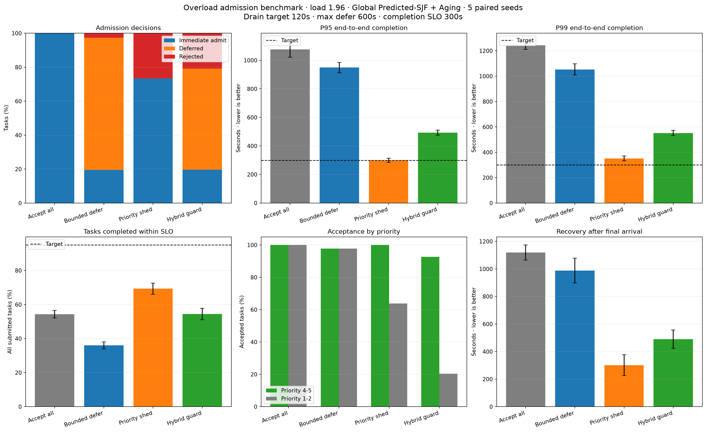
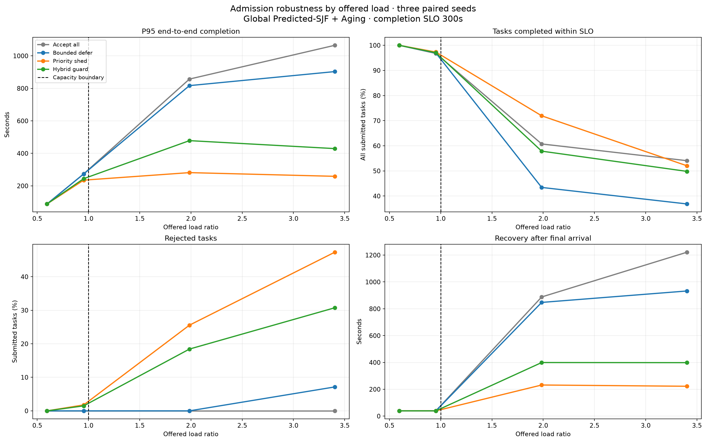

# Scheduler Overload Admission Experiment

> 실험일: 2026-08-27
> 상태: Synthetic prototype result
> 목적: 지속 과부하에서 무제한 수락, 지연 수락과 우선순위 차단 중 어떤 정책이 서비스 SLO를 가장 잘 보호하는지 검증

## 1. 연구 질문

작업 유입량이 Worker 처리 용량을 지속적으로 초과할 때 다음 중 어떤 전략이 가장 효율적인지
확인한다.

1. 모든 Task를 수락하고 Queue에서 기다리게 한다.
2. 예상 backlog가 한계를 넘으면 Deferred Queue로 이동한다.
3. 낮은 우선순위 Task를 거절하고 높은 우선순위 Task를 보호한다.
4. 낮은 우선순위는 거절하고 나머지는 제한적으로 지연하는 Hybrid 정책을 사용한다.

## 2. 실험 구조

모든 Admission 정책은 동일 Task stream과 동일 Runtime 예측값을 사용한다. Admission 이후 실행
순서는 `Global Predicted-SJF + Aging`으로 고정해 Admission 효과만 비교한다.

```text
Synthetic Task Stream
  → XGBoost Runtime Prediction
  → Admission Policy
  → Global Predicted-SJF + Aging
  → Non-preemptive Worker Pool
  → End-to-end Metrics
```

기본 조건은 다음과 같다.

```yaml
workspaces: 6
workers: 6
tasks_per_workspace: 80
latency_drift: 0.30
cache_hit_rate: 0.10
paired_seeds: 5
offered_load_ratio: 1.96
active_drain_target_seconds: 120
maximum_defer_seconds: 600
emergency_drain_seconds: 300
completion_slo_seconds: 300
```

`completion_slo_rate`의 분모에는 제출된 모든 Task가 포함된다. 거절된 Task를 분모에서 제외하면
적은 작업만 골라 처리하는 정책이 과도하게 좋아 보이므로, 거절도 사용자 관점의 SLO 실패로
계산한다.

## 3. Admission 정책

### Accept all

모든 작업을 즉시 Ready Queue에 넣는다. 작업 손실은 없지만 `ρ > 1` 상태가 지속되면 backlog와
tail latency가 계속 증가한다.

### Bounded defer

예상 Queue 소진시간이 120초를 넘으면 초과분만큼 admission을 지연한다. 계산된 지연이 600초를
넘으면 거절한다. Deferred Task도 예상 backlog에 예약된 작업량으로 포함해 동시 재방출을 줄인다.

### Priority shed

정상 drain 범위에서는 모든 작업을 수락한다. 범위를 넘으면 priority 4-5 Task만 emergency drain
300초까지 수락하고 나머지는 거절한다.

### Hybrid guard

과부하 시 priority 1-2 Task는 거절한다. priority 3-5 Task는 emergency drain과 maximum defer
범위 안에서만 지연 수락한다.

## 4. 기본 과부하 결과

| Policy | Admitted | Deferred | Rejected | P95 end-to-end | P99 end-to-end | SLO goodput | Priority 4-5 accepted | Recovery |
|---|---:|---:|---:|---:|---:|---:|---:|---:|
| Accept all | 100.0% | 0.0% | 0.0% | 1077.1 sec | 1243.3 sec | 54.4% | 100.0% | 1119.1 sec |
| Bounded defer | 97.4% | 77.9% | 2.6% | 949.2 sec | 1053.1 sec | 36.0% | 97.8% | 988.0 sec |
| Priority shed | 73.3% | 0.0% | 26.7% | 299.0 sec | 351.6 sec | 69.3% | 100.0% | 301.5 sec |
| Hybrid guard | 79.2% | 59.6% | 20.8% | 493.1 sec | 551.7 sec | 54.5% | 92.6% | 490.1 sec |



## 5. 부하 민감도

| Scenario | Offered load | Hybrid rejected | Hybrid SLO goodput | Hybrid recovery |
|---|---:|---:|---:|---:|
| Under capacity | 0.60 | 0.0% | 100.0% | 39.3 sec |
| Near capacity | 0.95 | 1.5% | 97.0% | 39.3 sec |
| Overloaded | 1.99 | 18.4% | 57.9% | 399.4 sec |
| Severe overload | 3.40 | 30.7% | 49.8% | 398.5 sec |



## 6. 해석

### 지속 과부하에서 Bounded defer만 사용하는 것은 부적절하다

Bounded defer는 내부 Ready Queue를 작게 보이게 만들지만 총 service demand를 제거하지 않는다.
사용자 제출 시각부터 측정한 end-to-end latency에는 deferred 시간이 그대로 포함된다. 이번
실험에서는 Accept all보다 P95와 recovery는 일부 개선됐지만 SLO goodput은 `54.4%`에서 `36.0%`로
악화됐다.

따라서 Deferred Queue는 다음 조건에서만 사용해야 한다.

- 짧은 burst가 끝날 가능성이 높다.
- 예상 시작시간을 사용자에게 표시한다.
- 최대 지연시간 이후에는 명시적으로 거절하거나 재승인을 받는다.
- Deferred Task가 overload detector의 예약 작업량에서 빠지지 않는다.

### Priority shed가 지속 과부하에서 가장 높은 유효 처리량을 보였다

Priority shed는 제출 Task의 `26.7%`를 거절했지만 priority 4-5 Task 수락률을 `100%`로 유지했다.
P95를 completion SLO인 300초에 근접한 `299.0초`로 낮추고, SLO 내 완료율을 네 정책 중 가장 높은
`69.3%`로 만들었다. 마지막 유입 이후 복구시간도 Accept all 대비 약 `73%` 감소했다.

이는 지속 과부하에서는 작업을 늦게 실패시키는 것보다 실행 전에 명확하게 제한하는 것이 더
효율적이라는 근거다.

### Admission만으로는 목표 SLO를 만족하지 못했다

Priority shed도 목표 SLO goodput `95%`에는 크게 못 미쳤다. 부하율 1.96에서 전체 제출 작업의 95%를
300초 안에 완료하는 것은 현재 Worker 용량과 동시에 만족할 수 없는 요구다. 다음 중 하나 이상이
필요하다.

1. Worker 또는 Provider quota 확장
2. Cache hit 증가로 실질 service demand 감소
3. 작업 범위 또는 모델 품질을 줄이는 Degrade 경로
4. 사용자별 rate limit과 예약 실행
5. 제품 SLO 또는 허용 거절률 재정의

## 7. 현재 권고 정책

```text
ρ < 0.90
  → 정상 수락

0.90 ≤ ρ < 1.00
  → 짧은 Bounded defer
  → 캐시 우선
  → 낮은 우선순위 유입 제한

ρ ≥ 1.00이 지속
  → Priority shed
  → Interactive 및 priority 4-5 예약 용량 보호
  → Batch Task 거절 또는 예약 실행
  → Autoscaling 요청

Provider 일시 장애
  → Checkpoint 저장
  → Bounded backoff retry
```

과부하와 Retry는 분리한다. `WAITING_FOR_CAPACITY` Task를 새로운 Task로 복제하거나 즉시 Retry하지
않는다. 용량 회복 이벤트가 발생하면 동일 `task_id`와 checkpoint에서 재개한다.

## 8. 한계

- Admission detector는 predicted work를 연속적으로 소진하는 fluid approximation이다.
- 실제 Provider별 rate limit, heterogeneous Worker와 Tool resource contention은 반영하지 않았다.
- Deferred release와 실제 Queue dispatch 사이의 feedback loop는 단순화했다.
- 거절된 작업의 사업 가치와 사용자 이탈 비용은 반영하지 않았다.
- Priority 분포는 synthetic이며 실제 고객 등급 또는 deadline 분포가 아니다.
- Checkpoint resume와 Retry dependency는 아직 이 실험에 포함하지 않았다.

따라서 Priority shed는 현재 synthetic 환경의 가장 효율적인 과부하 보호 후보이지, 바로 배포할
수 있는 최종 정책은 아니다.

## 9. 다음 실험

1. `Priority shed + delayed autoscaling` 조합과 scale-up 지연시간 비교
2. `Restart retry`, `bounded retry`, `checkpoint resume`의 service demand 증폭 비교
3. 사용자별 quota와 interactive reserved capacity 검증
4. Provider·model별 독립 resource pool과 admission 검증
5. 실제 execution log의 시간순 shadow replay

## 10. 재현 방법

```powershell
cd agent
uv run python -m tests.runtime_predictor_prototype.plot_overload_simulation
uv run pytest tests/runtime_predictor_prototype/test_overload_simulation.py
```

구현 파일:

- `agent/tests/runtime_predictor_prototype/overload_simulation.py`
- `agent/tests/runtime_predictor_prototype/plot_overload_simulation.py`
- `agent/tests/runtime_predictor_prototype/test_overload_simulation.py`
