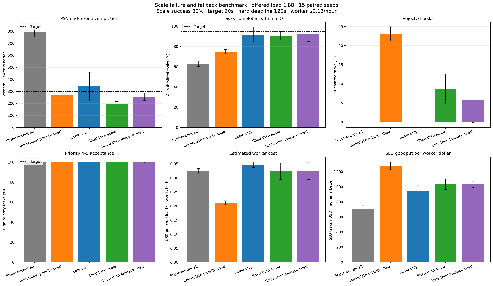
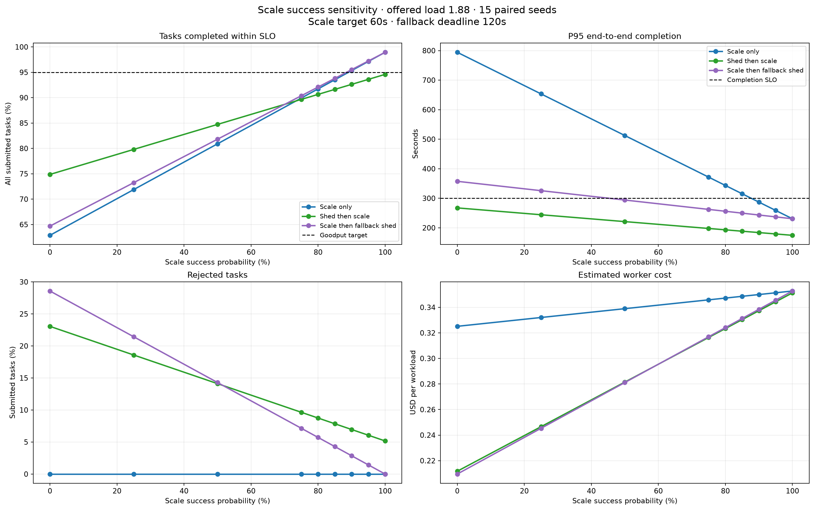
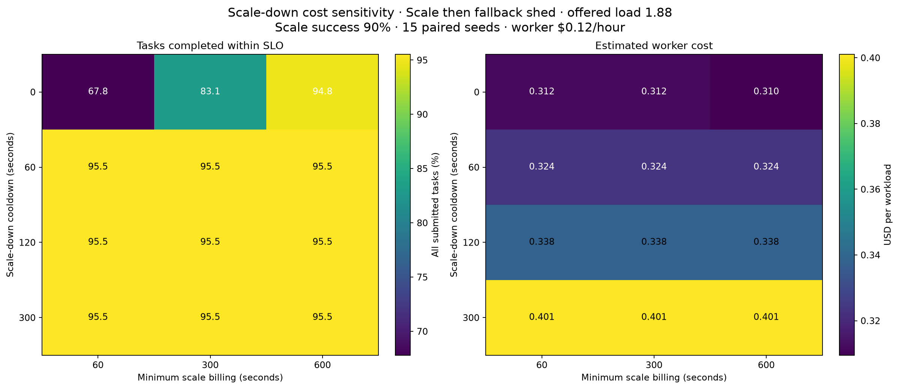

# Scheduler Scale 실패·Fallback·비용 실험

> 실험일: 2026-08-27
> 상태: Synthetic prototype result
> 목적: Worker 확장이 실패할 수 있는 환경에서 SLO를 지키는 정책과 최소 비용 scale-down 조건 검증

## 1. 연구 질문

이전 실험은 scale-up이 항상 성공한다고 가정했다. 이번 실험은 다음 질문을 검증한다.

1. Scale 실패 시 `Priority shed` fallback이 어느 정도 보호 효과를 내는가?
2. 제출 Task의 95%를 300초 안에 완료하려면 scale 성공률이 최소 얼마여야 하는가?
3. `Scale only`, `Shed then scale`과 `Scale then fallback shed` 중 어느 전략이 SLO와 비용을 가장 잘 절충하는가?
4. Scale-down cooldown과 최소 과금시간이 goodput과 worker 비용에 어떤 영향을 주는가?

## 2. 실험 모델

```yaml
workload_seeds: 15 paired seeds
offered_load_ratio: 1.88
base_workers: 6
scaled_workers: 12
scale_trigger_predicted_drain_seconds: 120
scale_up_target_seconds: 60
scale_hard_deadline_seconds: 120
completion_slo_seconds: 300
worker_hour_cost: 0.12 USD
```

`0.12 USD/worker-hour`는 특정 공급자의 실제 가격이 아니라 정책 간 상대 비교를 위한 실험값이다.
LLM token, Tool, network와 storage 비용은 포함하지 않는다.

### Counterfactual 확률 평가

15회 Bernoulli 표본만으로 성공확률 80%를 실행하면 관측 성공률이 우연히 73.3%가 될 수 있었다.
이 표본 오차를 정책 효과와 분리하기 위해 각 seed를 다음 두 경우로 모두 replay했다.

```text
동일 workload + 동일 runtime prediction
  ├─ scale 성공
  └─ scale 실패

지정 성공확률 p의 결과
  = p × 성공 replay + (1 - p) × 실패 replay
```

그래프의 80%는 표본에서 우연히 나온 비율이 아니라 정확히 80%로 가중된 기대 결과다. 신뢰구간은
workload seed와 성공·실패 결과의 결합 분산을 반영한다.

### Causal scale-down debounce

Scale-down은 미래의 마지막 Task 도착을 미리 사용하지 않는다. 확장 후 설정한 cooldown timer가 각
새 Task 도착 때 재설정되며, 다음 도착보다 timer가 먼저 만료되면 base Worker 수로 축소한다. 최소
과금시간이 남아 있으면 그 시각까지 축소를 보류한다.

## 3. 비교 전략

| Strategy | Scale 실패 전 | Scale 성공 | Hard deadline 실패 |
|---|---|---|---|
| Static accept all | 모두 수락 | 확장 없음 | 계속 수락 |
| Immediate priority shed | 즉시 낮은 우선순위 차단 | 확장 없음 | 계속 차단 |
| Scale only | 모두 수락 | 2배 확장 | 계속 수락 |
| Shed then scale | 즉시 낮은 우선순위 차단 | 2배 확장 | 계속 차단 |
| Scale then fallback shed | Grace window 동안 수락 | 2배 확장 | Priority shed 전환 |

모든 전략의 dispatch는 `Global Predicted-SJF + Aging`으로 고정했다. 거절된 Task도 제출 Task의 SLO
실패로 계산한다.

## 4. Scale 성공률 80% 결과

```yaml
scale_success_probability: 0.80
scale_down_cooldown_seconds: 120
minimum_scale_billing_seconds: 300
```

| Strategy | Rejected | P95 end-to-end | SLO goodput | Worker cost | SLO tasks / worker USD |
|---|---:|---:|---:|---:|---:|
| Static accept all | 0.0% | 794.3 sec | 62.9% | $0.325 | 700.6 |
| Immediate priority shed | 23.1% | 267.4 sec | 74.9% | **$0.212** | **1278.4** |
| Scale only | 0.0% | 343.4 sec | 91.7% | $0.347 | 949.6 |
| Shed then scale | 8.7% | **193.1 sec** | 90.6% | $0.323 | 1032.6 |
| Scale then fallback shed | 5.7% | 256.0 sec | **92.1%** | $0.324 | 1032.5 |



80% 성공률에서는 어떤 전략도 95% goodput gate를 통과하지 못했다. Fallback은 `Scale only` 대비
P95를 343.4초에서 256.0초로 25.5% 낮추고 worker 비용을 약 6.6% 낮췄지만, 거절을 실패로
계산하면 goodput 개선은 0.4%p에 그쳤다.

## 5. 필요한 Scale 신뢰도

| Scale 성공확률 | Scale only goodput | Scale only P95 | Fallback goodput | Fallback P95 |
|---:|---:|---:|---:|---:|
| 0% | 62.9% | 794.3 sec | 64.7% | 357.4 sec |
| 50% | 80.9% | 512.5 sec | 81.8% | 294.0 sec |
| 80% | 91.7% | 343.4 sec | 92.1% | 256.0 sec |
| 85% | 93.5% | 315.2 sec | 93.8% | 249.7 sec |
| 90% | **95.3%** | 287.0 sec | **95.5%** | 243.3 sec |
| 95% | 97.1% | 258.8 sec | 97.2% | 237.0 sec |
| 100% | 98.9% | 230.7 sec | 98.9% | 230.7 sec |



현재 workload에서 95% goodput을 만족하려면 scale 성공률이 약 89% 이상이어야 하며 초기 운영
gate는 보수적으로 90%로 둔다. Fallback은 실패 시 tail latency 폭주를 크게 완화하지만 부족한
capacity 자체를 만들지는 못한다. Scale 신뢰도가 90%보다 낮으면 warm reserve, secondary provider,
service degradation 또는 checkpoint resume로 service demand를 줄이는 추가 경로가 필요하다.

`Shed then scale`은 scale 성공률 100%에서도 이미 거절한 작업 때문에 goodput 94.6% 수준에 머문다.
따라서 중요한 작업만 처리하는 별도 서비스 등급이 아니라면 기본 순서로 사용하지 않는다.

## 6. Scale-down 비용 민감도

`Scale then fallback shed`, scale 성공률 90%에서 cooldown과 최소 과금시간을 비교했다.

| Cooldown | Minimum billing 60 sec | 300 sec | 600 sec |
|---:|---:|---:|---:|
| 0 sec goodput | 67.8% | 83.1% | 94.8% |
| 0 sec cost | $0.312 | $0.312 | $0.310 |
| 60 sec goodput | **95.5%** | **95.5%** | **95.5%** |
| 60 sec cost | **$0.324** | **$0.324** | **$0.324** |
| 120 sec goodput | 95.5% | 95.5% | 95.5% |
| 120 sec cost | $0.338 | $0.338 | $0.338 |
| 300 sec goodput | 95.5% | 95.5% | 95.5% |
| 300 sec cost | $0.401 | $0.401 | $0.401 |



Cooldown 0초는 arrival gap에서 너무 일찍 축소되어 최소 과금 600초에서도 goodput 94.8%로 gate를
통과하지 못했다. 60초부터 goodput 95.5%를 유지했고, 120초 대비 비용이 약 4.1%, 300초 대비
약 19.2% 낮았다. 이 workload에서는 cooldown 60초가 가장 저렴한 통과점이다.

60초 이상에서는 arrival stream이 timer를 계속 재설정하므로 최소 과금 60·300·600초의 차이가
없었다. 다른 burst 간격과 공급자 과금 단위에서는 달라질 수 있으므로 운영 고정값이 아니라 초기
후보다.

## 7. 현재 운영 후보

```text
Predicted backlog > 120 seconds
  → Primary scale request
  → 60-second scale target
  → Scale success
      → Global Predicted-SJF + Aging
      → 60-second causal scale-down cooldown
  → Scale not effective by 120-second hard deadline
      → Priority shed fallback
      → Warm reserve / secondary provider / degraded execution 요청
      → high-priority 작업 보호
```

초기 gate:

```yaml
minimum_scale_success_rate: 0.90
scale_up_target_seconds: 60
scale_up_hard_deadline_seconds: 120
scale_down_cooldown_seconds: 60
completion_slo_goodput: 0.95
high_priority_acceptance: 0.99
```

## 8. 한계

- Synthetic workload이며 실제 시간대별 burst와 provider quota가 아니다.
- Scale 성공과 실패를 이진 사건으로 단순화했다.
- 부분 확장, 느린 확장과 worker별 이질성을 모델링하지 않았다.
- Worker 단가만 포함하며 token, Tool, storage와 network 비용은 제외했다.
- Priority shed 이후 사용자 재시도에 따른 추가 부하는 아직 포함하지 않았다.
- Scale-down은 arrival debounce이며 backlog utilization 기반 hysteresis는 다음 단계가 필요하다.
- 15개 workload seed의 counterfactual 결과이므로 실제 로그 shadow replay 전 운영 배포 근거로는 부족하다.

## 9. 다음 실험

1. Restart retry와 checkpoint resume의 service demand 증폭 비교
2. Retry storm과 exponential backoff·jitter·retry budget 비교
3. Warm reserve와 secondary provider failover 비용 비교
4. 실제 execution history의 시간순 shadow replay
5. Workspace별 reserved capacity와 worst-tenant P99 검증

## 10. 재현 방법

```powershell
cd agent
uv run python -m tests.runtime_predictor_prototype.plot_autoscaling_reliability
uv run pytest tests/runtime_predictor_prototype/test_autoscaling_reliability_simulation.py
```

구현 파일:

- `agent/tests/runtime_predictor_prototype/autoscaling_reliability_simulation.py`
- `agent/tests/runtime_predictor_prototype/plot_autoscaling_reliability.py`
- `agent/tests/runtime_predictor_prototype/test_autoscaling_reliability_simulation.py`
