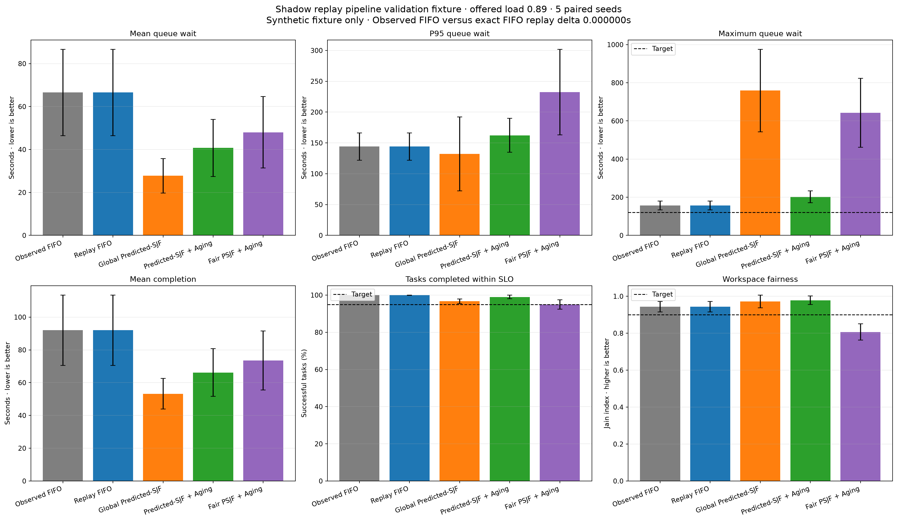

# Scheduler Shadow Replay 준비도 보고서

> 작성일: 2026-08-27
> 상태: Synthetic fixture를 이용한 replay pipeline 검증 완료
> 운영 결론: 실제 실행 로그가 없으므로 정책 승격 판단은 보류

## 1. 목적

Synthetic workload에서 얻은 Scheduler 결론을 실제 서비스에 적용하기 전에, 운영 TaskAttempt 로그를
시간순으로 재생해 현재 FIFO와 후보 정책을 같은 workload에서 비교할 수 있어야 한다. 이번 단계는
다음 두 가지를 분리한다.

1. replay loader, 데이터 누수 방지, 시간 정합성과 정책 비교 코드가 올바르게 작동하는지 확인한다.
2. 실제 로그가 수집된 뒤에만 Scheduler의 운영 효용을 판단한다.

현재 저장소에는 두 번째 판단에 필요한 고정형 TaskAttempt telemetry가 없다. 따라서 이번 plot은
파이프라인 검증용 synthetic fixture이며 실서비스 성능 근거가 아니다.

## 2. 현재 저장소의 데이터 공백

현재 `AgentRunStateModel`과 `AgentRunEventModel`은 run lifecycle과 자유 형식 event payload를 저장한다.
Backend의 `app.agent_run`은 생성·수정 시각을 보유하고, `tool_execution`은 개별 Tool의 시작·완료와
latency를 보유한다. 그러나 Scheduler shadow replay에는 아래 필드가 한 TaskAttempt 단위로 함께
필요하다.

| 필요한 정보 | 현재 상태 | 공백이 만드는 문제 |
|---|---|---|
| `queued_at`, `started_at`, `completed_at` | TaskAttempt 고정 필드 없음 | queue wait와 runtime 분리 불가 |
| 실행 전 feature snapshot | 고정 필드 없음 | predictor 입력과 사후 값을 구분할 수 없음 |
| prediction과 predictor version | 고정 필드 없음 | 당시 의사결정 재현 불가 |
| priority와 workspace weight | 고정 필드 없음 | 우선순위·공정성 replay 불가 |
| attempt number와 retry reason | 고정 필드 없음 | retry demand와 최초 실행 혼동 |
| checkpoint 복구량 | 고정 필드 없음 | restart와 resume 비용 분리 불가 |
| 당시 Worker capacity | 별도 이력 없음 | 관측 동시성과 정책 결과 검증 불가 |

기존 `created_at`과 `updated_at`을 임의로 queue/start/complete 시각으로 해석하면 안 된다. 과거
데이터에서 복구할 수 없는 필드는 추정값으로 채우지 않고, 새 telemetry contract 배포 이후 로그부터
운영 replay 대상으로 사용한다.

## 3. 구현한 Shadow Replay 계약

JSONL schema version은 `scheduler-shadow-replay-v1`이다. 한 줄은 한 번의 TaskAttempt를 의미한다.

### 실행 전 고정 필드

```text
attempt_id
task_id
attempt_number
workspace_id
task_type
model
input_tokens
context_tokens
file_count
subagent_depth
priority
workspace_weight
feature_snapshot_at
predicted_at
predicted_runtime_seconds
predictor_version
queued_at
```

### 실행 후 관측 필드

```text
started_at
completed_at
runtime_seconds
success
cache_hit
retry_reason
checkpoint_restored_seconds
metadata
```

`runtime_seconds`는 반드시 `completed_at - started_at`이며, `queue_wait_seconds`는
`started_at - queued_at`이다. Predictor target에 queue wait를 사용하지 않는다.

## 4. Reject 조건

Strict loader는 다음 데이터에서 replay를 중단한다.

- 지원하지 않는 schema version
- 중복 `attempt_id` 또는 중복 `(task_id, attempt_number)`
- timezone이 없는 timestamp
- `queued_at <= started_at <= completed_at` 위반
- `feature_snapshot_at` 또는 `predicted_at`이 `queued_at`보다 늦은 데이터 누수
- 기록 runtime과 timestamp 차이 불일치
- attempt number가 1부터 연속적이지 않은 retry chain
- 이전 attempt 완료 전에 queue에 들어온 retry
- 관측 동시 실행 수가 설정 Worker 수를 초과하는 이력
- 문자열로 기록된 boolean과 비어 있는 dataset

Retry reason 누락과 첫 attempt의 checkpoint 복구는 warning으로 남긴다. Warning은 데이터를 버리기
전에 instrumentation 문제를 관측하기 위한 것이며 운영 승격 gate에서는 별도 허용률을 둔다.

## 5. Fixture 검증 결과

다섯 paired seed, 총 1,500개 TaskAttempt와 평균 offered load 0.89를 사용했다. 각 seed에서 synthetic
workload를 FIFO로 먼저 실행해 관측 로그를 만든 뒤 같은 로그를 FIFO와 후보 정책으로 재생했다.

| 정책 | Mean wait | P95 wait | Maximum wait | Mean completion | 300초 SLO | Fairness |
|---|---:|---:|---:|---:|---:|---:|
| Observed FIFO | 66.5 sec | 144.1 sec | 156.5 sec | 92.0 sec | 99.9% | 0.944 |
| Replay FIFO | 66.5 sec | 144.1 sec | 156.5 sec | 92.0 sec | 99.9% | 0.944 |
| Global Predicted-SJF | 27.8 sec | 132.1 sec | 759.1 sec | 53.2 sec | 96.7% | 0.972 |
| Predicted-SJF + Aging | 40.7 sec | 162.3 sec | 202.3 sec | 66.2 sec | 99.0% | 0.978 |
| Fair PSJF + Aging | 48.0 sec | 232.4 sec | 642.2 sec | 73.5 sec | 94.9% | 0.807 |

Observed FIFO와 Replay FIFO의 mean wait, P95 wait와 mean completion 최대 차이는 `0.000000000초`다.
이 값은 loader → Task 변환 → event simulation → metric 집계 경로가 기준 fixture를 정확히 재현했다는
검증이다.



후보 정책 수치는 synthetic fixture에서만 해석한다. Global Predicted-SJF는 평균을 크게 낮추지만
maximum wait가 759.1초까지 증가했고, Aging은 maximum wait를 202.3초로 줄였다. 이번 Fair 정책은
오히려 fairness gate와 SLO를 위반했다. 이는 이름만으로 정책의 공정성을 가정하면 안 되며 실제
workspace별 workload와 service share를 replay해야 한다는 증거다.

## 6. 운영 instrumentation 권장 순서

한 TaskAttempt에 대해 append-only event를 다음 순서로 기록한다.

```text
TASK_ENQUEUED
  → feature snapshot + prediction + policy/predictor version

TASK_STARTED
  → worker/resource pool + capacity snapshot

TASK_CHECKPOINTED
  → durable progress + artifact/version + side-effect boundary

TASK_ATTEMPT_FINISHED
  → success/failure + actual runtime + retry classification
```

Content, prompt 원문과 고객 파일 내용은 replay dataset에 넣지 않는다. Workspace ID는 접근 통제된
내부 ID 또는 일관된 pseudonym을 사용하고, export도 workspace 격리를 유지한다. Worker scale-up과
scale-down은 별도의 capacity event stream으로 기록한다.

## 7. 실제 로그 승격 Gate

첫 운영 shadow replay는 다음 조건을 모두 만족한 구간에서만 수행한다.

```yaml
minimum_attempts: 1000
minimum_observation_days: 7
minimum_load_bands: 3
required_field_missing_rate: 0.0
timestamp_order_error_count: 0
runtime_mismatch_count: 0
observed_concurrency_mismatch_count: 0
prediction_coverage: ">= 0.95"
predictor_version_coverage: 1.0
retry_reason_coverage_for_retries: ">= 0.99"
```

운영 정책은 평균 latency 하나로 선택하지 않는다. 기존 hard gate인 P95 wait, maximum wait, SLO
goodput, priority SLO, workspace fairness와 worst-workspace tail을 모두 통과한 후보만 비교한다.

## 8. Replay 해석의 한계

현재 replay는 동일 arrival, 실제 runtime과 실제 retry arrival을 고정한 conditional replay다. 후보
정책이 실행 순서를 바꿔도 실패 발생 시점, retry 생성 시점, cache 상태와 autoscaling 결정을 다시
생성하지 않는다. 따라서 다음은 아직 causal 결론이 아니다.

- 정책 변경이 provider failure 확률에 미치는 영향
- retry storm과 circuit breaker의 상호작용
- cache warming 또는 invalidation 변화
- autoscaling trigger와 capacity event 변화
- 사용자의 취소·추가 지시가 새 실행 순서에서 만드는 변화

실제 로그로 conditional replay를 먼저 통과한 뒤, attempt failure와 capacity event를 다시 생성하는
causal simulator에서 최종 검증한다.

## 9. 결론과 다음 작업

Shadow replay의 입력 계약, strict validator, JSONL persistence, 관측 기준선과 네 후보 정책 비교,
plot 생성 경로는 준비됐다. 현재 확정할 수 있는 결론은 replay pipeline이 synthetic FIFO 기준을
정확히 복원한다는 것뿐이다.

다음 작업은 운영 runtime에 `TASK_ENQUEUED`, `TASK_STARTED`, `TASK_ATTEMPT_FINISHED` telemetry를
추가하고 최소 7일·1,000 attempt를 수집하는 것이다. 그 전에는 synthetic 결과를 근거로 Scheduler를
운영 기본값으로 승격하지 않는다.

전체 Runtime Predictor prototype pytest 76건과 새 shadow replay 파일을 포함한 Ruff 검사가
통과했다.

## 10. 재현 명령

```powershell
cd agent
& '.venv-codex\Scripts\python.exe' -m tests.runtime_predictor_prototype.plot_shadow_replay
& '.venv-codex\Scripts\python.exe' -m pytest tests/runtime_predictor_prototype/test_shadow_replay.py tests/runtime_predictor_prototype/test_scheduler_plot.py tests/runtime_predictor_prototype/test_style.py -q
```
