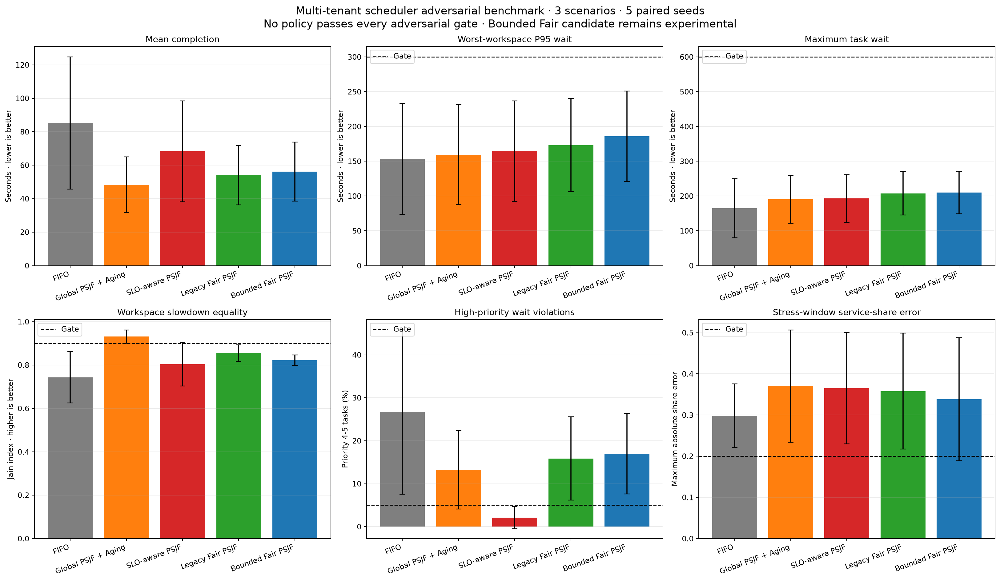
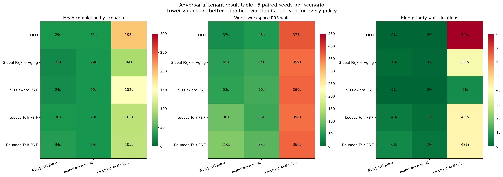

# Multi-tenant Scheduler 공정성·Priority SLO 실험

> 실험일: 2026-08-27
> 상태: Adversarial synthetic prototype result
> 운영 결정: 단일 정책 승격 없음, Global PSJF 기반 계층형 Admission 구조로 진행

## 1. 연구 질문

1. 현재 `Fair Predicted-SJF + Aging`이 noisy tenant를 실제로 격리하는가?
2. idle 후 복귀한 workspace가 과거 virtual-service credit을 악용할 수 있는가?
3. Global Predicted-SJF의 효율과 high-priority wait SLO를 동시에 유지할 수 있는가?
4. Elephant batch처럼 순간 부하가 매우 큰 경우 Scheduler 정렬만으로 SLO를 만족할 수 있는가?
5. 공정성을 Ready Queue에서 강제할지, Admission·capacity 계층에서 강제할지 결정할 수 있는가?

## 2. 기존 Fair 정책의 구조적 문제

기존 Fair 정책은 workspace별 누적 predicted service를 virtual service로 사용하고 가장 작은 workspace를
먼저 선택한다. 다음 두 문제가 있다.

- 오랫동안 idle이었던 workspace가 과거의 낮은 virtual service를 유지해 복귀 시 과도한 service
  credit을 받을 수 있다.
- max-wait aging은 workspace를 먼저 선택한 뒤 그 workspace 안에서만 적용되므로, 다른 workspace의
  오래된 Task를 전역적으로 구제하지 못한다.

이를 검증하기 위해 `Bounded Fair PSJF + Aging` 후보를 만들었다.

```text
Workspace reactivation
  → vruntime = max(previous vruntime, global min vruntime - 10 sec credit)

Global overdue Task exists
  → dispatch N회마다 oldest overdue Task를 workspace 경계 밖에서 rescue
```

Idle credit은 제한됐지만 전체 효율과 slowdown fairness를 개선하지 못했기 때문에 이 후보는 운영
정책 목록에서 제외했다.

## 3. 비교 정책

| 정책 | 목적 |
|---|---|
| FIFO | 도착 순서 기준선 |
| Global PSJF + Aging | 전체 Queue에서 predicted short task 우선, max-wait rescue |
| SLO-aware PSJF | priority 4–5를 별도 class로 즉시 rescue하고 class 안에서 predicted runtime 사용 |
| Legacy Fair PSJF | 누적 workspace virtual service 기반 선택 |
| Bounded Fair PSJF | idle credit 제한과 전역 overdue rescue를 추가한 실험 후보 |

`SLO-aware PSJF`는 priority class 내부에서 workspace별 predicted service를 추적한다. 이번 실험에서는
priority wait violation의 달성 가능 상한선을 보기 위해 rescue threshold를 0초로 두었다. 따라서
평균 latency와 low-priority fairness 비용이 큰 의도적인 stress upper bound다.

## 4. Adversarial workload

다섯 paired seed에서 모든 정책에 동일 Task와 prediction을 재사용했다.

| Scenario | 구조 | 평균 demand | Arrival span | 6 Worker 최소 drain |
|---|---|---:|---:|---:|
| Noisy neighbor | 짧은 Task 120개를 두 번 burst, quiet tenant 3개 | 3,255 sec | 582 sec | 543 sec |
| Sleep/wake burst | 지속 tenant 2개와 재진입 burst tenant | 3,329 sec | 595 sec | 555 sec |
| Elephant and mice | 긴 Task 30개와 짧은 Task 150개가 약 10초에 집중 | 2,634 sec | 10 sec | **439 sec** |

앞의 두 scenario는 평균 offered load 약 0.93이다. Elephant scenario의 arrival-span 기준 순간
offered load는 약 44이며, 전체 작업을 300초 안에 끝내는 것은 이론적으로 불가능하다. 이는 정책
성능뿐 아니라 overload detector가 불가능한 SLO를 탐지하는지 확인하기 위한 scenario다.

## 5. 전체 결과

| 정책 | Mean completion | Worst-workspace P95 | Maximum wait | Fairness | 300초 SLO | Priority violation | Share error | Gate pass |
|---|---:|---:|---:|---:|---:|---:|---:|---:|
| FIFO | 85.2 sec | 153.4 sec | 164.7 sec | 0.743 | 91.6% | 26.7% | **0.298** | 0.0% |
| Global PSJF + Aging | **48.4 sec** | **159.5 sec** | 190.3 sec | **0.931** | **97.5%** | 13.2% | 0.370 | 46.7% |
| SLO-aware PSJF | 68.3 sec | 164.6 sec | **192.9 sec** | 0.804 | 97.1% | **2.1%** | 0.365 | **53.3%** |
| Legacy Fair PSJF | 54.1 sec | 173.3 sec | 207.9 sec | 0.855 | 97.4% | 15.9% | 0.358 | 20.0% |
| Bounded Fair PSJF | 56.2 sec | 186.0 sec | 210.4 sec | 0.822 | 97.5% | 17.0% | 0.338 | 0.0% |



어떤 정책도 모든 adversarial run에서 gate를 통과하지 못했다. 평균값만 보면 Global PSJF + Aging이
가장 효율적이고 slowdown fairness도 가장 높았다. 항상-on virtual-service Fair Queue는 이름과 달리
worst-workspace P95와 Jain fairness를 개선하지 못했다.

## 6. Scenario별 결과



### Noisy neighbor

Global PSJF + Aging은 mean completion 22.2초, fairness 0.988, priority violation 1.1%로 가장 균형적이었다.
Legacy Fair는 worst-workspace P95가 95.6초, Bounded Fair는 109.9초로 증가했다. workspace를 순환하는
것만으로는 짧은 noisy workload와 긴 quiet workload의 slowdown을 같게 만들지 못했다.

### Sleep/wake burst

Global, SLO-aware와 Legacy Fair의 mean completion은 28.7–29.1초로 비슷했다. Bounded Fair는 idle
credit 악용을 막았지만 worst-workspace P95가 82.7초로 Legacy Fair의 65.8초보다 나빴다. 제한된
sleep bonus는 격리 수단이 될 수 있으나 기본 Ready Queue 정책으로 채택할 효용은 확인되지 않았다.

### Elephant and mice

Global PSJF + Aging은 mean completion을 FIFO의 194.9초에서 94.2초로 줄였지만 high-priority wait
violation이 38.2%였다. SLO-aware PSJF는 이를 6.3%로 낮췄지만 mean completion은 152.0초,
fairness는 0.524로 악화했다.

이 scenario의 high-priority service demand만 평균 약 700초이며 6 Worker에 모두 할당해도 drain에
약 117초가 필요하다. arrival이 약 10초에 집중되므로 60초 priority wait SLO를 모든 seed에서
Scheduler 정렬만으로 만족시키는 것은 불가능하다.

## 7. 예약 Worker 민감도

45초 fixed rescue 후보에서 priority 전용 예약 용량 0/1/2 Worker도 비교했다.

| Reserved workers | Mean completion | Worst-workspace P95 | Priority violation | 300초 SLO |
|---:|---:|---:|---:|---:|
| 0 | 60.4 sec | 160.5 sec | 7.1% | 97.2% |
| 1 | 62.5 sec | 174.8 sec | 7.1% | 96.9% |
| 2 | 67.9 sec | 210.3 sec | 6.9% | 95.8% |

항상 비워두는 Worker reservation은 priority class 자체가 순간 과부하인 경우 거의 도움이 되지 않고
일반 Task capacity만 줄였다. Reservation은 interactive arrival과 priority load가 낮을 때의 응답성을
위한 작은 보호 용량으로만 사용하고, priority predicted demand가 reserve capacity를 넘으면 즉시
scale 또는 admission으로 전환해야 한다.

## 8. 운영 설계 결정

가장 효율적인 실서비스 Scheduler는 하나의 정렬 함수가 아니라 다음 계층 구조여야 한다.

```text
Per-workspace Admission / concurrency quota
        ↓
Priority-class feasibility check
        ├─ feasible → interactive rescue capacity
        └─ infeasible → autoscale / defer / explicit reject
        ↓
Global Predicted-SJF + bounded aging
        ↓
Rescue Queue for deadline-at-risk Tasks
        ↓
Worker Pool
```

결정 사항:

1. 기본 Ready Queue 후보는 `Global Predicted-SJF + Aging`을 유지한다.
2. `Bounded Fair PSJF`는 실험 후보로 남기되 operational selection에서 제외한다.
3. Tenant isolation은 항상-on Ready Queue 순환보다 Admission token, workspace concurrency와 service
   share budget에서 강제한다.
4. Priority rescue는 predicted priority demand가 가용 capacity 안에 있을 때만 사용한다.
5. 최소 drain time이 SLO보다 크면 Scheduler 정책을 선택하지 않고 autoscale, defer 또는 reject한다.
6. Priority class 자체가 overload면 strict priority로 숨기지 않고 `PRIORITY_CAPACITY_EXHAUSTED`를
   명시한다.

## 9. 한계

- Synthetic workload이며 실제 tenant arrival correlation을 아직 반영하지 못했다.
- Jain fairness는 workspace별 inverse mean slowdown 기반이므로 service share와 동일하지 않다.
- Task는 non-preemptive다. Checkpoint 기반 preemption을 추가하면 priority rescue 결과가 달라질 수 있다.
- Stress-window equal-share error는 모든 tenant가 backlogged라는 가정 아래에서만 의미가 있다.
- Priority 값의 사용자별 신뢰성과 priority inflation 방어는 아직 모델링하지 않았다.
- Capacity reservation 비용은 worker-hour 가격이 아니라 latency·utilization 변화로만 평가했다.

## 10. 다음 연구

다음 단계는 per-workspace token bucket과 concurrency cap을 Admission 앞단에 추가한 adaptive hierarchical
Scheduler다. 동일 adversarial workload에서 다음을 검증한다.

- Global PSJF 효율을 유지하면서 noisy tenant service share 상한을 지키는가?
- priority demand feasibility detector가 불가능한 SLO를 사전에 분류하는가?
- rescue capacity를 고정하지 않고 predicted priority backlog에 따라 조절할 수 있는가?
- scale success/failure와 결합했을 때 전체 goodput 95%를 유지하는가?

실제 TaskAttempt telemetry가 수집되면 동일 metric을 shadow replay에 적용한다.

전체 Runtime Predictor prototype pytest 84건과 작업 범위 Ruff 검사가 통과했다.

## 11. 재현 명령

```powershell
cd agent
& '.venv-codex\Scripts\python.exe' -m tests.runtime_predictor_prototype.plot_tenant_fairness_simulation
& '.venv-codex\Scripts\python.exe' -m pytest tests/runtime_predictor_prototype/test_tenant_fairness_simulation.py tests/runtime_predictor_prototype/test_scheduler_simulation.py tests/runtime_predictor_prototype/test_scheduler_plot.py tests/runtime_predictor_prototype/test_style.py -q
```
